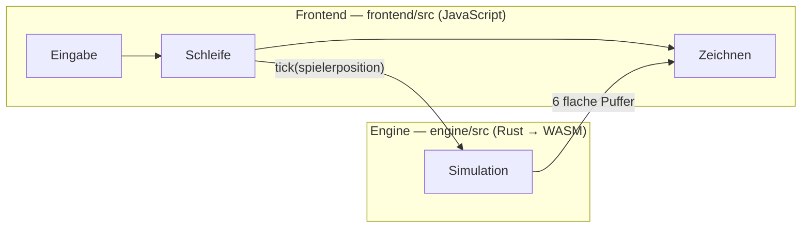
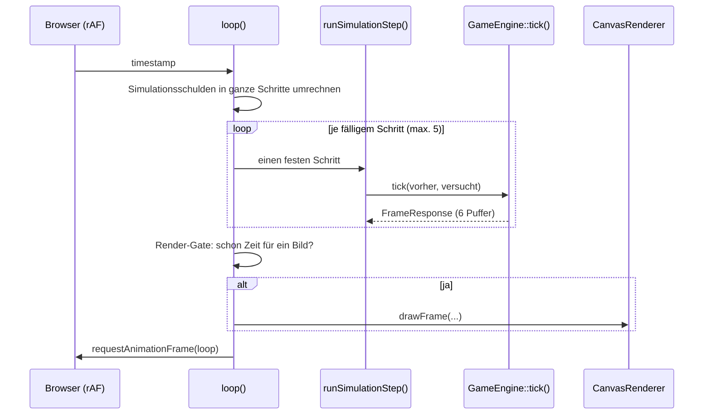

# Codebase-Überblick

Ein Einstieg in dieses Repository, in der Reihenfolge, in der das Programm selbst arbeitet:
erst was das Spiel ist, dann was beim Start passiert, dann ein einzelnes Bild von A bis Z, und
erst danach die Module.

Dieses Dokument ist **kein Kapitel der Prüfungsleistung** — es trägt deshalb keine Nummer und
wird nicht mit abgegeben. Es ist der Text, den es zum Einarbeiten und zum Vorführen braucht, und
das Rohmaterial, aus dem die Kapitel 03, 04 und 05 später ihre Bausteinsichten ziehen.

Zwei Dinge stehen hier bewusst **nicht**:

- **Zahlen.** Zeilen, Testzahlen, Coverage-Prozente leben laut Konvention 1 aus
  [00-index.md](report/00-index.md) ausschließlich in
  [09-quellcode-uebersicht.md](report/09-quellcode-uebersicht.md), zusammen mit den Befehlen, die
  sie erzeugen. Eine Zahl an zwei Stellen ist eine Zahl, die an einer davon veraltet.
- **Verhaltensregeln im Detail.** Wie ein Power-up genau spawnt oder wann ein Dash zulässig ist,
  steht in den Specs unter [docs/](../docs/). Hier steht, _wo_ es steht.

---

## 1. Das Spiel in 60 Sekunden

Ein Schwarm jagt den Spieler durch eine feste Arena. Der Schwarm besteht aus **Boids** — Punkten,
die nach den klassischen drei Regeln fliegen (Abstand halten, Richtung angleichen, zusammenbleiben)
und dazu eine vierte haben: auf den Spieler zu. Er wächst in Wellen und wird pro Welle nicht nur
größer, sondern auch schneller und weitsichtiger, bis Stufe 5.

Der Spieler läuft mit WASD oder den Pfeiltasten, hat drei Lebenssegmente und einen **Dash** auf der
Leertaste. Getroffen zu werden kostet ein Segment; Hindernisse, die im Lauf der Runde erscheinen,
ebenfalls. Drei Power-ups liegen herum: Aegis (Schild), Overdrive (Tempo), Mend (ein Segment
zurück). Escape hält die Runde an. Ziel ist Zeit — das Spiel endet nur auf eine Art.

Zwei Dinge, die man beim Zusehen bemerkt und die im Code viel Platz einnehmen: ein Boid **kündigt
seinen Angriff an**, bevor er zusticht (er pulsiert und zieht eine rote Linie dorthin, wo der Stoß
enden wird), und eine **Welle kündigt sich am Arenarand an**, bevor sie existiert.

---

## 2. Zwei Schichten und eine schmale Grenze

Die **Engine** besitzt die gesamte Simulation. Sie kennt weder DOM noch Canvas noch irgendeine
Browser-API — derselbe Code liefe in einem Terminal. Das ist keine Stilfrage: es macht die
Simulation unter `cargo test` prüfbar, ohne Browser und ohne gebautes WASM-Paket.

Das **Frontend** besitzt Darstellung, Eingabe, Spielzustand und Oberfläche. Es enthält **keine**
Simulationsmathematik — mit einer bewussten Ausnahme, die weiter unten benannt wird.

Dazwischen liegt genau eine Datei auf jeder Seite: [wasm_bridge/](../engine/src/wasm_bridge/) in
Rust und [engine-bridge.js](../frontend/src/engine-bridge.js) in JavaScript. Alles, was die Grenze
überquert, geht durch diese beiden.

---

## 3. Der Start

Alles beginnt in [index.js](../frontend/src/index.js) — die letzte Zeile der Datei ist ein nacktes
`bootstrap()`.

1. **Locale und Bildwiederholrate parallel**, in einem `Promise.all`. Die Messung wartet ein
   Dutzend Animationsframes ab; sie läuft nebenher, damit dieses Warten nichts kostet.
2. **Optionen beschneiden.** `settings.applyDisplayLimits(...)` entfernt Bildraten, die der
   gemessene Bildschirm gar nicht anzeigen kann.
3. **Mitspieler bauen**, in dieser Reihenfolge: Canvas, `Renderer`, `InputManager`,
   `PlayerController`, `GameState`, `Hud`, **`FrameTimeGraph` vor `Menu`**, `MenuBackdrop`. Die
   Reihenfolge der beiden letzten ist nicht willkürlich: die DOM-Reihenfolge in `#ui-overlay`
   entscheidet, was über was liegt, und das Menü muss über dem Graphen liegen.
4. **Resize verdrahten** und einmal sofort auslösen.
5. **Pause verdrahten** — ein einziger Fensterlistener für beide Richtungen.
6. **Startmenü zeigen.**
7. **`requestAnimationFrame(loop)`** — die Schleife läuft ab hier durchgehend, auch im Menü.

Eine Runde öffnet dann `openRound()`: Spieler zurücksetzen → Schweife löschen (die Boid-Indizes
werden neu vergeben, alte Bänder gehören toten Boids) → `initEngine(...)` → Rundendaten anlegen →
Zustand auf `PLAYING` → `input.setGameplayActive(true)`, womit das Frontend die Leertaste dem Menü
wegnimmt und dem Dash gibt.

---

## 4. Ein Frame von A bis Z

Das ist der Teil, den man verstanden haben muss; alles andere ist Detail.

### 4.1 Die Schleife

Die eine Aussage, aus der alles Weitere folgt: **Die Simulation wird nie gedrosselt, nur das
Zeichnen.** `GameEngine::tick()` rückt genau einen festen Schritt vor und skaliert **nicht** mit
der vergangenen Zeit. Würde man Ticks auslassen, liefe die Welt langsamer statt seltener gezeichnet
zu werden. Das Frontend simuliert deshalb konstant 60 Schritte pro Sekunde und wendet die gewählte
Bildrate ausschließlich auf das Zeichnen an — nachzulesen in
[index.js:186-228](../frontend/src/index.js#L186-L228).

Zwei Folgen davon, die man leicht übersieht:

- Ein Frame kann **mehrere** Simulationsschritte enthalten. Treffer müssen deshalb in **jedem**
  Schritt eingesammelt werden; nur den letzten zu lesen verliert Treffer.
- Umgekehrt muss einmaliger Tastendruck **gerastet und einmal verbraucht** werden. Eine Abfrage
  „ist die Taste gerade unten" pro Schritt macht aus einem Tastendruck bis zu fünf Dashes.

Die Schulden werden gedeckelt (`MAX_SIMULATION_STEPS_PER_FRAME`) und immer dann verworfen, wenn die
Welt eingefroren war: Countdown, Rundenstart, Tod, Pause. Sonst öffnet ein Neustart mit einem
Nachhol-Feuerwerk, das den Schwarm in den Spieler teleportiert.

### 4.2 Ein Simulationsschritt

[simulationStep.js](../frontend/src/loop/simulationStep.js). Die Reihenfolge ist durchgehend
tragend — jedes Nachbarpaar dieser Zeilen war irgendwann falsch herum:

| #   | Was                             | Warum genau hier                                                                                          |
| --- | ------------------------------- | --------------------------------------------------------------------------------------------------------- |
| 1   | `advanceClock`                  | Simulationsuhr, nicht Wanduhr — Score, Timer und alle Cooldowns hängen dran                               |
| 2   | `buildControls`                 | **verbraucht** die Dash-Rastung, genau einmal pro Schritt                                                 |
| 3   | Dash prüfen und registrieren    | vor der Integration, damit der Impuls in diesem Schritt wirkt                                             |
| 4   | `previousPosition` merken       | die Engine prüft die **ganze Bewegung**, nicht nur ihr Ende                                               |
| 5   | `setSpeedMultiplier`            | jeden Schritt, damit Overdrive im Ablaufschritt endet                                                     |
| 6   | `player.update(...)`            | der Spieler integriert im **selben** Schritt wie der Schwarm                                              |
| 7   | `updateWaveProgression`         | vor dem Tick, damit die Welle die aktuelle Spielerposition sieht                                          |
| 8   | **`tick(previous, attempted)`** | die Grenzüberquerung                                                                                      |
| 9   | Hindernis-Korrektur übernehmen  | die Antwort der Engine gewinnt, sonst driften Bild und Simulation auseinander                             |
| 10  | `powerups.step(...)`            | nach der Korrektur, damit nichts von einer Position eingesammelt wird, aus der man gerade geschoben wurde |
| 11  | Mend anwenden                   | **vor** den Treffern, damit Heilung und Treffer im selben Schritt in ihrer Reihenfolge abrechnen          |
| 12  | `registerHit(...)`              | beide Trefferquellen durch **einen** Eingang, also eine Unverwundbarkeitsspanne                           |

### 4.3 Was in der Engine passiert

`Flock::update()` in [flock.rs](../engine/src/simulation/flock.rs) ist der Kern eines Schritts:

1. Höchstens ein neuer Dash wird angeboten (`select_dash_group`) — vor jeder Bewegung, damit die
   gewählten Boids schon in diesem Schritt pulsieren.
2. Der Boid-Vektor wird in einen **Snapshot** geklont. Jeder Boid steuert damit gegen den Zustand
   des _vorherigen_ Schritts, nicht gegen halb aktualisierte Nachbarn.
3. Pro Boid: Dash-Zustandsmaschine weiter → gewichtete Steuerung (ein **dashender** Boid bekommt
   nur Separation — Kohäsion, Angleichung und Verfolgung sind aus, und genau das lässt ihn aus dem
   Schwarm ausbrechen) → integrieren → an Hindernissen abprallen → am Weltrand umbrechen.
4. Überlappungen entspannen, dann Boids aus Hindernissen schieben (in dieser Reihenfolge, weil die
   Entspannung selbst einen Boid in ein Hindernis schieben kann).
5. Treffer zählen.

Der Aufwand ist O(n²) in der Boid-Zahl. Das ist bekannt und für die Größenordnung des Spiels
gewollt einfach.

### 4.4 Zurück ins Bild

`drawFrame` in [canvasRenderer.js:186](../frontend/src/renderer/canvasRenderer.js#L186) zeichnet in
fester Ebenenreihenfolge — von unten nach oben:

Hintergrund (ein einziges `drawImage` einer gebackenen Arena, das zugleich das Löschen erledigt) →
Hindernisse → Power-up-Marker → Spawn-Marker → Dash-Schweife → Dash-Ziellinien → Boids → Spieler →
Buffs am Spieler → Statusbalken → Countdown.

---

## 5. Die Engine, Ordner für Ordner

`engine/src/simulation/` ist **vier Einzeldateien plus vier Ordner**. Die Dateien sind der Kern,
auf dem alles aufsetzt; jeder Ordner ist ein System darauf. Jeder Ordner hat ein
Fassaden-`mod.rs`, das genau die Namen re-exportiert, die von außerhalb benutzt werden — deshalb
schreibt ein Aufrufer `obstacle::Obstacle` und nicht `obstacle::shape::Obstacle`, und eine Datei
innerhalb eines Ordners zu verschieben ist keine brechende Änderung.

**Der Kern**

| Datei                                             | Aufgabe                                                                                                                                                                  |
| ------------------------------------------------- | ------------------------------------------------------------------------------------------------------------------------------------------------------------------------ |
| [boid.rs](../engine/src/simulation/boid.rs)       | Was ein Boid _ist_. Die Tuning-Werte liegen **pro Boid**, nicht global — mehrere Varianten fliegen gleichzeitig in einem Schwarm.                                        |
| [physics.rs](../engine/src/simulation/physics.rs) | `integrate`, `clamp_force`, `aabb_overlap`. Das Tempolimit ist ein **Parameter**, damit ein dashender Boid es überschreiten kann, ohne dass seine Steuerung mitskaliert. |
| [overlap.rs](../engine/src/simulation/overlap.rs) | Entstapeln des Schwarms und der Umbruch am Weltrand.                                                                                                                     |
| [flock.rs](../engine/src/simulation/flock.rs)     | Der einzige Orchestrator. Ruft in jeden der vier Ordner hinein.                                                                                                          |

**Die vier Systeme**

- **[steering/](../engine/src/simulation/steering/)** — wohin ein Boid will. `rules.rs` hält die
  fünf Regeln als reine Funktionen, jede gibt eine _ungewichtete_ Kraft zurück; `weights.rs` ist die
  einzige Stelle, die entscheidet, wie viel jede zählt. Die Regeln kennen keine Priorität, `flock.rs`
  kennt die Regeln nicht — diese Datei kennt beides.
- **[dash/](../engine/src/simulation/dash/)** — der Angriff, entlang seines Ablaufs:
  `properties.rs` (Tuning je Stufe) → `selection.rs` (wer drankommt) → `state.rs` (die
  Zustandsmaschine `Idle → Charging → Dashing → Cooling`) → `aim.rs` (wohin und wie weit).
  Zwei Punkte lohnen sich beim Vorführen: die Auswahl ist **deterministisch** aus dem
  Schrittzähler abgeleitet — es gibt keine `rand`-Abhängigkeit in der ganzen Engine, und eine
  hinzuzufügen würde die Reproduzierbarkeit brechen. Und `aim.rs` ist die _einzige_ Quelle der
  Richtung: dieselbe Funktion, die den Absprung schreibt, misst die gezeichnete Warnlinie, weshalb
  die Linie strukturell nichts versprechen kann, was der Absprung nicht einlöst.
- **[obstacle/](../engine/src/simulation/obstacle/)** — die Hindernisse, in drei Gruppen. `shape.rs`
  - `arming.rs`: was ein Hindernis ist und ab wann es _zählt_ (während es einblendet, ist es
    sichtbar, aber nicht fest). `collision.rs` + `bounce.rs` + `pushout.rs`: was bei Kontakt passiert,
    aufbauend auf **einem** Bewegungstest, den Spieler und Boids teilen. `field.rs` + `density.rs` +
    `rules.rs` + `spawn.rs`: der Lebenszyklus, inklusive der vier Platzierungsregeln, die Sackgassen
    konstruktiv unmöglich machen.
- **[wave/](../engine/src/simulation/wave/)** — wie die nächste Welle angekündigt wird. `queue.rs`
  ist der Warteraum: `set_wave` fügt der Welt **nichts** hinzu, die Boids liegen für die Dauer der
  Vorwarnung in der Schlange. Deshalb hinkt `entity_count` der Wellennummer absichtlich hinterher —
  das ist die Zahl der Boids, die _wirklich_ in der Arena sind. `placement.rs` setzt die drei Tore,
  `world_edge.rs` behandelt den Weltrand als **eine Zahl im Uhrzeigersinn**, weshalb ein Tor durch
  bloße Addition um eine Ecke rutscht.

**Daneben:** [constants.rs](../engine/src/constants.rs) (alle Tuning-Zahlen, keine Magic Numbers im
Code), [math/](../engine/src/math/) (`Vec2` und Streckengeometrie) und
[wasm_bridge/](../engine/src/wasm_bridge/) — die einzige `#[wasm_bindgen]`-Oberfläche.

---

## 6. Das Frontend, Paket für Paket

| Paket                                                | Was darin wohnt                                                                                                                                         |
| ---------------------------------------------------- | ------------------------------------------------------------------------------------------------------------------------------------------------------- |
| [index.js](../frontend/src/index.js)                 | Bootstrap, rAF-Schleife, Rundenlebenszyklus. Verdrahtet alle anderen.                                                                                   |
| [engine-bridge.js](../frontend/src/engine-bridge.js) | Die einzige Datei, die WASM anfasst. Übersetzt die `snake_case`-Getter in ein `camelCase`-Objekt, damit die Engine-Benennung nicht weiter durchsickert. |
| [input/](../frontend/src/input/)                     | Tastaturzustand, der Schritt-Steuerungsvertrag, und Escape + Auto-Pause bei Fokusverlust.                                                               |
| [loop/](../frontend/src/loop/)                       | Die Zeitarithmetik: Scheduler, Metriken, Render-Zustand, das Gate für unveränderte Bilder.                                                              |
| [player/](../frontend/src/player/)                   | Spielerintegration und Dash-Cooldown.                                                                                                                   |
| [powerups/](../frontend/src/powerups/)               | Marker, Buffs, Mend.                                                                                                                                    |
| [renderer/](../frontend/src/renderer/)               | Das größte Paket. `renderer.js` ist eine Fassade über `canvasRenderer.js`, damit ein WebGL-Backend die Aufrufer nicht anfassen müsste.                  |
| [round/](../frontend/src/round/)                     | Rundenbuchhaltung und die einzige Persistenz überhaupt (`localStorage`: bester und letzter Lauf).                                                       |
| [ui/](../frontend/src/ui/)                           | Menü, HUD, Karten, Frametime-Overlay, i18n.                                                                                                             |
| [gameConfig.js](../frontend/src/gameConfig.js)       | Alle Frontend-Konstanten.                                                                                                                               |

**Die Ausnahme, die man kennen sollte:** Die Power-ups liegen **vollständig im Frontend**. Die
Engine weiß nichts von ihnen. Das steht im Widerspruch zur Leitlinie „alle Simulation in der
Engine" und ist eine bewusste Abwägung — sie brauchen keine Nachbarschaftssuche und keinen
Determinismus, wohl aber die Rundendaten und die Spielerposition, die beide im Frontend liegen. Wer
nach der Power-up-Logik in Rust sucht, sucht vergeblich.

**Eine zweite Doppelung, die Absicht ist:** `INITIAL_BOID_COUNT` und `MAX_BOID_DIFFICULTY_TIER`
stehen sowohl in `engine/src/constants.rs` als auch in `frontend/src/gameConfig.js`, und
`round/waveTier.js` spiegelt bewusst `difficulty_tier_for_wave` aus `boid_factory.rs`. Beim Ändern
müssen beide Seiten mitgehen.

---

## 7. Die tragenden Invarianten

Drei Dinge, die man verletzen kann, ohne dass etwas sofort kaputtgeht — und die dann subtil
schiefgehen.

**1. Fester Zeitschritt.** Siehe Abschnitt 4.1. Alles, was Zeit misst — Score, Rundentimer, jeder
Cooldown — leitet sich aus `simulationTimeMs` ab, nie aus der Wanduhr. Und jeder Zeitstempel, der
gegen diese Uhr gemessen wird, muss in `beginRound()` neu gesetzt werden, weil die Uhr dort auf null
zurückspringt. `countdownEndsAt` ist die eine bewusste Ausnahme und läuft auf Wanduhrzeit — weshalb
es auch der eine Wert ist, den eine Pause über sich hinwegtragen muss.

**2. Flache Puffer über die Grenze.** `FrameResponse` liefert typisierte Arrays, keine Objekte und
keine Structs pro Entität. Vier davon sind index-gleich mit den Boids (Positionen,
Geschwindigkeiten, Stufen, Dash-Phasen), drei haben ihre **eigene Anzahl**, weil es keinen
Zusammenhang zur Boid-Zahl gibt (Hindernisse, Spawn-Marker, Dash-Ziele).

Ein Muster daran lohnt sich zu zeigen: `dash_phases` packt einen Zustand **und** ein „hier ist
nichts" in **eine** Zahl — `0` heißt nichts zu zeichnen, positiv ist Ladefortschritt, negativ ist
Restdash. Das Vorzeichen trägt den Zustand, ein zweiter Puffer entfällt. Und dieser Trick fehlt in
`spawn_markers` und `dash_aims` mit gleicher Absicht: dort existiert ein Eintrag nur, solange die
Sache läuft, also sagt die Anzahl schon alles und jeder Wert im Puffer ist echt. Zum Vorzeichen
greift man erst, wenn eine Zahl beides tragen muss.

**3. Keine Simulationsmathematik im Frontend.** Mit der in Abschnitt 6 genannten Ausnahme.

---

## 8. Landkarte: „ich will X ändern"

| Anliegen                             | Datei                                                                                                                                                                                                    |
| ------------------------------------ | -------------------------------------------------------------------------------------------------------------------------------------------------------------------------------------------------------- |
| Wie schnell/aggressiv Boids sind     | [engine/src/constants.rs](../engine/src/constants.rs)                                                                                                                                                    |
| Wie sich der Spieler anfühlt         | `PLAYER_*` in [gameConfig.js](../frontend/src/gameConfig.js)                                                                                                                                             |
| Wer/wann ein Boid dasht              | [dash/selection.rs](../engine/src/simulation/dash/selection.rs)                                                                                                                                          |
| Wie die Warnlinie aussieht           | [dashAimLayer.js](../frontend/src/renderer/dashAimLayer.js) + [dashPulse.js](../frontend/src/renderer/dashPulse.js)                                                                                      |
| Wo Hindernisse erscheinen dürfen     | [obstacle/rules.rs](../engine/src/simulation/obstacle/rules.rs)                                                                                                                                          |
| Wo eine Welle hereinkommt            | [wave/placement.rs](../engine/src/simulation/wave/placement.rs)                                                                                                                                          |
| Ein neuer Wert über die WASM-Grenze  | [frame_buffers.rs](../engine/src/wasm_bridge/frame_buffers.rs) + [response.rs](../engine/src/wasm_bridge/response.rs) + `normalizeFrameResponse` in [engine-bridge.js](../frontend/src/engine-bridge.js) |
| Zeichenreihenfolge / eine neue Ebene | [canvasRenderer.js](../frontend/src/renderer/canvasRenderer.js)                                                                                                                                          |
| HUD-Werte                            | [ui/hud.js](../frontend/src/ui/hud.js) + [loop/renderState.js](../frontend/src/loop/renderState.js)                                                                                                      |
| Menütexte                            | [public/locales/en.json](../frontend/public/locales/en.json) — **nie** im Code                                                                                                                           |
| Was eine Runde bucht                 | [round/roundData.js](../frontend/src/round/roundData.js)                                                                                                                                                 |
| Power-up-Regeln                      | [powerups/powerups.js](../frontend/src/powerups/powerups.js)                                                                                                                                             |

---

## 9. Tests und Werkzeuge

Vier Prüfstufen, jede für etwas, das die anderen nicht können:

| Stufe         | Befehl                                             | Deckt ab                                                                 |
| ------------- | -------------------------------------------------- | ------------------------------------------------------------------------ |
| Rust-Unit     | `cd engine && cargo test`                          | die gesamte Simulationsmathematik, `#[cfg(test)]` neben dem Code         |
| WASM-Grenze   | `cd engine && wasm-pack test --headless --firefox` | den Puffervertrag in `engine/tests/`                                     |
| Frontend-Unit | `cd frontend && npm test`                          | importfreie Logikmodule, Node-Umgebung, kein Browser                     |
| E2E           | `cd frontend && npm run test:e2e`                  | Menü, HUD, Rundenablauf, Tastaturbesitz — gegen den **Produktionsbuild** |

**Die eine Falle, die man kennen muss:** `cargo test` meldet für die Dateien unter `engine/tests/`
**0 Tests**. `#[wasm_bindgen_test]` expandiert für das Host-Target zu nichts. Ein grünes
`cargo test` sagt damit _gar nichts_ über die WASM-Grenze aus — genau so konnte `wasm_tests.rs`
zwei Monate lang als leerer Stub dastehen, ohne dass es auffiel. Nur `wasm-pack test` prüft sie.

Dieselbe Trennung erklärt eine scheinbar widersprüchliche Coverage-Zahl: `cargo llvm-cov`
instrumentiert das Host-Target, weshalb `wasm_bridge/response.rs` mit 0 % gemeldet wird, obwohl
jeder Puffer, den es zurückgibt, von den Browsertests abgedeckt ist. Die Zahl untertreibt dort.

Warum E2E gegen den Produktionsbuild und nicht gegen den Dev-Server: der Dev-Server liefert das
ganze Projektverzeichnis aus und verdeckt damit alles, was der Build zu kopieren vergisst. Genau so
blieb ein fehlendes `dist/locales/` unbemerkt.

Weiteres Werkzeug: ESLint muss auf **null Fehler und null Warnungen** stehen (mit
JSDoc-Pflicht für öffentliche API), Prettier besitzt die Formatierung von JS/JSON/CSS/Markdown
repository-weit, `cargo clippy` und `cargo fmt` sind die Rust-Gegenstücke. Details in
[07-tooling.md](report/07-tooling.md) und [08-qualitaet.md](report/08-qualitaet.md).

**Harte Regel, die die Struktur erklärt:** keine Quelldatei über 400 Zeilen. Mehrere Module
existieren nur deshalb als eigene Datei — und mehrere reine Rechenmodule (`dashPulse.js`,
`frameGraphScale.js`, `spawnMarkerPulse.js`, `mendPulse.js`) wurden abgetrennt, damit sie unter
Vitest prüfbar sind, was innerhalb einer Zeichenroutine nicht ginge.

---

## 10. Was sich zuletzt geändert hat

Der Stand der letzten Wochen, verdichtet — die Änderungen, die den Überblick gekostet haben. Die
vollständigen Begründungen stehen in [CHANGELOG.md](../CHANGELOG.md) unter `[Unreleased]`.

**Sichtbarkeit von Gefahr** — das durchgehende Thema:

- **Wellen kündigen sich an.** Drei rote Tore erscheinen zwei Sekunden vor der Welle am Arenarand,
  jedes mit einem Ring, der sich auf den Eintrittspunkt zusammenzieht. Vorher materialisierte eine
  Welle irgendwo, was einem bereits laufenden Spieler nicht half. _Die Grafik ist ausdrücklich ein
  Platzhalter_; Mechanik und Timing sind final.
- **Ein ladender Boid zeigt, wohin er sticht.** Eine dünne rote gestrichelte Linie, exakt so lang
  wie der Stoß trägt. Der Puls sagte immer _dass_ und _wann_, nie _wohin_ — und bei dreifacher
  Spielergeschwindigkeit macht das den Unterschied zwischen Ausweichen und Zucken.
- **Ein Hindernis ist nicht sofort fest.** Die ersten anderthalb Sekunden wird es nur gezeichnet;
  Spieler und Schwarm gehen hindurch. Die Einblendung war immer als Warnung gemeint, aber das
  Hindernis stand schon dahinter.

**Power-ups** (Feature komplett neu): Aegis, Overdrive, Mend. Aegis frisst nicht mehr einen Treffer,
sondern bricht und deckt danach eine Sekunde — ein Dash in eine Formation setzt drei Boids
innerhalb weniger Schritte auf den Spieler, der Schild war für genau diesen Zug wertlos. Mend ist
ein **Ereignis**, kein Zustand: kein HUD-Eintrag, stattdessen ein grüner Bogen, der einmal
_gegen_ den Uhrzeigersinn läuft, während jeder andere Bogen im Spiel im Uhrzeigersinn leerläuft.

**HUD:** Wellennummer, Timer und die neue Angabe `SPAWNING` (welche Boid-Stufe gerade kommt, in der
Farbe genau dieser Stufe) stehen jetzt als eine Gruppe oben Mitte statt in gegenüberliegenden Ecken.

**Leistung:** Die Arena wird einmal in ein Offscreen-Canvas gebacken und pro Bild einmal kopiert,
statt zwei vollflächige Füllungen und 66 Gitterlinien pro Bild neu zu zeichnen. Pausierte Runden
und der Game-Over-Bildschirm zeichnen ein unverändertes Bild nicht mehr sechzigmal pro Sekunde neu.

**Struktur (heute):** `engine/src/simulation/` ist von 22 flachen Dateien auf vier Einzeldateien
plus vier Themenordner umgestellt — siehe Abschnitt 5. Kein Dateiinhalt wurde dabei verändert.

---

## Weiterlesen

| Wofür                              | Wohin                                                                         |
| ---------------------------------- | ----------------------------------------------------------------------------- |
| Projektregeln und Konventionen     | [CLAUDE.md](../CLAUDE.md)                                                     |
| Aufsetzen und starten              | [README.md](../README.md)                                                     |
| Verhalten eines Features im Detail | [docs/spec-\*.md](../docs/)                                                   |
| Warum eine Entscheidung so fiel    | [projekt-journal.md](report/projekt-journal.md)                               |
| Alle Zahlen und Metriken           | [09-quellcode-uebersicht.md](report/09-quellcode-uebersicht.md)               |
| Aussehen und Designsprache         | [docs/design_system/design-system.md](../docs/design_system/design-system.md) |
