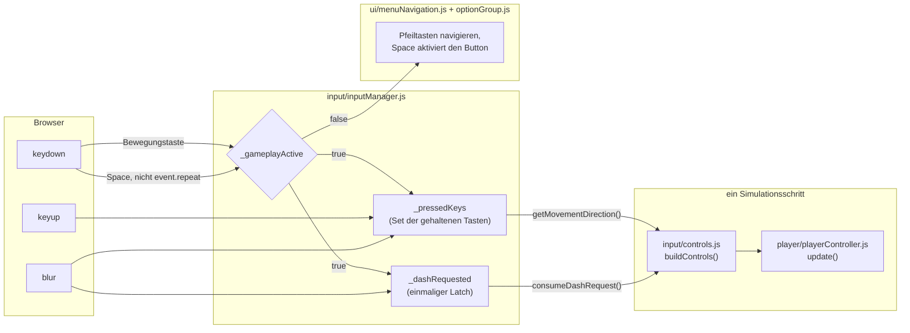
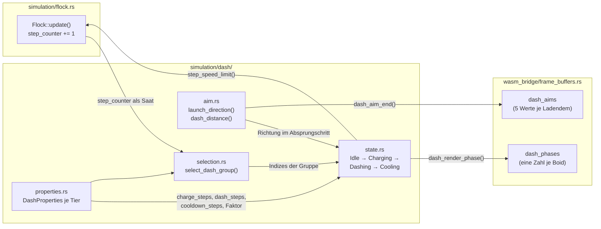
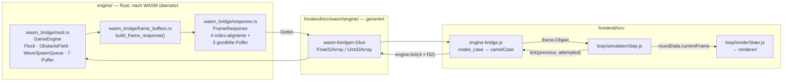
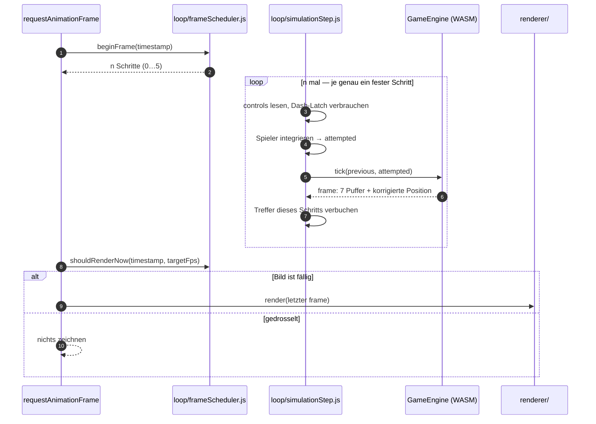

# Projekt- & Architekturdokumentation: Boids Survival Runner

Ein Ausweich-Spiel im Browser mit einer Rust/WebAssembly-Schwarmsimulation als Gegner.

Prüfungsleistung im Modul _[Modulname eintragen]_ — Abgabe 03.09.2026.

> **[Platzhalter: Titelblatt — Projekttitel, Name, Matrikelnummer, Studiengang, Dozent, Datum]**

> **[Platzhalter: Inhaltsverzeichnis, Tabellenverzeichnis, Abbildungsverzeichnis — in Word generieren]**

## Abkürzungsverzeichnis

| Abkürzung | Bedeutung                                      |
| --------- | ---------------------------------------------- |
| API       | Application Programming Interface              |
| ARIA      | Accessible Rich Internet Applications          |
| CI/CD     | Continuous Integration / Continuous Deployment |
| DOM       | Document Object Model                          |
| E2E       | End-to-End (Test)                              |
| ES        | ECMAScript                                     |
| FPS       | Frames per Second                              |
| GPU       | Graphics Processing Unit                       |
| HUD       | Head-up-Display                                |
| i18n      | Internationalisierung                          |
| MVP       | Minimum Viable Product                         |
| SEO       | Search Engine Optimization                     |
| SIMD      | Single Instruction, Multiple Data              |
| UI        | User Interface                                 |
| WASM      | WebAssembly                                    |

---

# 1 Anforderungen und Ziele

## 1.1 Themensteckbrief: Nutzer, Prozess, Pain und Kontext

**Zielgruppe** sind Gelegenheitsspieler am Desktop-Browser — ohne Installation, Konto
oder Server. Ein zweites Publikum liest den Quellcode: Der Code ist im Hochschulkontext
Lernmaterial für Rust und WebAssembly, weshalb Lesbarkeit in den Projektregeln über
Cleverness steht (siehe 1.4 Entwicklungsfokus).

**Kernprozess** ist eine einzelne, wiederholbare Runde: Ausweichen vor einem Schwarm, der
den Spieler sucht. Alle 30 Sekunden wächst der Schwarm und die Arena füllt sich mit
zeitlich begrenzten Hindernissen; der Spieler hat drei Mittel — Ausweichen, einen Dash
mit Abklingzeit, drei Power-ups — und drei Leben.

**Nutzer-Pain** ist die Lücke zwischen Schwarm-Demonstratoren ohne Spielziel und
Browserspielen mit gescripteten Gegnern; die technische Ursache: Eine
Jeder-gegen-jeden-Simulation wird in JavaScript schon bei einigen hundert Entitäten zum
Bildratenproblem. Das Projekt setzt echte Schwarmregeln als Spielmechanik ein und legt
die Rechenlast in eine Sprache, die sie tragen kann.

**Nutzungskontext** ist eine Sitzung von Minuten am Desktop mit Tastatur; die Maus wird
nicht benötigt. Die Spielwelt hat eine feste Größe von 1920 × 1080 Einheiten und wird nur
skaliert, damit dieselbe Runde in jedem Fenster dieselbe Simulation ist. Touch ist kein
Ziel: Die Steuerung braucht zwei Achsen plus Aktionstaste, und ein Daumen verdeckt genau
den relevanten Bildbereich.

## 1.2 Die Lösung

Boids Survival Runner ist ein Ausweich-Spiel, dessen Gegner eine vollständige
Boids-Schwarmsimulation ist: die Simulation als Rust-Modul in WebAssembly, Darstellung
und Eingabe in einem JavaScript-Frontend, dazwischen eine absichtlich schmale
Schnittstelle aus flachen Zahlenpuffern. Das Spiel lädt als statisches Artefakt und
stellt keine Netzwerkanfrage.

Der MVP-Umfang besteht aus sieben Spezifikationen — Schwarm-Simulation (S-01),
WASM-Bridge-API (S-02), Rendering/HUD (S-03), Spiel-Loop und Wellen (S-04),
Steuerung/Power-ups (S-05), Querschnitt (S-06), temporäre Hindernisse (S-07) —, zugleich
das Vokabular des Kapazitätsplans (siehe 10.1 Kapazitätsplan).

Bewusst nicht umgesetzt: **Slow-Time** als viertes Power-up, weil es als einziges den
festen Zeitschritt — eine tragende Invariante — verbiegen müsste; ein **WebGL-Renderer**
(die Indirektion existiert, die Kapazität nicht); ein **serverseitiger Highscore**
(widerspräche „serverlos"). CI/CD und Deployment sind offene Posten (siehe 7.10
Deployment und 8.3 CI/CD: GitHub Actions Pipeline).

## 1.3 Details zum Softwareprojekt

Das Vorgehen ist **spezifikationsgetrieben**: Vor der Implementierung wird das erwartete
mathematische Verhalten samt Randfällen festgeschrieben — hier die einzige praktikable
Prüfmethode, weil ein Schwarm auch mit falsch gewichteter Regel plausibel aussieht und
„sieht richtig aus" als Abnahmekriterium ausfällt.

Es ist ein **Ein-Personen-Projekt mit KI-Unterstützung**, deren Regelung selbst
Gegenstand des Berichts ist (siehe Kapitel 6 KI-driven Engineering & Prozess). Jede
Änderung wird atomar nach Conventional Commits committet und trägt Changelog-Eintrag,
Prompt-Protokoll und Journal-Zeile mit sich — das Journal ist der Mechanismus, mit dem
der Bericht **begleitend** statt nachgelagert entsteht.

Rahmenbedingung ist durchgehend **installationsfrei und serverlos**; zeitlich begrenzt
die Abgabe am 03.09.2026 mit Code-Freeze am 24.08.2026. Das geplante Budget übersteigt
die verfügbare Kapazität; das ist dokumentiert und über die Reihenfolge der Maßnahmen
gesteuert statt weggerechnet (siehe 10.1 Kapazitätsplan).

## 1.4 Entwicklungsfokus

Als Fokus-Thema ist **Systemnah / WASM** gewählt: Die Schwarmsimulation prüft jeden Boid
gegen jeden anderen, ihr Aufwand wächst quadratisch, der Anspruch liegt bei 60 Bildern
pro Sekunde — die einzige Stelle, an der die Ausführungsumgebung über die Machbarkeit
entscheidet.

Optimiert wurde entlang zweier Invarianten. Erstens der **feste Zeitschritt**: Die
Simulation rechnet einen Schritt pro Aufruf, das Frontend ruft sie mit konstanter Rate
und drosselt nur das Zeichnen; zusammen mit dem Verzicht auf jeden Zufallszahlengenerator
ist eine Runde damit reproduzierbar. Zweitens der **flache Puffer-Vertrag**: Zustände
reisen als typisierte Zahlenfelder statt als Objekte pro Entität, weil die Kosten des
Grenzübertritts sonst mit der Entitätszahl mitwachsen (siehe 5.2.1 Der Puffer-Vertrag).

Die Schichtgrenze ist in beide Richtungen scharf: Die Engine kennt weder DOM noch Canvas,
das Frontend enthält keine Simulationsmathematik — die Voraussetzung der Teststrategie
(siehe 8.1 Unit Tests und Coverage). Dem Leistungsziel steht **Lesbarkeit** als
gleichrangiges Ziel gegenüber: kein `unsafe`, kein SIMD, die naive quadratische
Nachbarschaftssuche, solange die Bildrate hält; Optimierungen sind erlaubt, wo eine
Messung sie begründet (siehe 8.6 GPU-Last: Messgrundlage vor Optimierung).

# 2 Technik Stack

Die Langfassung des Tech Stack Canvas mit Versionsangaben liegt im Anhang (siehe 11.1
Tabellen).

## 2.1 Rahmenbedingungen

**Zielplattform** ist der aktuelle Desktop-Browser; technisch verlangt das Spiel nur
WebAssembly und einen 2D-Canvas-Kontext, ausgeliefert wird eine Menge statischer Dateien.
**Die Sprachwahl** ist halb vorgegeben: Für Darstellung und Eingabe gibt es keine
Alternative zu **JavaScript**. Für die Simulation ist **Rust** gewählt, aus drei
strukturellen Gründen: vorab nach WebAssembly übersetzt statt zur Laufzeit optimiert;
kein Garbage-Collector im 60-mal pro Sekunde durchlaufenen Pfad; Rechnen auf Werten
fester Größe. **Die Sprachgrenze** überbrückt `wasm-bindgen`; `wasm-pack` baut mit
`--target web`, weil das Ergebnis ohne Bundler-Schritt lädt. **Node.js** ist nur
Entwicklungsumgebung, nicht Teil des Produkts.

## 2.2 Architektur-Entscheidungen

Drei Entscheidungen tragen den Aufbau. **Zwei Schichten mit schmaler Grenze** — der Grund
ist Prüfbarkeit: Engine-Tests laufen ohne Browser, Frontend-Tests ohne WASM-Paket.
**Fester Zeitschritt** — jede Dauer zählt in Schritten, und eine an die Bildrate
gekoppelte Schrittzahl ließe dieselbe Runde auf zwei Rechnern verschieden ablaufen.
**Flache typisierte Puffer** — ein Objekt pro Boid bedeutet eine Konvertierung pro Boid
und damit Kosten, die mit genau der Größe wachsen, die das Spiel steigern will.

Ebenso deutlich ist, **was es nicht gibt** — jeweils Entscheidung, nicht Rückstand: kein
Backend, keine Datenbank, kein Konto (die Rahmenbedingung selbst); kein UI-Framework (was
sich pro Bild ändert, liegt auf dem Canvas, wo ein Framework nichts beiträgt); keine
Spiel- oder Physikbibliothek (die Simulation ist der Gegenstand des Projekts); kein
`rand`-Crate (Reproduzierbarkeit); keine Laufzeit-Abhängigkeit im Frontend (siehe 7.2
Package Management). Die Daten liegen im Browser: der Bestwert in `localStorage`, die
Sprachdateien als statisches JSON unter `public/`.

## 2.3 Tech Stack Canvas

| Schicht            | Technologie                                                       | Zweck                                             |
| ------------------ | ----------------------------------------------------------------- | ------------------------------------------------- |
| Simulation         | Rust (Edition 2021, Cargo)                                        | Schwarm, Hindernisse, Wellen, Kollisionen         |
| Sprachgrenze       | `wasm-bindgen`, `js-sys`, `wasm-pack`                             | Engine als ES-Modul, Frame-Puffer über die Grenze |
| Präsentation       | JavaScript (ES-Module), HTML5 Canvas 2D, CSS                      | Rendering, Eingabe, Menü und HUD                  |
| Build              | Vite, npm                                                         | Dev-Server, Produktionsbündel, Paketverwaltung    |
| Qualitätssicherung | Vitest, Playwright, ESLint, Prettier, `cargo test`/`clippy`/`fmt` | Unit-, E2E- und Statikprüfung beider Sprachen     |

Deklariert sind Versionsbereiche, die gebaute Fassung steht in den **eingecheckten**
Lockfiles; nicht festgelegt ist die Toolchain selbst — ein offener Punkt für die Pipeline
(siehe 8.3 CI/CD: GitHub Actions Pipeline). Drei Katalog-Positionen fehlen im Canvas und
werden benannt statt übergangen: **TypeScript** (siehe 7.6 TypeScript), eine
**_vite.config.js_** (Vites Vorgaben genügen) und eine **CI/CD-Pipeline** — alle drei im
Kapazitätsplan als Rangfolge begründet.

# 3 Frontend: Struktur / Bausteine

Das Frontend besitzt alles, was der Spieler sieht und drückt, und nichts von der
Simulation.

## 3.1 Wesentliche Komponenten

Das Frontend besteht aus **ES-Modulen ohne Framework**, in drei Sorten: Module, die den
**Browser anfassen**, Module, die **Zustand halten**, und Module, die nur **rechnen** —
nur die dritte Sorte ist unter Vitest prüfbar und deshalb bewusst so groß wie möglich
gehalten.

Die Pakete: _index.js_ (Bootstrap und Loop — die einzige Datei, die alle anderen kennt),
_engine-bridge.js_ (die einzige Stelle, die das WASM-Modul berührt), `loop/`, `input/`,
`player/`, `powerups/`, `renderer/` (Fassade über dem Canvas-Renderer, daneben
importfreie Zeichenarithmetik), `round/`, `ui/` sowie _gameState.js_ und _gameConfig.js_.
Die Modulübersicht je Datei steht im Anhang (siehe 11.1 Tabellen), alle Kennzahlen in
Kapitel 9 Quellcode-Übersicht.

## 3.2 Komponenten — Details & Interaktion

### 3.2.1 (UI-)Komponenten — Aufbau

**Das Dokument ist fast leer**: _index.html_ enthält nur das Canvas und ein leeres
Overlay-`div`; alles Weitere entsteht zur Laufzeit — keine zweite Quelle der Wahrheit.
**Die Grenze zwischen Canvas und DOM** ist nach Kosten gezogen: Was sich pro Bild ändert,
gehört auf das Canvas; was eine feste Beschriftung trägt, ins DOM, wo der Browser sie
einmal setzt statt jedes Bild neu zu rastern — und wo Playwright sie lesen kann.

**Das Menü** hat einen Bildschirmtyp; die Optionsgruppen sind Buttons mit `aria-pressed`
statt `role="radiogroup"`, weil eine Radiogroup eigene Pfeiltastennavigation mitbringt
und mit der Menüliste um dieselben Tasten stritte. **Das HUD** besteht aus DOM-Elementen
mit stabilen IDs für die Testbarkeit.

**Alle nutzersichtbaren Zeichenketten liegen außerhalb des Codes**: _ui/i18n.js_ lädt
_public/locales/en.json_ zur Laufzeit; fehlt ein Schlüssel, liefert `t()` den Schlüssel
zurück, sodass ein fehlender Text als Text auffällt. Die Datei liegt unter `public/`,
weil Vite nur ausliefert, was es im Modulgraphen sieht oder dort findet. Die Schriften
liegen im Repository statt auf einem CDN — keine externe Anfrage zur Laufzeit.

### 3.2.2 Eine wesentliche Komponente: Darstellung des Aufbaus — Bausteinsicht

Als Bausteinsicht ist die **Eingabekette** gewählt, weil in ihr zwei nicht offensichtliche
Entscheidungen stecken: Die Dash-Taste ist flankengetriggert und gelatcht, und die
Tastatur gehört nur während einer laufenden Runde dem Spiel (siehe Abbildung 1).

_Abbildung 1: Bausteinsicht der Eingabekette_

**Der Latch** ist die Antwort auf den festen Zeitschritt: Ein Bild kann mehrere Schritte
fahren, und eine „ist die Leertaste unten"-Prüfung pro Schritt machte aus einem
Tastendruck bis zu fünf Dashes; `consumeDashRequest()` liest die Fahne und löscht sie
dabei. **Das Tor `_gameplayActive`** entscheidet, wem die Tastatur gehört — außerhalb
einer Runde bedienen Leertaste und Pfeiltasten das Menü. `keydown` ist am Zustand
gebunden, `keyup` bewusst nicht, denn Aufräumen darf nie zustandsabhängig sein.

### 3.2.3 Komponenten-Interaktion

**_index.js_ ist der einzige Ort, an dem Module einander kennenlernen** — wer etwas
braucht, bekommt es übergeben. Der Rundenlebenszyklus besteht aus fünf Funktionen, und
jede setzt den Tastenbesitz aus 3.2.2, weil er genau an diesen Übergängen wechselt. Die
Zeichenkette ist über eine Fassade entkoppelt, sodass ein WebGL-Backend Aufrufer nicht
anfassen müsste — die Indirektion existiert, das zweite Backend nicht (siehe 1.2 Die
Lösung).

## 3.3 Modularisierung: Strukturierung der fachlichen Logik

Drei Regeln erklären die Aufteilung. **Keine Simulationsmathematik im Frontend** — die
eine benannte Ausnahme ist die Punkt-zu-Segment-Geometrie in
_powerups/markerClearance.js_, billiger als ein zusätzlicher Puffer über die Grenze.
**Importfreie Arithmetik wird herausgelöst**, weil die Vitest-Suite ohne Browser und
WASM-Paket läuft. **400 Zeilen sind das Maximum**: Die mechanische Grenze hat fast jede
Aufteilung ausgelöst, geteilt wurde aber jeweils entlang einer echten Naht — eine
Aufteilung ohne Naht verteilte denselben Gedanken auf zwei Dateien.

## 3.4 State Management

Es gibt kein Framework und keinen Store — es gibt eine Ansicht und einen Loop, der den
Zustand ohnehin jedes Bild liest. **_gameState.js_** hält die Zustandsmaschine (`MENU`,
`PLAYING`, `PAUSED`, `GAME_OVER`) und **validiert nichts**; die Zusicherung „`PAUSED` nur
aus `PLAYING`" tragen zwei Wächter in _index.js_, wo das Warum sichtbar steht.
**_round/roundData.js_** hält den Rundenzustand browserfrei und damit unter Vitest
prüfbar; modulweiter Zustand in _index.js_ überlebt Runden.

**Die Zeitregel ist die eigentliche Aussage**: Punkte, Timer und Abklingzeiten leiten
sich aus `simulationTimeMs` ab, nie aus der Wanduhr; weil diese Uhr in `beginRound()` auf
null springt, muss jeder an ihr gemessene Zeitstempel dort neu gesetzt werden. Die eine
Ausnahme ist der Countdown auf Wanduhr — und damit der einzige Wert, den eine Pause über
sich hinwegtragen muss.

## 3.5 Routing und Navigation

**Es gibt kein Routing, und das ist die eine echte Absenz dieses Berichts.** Die Rolle
eines Routers trägt _gameState.js_ zusammen mit dem Menü: Ein Deep-Link müsste auf einen
Spielzustand zeigen, der zur Hälfte im linearen WASM-Speicher liegt und nicht fortsetzbar
ist, und ein zweites Navigationsmodell stritte um dieselben Tasten wie das Menü. Der
Zurück-Weg ist Escape: Ein einziger Fenster-Listener in _input/pauseControl.js_ besitzt
beide Richtungen plus die Auto-Pause bei Fokusverlust — ein zweiter Handler würde die
Sichtbarkeits-Bedingung des Menü-Escapes synchron im selben Ereignis verändern.

## 3.6 Persistenz

Persistiert wird **eine** Sache: das Ergebnis einer beendeten Runde, in `localStorage`
über _round/roundRecords.js_ — `localStorage` statt IndexedDB, weil es um eine Handvoll
Zahlen ohne Schema geht. Der Speicher wird hereingegeben statt importiert, wodurch das
Modul unter Vitest prüfbar ist; jeder Zugriff liegt in `try`/`catch`, und **ein Fehler
heißt „kein Rekord" und sonst nichts**. Bewusst nicht persistiert: laufende und
abgebrochene Runden (ein verlassener Lauf ist kein beendeter) sowie die
Menü-Einstellungen (Auslassung aus Aufwandsgründen).

## 3.7 Konfiguration

**_gameConfig.js_ ist die einzige Stelle für Frontend-Konstanten**; „keine Magic Numbers
in Logik-Modulen" ist eine harte Projektregel, und die Begründung eines Werts steht als
Kommentar an der Konstante. Die Entwickleroptionen werden beim Öffnen der Runde einmal
gelesen, damit ein mitten in der Runde umgelegter Schalter nicht die Regeln eines
laufenden Laufs ändert.

**Fünf Konstanten stehen bewusst doppelt** — `INITIAL_BOID_COUNT`,
`MAX_BOID_DIFFICULTY_TIER` und die drei Strides des Puffer-Vertrags. Bei den Strides ist
die Doppelung der Zweck: Die Grenztests nageln sie fest, sodass einseitiges Ändern
auffällt (siehe 5.2.1 Der Puffer-Vertrag). Die Weltgröße steht nur hier — die Engine
bekommt sie über den Konstruktor.

## 3.8 Implementierung der Fachlogik

**Der Spieler wird im Frontend integriert** (_player/playerController.js_). Der Dash
biegt die Geschwindigkeitsklemme sichtbar: `_startDash` setzt die Geschwindigkeit auf
1100 px/s **und hebt die Obergrenze mit**, die pro Schritt auf die normalen 360 px/s
zurückfällt — ohne die mitgehobene Grenze wäre der Impuls im selben Schritt weggeklemmt.
Gestimmt wird die Reichweite über den **Abbau**, nicht die Antrittsgeschwindigkeit, weil
letztere entscheidet, ob der Spieler durch ein dünnes Hindernis tunneln kann.

**Die Power-ups liegen vollständig im Frontend.** Die Abgrenzung: Hindernisse gehören in
die Engine, weil die Boids ihnen ausweichen; einen Marker sieht kein Boid an. Ebenso
bleiben Ableitungen aus vorhandenen Zahlen im Frontend.

**Der Ablauf eines Schritts ist die Fachlogik**: _loop/simulationStep.js_ fährt in fester
Reihenfolge (Uhr, Eingabe genau einmal, Buffs, Spieler, Wellenwechsel, `tick()`,
Hindernis-Korrektur, Power-ups, Heilung, Treffer) — und jedes Nachbarpaar stand
irgendwann falsch herum. **Drei Konsequenzen des festen Zeitschritts**: Der Spieler wird
im selben Schritt wie der Schwarm integriert; Treffer werden für jeden Schritt eines
Mehrschritt-Bildes verbucht; die Simulationsschuld wird geklemmt (maximal fünf Schritte
pro Bild) und bei eingefrorener Welt verworfen — sonst käme eine minutenlange Pause beim
Fortsetzen als Nachholstoß an.

# 4 Systemnah / WASM: Struktur / Bausteine

Dieses Kapitel beschreibt die Schicht, die das Fokus-Thema aus 1.4 Entwicklungsfokus
trägt.

## 4.1 Wesentliche Komponenten

**Die Engine besitzt die gesamte Simulation und kennt keine Browser-API**: Außerhalb von
`wasm_bridge/` steht kein `#[wasm_bindgen]`, jede Simulationsdatei liefe unverändert in
einem Terminalprogramm — die Voraussetzung dafür, dass `cargo test` ohne Browser prüft.

Vier Verzeichnisse entlang der Abhängigkeitsrichtung: **`math/`** (ohne Spielbezug),
**`simulation/`** mit vier Einzeldateien als Kern (_boid.rs_, _physics.rs_,
_overlap.rs_, _flock.rs_ als einziger Orchestrator) und vier Ordnern als je einem System
darauf (`steering/`, `dash/`, `obstacle/`, `wave/`), **`wasm_bridge/`** als einzige
Sprachgrenze (siehe Kapitel 5) und **_constants.rs_**. **Jeder Ordner hat ein
Fassaden-_mod.rs_**, das genau die außen benutzten Namen re-exportiert — eine Datei
innerhalb eines Ordners zu verschieben ist keine Änderung für Aufrufer. Die
Modulübersicht steht im Anhang (siehe 11.1 Tabellen).

## 4.2 Komponenten — Details & Interaktion

Die Schwarmbewegung entsteht aus **fünf Steuerungsregeln** in _steering/rules.rs_, jede
eine reine Funktion zu einer ungewichteten Kraft: `separation`, `alignment`, `cohesion`,
`seek_target`, `avoid_obstacles`. **Die nicht offensichtliche Kopplung**: Die ersten vier
skalieren mit `properties.max_speed` — deshalb bekommt `integrate(boid, speed_limit)` die
Obergrenze als Parameter, damit ein dashender Boid schneller sein darf, ohne dass seine
Steuerung mitskaliert. `avoid_obstacles` mischt die Normale mit der **Tangente**, weil
die reine Normale bei frontalem Anflug den Boid vor dem Hindernis stehen ließe. Wie viel
jede Regel zählt, entscheidet allein _steering/weights.rs_: `flocking_steering` summiert
alle fünf, `dash_steering` gibt nur Separation zurück.

### 4.2.1 Eine wesentliche Komponente: Darstellung des Aufbaus — Bausteinsicht

Als Bausteinsicht ist der **Dash-Cluster** gewählt, weil in ihm die
Determinismus-Zusicherung der ganzen Engine steckt (siehe Abbildung 2).

_Abbildung 2: Bausteinsicht des Dash-Clusters_

**Die Zustandsmaschine** durchläuft `Idle → Charging → Dashing → Cooling`; auf dem Boid
liegen genau zwei `Copy`-Felder, Zustand und Restzähler — die Invariante „genau eine
Phase aktiv" ist so gar nicht verletzbar. Alle Dauern zählen in Simulationsschritten, nie
in Millisekunden.

**Der Determinismus ist der Kern.** _Cargo.toml_ führt genau zwei Abhängigkeiten
(`js-sys`, `wasm-bindgen`), beide an der Sprachgrenze; ein `rand`-Crate gibt es nicht.
Wer dashen darf, wird per Integer-Hash aus dem `step_counter` abgeleitet — nur alle 24
Schritte, nur bei geeignetem Kandidaten (dash-fähig, `Idle`, 160–340 px vom Spieler). Der
Gewählte ist **Anführer** einer Gruppe: Boids desselben `difficulty_tier` im Umkreis
dashen mit, pulsen synchron und starten im selben Schritt. Ein Zufallsgenerator wurde
verworfen, weil er die Reproduzierbarkeit bricht, auf der jeder Simulationstest ruht.

**_aim.rs_ ist die einzige Quelle der Dash-Richtung**: Absprung und Vorwarnlinie benutzen
dieselbe Funktion — die Linie kann keine Richtung versprechen, die der Absprung nicht
nimmt. Die Richtung liegt auf keinem Boid: Sie entsteht erst im Absprungschritt und folgt
einem Spieler, der weiterläuft.

### 4.2.2 Komponenten-Interaktion

Die Interaktion **ist** die Schrittreihenfolge. `GameEngine::tick()` löst zuerst die
Spielerbewegung gegen die Hindernisse auf (geprüft wird die **Strecke**, nicht der
Endpunkt — deshalb tunnelt auch ein Dash nicht durch eine dünne Stange), gibt fällige
Wellen-Spawns frei und altert die Hindernisse — beides vor dem Flock-Schritt —, ruft dann
`Flock::update()` und packt den Frame.

`Flock::update()` klont den Boid-Vektor in einen **Snapshot**, verarbeitet jeden Boid,
relaxiert Overlaps, schiebt Boids aus Hindernissen (nach der Relaxation, die einen Boid
hineindrücken kann) und zählt Spielertreffer. Drei Eigenschaften sind tragend: Der
Snapshot entkoppelt das Ergebnis von der Iterationsreihenfolge (siehe 4.4 State
Management); ein dashender Boid ist in der Relaxation **unverschiebbar**, sonst schöbe
die symmetrische Korrektur ihn sichtbar von seiner Linie; der Wrap benutzt `rem_euclid`,
sodass auch eine Verschiebung größer als eine Weltbreite im Inneren landet. Der Schritt
ist **O(n²)** in der Boid-Anzahl.

## 4.3 Modularisierung: Strukturierung der fachlichen Logik

Vier Regeln: **Mathematik, Simulation und Bindungsschicht sind getrennt**, die
Abhängigkeiten laufen in eine Richtung — deshalb liegt _boid_factory.rs_ in
`wasm_bridge/`, denn die Schwierigkeitsrampe ist eine Design-Kurve, keine
Simulationsregel. **Die Regeln sind reine Funktionen**, ohne Aufbau testbar.
**_constants.rs_ hält Standardwerte, keine Invarianten**, weil mehrere Boid-Varianten
koexistieren. **Die 400-Zeilen-Grenze ist die erzwingende Regel** — sie machte aus 22
flachen Dateien vier Dateien plus vier Ordner. Bewusst nicht mitgemacht: Die
Sichtbarkeiten sind durchgängig `pub` — ein offener Posten (siehe 10.1 Kapazitätsplan).

## 4.4 State Management

Drei Schichten: Der Boid trägt seinen eigenen Zustand (`Copy` — die Voraussetzung des
Snapshots); `Flock` besitzt genau zwei Dinge, Boid-Vektor und `step_counter`; `GameEngine`
besitzt den Rest samt der sieben wiederverwendbaren Ausgabepuffer. **Der Snapshot ist
eine Zustandsentscheidung, keine Optimierung**: Ohne ihn hinge das Ergebnis von der
Iterationsreihenfolge ab; der Preis — eine Kopie pro Schritt — ist die einzige planmäßige
Allokation im heißen Pfad. Die Dash-Richtung fehlt absichtlich als Zustand: Sie entsteht
erst im Absprungschritt.

## 4.5 Routing

„Routing" heißt auf dieser Seite der Grenze **Dispatch** (zur Absenz von Web-Routing
siehe 3.5 Routing und Navigation). Drei Ebenen entscheiden, wohin ein Aufruf geht: die
Eintrittsfläche (`#[wasm_bindgen]` steht an genau zwei Typen — `GameEngine` mit fünf
Methoden und `FrameResponse` —, jeder Export mit Doc-Kommentar), die feste
Schrittreihenfolge aus 4.2.2 und die Dash-Zustandsmaschine als einzige Verzweigung pro
Boid und Schritt.

## 4.6 Persistenz

„Persistenz" heißt hier **Fortbestehen im linearen WASM-Speicher über Ticks hinweg**
(Speicherung über das Neuladen hinaus: siehe 3.6 Persistenz). Die sieben Ausgabepuffer
werden pro Frame mit `clear()` geleert, was die Kapazität behält. **Allokationsfrei ist
der Frame trotzdem nicht**: Snapshot-Klon und Kopien in die typisierten Arrays bleiben —
gespart wird das Wachsen, nicht das Kopieren; eine kopierfreie Sicht auf den
WASM-Speicher wurde verworfen, weil sie eine schwer benutzbare Lebenszeit-Zusage gegen
ein Kopieren tauschte, das messbar nicht das Problem war. **Der `step_counter` ist die
persistierte Uhr** — und weil er in Schritten zählt, erbt jede abgeleitete Frist die
Freeze-Fälle des Frontends gratis: Eine pausierte Runde hält ihre Wellenankündigung.

## 4.7 Konfiguration — Wesentliche Einstellungen

Die Engine hat **keine Konfigurationsdatei, keine Umgebungsvariablen, keine
Feature-Flags**; jeder Wert ist eine `pub const` in _constants.rs_ — die Kehrseite des
Determinismus, denn ein Laufzeit-Parameter wäre eine zweite Quelle der Wahrheit über
einen Lauf.

**Was pro Boid abweichen darf, steht in `BoidProperties`**; `build_boid` in
_boid_factory.rs_ ist die eine Stelle, an der eine Stufe zu einem Boid wird — geteilt vom
ersten Schwarm und den Wellen-Toren. **Eine Konstante wird zur Übersetzungszeit
geprüft**: Die Sackgassenfreiheit der Arena ruht auf `MINIMUM_CORRIDOR_WIDTH` >
2 · `PLAYER_COLLISION_RADIUS`, als `const _: () = assert!(…)` formuliert — ein Build, der
sie bricht, erzeugt kein Binary. Um den Spielerradius aufgeblasen ist jedes Hindernis
eine konvexe Insel, um die man immer herumlaufen kann; eine Erreichbarkeitssuche wäre nur
gemessen statt beweisbar.

## 4.8 Implementierung der Fachlogik

**`Vec2`** hat dreizehn reine Operationen; `limit` ist die einzige Stelle, an der eine
Obergrenze angewendet wird, und `normalize` gibt für den Nullvektor den Nullvektor
zurück — jeder Aufrufer trifft seine Rückfall-Entscheidung sichtbar selbst.
**_segment.rs_** behandelt eine Strecke der Länge null als Punkt: Ein `Obstacle` ist eine
Kapsel, ein Kreis die entartete Kapsel — das kreisförmige Hindernis fällt ohne eigenen
Codepfad aus derselben Formel.

### 4.8.1 Quantitatives Beispiel: die Reichweite eines Boid-Dashes

Der Dash ist vorab spezifiziert, nicht ertunt; die Reichweite ist ein Produkt aus
Geschwindigkeit und Dauer, weil die Geschwindigkeit im Absprungschritt einmal geschrieben
wird:

| Stufe             | v_dash          | Dauer       | Reichweite | Vorwarnung |
| ----------------- | --------------- | ----------- | ---------: | ---------: |
| Tier 2 (Welle 3)  | 13,8 px/Schritt | 20 Schritte |     276 px |     0,73 s |
| Tier 4 (Welle 5+) | 18,7 px/Schritt | 22 Schritte |     411 px |     0,57 s |

Ein Dash ist 2,3- bis 3,1-mal so schnell wie der Spieler; für die 21 px Seitversatz der
Trefferschwelle bleiben 0,57–0,73 s. **Ein stehender Spieler wird getroffen, ein
reagierender nicht** — die Vorwarnung ist die Fähigkeit, die belohnt wird. Auswahlfenster
(160–340 px) und Reichweite (276–411 px) begrenzen sich gegenseitig: Der Dash muss
ankommen können, sonst wäre die Vorwarnung eine Drohung ohne Deckung.

### 4.8.2 Wo der naheliegende Regler nichts tut

Um den Schwarm dichter zu packen, liegt es nahe, das Separationsgewicht zu senken. Es
wirkt kaum: `clamp_force` schneidet die Regelsumme ab, und auf kurzer Distanz sättigt
Separation diese Grenze allein. Der wirksame Regler ist der Anteil der
Wahrnehmungsreichweite, ab dem Separation einsetzt; der Kommentar an der Konstante sagt
beides.

### 4.8.3 Komplexität und was bewusst fehlt

Ein Simulationsschritt ist **O(n²)**; ein räumlicher Index würde das auf annähernd O(n)
drücken und ist bewusst nicht gebaut — die Simulation ist bei der erreichten Schwarmgröße
nicht der Engpass, und die Lesbarkeitsvorgabe wiegt höher. Ebenso fehlen `unsafe` (kein
einziger Block), SIMD und Bit-Tricks; optimiert wird nur gegen eine Messung (siehe 8.6
GPU-Last: Messgrundlage vor Optimierung).

# 5 Frontend/Systemnah-Integration — WASM

Die Naht zwischen den Schichten ist die schmalste Stelle des Projekts: **zwei exportierte
Typen und eine einzige Datei im Frontend**, die sie berührt.

## 5.1 Wesentliche Komponenten

Fünf Bausteine, und ihre geringe Zahl ist die Aussage: _wasm_bridge/mod.rs_
(`GameEngine`), _wasm_bridge/response.rs_ (`FrameResponse`),
_wasm_bridge/frame_buffers.rs_ (das Packen eines Frames plus die drei
Stride-Konstanten), _frontend/src/engine-bridge.js_ (die **einzige** Frontend-Datei, die
das WASM-Modul anfasst) und das generierte, gitignorierte Glue-Modul.

## 5.2 Komponenten — Details & Interaktion

### 5.2.1 Der Puffer-Vertrag

Über die Grenze gehen **flache, typisierte Arrays und einzelne Zahlen — keine Objekte**.
Ein `FrameResponse` liefert sieben Puffer: **vier index-alignierte** (`positions`,
`velocities`, `tiers`, `dash_phases`) mit gemeinsamem `entity_count`, und **drei mit
eigener Anzahl** (`obstacles`, Stride 7; `spawn_markers`, Stride 3; `dash_aims`,
Stride 5), weil ihre Länge nichts mit der Schwarmgröße zu tun hat — ein index-alignierter
Vorwarnpuffer bestünde zu über 90 % aus Leerstellen.

**Das Vorzeichen als Zustandsträger** ist das tragende Entwurfsmuster: In `dash_phases`
heißt `0.0` „nichts zu zeichnen", ein positiver Wert ist der Ladefortschritt, ein
negativer der verbleibende Dash-Anteil; eindeutig, weil kein Nicht-Idle-Zustand je exakt
`0.0` erreicht. Die verworfene Alternative — Zustands- plus Fortschritts-Array — wären
zwei zusätzliche Pufferkopien pro Bild. In `spawn_markers` und `dash_aims` fehlt das
Muster bewusst: Ein Eintrag existiert nur, solange etwas aussteht — das Vorzeichen wird
nur gebraucht, wenn eine Zahl einen Zustand _und_ ein „hier ist nichts" kodieren muss.

Die Kehrseite ehrlich benannt: Der Vertrag ist von vier auf sieben Puffer **gewachsen**;
jede Erweiterung wurde einzeln begründet, zweimal eine abgelehnt (siehe 5.3). Nicht
gewachsen ist die **Form**.

### 5.2.2 Bausteinsicht und Frame-Ablauf

Die Bausteinsicht zeigt den Weg der Daten vom Zustand der Engine bis in die Zeichenebenen
(siehe Abbildung 3).

_Abbildung 3: Bausteinsicht der Sprachgrenze_

Der Ablauf eines Bildes zeigt die erste tragende Invariante in ihrer Asymmetrie (siehe
Abbildung 4).

_Abbildung 4: Sequenzdiagramm eines Bildes — feste Schrittzahl, gedrosseltes Zeichnen_

**Die Asymmetrie ist der Punkt**: Die Simulation läuft konstant mit 60 Schritten je
Sekunde, gedrosselt wird allein das Zeichnen — eine an den Monitor gekoppelte Schrittzahl
verdoppelte die O(n²)-CPU-Last und ließe dieselbe Runde auf zwei Rechnern
unterschiedlich ablaufen.

## 5.3 Integration / Schnittstellen

**Die Namensübersetzung liegt an genau einer Stelle**: _engine-bridge.js_ baut aus den
`snake_case`-Gettern ein `camelCase`-Frame-Objekt; der Rest des Frontends sieht nie einen
Rust-Namen. Dieselbe Datei hält nicht das geladene Modul, sondern das **Promise** seines
Ladens: Ein Boolean wäre erst nach dem Laden gesetzt, und zwei nebenläufige Starts
instanziierten zwei WebAssembly-Module, deren Speicher sich mischen (siehe 10.2
Herausforderungen).

**`tick()` rückt genau einen Schritt vor.** Daraus folgen vier Verpflichtungen für den
Aufrufer: Spieler im selben Schritt integrieren wie den Schwarm; Treffer für jeden
Schritt verbuchen; Einmal-Eingaben latchen und genau einmal verbrauchen;
Simulationsschulden klemmen und bei eingefrorener Welt verwerfen. `tick` ist zudem
**nicht symmetrisch**: Der Aufrufer muss die zurückgegebene, korrigierte Spielerposition
benutzen, nicht die angefragte.

**Was über die Grenze geht, ist Zustand — was eine Rechnung auf einer Zahl ist, die der
Empfänger schon hat, nicht.** Die Vorwarnlinie eines ladenden Boids **geht** über die
Grenze, obwohl das Frontend sie nachrechnen könnte: Eine gespiegelte Zielregel stimmte
genau so lange, bis jemand die Zielregel ändert — kein Test fiele darauf. Die
Schwierigkeitsstufe der spawnenden Welle **geht nicht** über die Grenze: Sie ist
`wave − 1`, geklemmt, und die Wellennummer führt das Frontend selbst.

**Die Grenztests nageln die Strides mit einer dritten Kopie fest** — ein Test, der die
echte Konstante läse, folgte jeder Änderung stillschweigend. **Die Grenze ist zugleich
die teuerste Stelle in Sachen Testbarkeit**: Module, die _engine-bridge.js_ importieren,
sind unter Vitest strukturell unprüfbar, und die Dateien unter `engine/tests/` melden bei
`cargo test` **null Tests**, weil `#[wasm_bindgen_test]` für das Host-Ziel zu nichts
expandiert — nur `wasm-pack test` führt sie aus (siehe 8.1 Unit Tests und Coverage).

# 6 KI-driven Engineering & Prozess

Dieses Projekt ist über weite Strecken mit KI-Assistenz entwickelt worden; das Kapitel
beschreibt, **wie das geregelt wurde**. Der Prozess liegt als maschinenlesbare Datei im
Projekt und wird zu Beginn jeder Sitzung in den Kontext geladen.

## 6.1 Modulare Konfiguration

| Datei                             | Gültigkeit                      | Inhalt                                                          |
| --------------------------------- | ------------------------------- | --------------------------------------------------------------- |
| _.github/copilot-instructions.md_ | werkzeugübergreifend, committet | Architekturprämissen, Coding Standards, verpflichtende Schritte |
| _CLAUDE.md_                       | Claude Code, committet          | Befehle, Architektur-Walkthrough, aktuelle Projektphase         |
| _.claude/settings.json_           | Claude Code, committet          | geteilte Freigabeliste für Werkzeugaufrufe                      |
| _.claude/settings.local.json_     | Claude Code, gitignoriert       | maschinenlokale Ergänzungen (absolute Pfade)                    |

**Zwei Instruktionsdateien, ein Regelwerk**: Jede Regel liegt an einer Stelle, die zweite
Datei verweist darauf — eine einzige Datei scheitert daran, dass jedes Werkzeug nur seine
eigene liest. Ein negativer Befund gehört benannt: Die committete Freigabeliste enthält
inzwischen auch verändernde Aufrufe — sie wirkt als Reibungsabbau, nicht als
Sicherheitsgrenze; eine aufgeräumte Liste ist ein offener Posten.

## 6.2 Komponenten & Struktur

Der überprüfbare Teil eines Regelwerks ist die Struktur, die es hinterlassen hat; fünf
Regeln haben den Quellcode sichtbar geformt. **Human readability is the top priority** —
operationalisiert statt appelliert und zweimal einer technisch besseren Lösung vorgezogen
(exakte Kontaktbestimmung verworfen, strengere Linter-Plugins abgelehnt, siehe 7.3
Linter). **Keine Quelldatei über 400 Zeilen** — der stärkste Strukturgeber. **Keine Magic
Numbers, keine hartcodierten Strings** — der Nutzen ist Auffindbarkeit der Stellschrauben.
**Werte, die pro Boid abweichen können, gehören auf den Boid** — die Regel, die die
spätere Schwierigkeitsrampe ohne Umbau möglich machte. **Doc-Kommentar für jeden
`#[wasm_bindgen]`-Export** — der Puffer-Vertrag ist an der Grenze selbstbeschreibend.

Die verbindende Beobachtung: **Durchgesetzt hat sich, was geprüft wird** — die eine Regel
ohne Prüfung, die Prompt-Protokollierung, ist ausgefallen (siehe 6.3).

## 6.3 Entwicklungsprozess & Workflow

**Spec-driven**: Verhalten und Randfälle werden vor der Implementierung festgelegt;
_docs/spec-s05-dash.md_ ist das ausgeführte Beispiel. Der Nutzen liegt in der
Prüfbarkeit — eine Spezifikation, die ihre Randfälle benennt, erzeugt als Prompt nicht
nur Code, sondern die zugehörigen Tests.

**Verpflichtende Schritte pro Änderung**: Prompt-Protokoll unter `ai/`,
Changelog-Eintrag, atomarer Commit, Test-Abwägung, Journal-Zeile; weil die Sessiondatei
mit der Änderung committet wird, ist die Zuordnung von Prompt zu Commit nachvollziehbar
(siehe 12 KI-Verzeichnis). **Modell-Mix** in drei Rollen: Konfiguration und Planung
(GPT-5.4, Claude Sonnet 4.6), Implementierung (GitHub Copilot, danach durchgehend Claude
Code mit Opus 5), Entwurf der Optik (getrennte Sitzung eines Design-Assistenten, Handoff
unter `docs/design_system/`).

**Ein Handoff ist ein Vorschlag, kein Merge.** Kein Modul des Design-Pakets ist
unverändert übernommen: Das Stylesheet wurde geteilt, das Power-up-Modul verlor seine
eigene Uhr zugunsten der Simulationszeit, die HUD-Zeilen wanderten vom Canvas ins DOM —
KI-Ausgabe wird mit derselben Prüfpflicht behandelt wie ein fremder Pull Request.

**Begleitende Dokumentation**: Fakten pro Änderung ins Journal (mit Kapitel-Tag), die
Struktur-Kapitel in wenigen Sitzungen — die Dokumentation ans Ende zu legen hätte
gekostet, was den Bericht trägt: Verworfene Alternativen sind nach Wochen nicht mehr
rekonstruierbar.

**Ehrlich benannt: die Protokollierung war lückenhaft.** Die Ursache ist strukturell: Der
Changelog verlangt einen Anhang zur Commit-Zeit und wurde durchgehend gepflegt; das
Prompt-Log verlangte einen Anhang _vor der Antwort_, lag außerhalb dieses Takts und
schlief ein. Die Konsequenz war ein Werkzeug statt strengerer Regeln: _docs-check_ prüft
Sessiondatei, Journal, Changelog und 400-Zeilen-Grenze — **beratend, nicht blockierend**,
weil ein blockierender Hook unter Zeitdruck mit `--no-verify` umgangen wird. Das Fazit:
Ein Ritual hält, wenn es **zur Commit-Zeit an genau einer Datei** stattfindet und eine
Maschine seine Vollständigkeit sichtbar macht.

# 7 Tooling

Die Tooling-Maßnahmen sind nach ihrem Beitrag zu den Bewertungskriterien priorisiert:
Qualitätsmaßnahmen bedienen zwei Kriterien gleichzeitig, TypeScript und Deployment je
eines. TypeScript (T-02), CI/CD (T-05) und Deployment (T-06) stehen aus und werden in
7.6, 8.3 und 7.10 als begründete Negativbefunde behandelt.

## 7.1 Scripts in package.json

Alle Frontend-Werkzeuge laufen über npm-Scripts in _frontend/package.json_:

| Script                      | Nutzen                                                          |
| --------------------------- | --------------------------------------------------------------- |
| `dev` / `build` / `preview` | WASM-Build, dann Vite (Dev-Server, Bündel, lokale Auslieferung) |
| `build:wasm`                | Baut nur das WASM-Paket (`--target web`)                        |
| `test` / `test:coverage`    | Vitest-Suite, optional mit Coverage-Report                      |
| `test:e2e`                  | Playwright gegen den Produktionsbuild                           |
| `lint` / `format`           | ESLint (muss warnungsfrei sein) / Prettier repo-weit            |
| `docs:ki-verzeichnis`       | Erzeugt das KI-Verzeichnis (Kap. 12) aus `ai/*.json`            |
| `docs:check`                | Prüft die Doku-Disziplin (Prompt-Log, Journal, Changelog)       |

Drei geplante Scripts fehlen bewusst noch: `typecheck` (T-02), `deploy` (T-06),
`docs:diagrams` (Word-Zusammenbau). Die Rust-Seite läuft nicht über npm — ein Wrapper
wäre nur ein zweiter Name für denselben Befehl; die Engine-Coverage läuft mit
`cargo llvm-cov --lib`, weil ohne `--lib` die Grenztests den Lauf abbrechen würden.

## 7.2 Package Management

Zwei Paketmanager (npm, Cargo), beide Lockfiles eingecheckt. **Die Engine hat genau zwei
produktive Abhängigkeiten** — `wasm-bindgen` und `js-sys`, also die Schnittstelle
selbst — plus `wasm-bindgen-test`. **Das Frontend hat keine einzige produktive
Abhängigkeit**: Alle Einträge sind `devDependencies`, zur Laufzeit lädt das Spiel außer
dem eigenen WASM-Modul nichts nach. `wasm-pack` ist die einzige Toolchain-Anforderung,
die kein Lockfile abdeckt.

## 7.3 Linter

ESLint 9 in der Flat Config für das Frontend, `cargo clippy` für die Engine. Regelsätze:
`@eslint/js` recommended, `eslint-plugin-jsdoc` (siehe 7.5), `eslint-config-prettier` als
letzter Eintrag (siehe 7.4). Ebenso wichtig ist das bewusst nicht Aktivierte:
`eslint-plugin-unicorn` und `eslint-plugin-sonarjs` wurden verworfen, weil sie auf
idiomatisch-dichtes JavaScript optimieren und damit gegen die oberste Projektregel
arbeiten. Ehrlicher Ist-Stand: Clippy meldet **eine** Warnung — `Vec2::dot` ist
implementiert und getestet, aber unbenutzt; sie bleibt sichtbar, statt sie mit `#[allow]`
zuzudecken.

## 7.4 Formatter

Prettier für JavaScript, JSON, CSS und Markdown; `cargo fmt` für Rust (ohne eigene
_rustfmt.toml_). **Formatierung gehört dem Formatter, Semantik dem Linter** — erzwungen
durch `eslint-config-prettier`, sonst machten `lint:fix` und `format` abwechselnd die
Änderung des anderen zunichte. Der eine Konfigurationswert, der nicht Geschmackssache
ist, ist `proseWrap: preserve` — er schützt die deutsche Prosa dieses Berichts vor dem
Umbruch auf `printWidth`. Konfiguration und Ignore-Datei liegen an der Repository-Wurzel,
weil Prettiers Zuständigkeit das ganze Repository ist.

## 7.5 JSDoc — über ESLint enforced

JSDoc ist eine Lint-Regel: `eslint-plugin-jsdoc` prüft **Vorhandensein** und **Inhalt**
für dieselbe Menge — exportierte Funktionen und Klassen sowie deren öffentliche Methoden;
ausgenommen sind Konstanten, Unterstrich-Präfixe, Tests und modulprivate Funktionen.
Vorhandensein- und Inhaltsregeln teilen eine gemeinsame Selektorenliste — ohne sie
schreibt `--fix` leere `@param`-Zeilen in private Helfer, was beim ersten Lauf genau so
passierte. Der Nutzen zeigte sich sofort: Zwei Module waren gar nicht dokumentiert,
darunter ausgerechnet _engine-bridge.js_ — der beste Beleg, dass eine Konvention ohne
Werkzeug nicht hält.

## 7.6 TypeScript

**TypeScript ist nicht eingerichtet**; T-02 (3 h) ist geplant, aber nicht gelandet.
Geplant ist keine Migration, sondern `checkJs` mit `noEmit`: Der Compiler prüft die
vorhandenen `.js`-Dateien gegen die ohnehin erzwungenen JSDoc-Typen — eine Codebasis für
Rust-Einsteiger gewinnt nichts von einer zweiten neuen Sprache. Der wertvollste Fund läge
an der Sprachgrenze: _engine-bridge.js_ würde gegen die generierte `.d.ts` geprüft, eine
umbenannte Engine-Methode fiele beim Prüflauf auf statt zur Laufzeit — das ist zugleich
der Preis der Absenz.

## 7.7 Branch-Struktur

Zwei Branches: `main` für stabile Stände, `dev` als Integrationszweig.
**Feature-Branches gibt es nicht**, als Entscheidung: Bei einem Entwickler mit
KI-Assistent hätte ein Branch je Feature keinen Konflikt zu lösen und keine Review zu
beherbergen. Der ehrliche Ist-Stand ist ein negativer Befund: `main` ist über einhundert
Commits zurück und erfüllt seine Rolle derzeit nicht; der Merge ist zum Code-Freeze
vorgesehen. Die Commit-Konvention ist Conventional Commits — die Voraussetzung dafür,
dass die Kapitel 9 und 10 aus der Historie belegbar sind.

## 7.8 Dev Build

`npm run dev` ist eine erzwungene Kette: erst `build:wasm` (`wasm-pack build
--target web` nach `frontend/src/wasm/engine/`), dann Vite — ein vergessener Build wäre
ein Modulfehler beim ersten Bild. **`--target web`, nicht `--target bundler`**: `web`
erzeugt ein ES-Modul, das die `.wasm`-Datei selbst nachlädt — die Form, die Vite ohne
Plugin verarbeitet. Das Ausgabeverzeichnis ist gitignoriert: Es enthält nur generierten
Code, und ein eingecheckter Stand könnte gegen die Rust-Quelle auseinanderlaufen.

## 7.9 Production Build

`npm run build` ist dieselbe Kette mit `vite build`. **Es gibt keine _vite.config.js_** —
die Standardannahmen treffen zu, eine leere Datei wäre eine Attrappe. Für ein Deployment
unter einem Unterpfad wird sie gebraucht: Die erzeugte _index.html_ verweist **absolut**
auf `/assets/…`, was unter `…github.io/<repo>/` eine 404 liefert; `base: '/<repo>/'` ist
deshalb der erste Schritt von T-06. `npm run preview` ist zudem eine Teststufe: Die
Playwright-Suite läuft gegen diesen Stand (siehe 8.2 E2E Tests).

## 7.10 Deployment

**Ein Deployment existiert nicht.** Das Spiel läuft aus `dist/` über jeden statischen
Webserver, ist aber nirgends veröffentlicht; T-06 (3 h) ist offen. **Vorgesehen ist
GitHub Pages**: Das Artefakt ist ein statisches Bündel ohne Laufzeit oder Datenbank, und
Pages liegt am Repository; Alternativen wurden nicht evaluiert, weil sich die Anbieter
bei einem statischen Bündel in nichts unterscheiden, was hier messbar wäre. Zwei
Fallstricke sind vorab bekannt: der `base`-Pfad (siehe 7.9) und der MIME-Type der
`.wasm`-Datei — bei falschem Typ fällt das Glue-Modul still auf das langsamere
`WebAssembly.instantiate` zurück und schreibt nur eine Konsolen-**Warnung**, die auch die
E2E-Suite nicht sähe.

# 8 Qualität

Die Teststrategie folgt einer Leitfrage: Welche Stufe kann eine Eigenschaft überhaupt
prüfen? Unit-Tests beidseits der Sprachgrenze, eine eigene Browser-Stufe für den
Puffer-Vertrag, E2E gegen den gebauten Stand, statische Analyse — und CI als die
erzwingende Instanz, die noch fehlt (siehe 8.3).

## 8.1 Unit Tests und Coverage

| Ebene              | Werkzeug                             | Läuft in           | Deckt ab                                   |
| ------------------ | ------------------------------------ | ------------------ | ------------------------------------------ |
| Engine-Unit        | `cargo test`, `#[cfg(test)]` in-file | Host (native)      | Mathematik und Simulation                  |
| Sprachgrenze       | `wasm-pack test`, `engine/tests/`    | Browser (`wasm32`) | Der Puffer-Vertrag der Bridge              |
| Frontend-Unit      | Vitest                               | Node               | Importfreie Logikmodule                    |
| _(E2E, siehe 8.2)_ | Playwright                           | Browser            | Alles, was nur im gebauten Spiel existiert |

**Rust**: Unit-Tests liegen als `#[cfg(test)]`-Modul neben ihrem Code und sind für alle
Mathematik- und Simulationsfunktionen verpflichtend. **Die Sprachgrenze braucht eine
eigene Stufe**: Die Getter von `FrameResponse` liefern `js_sys`-Typen, die nur in einer
JavaScript-Laufzeit existieren — `cargo test` kann den Puffer-Vertrag in keinem Umfang
prüfen; der zuvor leere Stub _engine/tests/wasm_tests.rs_ wurde gefüllt. **Zwei
Beobachtungen**: Auf dem Host expandiert `#[wasm_bindgen_test]` zu nichts — `cargo test`
meldet null Tests und bleibt grün, weshalb der leere Stub monatelang kein Signal
erzeugte; und `cargo llvm-cov` instrumentiert dasselbe Host-Target, die Grenztests heben
die Rust-Coverage also nicht.

**Frontend**: Vitest im `node`-Environment — daraus folgt, dass nur importfreie
Logikmodule testbar sind. **Coverage wird je Sprache getrennt erhoben**; eine gemeinsame
Kennzahl verrechnete genau die Information, um die es geht. Zwei Entscheidungen gegen
eine schönere Zahl: `all: true` lässt Module ohne Test mitzählen, und die beiden größten
Dateien sind nicht ausgeschlossen. Schwellwerte sind bewusst noch nicht gesetzt — eine
Untergrenze oberhalb des Ist-Stands machte die künftige Pipeline dauerhaft rot, ohne
Information zu liefern.

## 8.2 E2E Tests

Playwright, weil alles Bewertbare entweder auf einem Canvas liegt oder erst nach dem
Laden eines WASM-Moduls existiert. **Die wichtigste Entscheidung ist das Ziel**: Die
Suite läuft gegen den **Production-Build**, nicht gegen den Dev-Server, der das ganze
Projektverzeichnis ausliefert und damit verdeckt, was der Build zu kopieren vergisst.
Beim Einrichten fehlte genau so `locales/` in `dist/`, und jedes Label stand im gebauten
Spiel als Rohschlüssel auf dem Bildschirm; keine andere Teststufe hätte das strukturell
finden können. Zehn Spec-Dateien decken Boot, Rundenlebenszyklus, Tastatureigentum, Menü,
Game Over, Hindernisse, Letterboxing, Power-ups und Pause ab (54 Fälle, siehe 9.4 Weitere
Masszahlen).

Fünf bewusste Begrenzungen, je mit Grund: **Nur Chromium** — ein zweiter Browser prüfte
überwiegend dessen eigene WASM- und Canvas-Implementierung. **Ein Worker** — parallele
O(n²)-Simulationen nehmen sich die CPU weg und machen Zeit-Zusicherungen instabil.
**Kein Pixelvergleich** — der Schwarm bewegt sich jedes Bild, eine
Ungleichheits-Zusicherung wäre immer erfüllt und ein Golden Image dauerhaft instabil; die
Zeichen-Arithmetik ist stattdessen als Unit-Test isoliert. **Kein Einsammeln eines
Power-ups** — Marker liegen zufällig, der Test wäre ein Wettlauf. **Keine gehaltene Taste
über eine Pause hinweg** — Playwright emuliert kein Auto-Repeat; geprüft wird der
Listener samt Guard per `dispatchEvent`. Nebeneffekt des Determinismus: „Stehenbleiben,
bis der Schwarm drei Leben genommen hat" ist ein reproduzierbarer Testfall.

## 8.3 CI/CD: GitHub Actions Pipeline

**Eine Pipeline existiert nicht**; T-05 (5 h) ist offen — der einzige namentlich
geforderte Punkt dieses Kapitels, den das Projekt nicht erfüllt. **Die Wirkung der
Absenz**: Alle Prüfungen existieren als je ein Befehl und werden von Hand gefahren; was
fehlt, ist die erzwingende Instanz — und der Bau in einer leeren Umgebung. Entworfen ist
die Pipeline als vier Jobs in `.github/workflows/ci.yml`:

| Job        | Inhalt                                                         | Abhängigkeit |
| ---------- | -------------------------------------------------------------- | ------------ |
| `rust`     | `cargo fmt --check`, `cargo clippy`, `cargo test`              | keine        |
| `frontend` | `lint`, `format:check`, `typecheck` (T-02), `test`, `coverage` | keine        |
| `build`    | `build:wasm` + `vite build`, danach `test:e2e`                 | `rust`       |
| `deploy`   | Veröffentlichung nach GitHub Pages, nur auf `main`             | `build`      |

`rust` und `frontend` laufen parallel; `deploy` ist an `main` gebunden — die eine Stelle,
an der die Branch-Rollen aus 7.7 eine technische Konsequenz bekommen. `docs:check` ist
bewusst nicht blockierend vorgesehen: Ein rotes Kreuz muss bedeuten, dass der Code kaputt
ist, sonst wird die Farbe bedeutungslos.

## 8.4 Kommentare — Visuelle Strukturierung des Quellcodes

Projektregel: Jeder nicht-triviale Block erhält einen Kommentar in Alltagssprache, der
_was_ und _warum_ erklärt, nicht _wie_ — wertvoll besonders dort, wo eine naheliegende
Lösung absichtlich nicht gewählt wurde. Drei harte Regeln ergänzen das: Doc-Kommentar für
jeden `#[wasm_bindgen]`-Export; Begründungskommentar für jeden `unsafe`-Block (Ist-Stand:
es gibt **keinen einzigen**); Begründungspflicht für jede Mikrooptimierung. **JSDoc ist
die maschinengeprüfte Hälfte dieser Konvention** (siehe 7.5); der Befund der Nachrüstung:
Die Prosa-Kommentare waren gepflegt, die Schnittstellen-Dokumentation lückenhaft —
inklusive der WASM-Bridge.

## 8.5 Lighthouse

Der Katalog fordert diesen Punkt „falls anwendbar"; die ehrliche Antwort hat zwei Teile.
**Ein Lauf ist nicht durchgeführt**: Lighthouse bewertet eine ausgelieferte Seite, ein
Deployment existiert nicht, und eine Messung gegen `localhost` wäre schlechter als keine.
**Die Anwendbarkeit ist zudem strukturell begrenzt**: Performance misst nur die Ladezeit;
Accessibility inspiziert das DOM, und das eigentliche Spiel ist für den Prüfer eine leere
Canvas-Fläche; SEO ist ohne Textinhalt nicht anwendbar. Was Lighthouse prüfen kann, ist
bewusst gebaut (`aria-pressed`, natives `
`); was es nicht prüfen kann, ist die
eigentliche Zugänglichkeitsfrage — ein Canvas-Spiel ist für einen Screenreader nicht
zugänglich.

## 8.6 GPU-Last: Messgrundlage vor Optimierung

Anlass war eine Beobachtung: hohe GPU-Auslastung bei einem einfachen Bild. Der erste
Schritt ist keine Optimierung, sondern die Frage, ob überhaupt gemessen werden kann.
**Der Frametime-Graph beantwortet sie nicht**: Er misst Skriptzeit, die Rasterisierung
wird außerhalb des Hauptthreads bezahlt. Schlimmer: Sein `backdrop-filter` war der
einzige aktive GPU-Effekt während einer Runde — das Overlay verfälschte die eigene
Messgröße; die Fläche ist jetzt deckend.

**Hinzugekommen ist eine Lastzeile** mit den drei Größen, die das Frontend ehrlich selbst
zählen kann: gezeichnete Bilder/Sekunde, Zeichenoperationen/Bild, Backing-Store-Pixel.
**Keine davon ist GPU-Zeit** — sie erklären GPU-Kosten, sie messen sie nicht. Gemessen
wird von außen (`chrome://gpu`, GPU-Track der DevTools) nach festem Protokoll; berichtet
wird GPU-Zeit in ms pro Bild, nie Prozent. **Gefahren ist die Messreihe noch nicht** —
geliefert ist die Voraussetzung, denn ohne Basiswert wäre jede Senkungsmaßnahme eine
Vermutung.

> **[Platzhalter Tabelle: Basis- und Nachher-Messung der GPU-Last — eintragen, sobald
> die Messreihe nach dem Protokoll aus 8.6 gefahren ist.]**

# 9 Quellcode-Übersicht

**Dies ist die einzige Stelle im Bericht, an der Kennzahlen stehen**; alle anderen
Kapitel verweisen zurück. Stand aller Werte: **13.08.2026**; nach dem Code-Freeze werden
sie mit den Befehlen aus 9.1 neu erhoben.

## 9.1 Methodik der Masszahlen

Die Zahlen werden erhoben, nicht geschätzt: Zeilen und Dateien per `find`/`wc`,
Testfälle per `grep` über die Test-Attribute, Coverage per `npm run test:coverage` und
`cargo llvm-cov --lib`, Bundle-Größen aus `dist/` nach `npm run build`; die vollständigen
Befehle stehen in _documentation/report/09-quellcode-uebersicht.md_ und machen jede
Angabe reproduzierbar. Zwei Abgrenzungen: `frontend/src/wasm/engine/` ist ein
gitignoriertes Build-Artefakt und zählt nicht als Quellcode; die Rust-Unit-Tests liegen
in den Produktivdateien und sind anhand des ersten `#[cfg(test)]`-Attributs getrennt
erhoben.

## 9.2 Größe und Verteilung

Das Projekt umfasst **159 handgeschriebene Quelldateien mit 25.317 Zeilen**: 49,4 %
Produktivcode, 45,6 % Tests, 5,0 % Assets.

| Schicht                                   | Dateien | Zeilen |  Anteil |
| ----------------------------------------- | ------: | -----: | ------: |
| Engine — Produktivcode (`engine/src`)     |      36 |  3.569 |  14,1 % |
| Engine — Unit-Tests (`#[cfg(test)]`)      |       — |  3.362 |  13,3 % |
| Engine — Grenztests (`engine/tests`)      |       5 |  1.187 |   4,7 % |
| Frontend — Produktivcode (`frontend/src`) |      61 |  8.934 |  35,3 % |
| Frontend — Unit-Tests (`__tests__/`)      |      38 |  5.845 |  23,1 % |
| Frontend — E2E-Flows (`frontend/e2e`)     |      11 |  1.149 |   4,5 % |
| Assets (CSS, HTML, `en.json`)             |       8 |  1.271 |   5,0 % |
| **Summe**                                 | **159** | 25.317 | 100,0 % |

_Tabelle 8: Codeverteilung nach Architektur-Schicht_

Drei Aussagen stecken darin: Der **Testanteil ist annähernd so groß wie der
Produktivcode** — die Testpflicht aus 8.1 ist keine Absichtserklärung geblieben. Die
Engine ist nur 28,5 % des Produktivcodes, obwohl sie die gesamte Simulation trägt — der
Beleg der Zweischichtigkeit, denn sie hat keine Zeile Darstellungscode. Und keine
Quelldatei überschreitet die 400-Zeilen-Grenze; die größten liegen bei 394 und 380
Zeilen.

## 9.3 Coverage

| Suite                                        |   Lines | Functions | Branches / Regions |
| -------------------------------------------- | ------: | --------: | -----------------: |
| Engine, `cargo llvm-cov --lib` (28 Dateien)  | 90,25 % |   92,49 % |  91,40 % (Regions) |
| Frontend, `@vitest/coverage-v8` (60 Dateien) | 45,42 % |   50,25 % | 48,13 % (Branches) |

_Tabelle 9: Coverage je Sprache_

**Engine**: 21 von 28 Dateien stehen bei 100 %; die Differenz entsteht fast vollständig
durch die drei `wasm_bridge`-Dateien bei 0 % — ein **Messartefakt, kein Testloch**, denn
die 41 zuständigen Grenztests laufen auf `wasm32` im Browser, während `cargo llvm-cov`
das Host-Target instrumentiert; ohne die drei Dateien liegt die Simulation bei
**98,73 % Lines**. **Frontend**: Der Wert ist niedrig, weil `all: true` jedes Modul
mitzählt; aussagekräftig ist die **zweigipfelige** Form — 28 Dateien bei 100 %, 23 bei
0 %, nur 9 dazwischen. Die 0 %-Gruppe ist ohne Ausnahme DOM- oder WASM-gebunden und wird
von der Playwright-Suite abgedeckt — das direkte Abbild der Modularisierungsregel aus
3.3. Die Tabellen je Datei stehen im Anhang (siehe 11.1 Tabellen).

## 9.4 Weitere Masszahlen

**Testumfang**: 206 Rust-Unit-Tests, 41 Grenztests unter `wasm-pack`, 475 Vitest-Fälle
und 54 Playwright-Fälle — zusammen **776 automatisierte Testfälle**. **Breite der
Sprachgrenze**: 2 exportierte Typen und 23 exportierte Funktionen. **Bundle**: 198,1 kB
in `dist/`, davon **47,5 kB** WebAssembly für die komplette Simulation. **i18n**: eine
Locale (`en`) mit 70 Schlüsseln.

**Repository-Historie**: 104 Commits zwischen 03.05. und 13.08.2026 — `feat` 41, `docs`
25, `refactor` 12, `chore` 9, `fix` 8, `test` 5, übrige 4. Der `docs`-Anteil von 24 % ist
die messbare Folge der begleitenden Dokumentation (siehe 6.3), und `fix` liegt unter
`refactor`. Ein negativer Befund: Fünf Commit-Titel tragen ein versehentliches Präfix
`@ ` (95,2 % formal korrekt); ein History-Rewrite auf einem geteilten Branch wäre teurer
als der Schönheitsfehler. **KI-Nutzung**: 72 protokollierte Prompts in 12
Sitzungsdateien; die Auflistung ist Kapitel 12 KI-Verzeichnis.

# 10 Projektbericht

Grundlage dieses Kapitels ist das mitlaufende Projekt-Journal, nicht die Rückschau.

## 10.1 Kapazitätsplan

### 10.1.1 Planung

Geplant wurde in Maßnahmen-IDs (`S-01`…`S-07`, `T-01`…`T-08`, `D-01`), die Planung,
Journal und dieses Kapitel teilen.

| Block                              |  Plan (h) |
| ---------------------------------- | --------: |
| Fachliche Specs `S-01`…`S-07`      |     ≈ 118 |
| Tooling und Qualität `T-01`…`T-08` |    ≈ 40,5 |
| Dokumentation `D-01`               |      ≈ 22 |
| **Gesamt**                         | **≈ 181** |

Der ursprüngliche Umfang lag bei 85 h; der gesamte Tooling-Block fehlte in der ersten
Schätzung — eine Forderung des Anforderungskatalogs, die übersehen wurde. Das Budget lag
damit von Anfang an **über der verfügbaren Kapazität**; bearbeitet durch die Streichung
von _Slow-Time_ und eine **begründete Reihenfolge**: Maßnahmen, die zwei
Bewertungskriterien bedienen, liegen vor solchen mit einem — TypeScript, CI/CD und
Deployment stehen deshalb am Ende, und reicht die Kapazität nicht, fällt die Entscheidung
dort.

### 10.1.2 Erfassung des Ist-Aufwands

Ist-Aufwände wurden pro Arbeitssitzung im Journal erfasst und **nicht** aus `git log`
rekonstruiert: Commit-Zeitstempel sagen nichts über Lese-, Denk- und Debugging-Zeit, und
verworfene Ansätze hinterlassen keinen Commit — genau die Stunden, nach denen ein
Kapazitätsplan fragt. Die Erfassung hat eine benannte **Lücke**: Das Journal beginnt am
29.07.2026, das Repository am 03.05.2026; die 24 Commits davor sind nicht enthalten, denn
rückwirkend geschätzte Stunden wären eine Erfindung gewesen.

### 10.1.3 Ist gegen Plan

| Block                              |  Plan (h) |  Ist (h) |  Differenz |
| ---------------------------------- | --------: | -------: | ---------: |
| Fachliche Specs `S-01`…`S-07`      |     ≈ 118 |     59,0 |     − 59,0 |
| Tooling und Qualität `T-01`…`T-08` |    ≈ 40,5 |     19,5 |     − 21,0 |
| Dokumentation `D-01`               |      ≈ 22 |     16,5 |      − 5,5 |
| **Gesamt**                         | **≈ 181** | **95,0** | **− 86,0** |

_Die Aufschlüsselung je Maßnahme steht im Anhang (siehe 11.1 Tabellen)._

Die Differenz ist **keine Einsparung**; sie besteht aus drei Anteilen: **nicht erfasst**
(vor allem S-01 und S-06, deren Aufwand vor dem Journal liegt), **noch offen** (T-02,
T-05, T-06 und die zweite Stufe von T-08) und **tatsächlich günstiger als geschätzt** —
S-05 und S-07 liegen unter der Schätzung, und beide sind die Maßnahmen mit vorab
geschriebener Detail-Spezifikation. Die einzige Überschreitung ist S-03 (ein
Design-Handoff, der zum Schätzzeitpunkt nicht vorlag). Was die Planung trägt: Ihre
Reihenfolge hat gehalten — die drei offenen Maßnahmen sind genau die, die vorher ans Ende
gestellt wurden.

## 10.2 Herausforderungen

**Technisch** war die teuerste eine **Speicherverletzung an der Sprachgrenze**: Ein
Playtest endete mit `RuntimeError: index out of bounds`; die naheliegende Lesart — ein
Indexfehler in der Engine — war messbar falsch. Die Ursache: `initEngine` zweimal
nebenläufig aufgerufen ergibt zwei WebAssembly-Instanzen, deren Speicher sich mischen;
rund 4 h, davon dreieinhalb Diagnose, behoben durch das geteilte Promise (siehe 5.3
Integration / Schnittstellen). Die zweite trat viermal auf: **Zusicherungen, die weniger
prüfen, als ihr Name verspricht** — eine leere Arena erfüllt jede Obergrenze und jede
Ausschlussregel. Gefunden hat den ersten Fall keine Teststufe, sondern ein Blick auf das
laufende Spiel.

**Organisatorisch** wiegt am schwersten, dass die **Tooling-Anforderungen zu spät gegen
den Anforderungskatalog geprüft** wurden: 40,5 h mussten nachträglich in die Restlaufzeit
gedrängt werden. Die zweite ist das **lückenhafte Prompt-Logging** (Ursache und
Konsequenz in 6.3 Entwicklungsprozess & Workflow); rückwirkend wurden keine Prompts
erfunden.

## 10.3 Lessons Learned

**Ein Prozessritual hält nur in einem bereits vorhandenen Takt.** Nur der Append zur
Commit-Zeit wurde durchgehend erfüllt; neue Prozessvorgaben gehören an einen bestehenden
Arbeitsschritt, Vollständigkeitsprüfungen beratend statt blockierend gebaut.

**Eine schmale, explizit dokumentierte Schnittstelle zahlt sich doppelt aus.** Der
Puffer-Vertrag machte beide Seiten unabhängig testbar und Erweiterungen additiv; der
teuerste Fehler saß genau dort, wo keine eigene Teststufe lag — im Lebenszyklus des
Moduls statt in seinem Datenvertrag.

**Eine Zusicherung muss die Sache selbst prüfen, nicht ihre Folge.** Zu jeder
Ausschlussbedingung gehört die Existenzbedingung, bei zustandsbehaftetem Code mindestens
zwei Schritte — und der Blick auf das laufende Programm bleibt ein Arbeitsschritt.

**Spezifikation vor Implementierung rechnet sich messbar.** Die beiden Maßnahmen mit
vorab geschriebener Detail-Spezifikation sind die beiden, die unter ihrer Schätzung
geblieben sind.

**Anforderungen an Werkzeuge und Prozess gehören in dieselbe erste Schätzung wie die
Fachlichkeit.** Der Tooling-Block war nicht unterschätzt, er war nicht vorhanden. Der
gezogene Notausgang: Ein Werkzeug wegzulassen und die Abwesenheit begründet zu benennen
kostet Minuten statt Stunden.

**Determinismus ist eine Architekturentscheidung, kein Implementierungsdetail.** Er wäre
nachträglich nicht einführbar und ist die Voraussetzung dafür, dass ein Fehler nach zwei
Millionen Schritten reproduzierbar statt erratbar ist.

**Die begleitende Dokumentation hat den Zeitdruck am Ende verringert, aber nicht
beseitigt.** Die Entscheidungen mussten nur aus dem Journal geholt werden; unterschätzt
wurde der Aufwand für Zusammenbau, Nummerierung und Layout am Ende.
