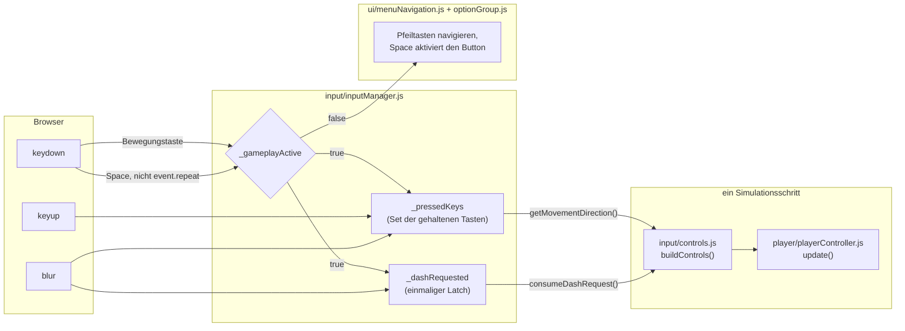

# 3 Frontend: Struktur / Bausteine

`Seitenbudget: ~5 S. | Status: Entwurf | Quellen: frontend/src/**, frontend/index.html, docs/spec-s05-dash.md §2 und §5, projekt-journal.md (Entscheidungen mit → Kap. 3)`

Das Frontend besitzt alles, was der Spieler sieht und drückt, und nichts von der Simulation.
Diese Aufgabenteilung ist in 2.2 Architektur-Entscheidungen festgelegt; dieses Kapitel zeigt,
wie das Frontend darunter aufgebaut ist. Der Ablauf **eines Bildes** über die Sprachgrenze
hinweg steht dagegen in 5.2.2 Bausteinsicht und Frame-Ablauf und wird hier nicht wiederholt.

## 3.1 Wesentliche Komponenten

Das Frontend besteht aus **ES-Modulen ohne Framework**, gruppiert in Pakete nach Aufgabe. Es
gibt drei Sorten von Modulen, und die Unterscheidung erklärt den Rest des Kapitels: Module,
die den **Browser anfassen** (DOM, Canvas, Tastatur), Module, die **Zustand halten**, und
Module, die nur **rechnen**. Nur die dritte Sorte ist unter Vitest prüfbar (siehe 3.3
Modularisierung), weshalb sie bewusst so groß wie möglich gehalten ist.

- **Bootstrap** — `index.js`. Baut alle Objekte, verdrahtet sie, hält den
  `requestAnimationFrame`-Loop und den Lebenszyklus einer Runde. Die einzige Datei, die alle
  anderen kennt.
- **Bridge** — `engine-bridge.js`. Die einzige Stelle, die das WASM-Modul berührt (siehe 5.1
  Wesentliche Komponenten).
- **`loop/`** — die Zeitrechnung: `frameScheduler.js` (feste Schrittzahl, Renderdrosselung,
  Schuldenklemmung), `simulationStep.js` (der Körper eines Schritts), `renderState.js`,
  `stateRenderer.js`, `staticFrameGate.js`, `frameMetrics.js`, `refreshRate.js`.
- **`input/`** — `inputManager.js` (Tastenzustand und Dash-Latch), `controls.js` (das
  Kontrollobjekt eines Schritts), `pauseControl.js` (Escape und Auto-Pause).
- **`player/`** — `playerController.js` (Integration und Dash) und `dashCooldown.js`
  (Abklingzeit als reine Arithmetik).
- **`powerups/`** — die drei Power-ups vollständig im Frontend: `powerups.js`, `mend.js`,
  `markerClearance.js`, `markerLifetime.js` (siehe 3.8 Implementierung der Fachlogik).
- **`renderer/`** — das größte Paket. `renderer.js` als Fassade über `canvasRenderer.js`,
  darunter je eine Zeichenebene pro Motiv (Arena, Hindernisse, Schweife, Dash-Ziellinie,
  Spawn-Marker, Power-ups, Statusbalken) und daneben die importfreie Zeichenarithmetik
  (`dashPulse.js`, `spawnMarkerPulse.js`, `mendPulse.js`, `worldTransform.js`).
- **`round/`** — `roundData.js` (der Zustand einer Runde), `roundRecords.js` (Persistenz),
  `waveTier.js` (die Stufe der gerade spawnenden Variante).
- **`ui/`** — das DOM: `menu.js` mit seinen vier Zulieferern, `hud.js`, die beiden Karten,
  `i18n.js`, `frameTimeGraph.js` samt Zubehör.
- **Zustand und Konfiguration** — `gameState.js` (die Zustandsmaschine) und `gameConfig.js`
  (alle Konstanten, siehe 3.7 Konfiguration).

Die vollständige Liste je Datei ist für den Anhang vorgesehen; Zeilenzahlen und Testzahlen
stehen ausschließlich in Kapitel 9 Quellcode-Übersicht.

## 3.2 Komponenten — Details & Interaktion

### 3.2.1 (UI-)Komponenten — Aufbau

**Das Dokument ist bewusst fast leer.** `index.html` enthält genau zwei Elemente: das
`<canvas id="game-canvas">` und ein leeres `<div id="ui-overlay">`. Alles Weitere entsteht
zur Laufzeit. Damit gibt es keine zweite Quelle der Wahrheit für die Oberfläche — kein
Element, das im HTML steht und im Modul noch einmal, und keine Bindung, die beide synchron
halten müsste.

**Die Grenze zwischen Canvas und DOM** ist keine Stilfrage, sondern nach Kosten gezogen: Was
sich in jedem Bild ändert, gehört auf das Canvas; was eine feste Beschriftung trägt, gehört
ins DOM. Beide Male hat dieselbe Beobachtung entschieden — die Dash-Leiste und später die
Buff-Zeilen standen auf dem Canvas und ließen ihre unveränderliche Beschriftung in **jedem
Bild neu rastern**. Beide sind ins DOM gewandert, wo der Browser sie einmal setzt. Der
Nebeneffekt ist ein Testeffekt: Was im DOM steht, kann Playwright lesen, während auf dem
Canvas gezeichneter Text für die E2E-Stufe unsichtbar ist (siehe 8.2 E2E Tests).

**Das Menü** ist ein Modul mit vier Zulieferern statt einer Datei: `menu.js` entscheidet, was
zu sehen ist, `menuDeck.js` liefert Rahmen, Titel und Zeilenliste, `menuPanels.js` die
einzelnen Paneele, `menuNavigation.js` die Tastaturführung und `optionGroup.js` die
Einstellungsgruppen. Es gibt **einen** Bildschirmtyp und nicht vier: ein Untermenü ersetzt nur
die linke Spalte und lässt Kopf, Fuß und Panelstapel stehen. Die Werte dahinter liegen in
`ui/menuSettings.js` — getrennt vom Rendern, weil die einzige Logik unter ihnen (welche
Bildraten der Bildschirm überhaupt lohnt) ohne Browser prüfbar sein soll.

**Eine Optionsgruppe existiert immer nur an einer Stelle.** `optionGroup.js` liefert Markup
und Auswahllogik für jede Einstellung, statt sie je Einstellung zu kopieren. Bemerkenswert ist
die Wahl der Bausteine: einfache Buttons mit `aria-pressed` statt `role="radiogroup"` oder
Radio-Inputs. Der Grund ist Tastenbesitz — die Pfeiltasten gehören der Menüliste, solange ein
Overlay offen ist, und dem Spieler, solange eine Runde läuft. Eine `radiogroup` bringt ihre
eigene Pfeiltastennavigation mit und würde um dieselben Tasten streiten, mit dem Ergebnis, dass
sie für Tastatur- und Screenreader-Nutzer kaputt ist. Ein Toggle-Button weckt diese Erwartung
nicht und funktioniert mit Tab plus Enter oder Leertaste. Dasselbe Thema kehrt in 3.2.2 als
Bausteinsicht wieder; hier ist es eine ARIA-Entscheidung, dort eine Ereignis-Entscheidung.

**Das HUD** ist eine feste Menge von DOM-Elementen mit stabilen IDs, die benennen, _was_ sie
zeigen (`hud-timer`, `hud-score`), neben Klassen, die sagen, _wo_ sie sitzen. Das ist eine
Zeile Produktionscode für die Testbarkeit und die Grenze, die dabei bewusst nicht
überschritten wurde: kein Test-Hook, der internen Spielzustand nach `window` exportiert.

**Zwei Karten und eine Attrappe** vervollständigen die Oberfläche. `gameOverCard.js` und
`pauseCard.js` sind Zwillinge über einer neutralen `card`-Basis — die Pause ist bewusst als
Karte gebaut und nicht als Sonderfall des Game-Over. `menuBackdrop.js` zeichnet den Schwarm
hinter dem Startmenü und ist **keine** Simulation, sondern eine Attrappe auf eigenem Canvas:
Sie läuft nur, solange das Menü steht, weil während einer Runde niemand die Dekoration
ansieht und sie sonst mit der Simulation um Bilder konkurrieren würde.

**Der Frametime-Graph** (`ui/frameTimeGraph.js` mit `frameGraphOverlay.js`,
`frameGraphScale.js` und `drawnFrameRate.js`) ist ein Diagnosewerkzeug und standardmäßig aus.
Er ist der einzige Teil der Oberfläche, der Messwerte statt Spielzustand zeigt; seine
Messgrundlage steht in 8.6 GPU-Last: Messgrundlage vor Optimierung.

**Alle nutzersichtbaren Zeichenketten liegen außerhalb des Codes.** `ui/i18n.js` lädt
`public/locales/en.json` zur Laufzeit und löst namensräumige Schlüssel auf (`menu.start`,
`hud.score`). Fehlt ein Schlüssel, liefert `t()` den Schlüssel selbst zurück — ein fehlender
Text fällt damit als Text auf, statt die Oberfläche leer zu lassen. Die Datei liegt unter
`public/`, weil sie geladen und nicht importiert wird: Was Vite nie im Modulgraphen sieht,
landet nur von dort im Produktionsbündel. Ein Verstoß dagegen ist genau einmal passiert und
in 10.2 Herausforderungen beschrieben.

**Das Aussehen** liegt in sechs Stylesheets, geteilt nach Zuständigkeit, und ihre Reihenfolge
in `index.html` ist tragend: `tokens.css` definiert die Variablen, die alle anderen lesen,
`components.css`, `cards.css`, `menu.css` und `hud.css` folgen, und `main.css` kommt zuletzt,
damit seine Positionierungs-Utilities gegen die Komponenten gewinnen. Die beiden Schriften
liegen als `woff2` im Repository statt auf einem Font-CDN — das ist dieselbe Rahmenbedingung
wie in 2.2: keine externe Anfrage zur Laufzeit.

### 3.2.2 Eine wesentliche Komponente: Darstellung des Aufbaus — Bausteinsicht

Als Bausteinsicht ist die **Eingabekette** gewählt, weil in ihr zwei nicht offensichtliche
Entscheidungen mit dokumentiertem Zielkonflikt stecken: Die Dash-Taste ist flankengetriggert
und gelatcht, und die Tastatur gehört nur während einer laufenden Runde dem Spiel.



**Der Latch** ist die Antwort auf den festen Zeitschritt. Ein Animationsbild kann mehrere
Simulationsschritte fahren; würde `controls` pro Schritt fragen „ist die Leertaste unten",
ergäbe ein Tastendruck bis zu fünf Dashes. Stattdessen setzt `keydown` eine Fahne, und
`consumeDashRequest()` liest sie **und löscht sie dabei**. Zusätzlich wird `event.repeat`
geprüft, damit eine gehaltene Taste nicht als Serie von Anfragen zählt. Der Aufruf pro Schritt
liegt in `controls.js`, einer Datei mit einer Funktion — sie existiert, damit „genau einmal pro
Schritt gelesen" eine benannte Stelle hat und nicht eine Gewohnheit ist.

**Das Tor `_gameplayActive`** entscheidet, wem die Tastatur gehört. Außerhalb einer Runde muss
die Leertaste den fokussierten Menü-Button aktivieren und müssen die Pfeiltasten die Menüliste
bewegen, deren Fuß das ausdrücklich verspricht. Drei Alternativen wurden verworfen:

| Alternative                                          | Grund der Ablehnung                                                                                                                                                      |
| ---------------------------------------------------- | ------------------------------------------------------------------------------------------------------------------------------------------------------------------------ |
| Menü-Navigation vor dem `InputManager` registrieren  | Reihenfolge von Listenern als Architektur. Beide sehen dieselbe Taste, und der zuerst registrierte gewinnt — beim nächsten Umbau der Bootstrap-Reihenfolge still kaputt. |
| Nur die Pfeiltasten freigeben, WASD weiter schlucken | Die Asymmetrie müsste erklärt werden, ohne etwas zu gewinnen. Die richtige Grenze ist der Spielzustand, nicht die Tastenmenge.                                           |
| `keyup` ebenfalls an die Runde binden                | Genau der Fehler, der dabei entsteht: eine beim Rundenende gehaltene Taste würde nie freigegeben und in der nächsten Runde als gedrückt gelten.                          |

Deshalb ist `keydown` am Zustand gebunden und `keyup` **nicht** — Aufräumen darf nie
zustandsabhängig sein. `blur` und `setGameplayActive(false)` tun dasselbe und sollen es tun:
beides sind Momente, in denen niemand mehr steuert. Diese Trennung ist zugleich das einzige
an der Eingabe, was nur die E2E-Stufe prüfen kann — alles Übrige ist Arithmetik und liegt in
Unit-Tests (siehe 8.2 E2E Tests).

### 3.2.3 Komponenten-Interaktion

**`index.js` ist der einzige Ort, an dem Module einander kennenlernen.** Kein Modul importiert
ein Geschwistermodul, um dessen Zustand zu lesen; wer etwas braucht, bekommt es übergeben.
Zwei Reihenfolgen darin sind tragend und im Code begründet: Die Messung der
Bildwiederholfrequenz läuft **parallel** zum Laden der Sprachdatei, damit die Wartezeit
einmal statt zweimal anfällt, und der Frametime-Graph wird **vor** dem Menü gebaut, weil das
Stapeln im `#ui-overlay` der DOM-Reihenfolge folgt und das Menü über dem Graphen liegen muss.

Der **Lebenszyklus einer Runde** besteht aus fünf Funktionen, und ihre Zuständigkeiten sind
scharf getrennt: `showStartMenu()` gibt Bildschirm und Tastatur ans Menü zurück,
`openRound()` baut die Engine neu und übergibt die Tastatur, `pauseGame()` friert die Welt
ein, `resumeGame()` lässt sie weiterlaufen, `endRound()` schreibt den Rekord und zeigt die
Karte. Jede von ihnen setzt `input.setGameplayActive(...)`, weil der Tastenbesitz aus 3.2.2
genau an diesen Übergängen wechselt.

Die Zeichenkette ist über eine **Fassade** entkoppelt: `renderer/renderer.js` delegiert an
`renderer/canvasRenderer.js`, sodass ein WebGL-Backend das Canvas-Backend ersetzen könnte,
ohne einen Aufrufer anzufassen. Diese Indirektion existiert, das zweite Backend nicht — die
Begründung dafür steht in 1.2 Die Lösung.

## 3.3 Modularisierung: Strukturierung der fachlichen Logik

Drei Regeln erklären die Aufteilung.

**Erstens: keine Simulationsmathematik im Frontend.** Positionen, Geschwindigkeiten,
Kollisionen und Ausweichverhalten kommen fertig aus der Engine. Es gibt genau **eine**
bewusste Ausnahme, und die ist benannt statt versteckt: Die Power-up-Marker müssen beim Setzen
Abstand zu den Hindernissen halten, also braucht das Frontend die Punkt-zu-Segment-Geometrie
ein zweites Mal. Sie liegt als exportierte, einzeln getestete `distanceToSegment` in
`powerups/markerClearance.js` statt inline im Spawnversuch — eine doppelte Geometrie an einer
sichtbaren Stelle ist billiger als ein zusätzlicher Puffer über die Sprachgrenze (siehe 3.8).

**Zweitens: importfreie Arithmetik wird herausgelöst.** Die Vitest-Suite läuft im
`node`-Environment, also ohne Browser und ohne gebautes WASM-Paket (siehe 8.1 Unit Tests und
Coverage). Jedes Modul, das etwas ausrechnet, ist deshalb frei von Importen auf Browser-APIs:
`loop/frameScheduler.js` und `loop/frameMetrics.js`, `ui/frameGraphScale.js`,
`player/dashCooldown.js`, `renderer/dashPulse.js`, `renderer/spawnMarkerPulse.js`,
`renderer/mendPulse.js`, `renderer/worldTransform.js`. Dieselbe Regel erklärt eine sonst
schwer begründbare Zweiteilung: `renderer/dashTrailHistory.js` hält den Ringpuffer der
Schweifpunkte, `renderer/dashTrail.js` die Verlaufsmathematik darüber, und
`renderer/trailLayer.js` zeichnet — nur das letzte Drittel braucht einen Kontext.

**Drittens: 400 Zeilen sind das Maximum.** Die Grenze ist mechanisch und hat trotzdem fast
jede Aufteilung dieses Projekts ausgelöst: `loop/simulationStep.js`, `loop/renderState.js`,
`loop/stateRenderer.js`, `powerups/markerLifetime.js`, `renderer/powerupMarkerLayer.js` und
`ui/menuSettings.js` sind alle entstanden, als `index.js` oder ihr Ursprungsmodul an die Grenze
lief. Bemerkenswert ist der Nebeneffekt: `loop/renderState.js` war als Teil von `index.js`
unter Vitest **nicht** erreichbar und ist es seit dem Herauslösen. Die Regel taugt aber nur
zusammen mit einer echten Naht — geteilt wurde jeweils entlang einer Grenze, die im
Kopfkommentar der Datei schon beschrieben war. Eine Aufteilung nach Zeilenzahl ohne Naht
verteilt denselben Gedanken auf zwei Dateien, statt zwei Gedanken zu trennen.

## 3.4 State Management

Es gibt **kein** Framework, keinen Store und kein Observable. Der Zustand liegt in drei
Schichten, jede mit einer eigenen Lebensdauer.

**`gameState.js`** hält die Zustandsmaschine mit vier Werten: `MENU`, `PLAYING`, `PAUSED`,
`GAME_OVER`. Sie kennt ausschließlich Übergänge und **validiert nichts** — `transition()`
schreibt den neuen Wert, ohne den alten zu prüfen. Die Zusicherung „`PAUSED` ist nur aus
`PLAYING` erreichbar und kehrt nur dorthin zurück" wird nicht hier, sondern von den beiden
Wächtern in `pauseGame()` und `resumeGame()` getragen, die dieses Paar besitzen. Das ist
Absicht: Ein Übergang, der aus zwei Gründen scheitern kann, ist schwerer zu lesen als eine
Zustandsmaschine ohne Meinung plus zwei sichtbare Wächter an der Stelle, an der das Warum
steht. Der Verzicht auf einen Store folgt aus der Bauform — es gibt eine einzige Ansicht und
einen Loop, der den Zustand ohnehin in jedem Bild liest; ein Abonnement-Mechanismus hätte
keinen Abnehmer.

**`round/roundData.js`** hält den Zustand einer Runde als einfaches Objekt mit Funktionen
darauf, nicht als Klasse: Punkte, Leben, Welle, Timer, Simulationsuhr, die Zeitstempel der
letzten Treffer und Dashes. Das Modul ist **browserfrei** und deshalb vollständig unter Vitest
prüfbar, was der Grund für diesen Schnitt ist.

**Modulweiter Zustand in `index.js`** ist die dritte Schicht und die kleinste: die
Menü-Einstellungen, der `FrameScheduler`, die Frame-Metriken und das Power-up-Feld. Sie liegen
dort und nicht in den Rundendaten, weil sie eine Runde überleben müssen — das Menü und der
Game-Over-Zweig haben keine Rundendaten, und die Bilduhr muss über Zustandswechsel
weiterlaufen, sonst sähe das erste spielende Bild eine mehrsekündige Zeitdifferenz.

**Die Zeitregel ist die eigentliche Aussage dieses Abschnitts.** Punkte, der Timer und jede
Abklingzeit leiten sich aus `simulationTimeMs` ab, nie aus der Wanduhr — sonst würde ein in
den Hintergrund geschobener Tab Punkte verschenken. Daraus folgt eine Pflicht, die leicht
übersehen wird: Diese Uhr springt in `beginRound()` auf null zurück, also muss **jeder** an
ihr gemessene Zeitstempel dort neu gesetzt werden. `lastHitAtSimulationMs` und
`lastDashAtSimulationMs` werden dazu eine volle Abklingzeit in die Vergangenheit gesetzt,
damit Dash und Trefferfenster im ersten Schritt bereit sind. Die eine Ausnahme ist
`countdownEndsAt`: Drei Sekunden Countdown sollen drei echte Sekunden sein, also läuft er auf
Wanduhr — und ist damit auch der einzige Wert, den eine Pause über sich hinwegtragen muss
(`pauseCountdown` / `resumeCountdown`). Umgekehrt gilt dieselbe Regel für Präsentation:
Animationen, die nichts entscheiden — der Startring des Dash-Schweifs, das Blinken eines
ablaufenden Markers — laufen absichtlich auf Wanduhr, weil sie zur Bildrate gehören und nicht
zur Simulation.

## 3.5 Routing und Navigation

**Es gibt kein Routing, und das ist die eine echte Absenz dieses Berichts.** Die Anwendung
besteht aus einer HTML-Seite, einem Canvas und einem Overlay-Container; es gibt keine URL-
Fläche, keine History-Behandlung und keine zweite Ansicht, auf die verwiesen werden könnte.
Die Rolle, die in einer Mehrseiten-Anwendung ein Router hätte, trägt `gameState.js` zusammen
mit dem Menü: Der Zustand entscheidet, was gezeichnet wird und wer die Tastatur besitzt.

Begründet ist das doppelt. Erstens durch die Rahmenbedingung „installationsfrei und
serverlos" — ein Deep-Link müsste auf etwas zeigen, und das einzige Ziel wäre ein
Spielzustand. Der liegt zur Hälfte im linearen Speicher des WASM-Moduls, dauert wenige
Minuten und ist nicht fortsetzbar; ein Link darauf hätte keine Bedeutung. Zweitens durch die
Bedienform: Die Anwendung ist für Tastatur gebaut, und ein zweites Navigationsmodell neben
dem Menü wäre eine zweite Stelle, an der um dieselben Tasten gestritten wird.

**Navigiert wird stattdessen im Menü**, und der Zurück-Weg ist Escape. Ein einziger
Fenster-Listener in `input/pauseControl.js` besitzt **beide** Richtungen — Pausieren und
Fortsetzen — plus die Auto-Pause bei Fokusverlust. Das ist kein Zufall: `ui/menuNavigation.js`
prüft für sein eigenes Escape, ob das Overlay sichtbar ist, und ein zweiter Handler würde diese
Bedingung synchron im selben Ereignis verändern. Eine geteilte Fassung schließt die Karte
also in demselben Moment, in dem sie sich öffnet, oder pausiert unmittelbar nach dem
Fortsetzen erneut. Kapitel 4 verweist für seine eigene Absenz auf diesen Abschnitt zurück
(siehe 4.5 Routing).

## 3.6 Persistenz

Persistiert wird **eine** Sache: das Ergebnis einer beendeten Runde, in `localStorage`, über
`round/roundRecords.js`. Gespeichert sind der persönliche Bestwert und der letzte Lauf, je mit
vier Werten — Punkte, Welle, Zeit und Schwarmgröße. Die Schwarmgröße gehört dazu, weil die
Statistikzeile der Game-Over-Karte sie zeigt und eine dort aus dem Nichts erscheinende Null
eine erfundene Zahl gewesen wäre.

**`localStorage` und nicht IndexedDB**, weil es um eine Handvoll Zahlen geht: Der Zugriff darf
synchron sein, es gibt kein Schema und keine Migration, und die asynchrone API von IndexedDB
würde eine Datenbank für zwei Datensätze verwalten.

**Der Speicher wird hereingegeben, nicht importiert.** `readRecords(storage = localStorage)`
nimmt ihn als Parameter, wodurch ein Map-gestütztes Objekt als Attrappe genügt und das Modul
unter Vitest prüfbar ist — die interessante Hälfte dieses Moduls ist nämlich nicht der
Normalfall, sondern der defekte Eintrag und der verweigerte Zugriff. Beides in Playwright zu
erzeugen kostet mehr als das ganze Modul. Jeder Zugriff liegt zusätzlich in `try`/`catch`:
Ein Profil im privaten Modus kann ein `localStorage` haben, das beim Schreiben wirft, und eine
von Hand editierte Zahl darf nicht als `NaN` im Menü landen. **Ein Fehler heißt „kein Rekord"
und sonst nichts** — die Grenzkontrolle sitzt an der Systemgrenze, nicht an jeder
Anzeigestelle. Was `readRecords` verlässt, ist entweder ein vollständiger Lauf oder `null`.

Bewusst **nicht** persistiert sind drei Dinge. Der Zustand einer laufenden Runde: Sie ist
kurz, und ein Wiederaufsetzen wäre spielmechanisch sinnlos. Eine **abgebrochene** Runde: Der
Weg von der Pausenkarte ins Hauptmenü schreibt nichts, weil ein Lauf, den der Spieler
verlassen hat, kein beendeter Lauf ist und „Letzter Lauf" nur mit einer Zahl überschreiben
würde, die niemand erreichen wollte. Und die **Menü-Einstellungen**: Bildrate, Graph und
Entwickleroptionen leben im Speicher einer Sitzung und sind nach einem Neuladen zurück auf
Standard. Das ist eine Auslassung aus Aufwandsgründen, keine architektonische — die Stelle
dafür wäre dieselbe wie für die Rekorde.

`recordRound` gibt die Rekorde nach dem Schreiben zurück, damit die Game-Over-Karte den
Bestwert **einschließlich** der gerade beendeten Runde zeigen kann: Ein Lauf, der den Rekord
gerade gesetzt hat, muss ihn sehen.

## 3.7 Konfiguration

**`gameConfig.js` ist die einzige Stelle für Frontend-Konstanten**; „keine Magic Numbers in
Logik-Modulen" ist eine harte Projektregel. Die Datei ist nach Themen gegliedert (Welt,
Spieler, Dash, Hindernisse, Spawn-Marker, Zeitschritt, Bildrate, Frametime-Graph) und trägt
ihre Begründungen als Doc-Kommentar an der Konstante — dort steht, warum ein Wert diesen
Betrag hat und welche andere Konstante mitgedacht werden muss. Ein Beispiel steht in 3.8.
Der Nutzen zeigt sich beim Nachstimmen: Weil jede Zusicherung in
`player/__tests__/playerSteering.test.js` ihre Konstante aus `gameConfig.js` **liest** statt
sie zu spiegeln, ist eine Umstimmung des Spielerhandlings eine Änderung von drei Zeilen und
keine Testrunde.

Die **Entwickleroptionen** liegen im Menü hinter einem eigenen Untermenü: Frametime-Graph an
oder aus, welche Kurven er zeichnet, und der unverwundbare Spieler. Die letzte ist ein
Messinstrument — die interessanten Frametimes liegen jenseits von zehn Minuten Spielzeit, und
dorthin kam man vorher nur durch Überleben. Sie wird beim Öffnen der Runde **einmal** gelesen
und ist danach Teil der Rundendaten, damit ein mitten in der Runde umgelegter Schalter nicht
die Regeln eines laufenden Laufs ändert.

**Vier Konstanten stehen bewusst doppelt** — je einmal hier und einmal in
`engine/src/constants.rs` bzw. im Puffer-Vertrag: `INITIAL_BOID_COUNT`,
`MAX_BOID_DIFFICULTY_TIER` sowie die drei Schrittweiten `OBSTACLE_STRIDE`,
`SPAWN_MARKER_STRIDE` und `DASH_AIM_STRIDE`. Bei den Schrittweiten ist die Doppelung der
Zweck: Die Grenztests der Engine nageln sie fest, sodass ein einseitiges Ändern auffällt statt
Zahlen zu verschieben (siehe 5.2.1 Der Puffer-Vertrag). Bei den beiden anderen ist es eine in
Kauf genommene Handsynchronisationspflicht, die als Kommentar an beiden Stellen steht.

Was **nicht** verdoppelt wurde, zeigt das Kriterium: `WORLD_WIDTH` und `WORLD_HEIGHT` stehen
nur hier. Die Engine bekommt die Weltgröße über ihren Konstruktor übergeben, ihre Tests
benutzen ohnehin eigene Größen, und eine zweite Kopie hätte eine Pflicht ohne Gewinn erzeugt.
Doppelt geführt wird also nur, was entweder von einem Test festgenagelt ist oder in beiden
Sprachen einen eigenen Verwendungszweck hat.

## 3.8 Implementierung der Fachlogik

Wenn die Simulation in der Engine liegt, bleibt für das Frontend mehr Fachlogik übrig, als es
zunächst aussieht: der Spieler selbst, die Power-ups, der Wellenfortschritt und alles, was aus
der Simulationsuhr abgeleitet wird.

**Der Spieler wird im Frontend integriert**, in `player/playerController.js`: Eine gehaltene
Richtung addiert Beschleunigung, eine losgelassene bremst gegen Null, und die
Geschwindigkeit wird gegen eine Obergrenze geklemmt. Der Dash ist die eine Stelle, an der
diese Klemme gebogen wird, und zwar sichtbar: `_startDash` setzt die Geschwindigkeit auf
`PLAYER_DASH_SPEED` (1100 px/s) **und hebt die Obergrenze mit**, die anschließend pro Schritt
um `PLAYER_DASH_SPEED_DECAY` (1533 px/s²) zurückfällt, bis sie wieder auf der normalen
Höchstgeschwindigkeit `PLAYER_MAX_SPEED` (360 px/s) sitzt. Ohne die mitgehobene Grenze wäre
der Impuls in demselben Schritt weggeklemmt, in dem er entsteht.

Die zusätzlich gewonnene Strecke ist damit die Fläche unter der abfallenden Rampe oberhalb der
normalen Höchstgeschwindigkeit:

```text
s_Überschuss = (v_dash − v_max)² / (2 · a_decay) = (1100 − 360)² / (2 · 1533) ≈ 179 px
t_Rampe      = (v_dash − v_max) / a_decay       = (1100 − 360) / 1533       ≈ 0,48 s
```

wobei _v_dash_ die Antrittsgeschwindigkeit des Dashs in px/s ist, _v_max_ die normale
Höchstgeschwindigkeit in px/s und _a_decay_ der Abbau der erhöhten Obergrenze in px/s².

Diese Form ist der Grund, warum die Reichweite über den **Abbau** gestimmt wird und nicht über
die Antrittsgeschwindigkeit: Die Distanz wächst quadratisch mit der Rampe, also würde eine um
30 % längere Strecke über `PLAYER_DASH_SPEED` nur √1,3 mehr Spitzengeschwindigkeit brauchen —
und genau die Spitzengeschwindigkeit entscheidet, wie weit der Spieler in **einem**
Simulationsschritt springt und damit, ob er durch ein dünnes Hindernis tunneln kann. Der Abbau
verändert die Reichweite, ohne den Moment des Antritts anzufassen. Zwei Stellen setzen die
erhöhte Grenze vorzeitig zurück, aus demselben Grund: ein Dash in die Weltkante und ein Dash
in ein Hindernis. Bliebe sie stehen, liefe die gewöhnliche Bewegung für den Rest des
Dash-Fensters oberhalb der Höchstgeschwindigkeit.

**Die Power-ups liegen vollständig im Frontend** — Marker, Aufnahme, Laufzeit und Wirkung.
Die Abgrenzung dahinter ist scharf: Hindernisse gehören in die Engine, weil die **Boids** ihnen
ausweichen und sie damit Teil der Simulation sind. Einen Marker sieht kein Boid an; er ist nur
für den Spieler da, und der wird hier ohnehin integriert. Eine Verlagerung hätte einen
zusätzlichen Puffer und eine geänderte `tick`-Signatur gekostet, um einen Abstandsvergleich zu
verschieben, den das Frontend in derselben Zeile schon rechnet.

**Zwei weitere Ableitungen** bleiben im Frontend, weil sie aus vorhandenen Zahlen entstehen
statt neue zu brauchen: `round/waveTier.js` errechnet die Stufe der gerade spawnenden
Boid-Variante aus der Wellennummer, anstatt sie als weiteren Wert über die Sprachgrenze zu
tragen, und `player/dashCooldown.js` macht aus zwei Zeitstempeln den Füllstand der Leiste.

**Der Ablauf eines Schritts ist die Fachlogik.** `loop/simulationStep.js` fährt in fester
Reihenfolge: Uhr weiterstellen, Eingabe genau einmal lesen, Geschwindigkeitsfaktor der Buffs
setzen, Spieler integrieren, fälligen Wellenwechsel anmelden, `tick()` rufen, eine
Hindernis-Korrektur der Engine annehmen, Power-ups schreiten lassen, Heilung anwenden, Treffer
verbuchen. Jedes Paar benachbarter Zeilen darin stand irgendwann in der falschen Reihenfolge,
und drei Fälle zeigen, was daran hängt:

- Die Position **vor** der Integration wird festgehalten, weil die Engine die ganze Bewegung
  gegen die Hindernisse prüft und nicht nur ihren Endpunkt — das ist es, was einen Dash
  abfängt, der schnell genug ist, um eine dünne Stange in einem Schritt zu überspringen.
- Die Power-ups schreiten **nach** der Hindernis-Korrektur, damit nichts von einer Position
  aus eingesammelt wird, aus der der Spieler gerade herausgeschoben wurde.
- Die Heilung wirkt **vor** den Treffern, damit ein Heilen und ein Treffer im selben Schritt
  sich in der Reihenfolge ihres Auftretens auswirken statt sich gegenseitig aufzuheben.

**Drei Konsequenzen des festen Zeitschritts** sind dabei im Frontend zu tragen und in 1.4
Entwicklungsfokus als Invariante angelegt. Erstens muss der Spieler **im selben Schritt** wie
der Schwarm integriert werden — seine Position ist Eingabe für `tick()` und für den
Kollisionstest der Engine, eine Integration pro gezeichnetem Bild würde beide entkoppeln.
Zweitens müssen Treffer für **jeden** Schritt eines Mehrschritt-Bildes verbucht werden; nur
den letzten Frame zu lesen verliert stillschweigend Treffer aus früheren Schritten. Beide
Trefferquellen — Boids und Hindernisse — laufen dazu durch **einen** Eingang, weil sie sich
das Unverwundbarkeitsfenster teilen müssen. Drittens wird die Simulationsschuld geklemmt
(`MAX_SIMULATION_STEPS_PER_FRAME` = 5) und bei eingefrorener Welt **verworfen**: im Countdown,
beim Rundenstart, beim Tod und in der Pause. Die Pause ist der einzige dieser vier Fälle, der
Minuten dauern kann — ohne das Verwerfen käme sie beim Fortsetzen als geklemmter Nachholstoß
auf einmal an, also genau als der Sprung, den die Auto-Pause bei Fokusverlust verhindern soll.
