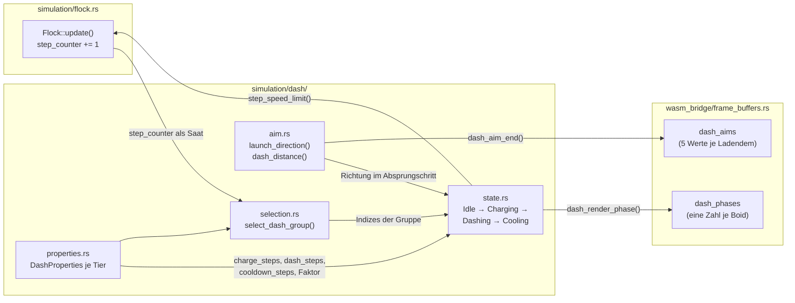

# 4 Systemnah / WASM: Struktur / Bausteine

`Seitenbudget: ~5 S. | Status: Entwurf | Quellen: engine/src/**, docs/spec-s05-dash.md, projekt-journal.md (Entscheidungen mit → Kap. 4)`

Dieses Kapitel beschreibt die Schicht, die das Fokus-Thema aus 1.4 Entwicklungsfokus trägt:
die Simulation selbst. Es folgt derselben Gliederung wie Kapitel 3 Frontend: Struktur /
Bausteine und ergänzt sie um den Punkt Konfiguration, weil hier alle Stellschrauben des
Spielverhaltens liegen.

## 4.1 Wesentliche Komponenten

Die Kernaussage steht vor der Aufzählung: **Die Engine besitzt die gesamte Simulation und
kennt weder DOM noch Canvas noch eine Browser-API.** Kein Modul unter `engine/src/`
importiert `web_sys`, und außerhalb von `wasm_bridge/` steht kein einziges
`#[wasm_bindgen]` — jede Datei der Simulation würde unverändert in einem Terminalprogramm
laufen. Das ist keine Stilfrage, sondern die Voraussetzung dafür, dass `cargo test` die
Simulation ohne Browser prüfen kann (siehe 8.1 Unit Tests und Coverage).

Vier Verzeichnisse, entlang der Abhängigkeitsrichtung:

- **`math/`** — zwei Dateien ohne jeden Spielbezug. `vector.rs` ist `Vec2` mit dreizehn
  reinen Operationen, `segment.rs` die Streckengeometrie, aus der die Hindernisse gebaut sind.
- **`simulation/`** — die Simulation, aufgeteilt in **vier Einzeldateien und vier Ordner**.
  Die Dateien sind der Kern, auf dem alles sitzt: `boid.rs` (was ein Boid _ist_),
  `physics.rs` (drei zustandslose Primitive), `overlap.rs` (Entstapeln und Weltrand) und
  `flock.rs` (der einzige Orchestrator). Die Ordner sind je ein System auf diesem Kern:
  `steering/` (wohin ein Boid will), `dash/` (der Stoß), `obstacle/` (die Hindernisse),
  `wave/` (Ankündigung und Eintritt der nächsten Welle).
- **`wasm_bridge/`** — die einzige Sprachgrenze. `mod.rs` hält `GameEngine` und den
  Lebenszyklus, `response.rs` den `FrameResponse`, `frame_buffers.rs` das Packen eines
  Frames, `boid_factory.rs` die Frage, was ein Boid einer bestimmten Welle ist. Details in
  Kapitel 5 Frontend/Systemnah-Integration — WASM.
- **`constants.rs`** — alle Standardwerte in vier kommentierten Blöcken (Schwarm,
  Wellen-Tore, Dash, Hindernisse), plus `lib.rs`, das genau einen Namen nach außen gibt:
  `GameEngine`.

**Jeder Ordner hat ein Fassaden-`mod.rs`**, das seine Untermodule deklariert und genau die
Namen re-exportiert, die von außerhalb benutzt werden. Ein Aufrufer schreibt
`obstacle::Obstacle` statt `obstacle::shape::Obstacle`; eine Datei innerhalb eines Ordners
zu verschieben ist damit keine Änderung für Aufrufer. Umgekehrt ist die Fassade eine
Zusage, die überprüft wird: Was nur ordnerintern gebraucht wird, kommt nicht hinein, und
`cargo clippy -- -D warnings` meldet einen Re-Export, den niemand liest.

Die Modulübersicht mit einer Aufgabenzeile je Datei ist für 11.1 Tabellen vorgesehen; alle
Zahlen zu Dateigröße und Verteilung stehen in 9.2 Größe und Verteilung.

## 4.2 Komponenten — Details & Interaktion

Die Schwarmbewegung entsteht aus **fünf Steuerungsregeln**, die in `steering/rules.rs` als
reine Funktionen liegen. Jede nimmt einen `&Boid` plus eine Nachbar- oder Hindernisliste und
gibt eine **ungewichtete** Kraft zurück: `separation` (Abstand zu zu nahen Nachbarn),
`alignment` (Richtung der Nachbarn übernehmen), `cohesion` (zum Schwerpunkt der Nachbarn),
`seek_target` (zum Spieler) und `avoid_obstacles` (an einem Hindernis vorbei).

**Die nicht offensichtliche Kopplung** liegt in den ersten vier: Alle skalieren ihre
Wunschgeschwindigkeit mit `properties.max_speed`. Diese Eigenschaft anzuheben verändert also
nicht nur die Höchstgeschwindigkeit, sondern **auch die Steuerungsstärke** aller vier Regeln.
Genau deshalb bekommt `integrate(boid, speed_limit)` die Obergrenze als Parameter übergeben,
statt sie vom Boid zu lesen — ein dashender Boid darf für einige Schritte schneller sein, ohne
dass seine Steuerung mitskaliert. Die drei naheliegenden Alternativen und warum sie ausfallen:

| Ansatz                                        | Grund der Ablehnung                                                                                                                |
| --------------------------------------------- | ---------------------------------------------------------------------------------------------------------------------------------- |
| Den Dash als zusätzliche **Kraft** aufbringen | `clamp_force` begrenzt die Summe aller Regeln auf `max_acceleration` (0,09). Der Impuls käme mit wenigen Prozent seiner Stärke an. |
| `max_speed` temporär **erhöhen**              | Verdreifacht Separation, Alignment, Kohäsion und Seeking mit — der Dasher würde nicht ausbrechen, sondern nur alles stärker tun.   |
| `integrate` **umgehen**                       | Ein zweiter Bewegungspfad, der irgendwann das Wrapping oder die Hindernisprüfung vergisst.                                         |

`avoid_obstacles` ist die einzige Regel mit einer eigenen Konstruktion: Sie mischt die
Oberflächennormale mit der **Tangente** und wählt die der beiden Tangenten, die zur
Flugrichtung passt. Die naheliegende Fassung — geradeaus von der Oberfläche weg — erzeugt bei
einem frontalen Anflug eine Kraft genau entgegen der eigenen Bewegung, und der Boid bleibt
vor dem Hindernis stehen. Mit Tangentenanteil (`OBSTACLE_TANGENT_SHARE` = 1,25) fliegt er
darum herum.

Wie viel jede Regel zählt, entscheidet **allein** `steering/weights.rs`. Die Regeln kennen
keine Priorität, und `flock.rs` kennt nicht, welche Regeln es gibt; diese Datei ist die
einzige, die beides weiß. Sie hält zwei Funktionen: `flocking_steering` summiert alle fünf
gewichtet, `dash_steering` gibt **nur** Separation zurück.

### 4.2.1 Eine wesentliche Komponente: Darstellung des Aufbaus — Bausteinsicht

Als Bausteinsicht ist der **Dash-Cluster** gewählt: `simulation/dash/` mit seinen vier
Modulen und dem Integrationspunkt in `Flock::update()`. Er trägt das Fokus-Thema, weil in ihm
die Determinismus-Zusicherung der ganzen Engine steckt.



**Die Zustandsmaschine** durchläuft `Idle → Charging → Dashing → Cooling → Idle`. Auf dem
Boid liegen dafür genau zwei `Copy`-Felder: `dash_state` und
`dash_state_steps_remaining`. Jeder Nicht-Idle-Zustand ist nur ein Countdown, ein Zähler
genügt also für alle drei. Drei getrennte Zähler wären eine Invariante zum Selberhalten
(„genau eine Phase ist aktiv") — mit Zustand plus Restzähler ist sie gar nicht verletzbar.
`Boid` ist `Copy` und wird pro Schritt vollständig geklont, neuer Zustand muss also `Copy`
bleiben. **Alle Dauern zählen in Simulationsschritten, nie in Millisekunden**, weil die
Engine keine Delta-Zeit kennt.

**Der Determinismus ist der Kern des Kapitels.** Es gibt in der ganzen Engine keine
`rand`-Abhängigkeit; `Cargo.toml` führt genau zwei Abhängigkeiten (`js-sys`,
`wasm-bindgen`) und eine Dev-Abhängigkeit (`wasm-bindgen-test`), alle drei an der
Sprachgrenze und keine in der Simulation. Wer
dashen darf, wird aus dem `step_counter` des Flocks abgeleitet — mit derselben
Integer-Hash-Arithmetik wie `find_spawn_position` in `boid_factory.rs`:

```text
Runde     r = step_counter / DASH_SELECTION_INTERVAL_STEPS
Saat      s = r · 37 + versuch · 17
Kandidat  i = (s · 97 + 31) mod n
```

Dabei ist `versuch` einer von acht Durchgängen, `n` die Schwarmgröße. Die Rechnung läuft in
`u64`, weil die Multiplikationen einen 32-Bit-Zähler nach wenigen Tagen Dauerbetrieb
überlaufen ließen. `select_dash_group` gibt fast immer eine leere Liste zurück: nur wenn
`step_counter` ein Vielfaches von `DASH_SELECTION_INTERVAL_STEPS` (24) ist, nur wenn der
Schwarm unter seiner Grenze gleichzeitiger Dasher liegt, und nur wenn ein Kandidat die
Eignungsprüfung besteht (dash-fähig, `Idle`, und 160–340 px vom Spieler entfernt). Der
leere Fall kostet ein `Vec::new()`, das nicht allokiert.

Der so gewürfelte Boid ist nicht der Dasher, sondern der **Anführer** einer Gruppe:
`collect_group_around` läuft danach einmal in Indexreihenfolge über den Schwarm und nimmt
jeden Boid desselben `difficulty_tier` innerhalb von `DASH_GROUP_RADIUS` (48 px) auf, bis
`MAX_DASH_GROUP_SIZE` (6) oder die Zahl freier Slots erreicht ist. Der Einzeldash ist damit
der Randfall der Gruppe — die leere Nachbarschaft — und kein zweiter Codepfad. Der
Tier-Vergleich trägt zwei Lasten: sichtbar lesen sich mehrere gleichfarbige Boids als ein
abgestimmter Stoß, und mechanisch teilen Boids eines Tiers ihre `charge_steps`, pulsen also
synchron und starten im **selben** Simulationsschritt.

| Alternative                                                    | Grund der Ablehnung                                                                                                                                                                                                       |
| -------------------------------------------------------------- | ------------------------------------------------------------------------------------------------------------------------------------------------------------------------------------------------------------------------- |
| Clusteranalyse über den Schwarm, dann das beste Cluster wählen | Deutlich größere Konstante pro Selektionsrunde, und die Determinismus-Zusicherung müsste für einen ganzen Algorithmus gelten statt für eine Schleife. Bei vier Boids sieht der Spieler den Unterschied nicht.             |
| Gruppen-Zustand auf dem Boid (`dash_group_id`)                 | Ein drittes Dash-Feld, das niemand liest: nach `begin_dash_charge` verhält sich jedes Mitglied wieder für sich. Zustand, der nichts entscheidet, kann nur inkonsistent werden.                                            |
| Mehrere unabhängige Würfe pro Runde statt einer Gruppe         | Gleichzeitige, aber räumlich verstreute Dashes — mehr Druck ohne den lesbaren Stoß. Das wäre nur die Frequenzerhöhung unter anderem Namen.                                                                                |
| Einen Zufallsgenerator einführen                               | Bricht die Reproduzierbarkeit, auf der jeder Simulationstest ruht: derselbe Startzustand plus dieselbe Eingabefolge ergibt heute denselben Ablauf. Der Gewinn wäre eine Streuung, die die Hash-Arithmetik ebenso liefert. |

**Der Tier-Ramp** liegt in `properties.rs`: `dash_properties_for_difficulty_tier` baut aus
den Standardwerten die Werte einer Stufe. Tuning, das pro Boid abweichen darf, gehört auf den
Boid bzw. in `BoidProperties` — nie in eine neue globale Konstante, weil mehrere Varianten
gleichzeitig in einem Schwarm fliegen. Die Sperre für die ersten Wellen ist ein eigenes
`can_dash: bool` und **nicht** `charge_steps == 0`: null Ladeschritte ist ein legitimer
Tuning-Wert („Dash ohne Vorwarnung") und darf nicht versehentlich Welle-1-Boids
freischalten. Die vollständige Wertetabelle je Stufe steht in 11.1 Tabellen.

**`aim.rs` ist die einzige Quelle der Richtung.** `launch_dash` in `state.rs` schreibt die
Absprunggeschwindigkeit mit `launch_direction`, und die Vorwarnlinie, die das Frontend
zeichnet, wird mit derselben Funktion gemessen. Die Linie kann deshalb keine Richtung
versprechen, die der Absprung nicht nimmt. Nichts davon liegt auf dem Boid: Die Richtung
entsteht erst im Absprungschritt, während der Aufladung ist die ehrliche Antwort also eine
frische pro Schritt — und sie folgt einem Spieler, der weiterläuft.

### 4.2.2 Komponenten-Interaktion

Die Interaktion **ist** die Schrittreihenfolge, und sie beginnt eine Ebene höher als der
Flock. `GameEngine::tick()` ordnet vier Systeme, jedes an seinem Platz aus einem Grund:

1. **Spielerbewegung gegen die Hindernisse auflösen.** Zuerst, damit der Schwarm gegen die
   Position steuert und gegen die Position geprüft wird, in der der Spieler wirklich landet.
   Geprüft wird die **Strecke** von der vorigen zur versuchten Position, nicht nur ihr
   Endpunkt — deshalb kann auch ein Dash nicht zwischen zwei Schritten durch ein dünnes
   Hindernis tunneln.
2. **Getroffenes Hindernis markieren.** Solange der Index noch auf das Hindernis zeigt, aus
   dem er stammt: die Feldaktualisierung entfernt gleich, was abgelaufen ist, und schiebt den
   Rest nach.
3. **Fällige Wellen-Spawns freigeben.** Vor dem Flock-Schritt, damit ein diesen Schritt
   ankommender Boid schon Teil des Schwarms ist, gegen den seine Nachbarn steuern.
4. **Hindernisse altern und spawnen lassen.** Ebenfalls vorher, damit kein Boid gegen ein
   Hindernis steuert, das es nicht mehr gibt.
5. **`Flock::update()`** — der eigentliche Schritt, unten aufgeschlüsselt.
6. **Frame packen** und die vier Werte anhängen, die nur eine Bewegung erzeugen kann
   (korrigierte Position, Trefferflag, Normale).

Innerhalb von `Flock::update()` sind es sieben Schritte:

1. `step_counter` erhöhen (mit `wrapping_add`, damit eine sehr lange Sitzung ihn nicht
   überläuft).
2. Höchstens eine neue Dash-Gruppe anbieten, **bevor** sich etwas bewegt, damit die
   gewählten Boids schon in diesem Schritt pulsen.
3. Den Boid-Vektor in einen **Snapshot** klonen, damit jeder Boid gegen den Zustand des
   _vorherigen_ Schritts steuert.
4. Je Boid: Dash-Zustand fortschreiben, dann `dash_steering` **oder** `flocking_steering`,
   Kraft auf `max_acceleration` klemmen, mit `step_speed_limit(boid)` integrieren, die
   gefahrene Strecke gegen die Hindernisse prüfen und abprallen, dann am Weltrand wrappen.
   Die Hindernisprüfung liegt **vor** dem Wrap, weil ein Boid, der über den Rand tritt,
   sonst entlang einer Strecke quer durch die Arena geprüft würde.
5. Overlaps relaxieren.
6. Boids aus Hindernissen herausschieben — bewusst **nach** der Relaxation, weil diese Boids
   zum Entstapeln verschiebt und dabei einen in ein Hindernis drücken kann.
7. Spielertreffer zählen.

Drei Eigenschaften dieser Reihenfolge sind tragend. **Der Snapshot** entkoppelt das Ergebnis
von der Iterationsreihenfolge (siehe 4.4 State Management). **Ein dashender Boid ist
innerhalb der Relaxation unverschiebbar**: Er legt bis zu 18,7 px pro Schritt zurück, bei
einem Mindestabstand von 12 px gerät er also fast jeden Schritt in eine neue Überlappung, und
die symmetrische Halbe/Halbe-Korrektur würde ihn über vier Durchläufe sichtbar von seiner
Linie schieben. Der nicht-dashende Partner nimmt daher die ganze Korrektur; zwei Dasher
teilen wie jedes andere Paar. Dasher ganz aus dem Pass auszunehmen wäre falsch — dann lägen
sie sichtbar übereinander, genau was der Pass verhindert. **Der Wrap benutzt `rem_euclid`**,
sodass auch eine Verschiebung größer als eine Weltbreite im Inneren landet.

Der Schritt ist **O(n²)** in der Boid-Anzahl, und die Relaxation ist es viermal. Welt und
Bildschirm sind dabei nicht dasselbe: Die Welt hat eine feste logische Größe, die das Frontend
ins Fenster einpasst.

## 4.3 Modularisierung: Strukturierung der fachlichen Logik

Vier Regeln teilen die Engine auf, in dieser Rangfolge.

**Mathematik, Simulation und Bindungsschicht sind getrennt.** `math/` weiß nichts von Boids,
`simulation/` nichts von WebAssembly, `wasm_bridge/` nichts von Steuerungsregeln. Die
Abhängigkeiten laufen nur in eine Richtung, was der Grund ist, dass `boid_factory.rs` in
`wasm_bridge/` liegt und nicht in `simulation/`: Die Schwierigkeitsrampe ist eine
**Design-Kurve**, keine Simulationsregel, und nichts in `BoidProperties` weiß, dass es
Wellen gibt.

**Die Regeln sind reine Funktionen.** Sie lesen einen Boid und eine Liste und geben eine
Kraft zurück. Das macht sie ohne Aufbau testbar und ist die Voraussetzung dafür, dass
`weights.rs` die Gewichtung an einer Stelle halten kann.

**`constants.rs` hält Standardwerte, keine Invarianten.** Weil mehrere Boid-Varianten in
einem Schwarm koexistieren, ist der Wert in der Konstante nur der Ausgangspunkt einer
Rampe. Was global bleibt, ist eine Eigenschaft der _Welt_ statt der _Variante_ —
`BOID_COLLISION_RADIUS` und `BOID_OBSTACLE_BOUNCE` etwa, weil ein Hindernis eine Wand ist,
die sich für alle gleich verhält.

**Die 400-Zeilen-Grenze ist die erzwingende Regel.** Sie ist der Grund, dass der Dash in
vier Dateien liegt statt in einer, dass `wasm_bridge/` drei Dateien neben `mod.rs` hat und
dass die 22 flachen Dateien in `simulation/` zu vier Dateien plus vier Ordnern wurden. Der
Umbau ist zugleich das Muster, an dem sich die Regel bewährt hat: Weil die Fassaden die
`use`-Zeilen unverändert auflösen ließen, mussten `boid.rs`, `overlap.rs` und weite Teile von
`flock.rs` nicht angefasst werden, kein Dateiinhalt wurde verändert, und die Zahl der
Lib-Tests war vor und nach jedem der vier Commits identisch. Daraus folgt eine Regel für
`use`-Zeilen, an der der Umbau hängt: innerhalb eines Ordners `use super::geschwister`, über
eine Ordnergrenze hinweg immer der absolute Pfad `use crate::simulation::…`. Innerhalb eines
`#[cfg(test)]`-Moduls zeigt `super` auf die **Datei** statt auf den Ordner, weshalb die
Testmodule durchgängig absolut importieren.

Bewusst nicht mitgemacht: Die Sichtbarkeiten sind weiterhin durchgängig `pub`, obwohl vieles
nur ordnerintern gebraucht wird. Das ist ein offener Posten und in 10.1 Kapazitätsplan als
solcher genannt.

## 4.4 State Management

Der Zustand liegt in drei Schichten, und die Aufteilung ist enger, als sie aussieht.

**Der Boid trägt seinen eigenen Zustand.** Position, Geschwindigkeit, Beschleunigung, seine
`BoidProperties`, sein `difficulty_tier` und die zwei Dash-Felder. `Boid` ist `Copy`, was die
Voraussetzung für den Snapshot ist.

**`Flock` besitzt genau zwei Dinge:** den Boid-Vektor und den `step_counter`. Nicht mehr —
Weltgrenzen und Wellennummer liegen eine Ebene höher, weil ein Flock nichts über Wellen
wissen muss, um einen Schritt zu rechnen.

**`GameEngine` besitzt den Rest:** den `Flock`, das `ObstacleField`, die `WaveSpawnQueue`,
Weltbreite und -höhe, die Startschwarmgröße, die laufende Wellennummer, die letzte
Spielerposition und sieben wiederverwendbare Ausgabepuffer.

**Der Snapshot ist eine Zustandsentscheidung, nicht eine Optimierung.** `Flock::update()`
klont den Boid-Vektor, und alle Regeln lesen aus dem Klon. Ohne ihn würde Boid 5 gegen die
bereits aktualisierten Boids 0–4 und die noch alten 6–n steuern; das Ergebnis hinge von der
Iterationsreihenfolge ab, und dieselbe Ausgangslage könnte je nach Einfügereihenfolge anders
ausgehen. Der Preis ist eine Kopie des Vektors pro Schritt und damit die einzige planmäßige
Allokation im heißen Pfad.

Zwei Zustände sind **absichtlich nicht** vorhanden. Die Dash-Richtung liegt auf keinem Boid,
weil sie erst im Absprungschritt entsteht (siehe 4.2.1). Und eine Gruppenzugehörigkeit gibt
es nicht, weil nach `begin_dash_charge` jedes Mitglied sich wieder für sich verhält.

Der eine gemerkte Fremdzustand ist `last_player_position`: Die Vorwarnlinien werden dagegen
gemessen, und `snapshot()` bekommt keine Spielerposition. Das ist keine Näherung, sondern
genau richtig — ein Snapshot zeichnet eine eingefrorene Welt (Countdown, Tod, Pause), in der
sich seither nichts bewegt hat.

## 4.5 Routing

„Routing" heißt auf dieser Seite der Grenze **Dispatch**, nicht URL-Navigation; dass die
Anwendung insgesamt kein Routing im Web-Sinn hat, ist in 3.5 Routing und Navigation
begründet. Drei Ebenen entscheiden hier, wohin ein Aufruf geht.

**Die Eintrittsfläche.** `#[wasm_bindgen]` steht an genau zwei Typen: `GameEngine` mit fünf
Methoden (`new`, `tick`, `snapshot`, `set_wave`, `resize`) und `FrameResponse` mit seinen
Gettern. Jeder dieser Exporte trägt einen Doc-Kommentar, was die Projektregel verlangt und
hier besonders trägt: Der Vertrag von `tick` — der Aufrufer muss die _zurückgegebene_
Position benutzen, nicht die angefragte — ist nur dort dokumentierbar. `resize` ist der
einzige Export, den das Spiel nicht mehr aufruft; der Kommentar sagt ausdrücklich, dass er
kein toter Code ist, weil die Weltgrenzen der Engine gehören und die Zusicherung, dass eine
schrumpfende Welt den Spieler nicht einschließen kann, nur dort geprüft wird.

**Die feste Schrittreihenfolge** aus 4.2.2 ist der zweite Dispatch: Sie entscheidet nicht
_ob_, sondern _wann_ ein System an einem Schritt beteiligt ist, und sie ist an mehreren
Stellen nicht vertauschbar.

**Die Dash-Zustandsmaschine** ist der dritte, und sie ist die einzige Verzweigung pro Boid
und Schritt: `advance_dash_state` entscheidet über das `match` auf `dash_state`, ob dieser
Boid normal flockt oder seine Dash-Linie fliegt, und `flock.rs` fragt das über `is_dashing`
nur noch ab.

## 4.6 Persistenz

„Persistenz" heißt hier **Fortbestehen im linearen WASM-Speicher über Ticks hinweg**. Eine
Speicherung über das Neuladen der Seite hinaus gibt es in der Engine nicht; die liegt im
Frontend und ist in 3.6 Persistenz beschrieben.

**Was fortbesteht, sind der Zustand und die Kapazitäten.** `GameEngine` wird einmal je Runde
gebaut und lebt dann über alle Ticks. Die sieben Ausgabepuffer werden pro Frame mit `clear()`
geleert, was die Kapazität behält — nach den ersten Frames einer Runde stehen sie also auf
ihrem Höchststand und wachsen nicht mehr. Zwei von ihnen werden zusätzlich vorreserviert,
weil ihre Länge im Betrieb schwankt (Hindernisse kommen und gehen, Marker gibt es die meiste
Zeit gar nicht); für die Dash-Ziele wird bewusst **nicht** reserviert, weil das Zählen der
ladenden Boids ein zweiter Durchlauf über den ganzen Schwarm wäre — für eine Allokation, die
längst passiert ist.

**Allokationsfrei ist der Frame damit trotzdem nicht,** und das gehört hierher statt in eine
Fußnote. Pro Frame fällt an: der Snapshot-Klon des Boid-Vektors, sieben `Vec`-Klone beim Bau
des `FrameResponse` und die Kopie in die typisierten Arrays, wenn das Frontend die Getter
liest. Was die wiederverwendeten Puffer einsparen, ist das **Wachsen** — nicht das Kopieren.
Eine kopierfreie Variante würde den WASM-Speicher direkt als Sicht exportieren und ist als
offener Posten in 10.1 Kapazitätsplan vermerkt; sie hätte den Puffer-Vertrag aus 5.2.1 Der
Puffer-Vertrag gegen eine Lebenszeit-Zusage eingetauscht, die schwerer richtig zu benutzen
ist als ein Kopieren, das messbar nicht das Problem war (siehe 8.6 GPU-Last: Messgrundlage
vor Optimierung).

**Der `step_counter` ist die persistierte Uhr.** Aus ihm zieht `dash/selection.rs` seinen
Determinismus, und aus ihm speist sich auch das Altern der Hindernisse. Derselbe
Startzustand plus dieselbe Eingabefolge ergibt denselben Ablauf, ohne jede Zufallsquelle —
und weil er in Schritten und nicht in Wandzeit zählt, erbt jede daraus abgeleitete Frist
die vier Freeze-Fälle des Frontends gratis: Eine pausierte Runde hält ihre Wellenankündigung,
statt die Welle im Hintergrund hereinzulassen.

## 4.7 Konfiguration — Wesentliche Einstellungen

Die Engine hat **keine Konfigurationsdatei, keine Umgebungsvariablen und keine
Feature-Flags.** Jeder Wert ist eine `pub const` in `constants.rs` und wird einkompiliert.
Das ist die Kehrseite des Determinismus: Ein zur Laufzeit veränderlicher Simulationsparameter
wäre eine zweite Quelle der Wahrheit über das Verhalten eines Laufs.

`constants.rs` ist in vier kommentierte Blöcke geteilt (Schwarm, Wellen-Tore, Dash,
Hindernisse), und die Begründung eines Werts steht **am Wert**, nicht in einer separaten
Tabelle — das ist dieselbe Konvention wie im Frontend und in 8.4 Kommentare — Visuelle
Strukturierung des Quellcodes beschrieben. Vier Gruppen sind erwähnenswert:

**Was pro Boid abweichen darf, steht nicht hier.** `BoidProperties` hält neun Felder, davon
`DashProperties` als eigene Gruppe mit fünf. `properties_for_difficulty_tier` in
`boid_factory.rs` baut aus der Stufe eine Variante, `build_boid` ist die **eine** Stelle, an
der eine Stufe zu einem Boid wird — geteilt vom ersten Schwarm und von den Wellen-Toren,
damit die beiden nicht auseinanderlaufen können. Ein Test hält genau das fest.

**Zwei Rampen unterschiedlicher Länge.** `difficulty_tier_for_wave` ist `wave − 1`, gedeckelt
bei `MAX_BOID_DIFFICULTY_TIER` = 4; die Boid-Varianten sind also ab Welle 5 am Anschlag.
`MAX_OBSTACLE_DENSITY_TIER` = 8 ist absichtlich länger, weil die Hindernisdichte über das
ganze Spiel steigen soll. Ohne diese Begründung sähen zwei verschiedene Deckel wie ein
Versehen aus. Das Ausweichgewicht der Boids bleibt dagegen über alle Stufen konstant:
Ausweichen ist Kompetenz, nicht Schwierigkeit — ein späterer Boid, der schlechter ausweicht,
sähe kaputt aus und nicht schwerer.

**Eine Konstante, die zur Übersetzungszeit geprüft wird.** Die Sackgassenfreiheit der Arena
ruht auf einer einzigen Ungleichung: `MINIMUM_CORRIDOR_WIDTH` > 2 · `PLAYER_COLLISION_RADIUS`.
Sie steht als `const _: () = assert!(…)` in `constants.rs` und nicht in einem Test, weil ein
Build, der sie bricht, gar kein Binary erzeugen soll. Der Zusammenhang: Um den Spielerradius
aufgeblasen ist jedes Hindernis eine konvexe Insel echt im Inneren der Arena, die keine andere
und keine Wand berührt — und um eine solche Insel kann man immer herumlaufen. Die Alternative,
nach jedem Spawn eine Erreichbarkeitssuche zu fahren, wäre nicht mehr _beweisbar_, sondern
nur noch gemessen, und ihre Aussage nur so gut wie die Gitterauflösung.

**Doppelt geführte Werte.** `INITIAL_BOID_COUNT` (24) steht in `constants.rs` **und** in
`gameConfig.js`; die drei Stride-Konstanten stehen in `frame_buffers.rs` und in
`gameConfig.js`. Bei den Strides ist die Doppelung der Punkt — die Grenztests nageln sie fest
(siehe 5.2.1 Der Puffer-Vertrag) —, beim Startschwarm ist sie eine in Kauf genommene
Handsynchronisation. Das Gegenstück steht in 3.7 Konfiguration.

## 4.8 Implementierung der Fachlogik

Der Rechenkern ist bewusst klein und besteht aus reinen Funktionen.

**`Vec2`** hat dreizehn Operationen: `new`, `zero`, `length`, `length_squared`, `normalize`,
`dot`, `cross`, `perp`, `scale`, `add`, `sub`, `limit` und `distance_to`. Zwei davon tragen
mehr, als ihr Name sagt: `limit` ist die **einzige** Stelle, an der eine Obergrenze angewendet wird — von
`clamp_force` für die Kraft und von `integrate` für die Geschwindigkeit —, und `normalize`
gibt für einen Nullvektor den Nullvektor zurück, statt durch Null zu teilen. Letzteres
verlagert die Entscheidung an den Aufrufer, und jeder, der eine Richtung _braucht_, trifft
sie sichtbar: `launch_direction` fällt auf das Heading und dann auf `(1, 0)` zurück,
`fallback_overlap_direction` leitet aus den zwei Indizes eine der vier Achsrichtungen ab.

**`segment.rs`** hält vier Funktionen: `closest_point_on_segment`,
`distance_from_point_to_segment`, `segments_intersect` und `distance_between_segments`. Eine
Strecke der Länge null ist darin ein Punkt — und genau daraus fällt das kreisförmige
Hindernis ohne eigenen Codepfad aus derselben Formel, weil ein `Obstacle` eine Kapsel ist
(Mittellinie plus Radius) und ein Kreis die entartete Kapsel mit Nulllängen-Mittellinie. Die
Alternative, ein `enum ObstacleKind { Circle, Segment }`, hätte zwei Distanzfunktionen, zwei
Kollisionstests und zwei Zeichenpfade bedeutet — die Sorte Duplikat, bei der ein Fehler nur
in einer der beiden Formen auftritt.

**Der Schritt selbst** ist dann kurz: `clamp_force` klemmt die Regelsumme auf
`max_acceleration`, `integrate` addiert Beschleunigung auf Geschwindigkeit, klemmt auf das
übergebene Limit und addiert die Geschwindigkeit auf die Position. `aabb_overlap` prüft den
Spielertreffer gegen den doppelten `BOID_HIT_RADIUS`. `resolve_boid_overlaps` fährt vier
paarweise Durchläufe über den Schwarm und schiebt jedes Paar unter dem Mindestabstand
auseinander, `wrap_position` legt beide Achsen per `rem_euclid` in die Welt zurück.

### Quantitatives Beispiel: die Reichweite eines Boid-Dashes

Der Dash ist vorab spezifiziert und nicht ertunt worden, und die Rechnung dahinter ist kurz
genug, um sie ganz zu zeigen. Weil die Geschwindigkeit im Absprungschritt **einmal**
geschrieben und danach nicht mehr überschrieben wird, ist die Reichweite ein Produkt und kein
Integral:

```text
v_dash       = max_speed · speed_multiplier   = (3,7 + 0,45 · Tier) · (2,6 + 0,2 · Tier)
Reichweite   = v_dash · dash_steps            mit dash_steps = 18 + Tier
Vorwarnung   = charge_steps / 60 s            mit charge_steps = max(54 − 5 · Tier, 24)
```

Für die beiden Endpunkte der Kurve:

| Stufe             | v_dash          | Dauer       | Reichweite | Vorwarnung |
| ----------------- | --------------- | ----------- | ---------: | ---------: |
| Tier 2 (Welle 3)  | 13,8 px/Schritt | 20 Schritte |     276 px |     0,73 s |
| Tier 4 (Welle 5+) | 18,7 px/Schritt | 22 Schritte |     411 px |     0,57 s |

Der Spieler läuft mit 360 px/s, also 6 px/Schritt; ein Dash ist damit 2,3- bis 3,1-mal so
schnell. Die Trefferschwelle liegt bei 21 px Mittenabstand (`BOID_HIT_RADIUS` = 10,5,
verdoppelt), ein bewegter Spieler braucht also gut 21 px Seitversatz und hat 0,57–0,73 s
Zeit dafür — bei seiner Geschwindigkeit reichlich. **Ein stehender Spieler wird getroffen,
ein reagierender nicht**, und genau das ist die Absicht: Die Vorwarnung ist die Fähigkeit,
die belohnt wird.

Zwei Zahlen begrenzen sich dabei gegenseitig. Die Auswahl greift nur bei 160–340 px
Entfernung, während die Reichweite 276–411 px beträgt — der Dash muss **ankommen** können,
sonst wäre die Vorwarnung eine Drohung ohne Deckung. Umgekehrt heißen die Schranken
`..._SELECTION_DISTANCE` und nicht `..._LAUNCH_DISTANCE`, weil der Boid während seiner
Ladeschritte weiter flockt: 44 Schritte à 4,6 px sind gut 200 px, die er im Extremfall noch
zurücklegt, bevor er überhaupt abspringt.

Auch die eine Regel, die im Dash aktiv bleibt, lässt sich beziffern. Separation ist auf
`max_acceleration` (0,09–0,17) begrenzt und wirkt gegen 13,8–18,7 px/Schritt, lenkt also um
etwa ein halbes Grad pro Schritt ab. Über einen ganzen Dash ergibt das höchstens einen sanften
Bogen um einen anderen Boid — die Bahn bleibt gerade genug, um ausweichbar zu sein, und
Separation wird nicht zur Attrappe. Würde die Geschwindigkeit jeden Schritt neu gesetzt, wäre
sie rechnerisch wirkungslos.

### Wo der naheliegende Regler nichts tut

Ein zweites Beispiel, weil es die Regelsumme aus 4.2 quantitativ belegt. Um den Schwarm
dichter zu packen, ist der naheliegende Griff `DEFAULT_SEPARATION_WEIGHT` (3,2) zu senken.
Er wirkt kaum: `flocking_steering` summiert alle Regeln, und `clamp_force` schneidet das
Ergebnis anschließend auf `max_acceleration` = 0,09 ab. Auf kurzer Distanz sättigt Separation
diese Grenze allein — die Kraft wäre so oder so abgeschnitten, das Gewicht verschiebt dann
nur noch, _welche_ Regel bei mittlerer Distanz dominiert, nicht den Ruheabstand. Der
wirksame Regler ist `CLOSE_NEIGHBOUR_RADIUS_SHARE` (0,36), der Anteil der
Wahrnehmungsreichweite, **ab dem** Separation überhaupt einsetzt. Er bleibt bewusst relativ
zur Wahrnehmung, damit spätere Wellen mit größerem Radius auch mehr Abstand halten. Der
Kommentar an der Konstante sagt beides, damit der nächste Leser nicht am Gewicht dreht.

### Komplexität und was bewusst fehlt

Ein Simulationsschritt ist **O(n²)**: Jeder Boid liest den ganzen Snapshot, und die
Overlap-Relaxation prüft alle Paare, viermal. Ein räumlicher Index (Gitter oder Quadtree)
würde das auf annähernd O(n) drücken und ist bewusst nicht gebaut — bei der erreichten
Schwarmgröße ist die Simulation nicht der Engpass, und die Lesbarkeitsvorgabe aus 1.4
Entwicklungsfokus wiegt hier höher als ein Faktor, den niemand messen kann. Ebenso fehlen
`unsafe`, manuelle SIMD und jede Bit-Trickserei; die Engine enthält keinen einzigen
`unsafe`-Block. Die Regel dahinter — optimiert wird nur gegen eine Messung — ist in 8.6
GPU-Last: Messgrundlage vor Optimierung belegt.

Bemerkenswert ist dabei, dass Dichte und Kosten **nicht** dasselbe sind: Die Paarzahl ist von
der Packung unabhängig, dichter gepackte Boids erzeugen nur mehr echte Überlappungen
_innerhalb_ der Schleifen. Der eigentliche Lasthebel ist die Schwarmgröße.

Die Testabdeckung dieses Kerns ist in 8.1 Unit Tests und Coverage beschrieben, die Zahlen
stehen in 9.2b Coverage. Die deterministische Auswahl aus 4.2.1 ist als
Quellcode-Ausschnitt für 11.3 Quellcode-Ausschnitte vorgesehen.
