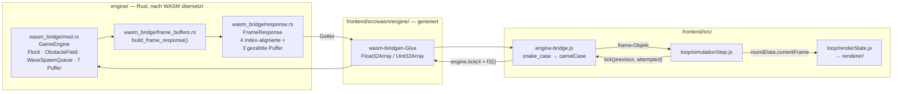
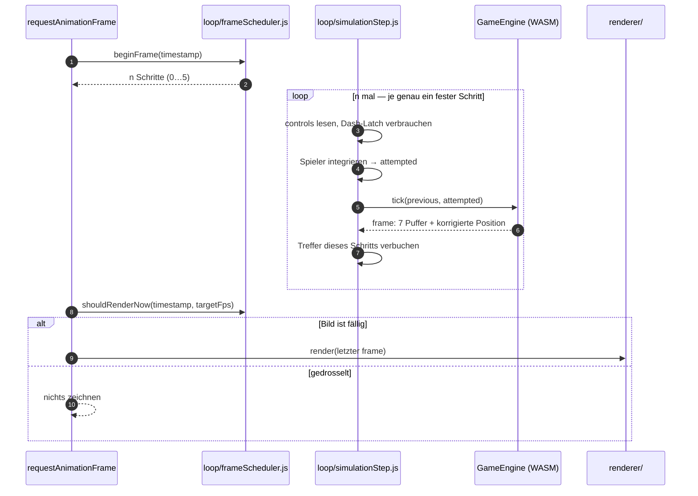

# 5 Frontend/Systemnah-Integration — WASM

`Seitenbudget: ~2 S. | Status: Entwurf | Quellen: engine/src/wasm_bridge/**, frontend/src/engine-bridge.js, frontend/src/loop/**, docs/spec-s05-dash.md §4, projekt-journal.md (Entscheidungen mit → Kap. 5)`

Die Kapitel 3 Frontend: Struktur / Bausteine und 4 Systemnah / WASM: Struktur / Bausteine
beschreiben zwei Schichten, die einander nicht kennen. Dieses Kapitel beschreibt die Naht
dazwischen: welche Bausteine sie bilden, welchen Vertrag sie einhalten und welche
Verpflichtungen daraus für beide Seiten folgen. Die Naht ist bewusst die schmalste Stelle des
Projekts — sie besteht aus **zwei exportierten Typen und einer einzigen Datei im Frontend**,
die sie berührt.

## 5.1 Wesentliche Komponenten

Fünf Bausteine, und ihre geringe Zahl ist die Aussage:

- **`engine/src/wasm_bridge/mod.rs`** — `GameEngine`, die einzige Klasse, die JavaScript
  instanziiert. Sie besitzt den `Flock`, das `ObstacleField`, die `WaveSpawnQueue`, die
  Weltgrenzen, den Wellenzustand und die sieben wiederverwendbaren Ausgabepuffer. Ihre
  Eintrittsfläche sind fünf Methoden: `new`, `tick`, `snapshot`, `set_wave`, `resize`.
- **`engine/src/wasm_bridge/response.rs`** — `FrameResponse`, der zweite und letzte
  `#[wasm_bindgen]`-Typ. Er ist die Antwort auf einen Schritt und trägt den Puffer-Vertrag;
  jeder Getter dokumentiert das Format des Puffers, den er zurückgibt.
- **`engine/src/wasm_bridge/frame_buffers.rs`** — `build_frame_response`, die eine Funktion,
  die einen Frame packt, samt den drei Stride-Konstanten. Sie ist von `mod.rs` abgetrennt,
  weil dort der Lebenszyklus liegt und hier das Format.
- **`frontend/src/engine-bridge.js`** — die **einzige** Datei des Frontends, die das
  WASM-Modul anfasst. Sie lädt es, hält die Instanz und übersetzt die `snake_case`-Getter aus
  Rust in ein `camelCase`-Frame-Objekt.
- **`frontend/src/wasm/engine/`** — das von `wasm-pack` erzeugte Glue-Modul samt `.wasm`-Datei.
  Reines Build-Artefakt, gitignoriert, nie von Hand angefasst (siehe 7.8 Dev Build).

Zwei weitere Module gehören nicht zur Grenze, halten aber den Vertrag ein und werden deshalb
in 5.3 Integration / Schnittstellen mitbetrachtet: `loop/frameScheduler.js` bestimmt, wie oft
`tick()` pro Bild gerufen wird, und `loop/simulationStep.js` ist der Körper eines solchen
Aufrufs. `wasm_bridge/boid_factory.rs` liegt zwar im selben Verzeichnis, überquert aber nichts
— es ist die Schwierigkeitsrampe und in 4.7 Konfiguration — Wesentliche Einstellungen
beschrieben.

## 5.2 Komponenten — Details & Interaktion

### 5.2.1 Der Puffer-Vertrag

Über die Grenze gehen **flache, typisierte Arrays und einzelne Zahlen — keine Objekte und
keine Per-Entity-Structs**. Ein `FrameResponse` liefert sieben Puffer in zwei Gruppen.

**Vier index-alignierte Puffer**, einer je Boid an derselben Stelle: `positions` und
`velocities` als `Float32Array` mit zwei Werten je Boid, `tiers` als `Uint32Array` und
`dash_phases` als `Float32Array` mit je einem. Ein einziger Zähler, `entity_count`, gilt für
alle vier; der Renderer läuft mit einem Index über alle gleichzeitig.

**Drei Puffer mit eigener Anzahl**, weil ihre Länge nichts mit der Schwarmgröße zu tun hat:
`obstacles` (`OBSTACLE_STRIDE` = 7), `spawn_markers` (`SPAWN_MARKER_STRIDE` = 3) und
`dash_aims` (`DASH_AIM_STRIDE` = 5). Der Grund ist quantitativ: Es laden höchstens etwa
fünfzehn von bis zu 156 Boids gleichzeitig auf, ein index-alignierter Vorwarnpuffer bestünde
also zu über 90 % aus Leerstellen. Die vollständige Aufstellung steht in 11.1 Tabellen
(Tabelle „Die sieben Puffer eines Frames").

**Das Vorzeichen als Zustandsträger** ist das tragende Entwurfsmuster dieser Schnittstelle,
und `dash_phases` ist sein Ursprung. Eine Zahl je Boid trägt drei Aussagen:

| Wert         | Bedeutung                                       |
| ------------ | ----------------------------------------------- |
| `0.0`        | nichts zu zeichnen (`Idle` oder `Cooling`)      |
| `0 < v < 1`  | lädt auf, `v` ist der Fortschritt der Aufladung |
| `-1 ≤ v < 0` | dasht, `−v` ist der verbleibende Anteil         |

Dass die Kodierung eindeutig ist, hängt an einer Eigenschaft der Zähler und nicht an einer
Konvention: Weder eine Aufladung noch ein Dash erreicht jemals exakt `0.0`, denn jeder
Nicht-Idle-Zustand hat mindestens einen Restschritt. „Idle" ist damit nicht mit „hat gerade
angefangen zu laden" verwechselbar. Die verworfene Alternative war ein `Uint32Array` für den
Zustand **plus** ein `Float32Array` für den Fortschritt — zwei zusätzliche Pufferkopien pro
Bild für eine Information, die in eine Zahl passt. Der sechste Wert eines Hindernisses,
`render_phase`, wendet dasselbe Muster ein zweites Mal an: negativ heißt „blendet gerade ein
und ist **noch nicht fest**", positiv ist die Restlebensdauer. Der Ausbau auf einen
achten Wert je Hindernis wurde genau deshalb verworfen.

Ebenso aussagekräftig ist, **wo das Muster bewusst fehlt**: `spawn_markers` und `dash_aims`
tragen keinen Vorzeichentrick. Ein Eintrag existiert dort nur, solange der Spawn aussteht
bzw. der Boid lädt, die eigene Anzahl sagt also bereits, wie viele es gibt, und jeder Wert im
Puffer ist ein echter. Das Vorzeichen wird nur dann gebraucht, wenn eine Zahl einen Zustand
_und_ ein „hier ist nichts" kodieren muss. Der Preis dieser Bauform steht daneben:
`dash_aims` wiederholt den Ladefortschritt, den `dash_phases` schon trägt, weil genau der
Index fehlt, mit dem man ihn dort fände.

Die Kehrseite des Vertrags ist ehrlich zu benennen: **Er ist von vier auf sieben Puffer
gewachsen.** Jede Erweiterung wurde einzeln begründet und gegen die Alternative geprüft, im
Frontend nachzurechnen (Hindernisse in S-07, Spawn-Marker in S-04, Vorwarnlinien in S-05);
zweimal wurde eine Erweiterung aus demselben Grund auch abgelehnt (siehe 5.3). Was nicht
gewachsen ist, ist die **Form**: weiterhin nur flache Arrays und Skalare, weiterhin kein
Objekt über der Grenze. Auch die Kopierkosten bleiben bestehen — jeder Getter kopiert einen
`Vec` in ein typisiertes Array. Eine kopierfreie Variante über eine direkte Sicht auf den
WASM-Speicher ist als offener Posten in 10.1 Kapazitätsplan vermerkt; die Begründung, warum
sie nicht gebaut wurde, steht in 4.6 Persistenz.

### 5.2.2 Bausteinsicht und Frame-Ablauf

Die Bausteinsicht zeigt den Weg der Daten in eine Richtung — vom Zustand der Engine bis in
die Zeichenebenen:

Der zeitliche Ablauf **eines Bildes** trägt die erste tragende Invariante des Projekts besser
als eine Seite Prosa, weil sie in seiner Asymmetrie sichtbar wird:

**Die Asymmetrie ist der Punkt.** Die Simulation läuft konstant mit 60 Schritten je Sekunde
(`SIMULATION_STEPS_PER_SECOND`), gedrosselt wird **allein das Zeichnen** auf die im Menü
gewählte Zielbildrate. Ein Bild kann also null, einen oder bis zu
`MAX_SIMULATION_STEPS_PER_FRAME` = 5 Schritte enthalten, zeichnet aber höchstens einmal. Der
naheliegende Gegenvorschlag — die Simulation an die Bildwiederholrate koppeln, damit Bilder
oberhalb von 60 fps neue Information tragen — ist verworfen worden und löste das Problem in
die falsche Richtung: Ein Schritt ist O(n²) über den Schwarm, 120 Schritte/s verdoppeln also
die CPU-Last, während die GPU ohnehin zeichnet. Dazu zählt in der Engine **jede** Dauer in
Schritten und nicht in Millisekunden, allen voran die deterministische Dash-Auswahl aus dem
`step_counter` (siehe 4.2.1). Eine an den Monitor gekoppelte Schrittzahl ließe dieselbe Runde
auf zwei Rechnern unterschiedlich ablaufen. Die richtige Konsequenz aus derselben Beobachtung
ist der Deckel beim Zeichnen, nicht das Anheben der Simulation.

## 5.3 Integration / Schnittstellen

**Die Namensübersetzung liegt an genau einer Stelle.** `normalizeFrameResponse` in
`engine-bridge.js` baut aus den `snake_case`-Gettern ein `camelCase`-Frame-Objekt
(`entity_count` → `entityCount`, `dash_phases` → `dashPhases`). Der Rest des Frontends sieht
nie einen Rust-Namen, und ein umbenannter Getter ist eine Änderung an einer Datei. Dieselbe
Datei ist auch die einzige, die `import('./wasm/engine/…')` schreibt — ein zweiter Importeur
wäre eine zweite Instanz und damit das Problem des nächsten Absatzes.

**Eine Instanz pro Sitzung, abgesichert über ein geteiltes Promise.** `engine-bridge.js` hält
nicht das geladene Modul, sondern das **Promise** seines Ladens. Ein Boolean wäre erst gesetzt,
wenn das Laden _fertig_ ist — genau das ist auch die einzige Absicherung im generierten
`wasm-bindgen`-Loader (`if (wasm !== undefined) return wasm`). Zwei Aufrufe, die beide starten,
während noch geladen wird, finden beide nichts vor und instanziieren beide ein WebAssembly-Modul
mit eigenem Speicher. Von da an mischen sich die beiden: Zeiger der einen Instanz werden mit der
anderen benutzt, und der Schaden erscheint Minuten später als nackter `RuntimeError` aus `tick()`.
Das Promise ist die einzige Form, die den _laufenden_ Vorgang darstellt. Zwei E2E-Tests zählen
deshalb die Instanziierungen in der Seite statt auf eine Fehlermeldung zu warten (siehe 8.2 E2E
Tests).

**`GameEngine::tick()` rückt genau einen Schritt vor und skaliert nicht mit der Delta-Zeit.**
Daraus folgen vier Verpflichtungen für den Aufrufer, die zusammen den eigentlichen Vertrag
ausmachen:

1. **Der Spieler wird im selben Schritt integriert wie der Schwarm.** Seine Position ist
   Eingabe von `tick()` und des Kollisionstests; eine Integration je gezeichnetem Bild ließe
   beide auseinanderlaufen.
2. **Treffer werden für jeden Schritt verbucht.** Wer nur den letzten Frame eines
   Mehrschritt-Bildes liest, verliert die Treffer der Schritte davor.
3. **Einmal-Eingaben werden gelatcht und genau einmal verbraucht.** Eine
   „Taste-ist-gedrückt"-Prüfung pro Schritt macht aus einem Tastendruck bis zu fünf Dashes.
4. **Simulationsschulden werden geklemmt und bei eingefrorener Welt verworfen.** Countdown,
   Rundenstart, Tod und Pause rufen `discardPendingTime()`; ohne das öffnete ein Neustart mit
   einem Nachhol-Stoß, der Boids in den Spieler teleportiert. Die Pause ist der einzige der
   vier Fälle, der Minuten dauern kann.

Hinzu kommt, dass **`tick` nicht symmetrisch ist**: Die Engine besitzt die Hindernisse und
löst die Bewegung gegen sie auf, weshalb sie die vorige _und_ die versuchte Spielerposition
bekommt und die korrigierte zurückgibt. Der Aufrufer muss `frame.playerPosition` benutzen und
nicht die Position, die er angefragt hat. Weil die **Strecke** und nicht nur ihr Endpunkt
geprüft wird, kann auch ein Dash nicht zwischen zwei Schritten durch ein dünnes Hindernis
tunneln.

**Was über die Grenze geht, ist Zustand — was eine Rechnung auf einer Zahl ist, die der
Empfänger schon hat, nicht.** Diese Regel ist zweimal in beide Richtungen angewandt worden und
hält die Schnittstelle schmal. Die Vorwarnlinie eines ladenden Boids **geht** über die Grenze,
obwohl das Frontend Richtung und Reichweite im Prinzip selbst berechnen könnte: Sie ist eine
Funktion aus Boidposition, Spielerposition nach der Hindernisauflösung und Dash-Tuning je
Stufe, und sie ist ein Versprechen über künftiges Verhalten der Simulation. Eine im Renderer
gespiegelte Zielregel stimmt genau so lange, bis jemand die Zielregel ändert — danach zeigte
die Linie dorthin, wo der Dash früher hinging, und der Spieler wiche in den Treffer aus; kein
Test fiele darauf, weil beide Seiten in sich schlüssig blieben. Die Schwierigkeitsstufe der
gerade spawnenden Welle **geht nicht** über die Grenze, obwohl sie in der Engine steht: Sie
ist `wave − 1`, geklemmt, und die Wellennummer führt das Frontend ohnehin selbst; ein achter
Wert im `FrameResponse` trüge pro Bild eine Zahl, die der Empfänger schon hat.
`round/waveTier.js` leitet sie deshalb im Frontend ab. Aus demselben Grund liegen die drei
Power-ups vollständig im Frontend — ein Marker ist nur für den Spieler da, kein Boid sieht ihn
an —, während die Hindernisse in der Engine liegen, weil die Boids ihnen ausweichen müssen.

**Fünf Werte sind von Hand doppelt geführt**, und bei den drei Strides ist das der Zweck der
Übung: `OBSTACLE_STRIDE`, `SPAWN_MARKER_STRIDE` und `DASH_AIM_STRIDE` stehen in
`frame_buffers.rs` und noch einmal in `gameConfig.js`; `INITIAL_BOID_COUNT` und
`MAX_BOID_DIFFICULTY_TIER` stehen in `constants.rs` und noch einmal in `gameConfig.js`. Die Grenztests unter `engine/tests/` nageln die Strides fest, und sie tun das
mit einer **dritten** Kopie: Ein Test, der die echte Konstante läse, folgte jeder Änderung an
ihr stillschweigend, statt sie zu melden. Die Doppelung ist damit kein Versehen, sondern der
Mechanismus, der ein Auseinanderlaufen der beiden Sprachen zu einem fehlschlagenden Test macht
statt zu einem falsch gezeichneten Bild.

**Die Build-Kopplung ist einseitig.** `npm run build:wasm` ist der maßgebliche Engine-Build und
emittiert mit `wasm-pack --target web` nach `frontend/src/wasm/engine/`; sowohl `npm run dev`
als auch `npm run build` rufen ihn vorher auf, damit ein Vite-Start nie gegen ein veraltetes
Paket läuft. Nach `engine/pkg/` wird nicht gebaut — die `--target bundler`-Variante in der
README ist überholt und in 7.9 Production Build als solche benannt. Die Rust-Toolchain und
`wasm-pack` selbst sind nirgends im Repository festgeschrieben; das ist ein offener Posten und
in 2.3 Tech Stack Canvas vermerkt.

**Die Grenze ist die teuerste Stelle des Projekts in Sachen Testbarkeit**, und das ist keine
Nebenbemerkung, sondern erklärt zwei Zahlen in Kapitel 9. Erstens läuft die Vitest-Suite im
`node`-Environment ohne Browser und ohne gebautes WASM-Paket; jedes Modul, das
`engine-bridge.js` importiert, ist dort strukturell unprüfbar — deshalb hat
`loop/simulationStep.js` als einziges Modul in `loop/` keinen Unit-Test und wird von Playwright
abgedeckt. Zweitens melden die vier Dateien unter `engine/tests/` bei `cargo test` **null
Tests**, weil `#[wasm_bindgen_test]` für das Host-Ziel zu nichts expandiert; nur
`wasm-pack test` führt sie aus. Aus demselben Grund weist `cargo llvm-cov` für
`wasm_bridge/response.rs` 0 % aus, obwohl jeder Puffer, den die Datei zurückgibt, im Browser
geprüft wird. Beide Befunde sind in 8.1 Unit Tests und Coverage eingeordnet; die Zahlen selbst
stehen in 9.2 Coverage.
