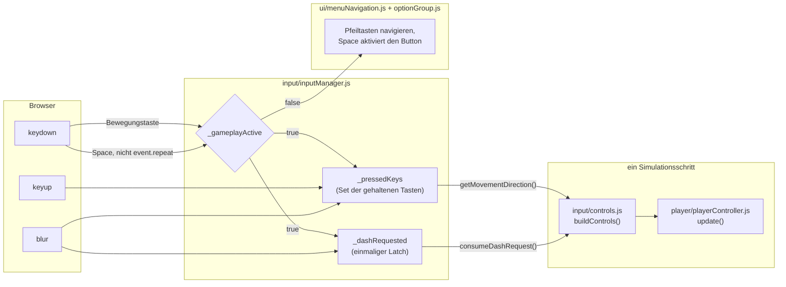
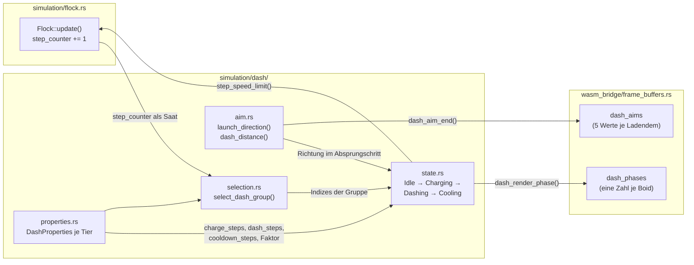
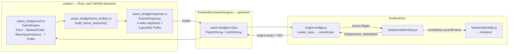
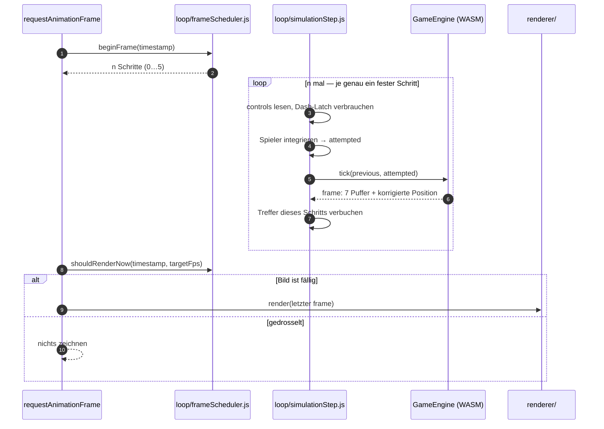

# Gesamtdokument: Bericht und Projektjournal

Automatisch zusammengefuegt aus den Dateien in `documentation/report/`. Der Text der Quelldateien ist unveraendert uebernommen; ergaenzt sind ausschliesslich die Kapitel-Trennmarkierungen.

## Inhalt der zusammengefuegten Dateien

1. Kapitel 1 - `00-index.md`
2. Kapitel 2 - `01-anforderungen-und-ziele.md`
3. Kapitel 3 - `02-tech-stack.md`
4. Kapitel 4 - `03-frontend-bausteine.md`
5. Kapitel 5 - `04-systemnah-wasm-bausteine.md`
6. Kapitel 6 - `05-integration-wasm.md`
7. Kapitel 7 - `06-ki-engineering-und-prozess.md`
8. Kapitel 8 - `07-tooling.md`
9. Kapitel 9 - `08-qualitaet.md`
10. Kapitel 10 - `09-quellcode-uebersicht.md`
11. Kapitel 11 - `10-projektbericht.md`
12. Kapitel 12 - `11-anhang.md`
13. Kapitel 13 - `12-ki-verzeichnis.md`
14. Kapitel 14 - `projekt-journal.md`

---

# Kapitel 1 - Datei: `00-index.md`

---

# Projekt- & Architekturdokumentation — Arbeitsindex

Arbeitsverzeichnis für die Ausarbeitung „Projekt- & Architekturdokumentation"
(Prüfungsleistung, 70 % der Gesamtnote, Abgabe **03.09.2026**).

Dieses Dokument ist **kein Kapitel des Berichts**, sondern die Steuerung dahinter.
Es wird nicht mit abgegeben.

## Warum diese Struktur

Der Bericht entsteht **begleitend zur Entwicklung**, nicht danach. Die
Musterdokumentation des Professors nennt in ihren eigenen _Lessons Learned_ die
nachgelagerte Erstellung als Hauptursache für Zeitdruck am Projektende. Der
Mechanismus dagegen steht in `CLAUDE.md` → _Mandatory per-change steps_, Schritt 5:
pro Änderung werden **Fakten** in [projekt-journal.md](projekt-journal.md) gesichert,
nicht Prosa in Kapitel geschrieben.

Ein Kapitel pro Datei, numerisches Präfix = Berichtsreihenfolge, ASCII-Slugs
(`qualitaet` statt `qualität`) gegen Encoding-Probleme unter Windows.

**Vor dem Schreiben eines Kapitels:** [../muster-referenz.md](../muster-referenz.md)
lesen. Dort steht die Musterdokumentation des Professors aufbereitet — Aufbau,
Detailtiefe und Schreibstil pro Kapitel, das Kapitel-Mapping Muster → hier, und die
Stilregeln, die dieser Bericht einhalten muss. Das PDF selbst ist als Bildvorlage nur
eingeschränkt lesbar; die Markdown-Fassung ist die Arbeitsgrundlage.

## Fortschritt

Status: `Gerüst` (nur Überschriften) → `Entwurf` (Inhalt steht, Sprache rau) →
`Fertig` (abgabereif).

| #   | Kapitel                                                                  | Budget | Status    | Blocker                                       |
| --- | ------------------------------------------------------------------------ | -----: | --------- | --------------------------------------------- |
| 01  | [Anforderungen und Ziele](01-anforderungen-und-ziele.md)                 |  ~2 S. | Entwurf   | —                                             |
| 02  | [Technik Stack](02-tech-stack.md)                                        |  ~2 S. | Entwurf   | wächst mit T-02, T-05, T-06                   |
| 03  | [Frontend: Struktur / Bausteine](03-frontend-bausteine.md)               |  ~5 S. | Entwurf   | Modulübersicht je Datei fehlt im Anhang       |
| 04  | [Systemnah / WASM: Struktur / Bausteine](04-systemnah-wasm-bausteine.md) |  ~5 S. | Entwurf   | Modulübersicht je Datei fehlt im Anhang       |
| 05  | [Frontend/Systemnah-Integration — WASM](05-integration-wasm.md)          |  ~2 S. | Entwurf   | —                                             |
| 06  | [KI-driven Engineering & Prozess](06-ki-engineering-und-prozess.md)      |  ~2 S. | Entwurf   | —                                             |
| 07  | [Tooling](07-tooling.md)                                                 |  ~3 S. | Entwurf   | 7.6/7.10 nachziehen, falls T-02/T-06          |
| 08  | [Qualität](08-qualitaet.md)                                              |  ~2 S. | Entwurf   | 8.3 falls T-05, 8.5 falls T-06, 8.6 Messreihe |
| 09  | [Quellcode-Übersicht](09-quellcode-uebersicht.md)                        |  ~1 S. | Entwurf   | Zahlen nach Code-Freeze neu erheben           |
| 10  | [Projektbericht](10-projektbericht.md)                                   |  ~2 S. | Entwurf   | Ist-Zahlen nach Code-Freeze nachziehen        |
| 11  | [Anhang](11-anhang.md)                                                   |      — | Gerüst    | akkretiv                                      |
| 12  | [KI-Verzeichnis](12-ki-verzeichnis.md)                                   |      — | generiert | `npm run docs:ki-verzeichnis`                 |

Seitenbudget insgesamt: **~26 S.** Zulässig sind 5–12 Seiten, bis 22 möglich. Die
Summe liegt bewusst darüber — beim Trocken-Zusammenbau (siehe unten) wird gekürzt,
und Gekürztes wandert in [Kapitel 11 Anhang](11-anhang.md) statt gelöscht zu werden.

## Zwei Konventionen, die eingehalten werden müssen

**1. Alle Zahlen leben nur in Kapitel 09.** LOC, Dateizahlen, Testzahlen,
Coverage-Prozente, Commit-Zahlen stehen **ausschließlich** in
[09-quellcode-uebersicht.md](09-quellcode-uebersicht.md); alle anderen Kapitel
verweisen dorthin. Sonst tauchen LOC-Angaben in Kap. 3, 4, 8 und 9 auf und laufen
bis September auseinander. Kapitel 09 hält an Tag eins die **Befehle**, nicht die
Zahlen — die Befehle sind zugleich die geforderten „Masszahlen"-Methodik.

**2. Die 400-Zeilen-Regel gilt hier nicht.** `CLAUDE.md` verbietet Quelldateien über
400 Zeilen. Ein 5-Seiten-Kapitel überschreitet das zwangsläufig; unter
`documentation/` ist die Regel ausgesetzt (dort ebenfalls vermerkt).

## Diagramme

Mermaid-Blöcke stehen **inline im jeweiligen Kapitel** — eine Quelle, GitHub rendert
sie direkt. `npm run docs:diagrams` extrahiert sie nach `rendered/*.svg` für Word.

Drei Bausteinsichten sind gefordert:

| Kapitel | Komponente                                                               |
| ------- | ------------------------------------------------------------------------ |
| 04      | `simulation/dash/` + Integration in `Flock::update()`                    |
| 05      | `wasm_bridge/` ↔ `engine-bridge.js`, plus `sequenceDiagram` eines Frames |
| 03      | `input/inputManager.js` + `input/controls.js`                            |

In Word **SVG einfügen, nicht PNG** — SVG skaliert druckscharf.

## Word-Zusammenbau

1. `npm run docs:diagrams` → aktuelle SVGs in `rendered/`.
2. Kapitel 01…12 in Reihenfolge zusammenführen. Erst prüfen, ob
   `pandoc --reference-doc=vorlage.docx` die Dateien im Block konvertiert; sonst von
   Hand einfügen.
3. Inhaltsverzeichnis, Seitenzahlen, Kopfzeile erzeugen.
4. Tabellen und Abbildungen durchnummerieren und beschriften (`Tabelle 1: …`,
   `Abbildung 1: …`) — das Muster tut das konsequent und referenziert im Text darauf.
5. Querverweise auflösen („siehe Kapitel 3.5").

**Trocken-Zusammenbau bei ~60 % Inhalt, Mitte August, 2 h Budget.** Nur daraus lernt
man das Verhältnis Markdown-Seite → Word-Seite gegen das Seitenbudget und ob Pandoc
trägt. Wird das erst am 01.09. versucht, ist es zu spät.

## Termine

| Datum          | Meilenstein                                               |
| -------------- | --------------------------------------------------------- |
| ~15.08.2026    | Trocken-Zusammenbau, Seitenbudget prüfen                  |
| **24.08.2026** | **Code-Freeze** — danach nur Prosa, Diagramme, Layout     |
| 03.09.2026     | Abgabe Dokumentation, Working Code, Abschlusspräsentation |

---

# Kapitel 2 - Datei: `01-anforderungen-und-ziele.md`

---

# 1 Anforderungen und Ziele

`Seitenbudget: ~2 S. | Status: Entwurf | Quellen: .github/copilot-instructions.md §Project Overview, docs/specs-overview.md §1–3, README.md, CLAUDE.md`

Damit die Entwicklung auf ein prüfbares Ziel zuläuft, definiert dieses Kapitel zuerst
die Zielgruppe und ihren Bedarf, danach den Funktionsumfang, mit dem das Projekt darauf
antwortet, die Rahmenbedingungen des Vorhabens und zuletzt das gewählte Fokus-Thema.
Alles Weitere im Bericht ist die technische Ausführung dieser vier Festlegungen.

## 1.1 Themensteckbrief: Nutzer, Prozess, Pain und Kontext

**Zielgruppe** sind Gelegenheitsspieler am Desktop-Browser, die eine Runde in einer
Pause spielen und dafür nichts einrichten wollen: keine Installation, kein Konto, kein
Server, keine Berechtigung. Ein zweites Publikum liest den Quellcode statt ihn
auszuführen — das Projekt entsteht im Hochschulkontext und der Code ist zugleich
Lernmaterial für Rust und WebAssembly (WASM). Diese zweite Gruppe ist kein Beiwerk,
sondern begrenzt die Mittel: Lesbarkeit steht in `CLAUDE.md` ausdrücklich über
Cleverness, was bestimmte Optimierungen ausschließt (siehe 1.4 Entwicklungsfokus).

**Kernprozess** ist eine einzelne Runde und deren Wiederholung. Der Spieler startet aus
dem Menü, ein Countdown friert die Welt für den Einstieg ein, danach weicht er einem
Schwarm aus, der ihn sucht. Alle 30 Sekunden beginnt eine neue Welle: der Schwarm
wächst um zwölf Boids und schickt bis zur fünften Welle je eine schnellere, weiter
sehende Variante, außerdem füllt sich die Arena zunehmend mit zeitlich begrenzten
Hindernissen. Gegen den Schwarm hat der Spieler drei Mittel — Ausweichen, einen Dash
mit Abklingzeit und drei aufsammelbare Power-ups. Nach drei verlorenen Leben endet die
Runde, das Ergebnis wird mit dem lokal gespeicherten persönlichen Bestwert verglichen,
und aus der Game-Over-Karte führt ein Weg direkt in die nächste Runde. Der Prozess ist
damit bewusst kurz und vollständig wiederholbar; er enthält keinen Schritt, der beim
zweiten Mal übersprungen werden möchte.

**Nutzer-Pain** ist die Lücke zwischen zwei Arten vorhandener Anwendungen.
Schwarmsimulationen im Browser sind überwiegend Demonstratoren: sie zeigen das
Boids-Modell mit Regelgewichten an Schiebereglern, haben aber kein Spielziel, keine
Niederlage und deshalb keinen Grund, sie ein zweites Mal zu öffnen. Browserspiele
umgekehrt haben ein Ziel, ihre Gegner folgen aber gescripteten Bahnen oder einer
einzelnen Verfolgungsregel — der Schwarm ist Kulisse, nicht Mechanik. Dazu kommt eine
technische Ursache für diese Trennung: eine Simulation, die jeden Boid gegen jeden
anderen prüft, wird in JavaScript bereits bei einigen hundert Entitäten zum
Bildratenproblem, weshalb spielbare Umsetzungen die Schwarmlogik gerade dort
vereinfachen, wo sie interessant wird. Das Projekt adressiert genau diese Lücke: echte
Schwarmregeln als Spielmechanik, und die Rechenlast dafür in einer Sprache, die sie
tragen kann.

**Nutzungskontext** ist eine Sitzung von wenigen Minuten am Desktop-Browser mit
Tastatur. Gesteuert wird mit **W A S D** oder den Pfeiltasten, der Dash liegt auf der
Leertaste, Escape pausiert; die Maus wird nicht benötigt, und auch das Menü bleibt
vollständig mit der Tastatur bedienbar. Die Spielwelt hat eine feste Größe von
1920 × 1080 Einheiten und wird an das Fenster nur skaliert, damit dieselbe Runde in
jedem Fenster dieselbe Simulation ist. Touch-Eingabe und mobile Bildschirme sind kein
Ziel: die Steuerung braucht zwei Achsen und eine Aktionstaste gleichzeitig, und ein
Daumen verdeckt genau den Bildbereich, in dem der Schwarm ankommt.

## 1.2 Die Lösung

Boids Survival Runner ist ein Ausweich-Spiel im Browser, dessen Gegner eine vollständige
Boids-Schwarmsimulation ist. Die Simulation läuft als Rust-Modul in WebAssembly, die
Darstellung und die Eingabe liegen in einem JavaScript-Frontend, und zwischen beiden
steht eine absichtlich schmale Schnittstelle aus flachen Zahlenpuffern. Das Spiel ist
installationsfrei und serverlos: es lädt als statisches Artefakt, hält seinen Bestwert
im Browser und stellt keine Netzwerkanfrage.

Der Funktionsumfang des MVP besteht aus sieben Spezifikationen, die zugleich das
Vokabular des Kapazitätsplans sind (siehe 10.1 Kapazitätsplan):

1. **Schwarm-Simulation** (S-01) — fünf Steering-Regeln, mehrere Boid-Varianten in
   einem Schwarm, Kollisions- und Überlappungsauflösung.
2. **WASM-Bridge-API** (S-02) — der Puffer-Vertrag zwischen Rust und JavaScript
   (siehe Kapitel 5 Frontend/Systemnah-Integration).
3. **Rendering und HUD** (S-03) — Canvas-Darstellung, Leben, Punkte, Welle, Timer.
4. **Spiel-Loop und Wellen-Progression** (S-04) — fester Zeitschritt,
   Schwierigkeitskurve, Pause bei Escape und bei Fokusverlust.
5. **Steuerung und Power-ups** (S-05) — Spieler-Dash, Boid-Dash samt Vorwarnung, sowie
   die drei Power-ups Aegis, Overdrive und Mend.
6. **Querschnitt** (S-06) — Internationalisierung, Punktestand mit lokalem Bestwert,
   Build-Pipeline.
7. **Temporäre Hindernisse** (S-07) — Weltgeometrie mit Kapselform, getrennte Reaktion
   von Spieler und Boids darauf, Dichte-Rampe über die Wellen.

Bewusst **nicht** umgesetzt sind drei Erweiterungen, jede aus einem eigenen Grund:

- **Slow-Time** als viertes Power-up entfällt. Es wäre das einzige, dessen Wirkung
  darin besteht, den festen Zeitschritt zu verbiegen — also genau die Invariante, auf
  der die Korrektheit des Spiel-Loops beruht (siehe 1.4 Entwicklungsfokus). Ein
  Feature, dessen Kern das Aufweichen einer tragenden Invariante ist, ist der schlechteste
  Kandidat für die letzte freie Kapazität.
- **Ein WebGL-Renderer** entfällt. Die Indirektion dafür existiert im Frontend, das
  Canvas-Backend ist hinter einer Schnittstelle austauschbar (siehe 3.1 Wesentliche
  Komponenten); die zweite Implementierung ist es nicht. Der Grund ist Kapazität und
  wird in 10.1 offengelegt, nicht technische Unmöglichkeit.
- **Ein serverseitiger Highscore** entfällt, hier aber nicht aus Kapazitätsgründen: er
  widerspräche der Rahmenbedingung, ohne Server auszukommen (siehe 1.3).

Zwei weitere Punkte des Anforderungskatalogs — CI/CD-Pipeline und Deployment — sind
offene Posten und werden dort begründet, wo sie hingehören (siehe 7.10 Deployment und
8.3 CI/CD: GitHub Actions Pipeline).

## 1.3 Details zum Softwareprojekt

Das Vorgehen ist **spezifikationsgetrieben**: vor der Implementierung wird das erwartete
mathematische Verhalten samt Randfällen festgeschrieben, erst danach entsteht Code.
Die Spezifikationen liegen als eigene Dokumente neben dem Repository-Code
(`docs/spec-s05-dash.md`, `docs/spec-s07-hindernisse.md` und weitere) und werden
nachgezogen, wenn die Umsetzung sie korrigiert — ein Fall, der zweimal eingetreten ist.
Dieser Ansatz ist hier nicht Formalismus, sondern die einzige praktikable Prüfmethode:
Ein Schwarm sieht auf dem Bildschirm auch dann plausibel aus, wenn eine Regel falsch
gewichtet ist, weshalb „sieht richtig aus" als Abnahmekriterium ausfällt und eine vorab
formulierte Erwartung an ihre Stelle treten muss.

Es ist ein **Ein-Personen-Projekt** mit KI-Unterstützung; die Konfiguration dieser
Unterstützung und der daraus folgende Arbeitsablauf sind selbst Gegenstand des Berichts
(siehe Kapitel 6 KI-driven Engineering & Prozess). Versioniert wird in einem
zweistufigen Branch-Modell aus `main` und `dev` (siehe 7.7 Branch-Struktur). Jede
abgeschlossene Änderung wird atomar nach dem Conventional-Commits-Schema committet und
trägt drei Pflichtanteile mit sich: den Eintrag in `CHANGELOG.md`, die Protokollierung
des verwendeten Prompts und eine Zeile im Projekt-Journal. Der Journaleintrag ist der
Mechanismus, mit dem dieser Bericht **begleitend** und nicht nachgelagert entsteht —
eine bewusste Umkehrung gegenüber der Musterdokumentation, die genau diese Nachlagerung
als ihre größte Schwäche benennt (siehe 10.3 Lessons Learned).

Als Rahmenbedingung gilt durchgehend, dass das Spiel für Endnutzer
**installationsfrei und serverlos** bleibt. Daraus folgt unmittelbar, was es nicht gibt:
kein Backend, keine Datenbank, kein Konto, keine externe API (siehe 2.2
Architektur-Entscheidungen). Der Bestwert liegt im Speicher des Browsers, die
Sprachdateien werden zur Laufzeit als statische JSON-Datei geladen. Zeitlich ist das
Projekt durch die Abgabe am 03.09.2026 begrenzt, mit einem selbst gesetzten Code-Freeze
am 24.08.2026, damit die verbleibenden Tage der Dokumentation gehören. Das geplante
Aufwandsbudget übersteigt die verfügbare Kapazität; das ist bekannt, dokumentiert und
über die Reihenfolge der Maßnahmen gesteuert statt weggerechnet (siehe 10.1
Kapazitätsplan).

## 1.4 Entwicklungsfokus

Als Fokus-Thema ist **Systemnah / WASM** gewählt. Der Grund liegt im Gegenstand selbst:
Die Schwarmsimulation prüft jeden Boid gegen jeden anderen, ihr Aufwand wächst also
quadratisch mit der Boid-Zahl, während der Anspruch bei durchgehend 60 Bildern pro
Sekunde und einigen hundert bis tausend Entitäten liegt. Das ist die einzige Stelle im
Projekt, an der die Wahl der Ausführungsumgebung über die Machbarkeit entscheidet, und
damit die einzige, an der eine systemnahe Sprache mehr ist als eine Vorliebe.

Optimiert wurde entlang zweier Invarianten, die im weiteren Bericht immer wieder
auftauchen und beide aus dem Fokus-Thema folgen. Die erste ist der **feste
Zeitschritt**: die Simulation rechnet einen Schritt pro Aufruf und skaliert nicht mit
der Bildzeit, das Frontend ruft sie mit konstanter Rate auf und begrenzt nur das
Zeichnen auf die gewählte Bildrate. Dadurch ist eine Runde von der Leistung des
Rechners entkoppelt und, in Verbindung mit dem vollständigen Verzicht auf einen
Zufallszahlengenerator in der Engine, reproduzierbar. Die zweite ist der **flache
Puffer-Vertrag** über die Sprachgrenze: Positionen, Geschwindigkeiten und Renderzustände
reisen als typisierte Zahlenfelder, nicht als Objekte pro Entität, weil die Kosten des
Grenzübertritts sonst mit der Entitätszahl mitwachsen (siehe 5.2.1 Der Puffer-Vertrag).

Die Grenze zwischen den Schichten ist scharf gezogen und in beide Richtungen
formuliert: Die Engine kennt weder DOM noch Canvas noch eine Browser-API, das Frontend
enthält keine Simulationsmathematik. Diese Trennung ist keine Stilfrage, sondern die
Voraussetzung für die Teststrategie — die Engine-Tests laufen ohne Browser, die
Frontend-Tests ohne gebautes WASM-Paket (siehe 8.1 Unit Tests und Coverage).

Dem Leistungsziel steht ein zweites, gleichrangiges Ziel gegenüber: **Lesbarkeit**. Der
Quellcode soll von jemandem verstanden werden, der Rust zum ersten Mal liest, was
`unsafe`, manuelles SIMD und dichte Iteratorketten ausschließt und die naive
quadratische Nachbarschaftssuche gegenüber einem räumlichen Index bevorzugt, solange die
Bildrate hält. Die beiden Ziele stehen in einem echten Konflikt, und er ist bewusst zu
Gunsten der Lesbarkeit entschieden — mit der Einschränkung, dass Optimierungen dort
erlaubt sind, wo eine Messung sie begründet und nicht ein Gefühl (siehe 8.6 GPU-Last:
Messgrundlage vor Optimierung).

---

# Kapitel 3 - Datei: `02-tech-stack.md`

---

# 2 Technik Stack

`Seitenbudget: ~2 S. | Status: Entwurf | Quellen: engine/Cargo.toml, engine/Cargo.lock, frontend/package.json, frontend/package-lock.json, .github/copilot-instructions.md §Tech Stack, CLAUDE.md §Architecture`

Dieses Kapitel nennt die eingesetzten Technologien und jeweils den Grund für ihre Wahl.
Es ist absichtlich knapp gehalten: Was aus den Entscheidungen technisch folgt, steht in
den Kapiteln 3 bis 5, was jedes einzelne Werkzeug tut, in Kapitel 7 Tooling. Die
vollständige Fassung des Tech Stack Canvas mit allen Versionsangaben liegt im Anhang
(siehe 11.1 Tabellen, „Tech Stack Canvas — Langfassung").

## 2.1 Rahmenbedingungen

**Zielplattform** ist der aktuelle Desktop-Browser, und zwar ohne Zusatz: Das Spiel muss
installationsfrei und serverlos laufen (siehe 1.3 Details zum Softwareprojekt). Technisch
verlangt es damit nur zwei Fähigkeiten, die jeder aktuelle Browser mitbringt —
WebAssembly und einen 2D-Canvas-Kontext. Alles, was ausgeliefert wird, ist eine Menge
statischer Dateien; zur Laufzeit gibt es keinen Prozess außerhalb des Browsertabs. Das ist
keine Sparmaßnahme, sondern die Rahmenbedingung, aus der die restliche Stack-Wahl folgt:
Was nicht in den Browser passt, kann nicht Teil der Lösung sein.

**Die Sprachwahl** ist damit zur Hälfte vorgegeben und zur Hälfte eine Entscheidung. Für
Darstellung und Eingabe gibt es im Browser keine Alternative zu **JavaScript**, hier in
Form von ES-Modulen ohne Transpilations-Schritt. Für die Simulation ist **Rust** gewählt,
und zwar aus drei strukturellen Gründen: Rust übersetzt vor der Ausführung nach
WebAssembly, statt zur Laufzeit optimiert zu werden; es hat keine automatische
Speicherbereinigung, kann also im Pfad, der 60-mal pro Sekunde durchlaufen wird, keine
Pause durch einen Garbage-Collector erzeugen; und es rechnet auf Werten fester Größe, ohne
dass Zahlen als Objekte im Speicher liegen. Der Aufwand der Schwarmsimulation wächst
quadratisch mit der Boid-Zahl (siehe 1.4 Entwicklungsfokus) — genau dort zahlen sich diese
drei Eigenschaften aus, und nur dort. Verwendet wird die stabile Toolchain in Edition 2021,
verwaltet über Cargo.

**Die Sprachgrenze** überbrückt `wasm-bindgen`: Es erzeugt aus den annotierten Rust-Typen
das JavaScript-Gegenstück, sodass die Engine als gewöhnliches ES-Modul importierbar ist.
`wasm-pack` ist das Build-Werkzeug darüber und wird mit `--target web` aufgerufen, weil das
Ergebnis dann ohne weiteren Bundler-Schritt lädt. Die Bibliothek `js-sys` steht nur an
einer einzigen Stelle im Quellcode (`wasm_bridge/response.rs`) und liefert dort die beiden
Typen `Float32Array` und `Uint32Array`, in denen ein Frame die Sprachgrenze überquert. Dass
diese Abhängigkeit an genau einer Stelle auftaucht, ist der Zustand, den die schmale
Schnittstelle aus 2.2 herbeiführen soll.

**Node.js** ist ausdrücklich **kein** Bestandteil des ausgelieferten Produkts, sondern nur
der Entwicklungsumgebung: Es baut, testet, prüft und formatiert. Der Endnutzer lädt eine
Seite, keinen Server. Diese Unterscheidung ist wichtig für die Lesart des Canvas in 2.3 —
die Hälfte der dort genannten Technologien läuft nie auf dem Rechner eines Spielers.

## 2.2 Architektur-Entscheidungen

Drei Entscheidungen tragen den Aufbau. Sie werden hier genannt und begründet; ihre
technische Umsetzung ist Gegenstand der Kapitel 4 und 5.

**Zwei Schichten mit absichtlich schmaler Grenze.** Die Engine besitzt die vollständige
Simulation und kennt weder DOM noch Canvas noch eine andere Browser-Schnittstelle; das
Frontend besitzt Darstellung, Eingabe und Spielzustand und enthält keine
Simulationsmathematik. Der Grund ist nicht Ordnungsliebe, sondern Prüfbarkeit: So laufen
die Engine-Tests ohne Browser und die Frontend-Tests ohne gebautes WASM-Paket, was beide
Testläufe schnell und unabhängig voneinander macht (siehe 8.1 Unit Tests und Coverage).
Eine geteilte Zuständigkeit — etwa Kollisionsprüfung auf beiden Seiten — würde diesen
Vorteil sofort aufheben.

**Fester Zeitschritt statt Skalierung mit der Bildzeit.** Ein Aufruf der Engine rechnet
genau einen Simulationsschritt und multipliziert nichts mit der vergangenen Zeit; das
Frontend ruft sie mit konstanter Rate auf und drosselt nur das Zeichnen. Der Grund ist,
dass in der Engine jede Dauer in **Schritten** zählt und nicht in Millisekunden — von den
Dash-Phasen über den Wellenfortschritt bis zur Auswahl, welcher Boid als Nächstes
losstürmt. Diese Auswahl wird deterministisch aus dem Schrittzähler abgeleitet; einen
Zufallszahlengenerator gibt es in der Engine bewusst nicht. Eine an die
Bildwiederholfrequenz gekoppelte Schrittzahl würde dieselbe Runde auf zwei Rechnern
unterschiedlich ablaufen lassen und jede schrittbasierte Konstante samt ihren Tests
umrechnungspflichtig machen (siehe 4.2.1 Eine wesentliche Komponente: Darstellung des
Aufbaus — Bausteinsicht).

**Flache typisierte Puffer statt Objekten pro Entität.** Ein Frame verlässt die Engine als
eine Handvoll Zahlenfelder mit festem Zeilenabstand, nicht als Liste von Objekten. Der
Grund ist die Kostenstruktur des Grenzübertritts: Ein Objekt pro Boid bedeutet eine
Konvertierung pro Boid und damit Kosten, die mit der Entitätszahl wachsen — also genau mit
der Größe, die das Spiel steigern will. Ein Puffer dagegen wird einmal übergeben, unabhängig
davon, wie viele Boids darin stehen (siehe 5.2.1 Der Puffer-Vertrag).

Aus den Rahmenbedingungen folgt ebenso deutlich, **was es nicht gibt**, und in allen fünf
Fällen ist das eine Entscheidung und kein Rückstand:

- **Kein Backend, keine Datenbank, keine externe API, kein Konto.** Das ist die
  Rahmenbedingung aus 1.3 selbst; jede dieser vier Komponenten würde sie brechen.
- **Kein UI-Framework.** Der DOM-Anteil besteht aus einem Startmenü, einem HUD und zwei
  Overlays; alles, was sich pro Bild ändert, liegt auf dem Canvas. Ein Framework würde also
  gerade dort nichts beitragen, wo die Arbeit anfällt, und im Gegenzug einen
  Abgleichmechanismus in den Bildpfad legen.
- **Keine Spiel- oder Physikbibliothek.** Die Simulation ist der Gegenstand des Projekts.
  Sie einzukaufen, hieße das Fokus-Thema auszulagern.
- **Kein `rand`-Crate in der Engine.** Alles, was zufällig aussieht — Spawnorte,
  Hindernisformen, Dash-Auswahl — wird per Ganzzahl-Streuung aus dem Schrittzähler
  abgeleitet, damit eine Runde reproduzierbar bleibt.
- **Keine Laufzeit-Abhängigkeit im Frontend.** Alle npm-Pakete des Projekts sind
  `devDependencies`; im Bundle landet ausschließlich eigener Code (siehe 7.2 Package
  Management).

**Die Daten** liegen entsprechend im Browser. Der persönliche Bestwert wird über
`localStorage` gehalten, und zwar bestmöglich: Fehlt der Speicher oder verweigert er den
Zugriff, spielt die Runde weiter und nur der Bestwert fehlt (siehe 3.6 Persistenz). Die
Sprachdateien sind statische JSON-Dateien, die zur Laufzeit nachgeladen werden, weshalb sie
unter `public/` liegen müssen und nicht im Modulgraph.

## 2.3 Tech Stack Canvas

Die folgende Tabelle fasst den Stack nach Schichten zusammen. Die Langfassung mit
Versionsangaben je Paket steht im Anhang (siehe 11.1 Tabellen, „Tech Stack Canvas —
Langfassung"), weil die Versionen dort nachgeführt werden können, ohne den Fließtext
anzufassen.

| Schicht            | Technologie                                                       | Zweck                                             |
| ------------------ | ----------------------------------------------------------------- | ------------------------------------------------- |
| Simulation         | Rust (Edition 2021, Cargo)                                        | Schwarm, Hindernisse, Wellen, Kollisionen         |
| Sprachgrenze       | `wasm-bindgen`, `js-sys`, `wasm-pack`                             | Engine als ES-Modul, Frame-Puffer über die Grenze |
| Präsentation       | JavaScript (ES-Module), HTML5 Canvas 2D, CSS                      | Rendering, Eingabe, Menü und HUD                  |
| Build              | Vite, npm                                                         | Dev-Server, Produktionsbündel, Paketverwaltung    |
| Qualitätssicherung | Vitest, Playwright, ESLint, Prettier, `cargo test`/`clippy`/`fmt` | Unit-, E2E- und Statikprüfung beider Sprachen     |

**Versionen sind zweistufig festgelegt.** Deklariert sind in `Cargo.toml` und
`package.json` nur Bereiche (`"0.2"`, `"^5.0.0"`); die tatsächlich gebaute Fassung steht in
`Cargo.lock` und `package-lock.json`, und **beide Lockfiles sind eingecheckt**. Damit ist
der Paketstand reproduzierbar. Nicht festgelegt ist die Toolchain selbst: Es gibt keine
`rust-toolchain.toml`, und `wasm-pack` ist ein lokal installiertes Kommandozeilenwerkzeug.
Der Build hängt also am Entwicklungsrechner — ein offener Punkt, der genau dann geschlossen
wird, wenn eine Pipeline die Versionen benennen muss (siehe 8.3 CI/CD: GitHub Actions
Pipeline).

**Drei Positionen des Anforderungskatalogs fehlen im Canvas und werden hier benannt statt
übergangen.** **TypeScript** ist nicht eingerichtet: Es war als Typprüfung über `checkJs`
für vorhandenen JavaScript-Code geplant (T-02) und ist hinter die Testmaßnahmen einsortiert
worden, weil ein Testlauf Fehler in der Logik findet und `checkJs` in den Signaturen (siehe
7.6 TypeScript). **Eine `vite.config.js` existiert nicht**, weil die Vorgaben von Vite für
dieses Projekt genügen — die Datei war für den Basispfad des Deployments vorgesehen und
teilt daher dessen Status (siehe 7.10 Deployment). **Eine CI/CD-Pipeline** gibt es nicht;
`.github/` enthält bislang nur die Anweisungsdatei für die KI-Unterstützung. Alle drei
Lücken sind im Kapazitätsplan als Rangfolge und nicht als Versäumnis begründet (siehe 10.1
Kapazitätsplan).

---

# Kapitel 4 - Datei: `03-frontend-bausteine.md`

---

# 3 Frontend: Struktur / Bausteine

`Seitenbudget: ~5 S. | Status: Entwurf | Quellen: frontend/src/**, frontend/index.html, docs/spec-s05-dash.md §2 und §5, projekt-journal.md (Entscheidungen mit → Kap. 3)`

Das Frontend besitzt alles, was der Spieler sieht und drückt, und nichts von der Simulation.
Diese Aufgabenteilung ist in 2.2 Architektur-Entscheidungen festgelegt; dieses Kapitel zeigt,
wie das Frontend darunter aufgebaut ist. Der Ablauf **eines Bildes** über die Sprachgrenze
hinweg steht dagegen in 5.2.2 Bausteinsicht und Frame-Ablauf und wird hier nicht wiederholt.

## 3.1 Wesentliche Komponenten

Das Frontend besteht aus **ES-Modulen ohne Framework**, gruppiert in Pakete nach Aufgabe. Es
gibt drei Sorten von Modulen, und die Unterscheidung erklärt den Rest des Kapitels: Module,
die den **Browser anfassen** (DOM, Canvas, Tastatur), Module, die **Zustand halten**, und
Module, die nur **rechnen**. Nur die dritte Sorte ist unter Vitest prüfbar (siehe 3.3
Modularisierung), weshalb sie bewusst so groß wie möglich gehalten ist.

- **Bootstrap** — `index.js`. Baut alle Objekte, verdrahtet sie, hält den
  `requestAnimationFrame`-Loop und den Lebenszyklus einer Runde. Die einzige Datei, die alle
  anderen kennt.
- **Bridge** — `engine-bridge.js`. Die einzige Stelle, die das WASM-Modul berührt (siehe 5.1
  Wesentliche Komponenten).
- **`loop/`** — die Zeitrechnung: `frameScheduler.js` (feste Schrittzahl, Renderdrosselung,
  Schuldenklemmung), `simulationStep.js` (der Körper eines Schritts), `renderState.js`,
  `stateRenderer.js`, `staticFrameGate.js`, `frameMetrics.js`, `refreshRate.js`.
- **`input/`** — `inputManager.js` (Tastenzustand und Dash-Latch), `controls.js` (das
  Kontrollobjekt eines Schritts), `pauseControl.js` (Escape und Auto-Pause).
- **`player/`** — `playerController.js` (Integration und Dash) und `dashCooldown.js`
  (Abklingzeit als reine Arithmetik).
- **`powerups/`** — die drei Power-ups vollständig im Frontend: `powerups.js`, `mend.js`,
  `markerClearance.js`, `markerLifetime.js` (siehe 3.8 Implementierung der Fachlogik).
- **`renderer/`** — das größte Paket. `renderer.js` als Fassade über `canvasRenderer.js`,
  darunter je eine Zeichenebene pro Motiv (Arena, Hindernisse, Schweife, Dash-Ziellinie,
  Spawn-Marker, Power-ups, Statusbalken) und daneben die importfreie Zeichenarithmetik
  (`dashPulse.js`, `spawnMarkerPulse.js`, `mendPulse.js`, `worldTransform.js`).
- **`round/`** — `roundData.js` (der Zustand einer Runde), `roundRecords.js` (Persistenz),
  `waveTier.js` (die Stufe der gerade spawnenden Variante).
- **`ui/`** — das DOM: `menu.js` mit seinen vier Zulieferern, `hud.js`, die beiden Karten,
  `i18n.js`, `frameTimeGraph.js` samt Zubehör.
- **Zustand und Konfiguration** — `gameState.js` (die Zustandsmaschine) und `gameConfig.js`
  (alle Konstanten, siehe 3.7 Konfiguration).

Die vollständige Liste je Datei ist für den Anhang vorgesehen; Zeilenzahlen und Testzahlen
stehen ausschließlich in Kapitel 9 Quellcode-Übersicht.

## 3.2 Komponenten — Details & Interaktion

### 3.2.1 (UI-)Komponenten — Aufbau

**Das Dokument ist bewusst fast leer.** `index.html` enthält genau zwei Elemente: das
`<canvas id="game-canvas">` und ein leeres `<div id="ui-overlay">`. Alles Weitere entsteht
zur Laufzeit. Damit gibt es keine zweite Quelle der Wahrheit für die Oberfläche — kein
Element, das im HTML steht und im Modul noch einmal, und keine Bindung, die beide synchron
halten müsste.

**Die Grenze zwischen Canvas und DOM** ist keine Stilfrage, sondern nach Kosten gezogen: Was
sich in jedem Bild ändert, gehört auf das Canvas; was eine feste Beschriftung trägt, gehört
ins DOM. Beide Male hat dieselbe Beobachtung entschieden — die Dash-Leiste und später die
Buff-Zeilen standen auf dem Canvas und ließen ihre unveränderliche Beschriftung in **jedem
Bild neu rastern**. Beide sind ins DOM gewandert, wo der Browser sie einmal setzt. Der
Nebeneffekt ist ein Testeffekt: Was im DOM steht, kann Playwright lesen, während auf dem
Canvas gezeichneter Text für die E2E-Stufe unsichtbar ist (siehe 8.2 E2E Tests).

**Das Menü** ist ein Modul mit vier Zulieferern statt einer Datei: `menu.js` entscheidet, was
zu sehen ist, `menuDeck.js` liefert Rahmen, Titel und Zeilenliste, `menuPanels.js` die
einzelnen Paneele, `menuNavigation.js` die Tastaturführung und `optionGroup.js` die
Einstellungsgruppen. Es gibt **einen** Bildschirmtyp und nicht vier: ein Untermenü ersetzt nur
die linke Spalte und lässt Kopf, Fuß und Panelstapel stehen. Die Werte dahinter liegen in
`ui/menuSettings.js` — getrennt vom Rendern, weil die einzige Logik unter ihnen (welche
Bildraten der Bildschirm überhaupt lohnt) ohne Browser prüfbar sein soll.

**Eine Optionsgruppe existiert immer nur an einer Stelle.** `optionGroup.js` liefert Markup
und Auswahllogik für jede Einstellung, statt sie je Einstellung zu kopieren. Bemerkenswert ist
die Wahl der Bausteine: einfache Buttons mit `aria-pressed` statt `role="radiogroup"` oder
Radio-Inputs. Der Grund ist Tastenbesitz — die Pfeiltasten gehören der Menüliste, solange ein
Overlay offen ist, und dem Spieler, solange eine Runde läuft. Eine `radiogroup` bringt ihre
eigene Pfeiltastennavigation mit und würde um dieselben Tasten streiten, mit dem Ergebnis, dass
sie für Tastatur- und Screenreader-Nutzer kaputt ist. Ein Toggle-Button weckt diese Erwartung
nicht und funktioniert mit Tab plus Enter oder Leertaste. Dasselbe Thema kehrt in 3.2.2 als
Bausteinsicht wieder; hier ist es eine ARIA-Entscheidung, dort eine Ereignis-Entscheidung.

**Das HUD** ist eine feste Menge von DOM-Elementen mit stabilen IDs, die benennen, _was_ sie
zeigen (`hud-timer`, `hud-score`), neben Klassen, die sagen, _wo_ sie sitzen. Das ist eine
Zeile Produktionscode für die Testbarkeit und die Grenze, die dabei bewusst nicht
überschritten wurde: kein Test-Hook, der internen Spielzustand nach `window` exportiert.

**Zwei Karten und eine Attrappe** vervollständigen die Oberfläche. `gameOverCard.js` und
`pauseCard.js` sind Zwillinge über einer neutralen `card`-Basis — die Pause ist bewusst als
Karte gebaut und nicht als Sonderfall des Game-Over. `menuBackdrop.js` zeichnet den Schwarm
hinter dem Startmenü und ist **keine** Simulation, sondern eine Attrappe auf eigenem Canvas:
Sie läuft nur, solange das Menü steht, weil während einer Runde niemand die Dekoration
ansieht und sie sonst mit der Simulation um Bilder konkurrieren würde.

**Der Frametime-Graph** (`ui/frameTimeGraph.js` mit `frameGraphOverlay.js`,
`frameGraphScale.js` und `drawnFrameRate.js`) ist ein Diagnosewerkzeug und standardmäßig aus.
Er ist der einzige Teil der Oberfläche, der Messwerte statt Spielzustand zeigt; seine
Messgrundlage steht in 8.6 GPU-Last: Messgrundlage vor Optimierung.

**Alle nutzersichtbaren Zeichenketten liegen außerhalb des Codes.** `ui/i18n.js` lädt
`public/locales/en.json` zur Laufzeit und löst namensräumige Schlüssel auf (`menu.start`,
`hud.score`). Fehlt ein Schlüssel, liefert `t()` den Schlüssel selbst zurück — ein fehlender
Text fällt damit als Text auf, statt die Oberfläche leer zu lassen. Die Datei liegt unter
`public/`, weil sie geladen und nicht importiert wird: Was Vite nie im Modulgraphen sieht,
landet nur von dort im Produktionsbündel. Ein Verstoß dagegen ist genau einmal passiert und
in 10.2 Herausforderungen beschrieben.

**Das Aussehen** liegt in sechs Stylesheets, geteilt nach Zuständigkeit, und ihre Reihenfolge
in `index.html` ist tragend: `tokens.css` definiert die Variablen, die alle anderen lesen,
`components.css`, `cards.css`, `menu.css` und `hud.css` folgen, und `main.css` kommt zuletzt,
damit seine Positionierungs-Utilities gegen die Komponenten gewinnen. Die beiden Schriften
liegen als `woff2` im Repository statt auf einem Font-CDN — das ist dieselbe Rahmenbedingung
wie in 2.2: keine externe Anfrage zur Laufzeit.

### 3.2.2 Eine wesentliche Komponente: Darstellung des Aufbaus — Bausteinsicht

Als Bausteinsicht ist die **Eingabekette** gewählt, weil in ihr zwei nicht offensichtliche
Entscheidungen mit dokumentiertem Zielkonflikt stecken: Die Dash-Taste ist flankengetriggert
und gelatcht, und die Tastatur gehört nur während einer laufenden Runde dem Spiel.



**Der Latch** ist die Antwort auf den festen Zeitschritt. Ein Animationsbild kann mehrere
Simulationsschritte fahren; würde `controls` pro Schritt fragen „ist die Leertaste unten",
ergäbe ein Tastendruck bis zu fünf Dashes. Stattdessen setzt `keydown` eine Fahne, und
`consumeDashRequest()` liest sie **und löscht sie dabei**. Zusätzlich wird `event.repeat`
geprüft, damit eine gehaltene Taste nicht als Serie von Anfragen zählt. Der Aufruf pro Schritt
liegt in `controls.js`, einer Datei mit einer Funktion — sie existiert, damit „genau einmal pro
Schritt gelesen" eine benannte Stelle hat und nicht eine Gewohnheit ist.

**Das Tor `_gameplayActive`** entscheidet, wem die Tastatur gehört. Außerhalb einer Runde muss
die Leertaste den fokussierten Menü-Button aktivieren und müssen die Pfeiltasten die Menüliste
bewegen, deren Fuß das ausdrücklich verspricht. Drei Alternativen wurden verworfen:

| Alternative                                          | Grund der Ablehnung                                                                                                                                                      |
| ---------------------------------------------------- | ------------------------------------------------------------------------------------------------------------------------------------------------------------------------ |
| Menü-Navigation vor dem `InputManager` registrieren  | Reihenfolge von Listenern als Architektur. Beide sehen dieselbe Taste, und der zuerst registrierte gewinnt — beim nächsten Umbau der Bootstrap-Reihenfolge still kaputt. |
| Nur die Pfeiltasten freigeben, WASD weiter schlucken | Die Asymmetrie müsste erklärt werden, ohne etwas zu gewinnen. Die richtige Grenze ist der Spielzustand, nicht die Tastenmenge.                                           |
| `keyup` ebenfalls an die Runde binden                | Genau der Fehler, der dabei entsteht: eine beim Rundenende gehaltene Taste würde nie freigegeben und in der nächsten Runde als gedrückt gelten.                          |

Deshalb ist `keydown` am Zustand gebunden und `keyup` **nicht** — Aufräumen darf nie
zustandsabhängig sein. `blur` und `setGameplayActive(false)` tun dasselbe und sollen es tun:
beides sind Momente, in denen niemand mehr steuert. Diese Trennung ist zugleich das einzige
an der Eingabe, was nur die E2E-Stufe prüfen kann — alles Übrige ist Arithmetik und liegt in
Unit-Tests (siehe 8.2 E2E Tests).

### 3.2.3 Komponenten-Interaktion

**`index.js` ist der einzige Ort, an dem Module einander kennenlernen.** Kein Modul importiert
ein Geschwistermodul, um dessen Zustand zu lesen; wer etwas braucht, bekommt es übergeben.
Zwei Reihenfolgen darin sind tragend und im Code begründet: Die Messung der
Bildwiederholfrequenz läuft **parallel** zum Laden der Sprachdatei, damit die Wartezeit
einmal statt zweimal anfällt, und der Frametime-Graph wird **vor** dem Menü gebaut, weil das
Stapeln im `#ui-overlay` der DOM-Reihenfolge folgt und das Menü über dem Graphen liegen muss.

Der **Lebenszyklus einer Runde** besteht aus fünf Funktionen, und ihre Zuständigkeiten sind
scharf getrennt: `showStartMenu()` gibt Bildschirm und Tastatur ans Menü zurück,
`openRound()` baut die Engine neu und übergibt die Tastatur, `pauseGame()` friert die Welt
ein, `resumeGame()` lässt sie weiterlaufen, `endRound()` schreibt den Rekord und zeigt die
Karte. Jede von ihnen setzt `input.setGameplayActive(...)`, weil der Tastenbesitz aus 3.2.2
genau an diesen Übergängen wechselt.

Die Zeichenkette ist über eine **Fassade** entkoppelt: `renderer/renderer.js` delegiert an
`renderer/canvasRenderer.js`, sodass ein WebGL-Backend das Canvas-Backend ersetzen könnte,
ohne einen Aufrufer anzufassen. Diese Indirektion existiert, das zweite Backend nicht — die
Begründung dafür steht in 1.2 Die Lösung.

## 3.3 Modularisierung: Strukturierung der fachlichen Logik

Drei Regeln erklären die Aufteilung.

**Erstens: keine Simulationsmathematik im Frontend.** Positionen, Geschwindigkeiten,
Kollisionen und Ausweichverhalten kommen fertig aus der Engine. Es gibt genau **eine**
bewusste Ausnahme, und die ist benannt statt versteckt: Die Power-up-Marker müssen beim Setzen
Abstand zu den Hindernissen halten, also braucht das Frontend die Punkt-zu-Segment-Geometrie
ein zweites Mal. Sie liegt als exportierte, einzeln getestete `distanceToSegment` in
`powerups/markerClearance.js` statt inline im Spawnversuch — eine doppelte Geometrie an einer
sichtbaren Stelle ist billiger als ein zusätzlicher Puffer über die Sprachgrenze (siehe 3.8).

**Zweitens: importfreie Arithmetik wird herausgelöst.** Die Vitest-Suite läuft im
`node`-Environment, also ohne Browser und ohne gebautes WASM-Paket (siehe 8.1 Unit Tests und
Coverage). Jedes Modul, das etwas ausrechnet, ist deshalb frei von Importen auf Browser-APIs:
`loop/frameScheduler.js` und `loop/frameMetrics.js`, `ui/frameGraphScale.js`,
`player/dashCooldown.js`, `renderer/dashPulse.js`, `renderer/spawnMarkerPulse.js`,
`renderer/mendPulse.js`, `renderer/worldTransform.js`. Dieselbe Regel erklärt eine sonst
schwer begründbare Zweiteilung: `renderer/dashTrailHistory.js` hält den Ringpuffer der
Schweifpunkte, `renderer/dashTrail.js` die Verlaufsmathematik darüber, und
`renderer/trailLayer.js` zeichnet — nur das letzte Drittel braucht einen Kontext.

**Drittens: 400 Zeilen sind das Maximum.** Die Grenze ist mechanisch und hat trotzdem fast
jede Aufteilung dieses Projekts ausgelöst: `loop/simulationStep.js`, `loop/renderState.js`,
`loop/stateRenderer.js`, `powerups/markerLifetime.js`, `renderer/powerupMarkerLayer.js` und
`ui/menuSettings.js` sind alle entstanden, als `index.js` oder ihr Ursprungsmodul an die Grenze
lief. Bemerkenswert ist der Nebeneffekt: `loop/renderState.js` war als Teil von `index.js`
unter Vitest **nicht** erreichbar und ist es seit dem Herauslösen. Die Regel taugt aber nur
zusammen mit einer echten Naht — geteilt wurde jeweils entlang einer Grenze, die im
Kopfkommentar der Datei schon beschrieben war. Eine Aufteilung nach Zeilenzahl ohne Naht
verteilt denselben Gedanken auf zwei Dateien, statt zwei Gedanken zu trennen.

## 3.4 State Management

Es gibt **kein** Framework, keinen Store und kein Observable. Der Zustand liegt in drei
Schichten, jede mit einer eigenen Lebensdauer.

**`gameState.js`** hält die Zustandsmaschine mit vier Werten: `MENU`, `PLAYING`, `PAUSED`,
`GAME_OVER`. Sie kennt ausschließlich Übergänge und **validiert nichts** — `transition()`
schreibt den neuen Wert, ohne den alten zu prüfen. Die Zusicherung „`PAUSED` ist nur aus
`PLAYING` erreichbar und kehrt nur dorthin zurück" wird nicht hier, sondern von den beiden
Wächtern in `pauseGame()` und `resumeGame()` getragen, die dieses Paar besitzen. Das ist
Absicht: Ein Übergang, der aus zwei Gründen scheitern kann, ist schwerer zu lesen als eine
Zustandsmaschine ohne Meinung plus zwei sichtbare Wächter an der Stelle, an der das Warum
steht. Der Verzicht auf einen Store folgt aus der Bauform — es gibt eine einzige Ansicht und
einen Loop, der den Zustand ohnehin in jedem Bild liest; ein Abonnement-Mechanismus hätte
keinen Abnehmer.

**`round/roundData.js`** hält den Zustand einer Runde als einfaches Objekt mit Funktionen
darauf, nicht als Klasse: Punkte, Leben, Welle, Timer, Simulationsuhr, die Zeitstempel der
letzten Treffer und Dashes. Das Modul ist **browserfrei** und deshalb vollständig unter Vitest
prüfbar, was der Grund für diesen Schnitt ist.

**Modulweiter Zustand in `index.js`** ist die dritte Schicht und die kleinste: die
Menü-Einstellungen, der `FrameScheduler`, die Frame-Metriken und das Power-up-Feld. Sie liegen
dort und nicht in den Rundendaten, weil sie eine Runde überleben müssen — das Menü und der
Game-Over-Zweig haben keine Rundendaten, und die Bilduhr muss über Zustandswechsel
weiterlaufen, sonst sähe das erste spielende Bild eine mehrsekündige Zeitdifferenz.

**Die Zeitregel ist die eigentliche Aussage dieses Abschnitts.** Punkte, der Timer und jede
Abklingzeit leiten sich aus `simulationTimeMs` ab, nie aus der Wanduhr — sonst würde ein in
den Hintergrund geschobener Tab Punkte verschenken. Daraus folgt eine Pflicht, die leicht
übersehen wird: Diese Uhr springt in `beginRound()` auf null zurück, also muss **jeder** an
ihr gemessene Zeitstempel dort neu gesetzt werden. `lastHitAtSimulationMs` und
`lastDashAtSimulationMs` werden dazu eine volle Abklingzeit in die Vergangenheit gesetzt,
damit Dash und Trefferfenster im ersten Schritt bereit sind. Die eine Ausnahme ist
`countdownEndsAt`: Drei Sekunden Countdown sollen drei echte Sekunden sein, also läuft er auf
Wanduhr — und ist damit auch der einzige Wert, den eine Pause über sich hinwegtragen muss
(`pauseCountdown` / `resumeCountdown`). Umgekehrt gilt dieselbe Regel für Präsentation:
Animationen, die nichts entscheiden — der Startring des Dash-Schweifs, das Blinken eines
ablaufenden Markers — laufen absichtlich auf Wanduhr, weil sie zur Bildrate gehören und nicht
zur Simulation.

## 3.5 Routing und Navigation

**Es gibt kein Routing, und das ist die eine echte Absenz dieses Berichts.** Die Anwendung
besteht aus einer HTML-Seite, einem Canvas und einem Overlay-Container; es gibt keine URL-
Fläche, keine History-Behandlung und keine zweite Ansicht, auf die verwiesen werden könnte.
Die Rolle, die in einer Mehrseiten-Anwendung ein Router hätte, trägt `gameState.js` zusammen
mit dem Menü: Der Zustand entscheidet, was gezeichnet wird und wer die Tastatur besitzt.

Begründet ist das doppelt. Erstens durch die Rahmenbedingung „installationsfrei und
serverlos" — ein Deep-Link müsste auf etwas zeigen, und das einzige Ziel wäre ein
Spielzustand. Der liegt zur Hälfte im linearen Speicher des WASM-Moduls, dauert wenige
Minuten und ist nicht fortsetzbar; ein Link darauf hätte keine Bedeutung. Zweitens durch die
Bedienform: Die Anwendung ist für Tastatur gebaut, und ein zweites Navigationsmodell neben
dem Menü wäre eine zweite Stelle, an der um dieselben Tasten gestritten wird.

**Navigiert wird stattdessen im Menü**, und der Zurück-Weg ist Escape. Ein einziger
Fenster-Listener in `input/pauseControl.js` besitzt **beide** Richtungen — Pausieren und
Fortsetzen — plus die Auto-Pause bei Fokusverlust. Das ist kein Zufall: `ui/menuNavigation.js`
prüft für sein eigenes Escape, ob das Overlay sichtbar ist, und ein zweiter Handler würde diese
Bedingung synchron im selben Ereignis verändern. Eine geteilte Fassung schließt die Karte
also in demselben Moment, in dem sie sich öffnet, oder pausiert unmittelbar nach dem
Fortsetzen erneut. Kapitel 4 verweist für seine eigene Absenz auf diesen Abschnitt zurück
(siehe 4.5 Routing).

## 3.6 Persistenz

Persistiert wird **eine** Sache: das Ergebnis einer beendeten Runde, in `localStorage`, über
`round/roundRecords.js`. Gespeichert sind der persönliche Bestwert und der letzte Lauf, je mit
vier Werten — Punkte, Welle, Zeit und Schwarmgröße. Die Schwarmgröße gehört dazu, weil die
Statistikzeile der Game-Over-Karte sie zeigt und eine dort aus dem Nichts erscheinende Null
eine erfundene Zahl gewesen wäre.

**`localStorage` und nicht IndexedDB**, weil es um eine Handvoll Zahlen geht: Der Zugriff darf
synchron sein, es gibt kein Schema und keine Migration, und die asynchrone API von IndexedDB
würde eine Datenbank für zwei Datensätze verwalten.

**Der Speicher wird hereingegeben, nicht importiert.** `readRecords(storage = localStorage)`
nimmt ihn als Parameter, wodurch ein Map-gestütztes Objekt als Attrappe genügt und das Modul
unter Vitest prüfbar ist — die interessante Hälfte dieses Moduls ist nämlich nicht der
Normalfall, sondern der defekte Eintrag und der verweigerte Zugriff. Beides in Playwright zu
erzeugen kostet mehr als das ganze Modul. Jeder Zugriff liegt zusätzlich in `try`/`catch`:
Ein Profil im privaten Modus kann ein `localStorage` haben, das beim Schreiben wirft, und eine
von Hand editierte Zahl darf nicht als `NaN` im Menü landen. **Ein Fehler heißt „kein Rekord"
und sonst nichts** — die Grenzkontrolle sitzt an der Systemgrenze, nicht an jeder
Anzeigestelle. Was `readRecords` verlässt, ist entweder ein vollständiger Lauf oder `null`.

Bewusst **nicht** persistiert sind drei Dinge. Der Zustand einer laufenden Runde: Sie ist
kurz, und ein Wiederaufsetzen wäre spielmechanisch sinnlos. Eine **abgebrochene** Runde: Der
Weg von der Pausenkarte ins Hauptmenü schreibt nichts, weil ein Lauf, den der Spieler
verlassen hat, kein beendeter Lauf ist und „Letzter Lauf" nur mit einer Zahl überschreiben
würde, die niemand erreichen wollte. Und die **Menü-Einstellungen**: Bildrate, Graph und
Entwickleroptionen leben im Speicher einer Sitzung und sind nach einem Neuladen zurück auf
Standard. Das ist eine Auslassung aus Aufwandsgründen, keine architektonische — die Stelle
dafür wäre dieselbe wie für die Rekorde.

`recordRound` gibt die Rekorde nach dem Schreiben zurück, damit die Game-Over-Karte den
Bestwert **einschließlich** der gerade beendeten Runde zeigen kann: Ein Lauf, der den Rekord
gerade gesetzt hat, muss ihn sehen.

## 3.7 Konfiguration

**`gameConfig.js` ist die einzige Stelle für Frontend-Konstanten**; „keine Magic Numbers in
Logik-Modulen" ist eine harte Projektregel. Die Datei ist nach Themen gegliedert (Welt,
Spieler, Dash, Hindernisse, Spawn-Marker, Zeitschritt, Bildrate, Frametime-Graph) und trägt
ihre Begründungen als Doc-Kommentar an der Konstante — dort steht, warum ein Wert diesen
Betrag hat und welche andere Konstante mitgedacht werden muss. Ein Beispiel steht in 3.8.
Der Nutzen zeigt sich beim Nachstimmen: Weil jede Zusicherung in
`player/__tests__/playerSteering.test.js` ihre Konstante aus `gameConfig.js` **liest** statt
sie zu spiegeln, ist eine Umstimmung des Spielerhandlings eine Änderung von drei Zeilen und
keine Testrunde.

Die **Entwickleroptionen** liegen im Menü hinter einem eigenen Untermenü: Frametime-Graph an
oder aus, welche Kurven er zeichnet, und der unverwundbare Spieler. Die letzte ist ein
Messinstrument — die interessanten Frametimes liegen jenseits von zehn Minuten Spielzeit, und
dorthin kam man vorher nur durch Überleben. Sie wird beim Öffnen der Runde **einmal** gelesen
und ist danach Teil der Rundendaten, damit ein mitten in der Runde umgelegter Schalter nicht
die Regeln eines laufenden Laufs ändert.

**Vier Konstanten stehen bewusst doppelt** — je einmal hier und einmal in
`engine/src/constants.rs` bzw. im Puffer-Vertrag: `INITIAL_BOID_COUNT`,
`MAX_BOID_DIFFICULTY_TIER` sowie die drei Schrittweiten `OBSTACLE_STRIDE`,
`SPAWN_MARKER_STRIDE` und `DASH_AIM_STRIDE`. Bei den Schrittweiten ist die Doppelung der
Zweck: Die Grenztests der Engine nageln sie fest, sodass ein einseitiges Ändern auffällt statt
Zahlen zu verschieben (siehe 5.2.1 Der Puffer-Vertrag). Bei den beiden anderen ist es eine in
Kauf genommene Handsynchronisationspflicht, die als Kommentar an beiden Stellen steht.

Was **nicht** verdoppelt wurde, zeigt das Kriterium: `WORLD_WIDTH` und `WORLD_HEIGHT` stehen
nur hier. Die Engine bekommt die Weltgröße über ihren Konstruktor übergeben, ihre Tests
benutzen ohnehin eigene Größen, und eine zweite Kopie hätte eine Pflicht ohne Gewinn erzeugt.
Doppelt geführt wird also nur, was entweder von einem Test festgenagelt ist oder in beiden
Sprachen einen eigenen Verwendungszweck hat.

## 3.8 Implementierung der Fachlogik

Wenn die Simulation in der Engine liegt, bleibt für das Frontend mehr Fachlogik übrig, als es
zunächst aussieht: der Spieler selbst, die Power-ups, der Wellenfortschritt und alles, was aus
der Simulationsuhr abgeleitet wird.

**Der Spieler wird im Frontend integriert**, in `player/playerController.js`: Eine gehaltene
Richtung addiert Beschleunigung, eine losgelassene bremst gegen Null, und die
Geschwindigkeit wird gegen eine Obergrenze geklemmt. Der Dash ist die eine Stelle, an der
diese Klemme gebogen wird, und zwar sichtbar: `_startDash` setzt die Geschwindigkeit auf
`PLAYER_DASH_SPEED` (1100 px/s) **und hebt die Obergrenze mit**, die anschließend pro Schritt
um `PLAYER_DASH_SPEED_DECAY` (1533 px/s²) zurückfällt, bis sie wieder auf der normalen
Höchstgeschwindigkeit `PLAYER_MAX_SPEED` (360 px/s) sitzt. Ohne die mitgehobene Grenze wäre
der Impuls in demselben Schritt weggeklemmt, in dem er entsteht.

Die zusätzlich gewonnene Strecke ist damit die Fläche unter der abfallenden Rampe oberhalb der
normalen Höchstgeschwindigkeit:

```text
s_Überschuss = (v_dash − v_max)² / (2 · a_decay) = (1100 − 360)² / (2 · 1533) ≈ 179 px
t_Rampe      = (v_dash − v_max) / a_decay       = (1100 − 360) / 1533       ≈ 0,48 s
```

wobei _v_dash_ die Antrittsgeschwindigkeit des Dashs in px/s ist, _v_max_ die normale
Höchstgeschwindigkeit in px/s und _a_decay_ der Abbau der erhöhten Obergrenze in px/s².

Diese Form ist der Grund, warum die Reichweite über den **Abbau** gestimmt wird und nicht über
die Antrittsgeschwindigkeit: Die Distanz wächst quadratisch mit der Rampe, also würde eine um
30 % längere Strecke über `PLAYER_DASH_SPEED` nur √1,3 mehr Spitzengeschwindigkeit brauchen —
und genau die Spitzengeschwindigkeit entscheidet, wie weit der Spieler in **einem**
Simulationsschritt springt und damit, ob er durch ein dünnes Hindernis tunneln kann. Der Abbau
verändert die Reichweite, ohne den Moment des Antritts anzufassen. Zwei Stellen setzen die
erhöhte Grenze vorzeitig zurück, aus demselben Grund: ein Dash in die Weltkante und ein Dash
in ein Hindernis. Bliebe sie stehen, liefe die gewöhnliche Bewegung für den Rest des
Dash-Fensters oberhalb der Höchstgeschwindigkeit.

**Die Power-ups liegen vollständig im Frontend** — Marker, Aufnahme, Laufzeit und Wirkung.
Die Abgrenzung dahinter ist scharf: Hindernisse gehören in die Engine, weil die **Boids** ihnen
ausweichen und sie damit Teil der Simulation sind. Einen Marker sieht kein Boid an; er ist nur
für den Spieler da, und der wird hier ohnehin integriert. Eine Verlagerung hätte einen
zusätzlichen Puffer und eine geänderte `tick`-Signatur gekostet, um einen Abstandsvergleich zu
verschieben, den das Frontend in derselben Zeile schon rechnet.

**Zwei weitere Ableitungen** bleiben im Frontend, weil sie aus vorhandenen Zahlen entstehen
statt neue zu brauchen: `round/waveTier.js` errechnet die Stufe der gerade spawnenden
Boid-Variante aus der Wellennummer, anstatt sie als weiteren Wert über die Sprachgrenze zu
tragen, und `player/dashCooldown.js` macht aus zwei Zeitstempeln den Füllstand der Leiste.

**Der Ablauf eines Schritts ist die Fachlogik.** `loop/simulationStep.js` fährt in fester
Reihenfolge: Uhr weiterstellen, Eingabe genau einmal lesen, Geschwindigkeitsfaktor der Buffs
setzen, Spieler integrieren, fälligen Wellenwechsel anmelden, `tick()` rufen, eine
Hindernis-Korrektur der Engine annehmen, Power-ups schreiten lassen, Heilung anwenden, Treffer
verbuchen. Jedes Paar benachbarter Zeilen darin stand irgendwann in der falschen Reihenfolge,
und drei Fälle zeigen, was daran hängt:

- Die Position **vor** der Integration wird festgehalten, weil die Engine die ganze Bewegung
  gegen die Hindernisse prüft und nicht nur ihren Endpunkt — das ist es, was einen Dash
  abfängt, der schnell genug ist, um eine dünne Stange in einem Schritt zu überspringen.
- Die Power-ups schreiten **nach** der Hindernis-Korrektur, damit nichts von einer Position
  aus eingesammelt wird, aus der der Spieler gerade herausgeschoben wurde.
- Die Heilung wirkt **vor** den Treffern, damit ein Heilen und ein Treffer im selben Schritt
  sich in der Reihenfolge ihres Auftretens auswirken statt sich gegenseitig aufzuheben.

**Drei Konsequenzen des festen Zeitschritts** sind dabei im Frontend zu tragen und in 1.4
Entwicklungsfokus als Invariante angelegt. Erstens muss der Spieler **im selben Schritt** wie
der Schwarm integriert werden — seine Position ist Eingabe für `tick()` und für den
Kollisionstest der Engine, eine Integration pro gezeichnetem Bild würde beide entkoppeln.
Zweitens müssen Treffer für **jeden** Schritt eines Mehrschritt-Bildes verbucht werden; nur
den letzten Frame zu lesen verliert stillschweigend Treffer aus früheren Schritten. Beide
Trefferquellen — Boids und Hindernisse — laufen dazu durch **einen** Eingang, weil sie sich
das Unverwundbarkeitsfenster teilen müssen. Drittens wird die Simulationsschuld geklemmt
(`MAX_SIMULATION_STEPS_PER_FRAME` = 5) und bei eingefrorener Welt **verworfen**: im Countdown,
beim Rundenstart, beim Tod und in der Pause. Die Pause ist der einzige dieser vier Fälle, der
Minuten dauern kann — ohne das Verwerfen käme sie beim Fortsetzen als geklemmter Nachholstoß
auf einmal an, also genau als der Sprung, den die Auto-Pause bei Fokusverlust verhindern soll.

---

# Kapitel 5 - Datei: `04-systemnah-wasm-bausteine.md`

---

# 4 Systemnah / WASM: Struktur / Bausteine

`Seitenbudget: ~5 S. | Status: Entwurf | Quellen: engine/src/**, docs/spec-s05-dash.md, projekt-journal.md (Entscheidungen mit → Kap. 4)`

Dieses Kapitel beschreibt die Schicht, die das Fokus-Thema aus 1.4 Entwicklungsfokus trägt:
die Simulation selbst. Es folgt derselben Gliederung wie Kapitel 3 Frontend: Struktur /
Bausteine und ergänzt sie um den Punkt Konfiguration, weil hier alle Stellschrauben des
Spielverhaltens liegen.

## 4.1 Wesentliche Komponenten

Die Kernaussage steht vor der Aufzählung: **Die Engine besitzt die gesamte Simulation und
kennt weder DOM noch Canvas noch eine Browser-API.** Kein Modul unter `engine/src/`
importiert `web_sys`, und außerhalb von `wasm_bridge/` steht kein einziges
`#[wasm_bindgen]` — jede Datei der Simulation würde unverändert in einem Terminalprogramm
laufen. Das ist keine Stilfrage, sondern die Voraussetzung dafür, dass `cargo test` die
Simulation ohne Browser prüfen kann (siehe 8.1 Unit Tests und Coverage).

Vier Verzeichnisse, entlang der Abhängigkeitsrichtung:

- **`math/`** — zwei Dateien ohne jeden Spielbezug. `vector.rs` ist `Vec2` mit dreizehn
  reinen Operationen, `segment.rs` die Streckengeometrie, aus der die Hindernisse gebaut sind.
- **`simulation/`** — die Simulation, aufgeteilt in **vier Einzeldateien und vier Ordner**.
  Die Dateien sind der Kern, auf dem alles sitzt: `boid.rs` (was ein Boid _ist_),
  `physics.rs` (drei zustandslose Primitive), `overlap.rs` (Entstapeln und Weltrand) und
  `flock.rs` (der einzige Orchestrator). Die Ordner sind je ein System auf diesem Kern:
  `steering/` (wohin ein Boid will), `dash/` (der Stoß), `obstacle/` (die Hindernisse),
  `wave/` (Ankündigung und Eintritt der nächsten Welle).
- **`wasm_bridge/`** — die einzige Sprachgrenze. `mod.rs` hält `GameEngine` und den
  Lebenszyklus, `response.rs` den `FrameResponse`, `frame_buffers.rs` das Packen eines
  Frames, `boid_factory.rs` die Frage, was ein Boid einer bestimmten Welle ist. Details in
  Kapitel 5 Frontend/Systemnah-Integration — WASM.
- **`constants.rs`** — alle Standardwerte in vier kommentierten Blöcken (Schwarm,
  Wellen-Tore, Dash, Hindernisse), plus `lib.rs`, das genau einen Namen nach außen gibt:
  `GameEngine`.

**Jeder Ordner hat ein Fassaden-`mod.rs`**, das seine Untermodule deklariert und genau die
Namen re-exportiert, die von außerhalb benutzt werden. Ein Aufrufer schreibt
`obstacle::Obstacle` statt `obstacle::shape::Obstacle`; eine Datei innerhalb eines Ordners
zu verschieben ist damit keine Änderung für Aufrufer. Umgekehrt ist die Fassade eine
Zusage, die überprüft wird: Was nur ordnerintern gebraucht wird, kommt nicht hinein, und
`cargo clippy -- -D warnings` meldet einen Re-Export, den niemand liest.

Die Modulübersicht mit einer Aufgabenzeile je Datei ist für 11.1 Tabellen vorgesehen; alle
Zahlen zu Dateigröße und Verteilung stehen in 9.2 Größe und Verteilung.

## 4.2 Komponenten — Details & Interaktion

Die Schwarmbewegung entsteht aus **fünf Steuerungsregeln**, die in `steering/rules.rs` als
reine Funktionen liegen. Jede nimmt einen `&Boid` plus eine Nachbar- oder Hindernisliste und
gibt eine **ungewichtete** Kraft zurück: `separation` (Abstand zu zu nahen Nachbarn),
`alignment` (Richtung der Nachbarn übernehmen), `cohesion` (zum Schwerpunkt der Nachbarn),
`seek_target` (zum Spieler) und `avoid_obstacles` (an einem Hindernis vorbei).

**Die nicht offensichtliche Kopplung** liegt in den ersten vier: Alle skalieren ihre
Wunschgeschwindigkeit mit `properties.max_speed`. Diese Eigenschaft anzuheben verändert also
nicht nur die Höchstgeschwindigkeit, sondern **auch die Steuerungsstärke** aller vier Regeln.
Genau deshalb bekommt `integrate(boid, speed_limit)` die Obergrenze als Parameter übergeben,
statt sie vom Boid zu lesen — ein dashender Boid darf für einige Schritte schneller sein, ohne
dass seine Steuerung mitskaliert. Die drei naheliegenden Alternativen und warum sie ausfallen:

| Ansatz                                        | Grund der Ablehnung                                                                                                                |
| --------------------------------------------- | ---------------------------------------------------------------------------------------------------------------------------------- |
| Den Dash als zusätzliche **Kraft** aufbringen | `clamp_force` begrenzt die Summe aller Regeln auf `max_acceleration` (0,09). Der Impuls käme mit wenigen Prozent seiner Stärke an. |
| `max_speed` temporär **erhöhen**              | Verdreifacht Separation, Alignment, Kohäsion und Seeking mit — der Dasher würde nicht ausbrechen, sondern nur alles stärker tun.   |
| `integrate` **umgehen**                       | Ein zweiter Bewegungspfad, der irgendwann das Wrapping oder die Hindernisprüfung vergisst.                                         |

`avoid_obstacles` ist die einzige Regel mit einer eigenen Konstruktion: Sie mischt die
Oberflächennormale mit der **Tangente** und wählt die der beiden Tangenten, die zur
Flugrichtung passt. Die naheliegende Fassung — geradeaus von der Oberfläche weg — erzeugt bei
einem frontalen Anflug eine Kraft genau entgegen der eigenen Bewegung, und der Boid bleibt
vor dem Hindernis stehen. Mit Tangentenanteil (`OBSTACLE_TANGENT_SHARE` = 1,25) fliegt er
darum herum.

Wie viel jede Regel zählt, entscheidet **allein** `steering/weights.rs`. Die Regeln kennen
keine Priorität, und `flock.rs` kennt nicht, welche Regeln es gibt; diese Datei ist die
einzige, die beides weiß. Sie hält zwei Funktionen: `flocking_steering` summiert alle fünf
gewichtet, `dash_steering` gibt **nur** Separation zurück.

### 4.2.1 Eine wesentliche Komponente: Darstellung des Aufbaus — Bausteinsicht

Als Bausteinsicht ist der **Dash-Cluster** gewählt: `simulation/dash/` mit seinen vier
Modulen und dem Integrationspunkt in `Flock::update()`. Er trägt das Fokus-Thema, weil in ihm
die Determinismus-Zusicherung der ganzen Engine steckt.



**Die Zustandsmaschine** durchläuft `Idle → Charging → Dashing → Cooling → Idle`. Auf dem
Boid liegen dafür genau zwei `Copy`-Felder: `dash_state` und
`dash_state_steps_remaining`. Jeder Nicht-Idle-Zustand ist nur ein Countdown, ein Zähler
genügt also für alle drei. Drei getrennte Zähler wären eine Invariante zum Selberhalten
(„genau eine Phase ist aktiv") — mit Zustand plus Restzähler ist sie gar nicht verletzbar.
`Boid` ist `Copy` und wird pro Schritt vollständig geklont, neuer Zustand muss also `Copy`
bleiben. **Alle Dauern zählen in Simulationsschritten, nie in Millisekunden**, weil die
Engine keine Delta-Zeit kennt.

**Der Determinismus ist der Kern des Kapitels.** Es gibt in der ganzen Engine keine
`rand`-Abhängigkeit; `Cargo.toml` führt genau zwei Abhängigkeiten (`js-sys`,
`wasm-bindgen`) und eine Dev-Abhängigkeit (`wasm-bindgen-test`), alle drei an der
Sprachgrenze und keine in der Simulation. Wer
dashen darf, wird aus dem `step_counter` des Flocks abgeleitet — mit derselben
Integer-Hash-Arithmetik wie `find_spawn_position` in `boid_factory.rs`:

```text
Runde     r = step_counter / DASH_SELECTION_INTERVAL_STEPS
Saat      s = r · 37 + versuch · 17
Kandidat  i = (s · 97 + 31) mod n
```

Dabei ist `versuch` einer von acht Durchgängen, `n` die Schwarmgröße. Die Rechnung läuft in
`u64`, weil die Multiplikationen einen 32-Bit-Zähler nach wenigen Tagen Dauerbetrieb
überlaufen ließen. `select_dash_group` gibt fast immer eine leere Liste zurück: nur wenn
`step_counter` ein Vielfaches von `DASH_SELECTION_INTERVAL_STEPS` (24) ist, nur wenn der
Schwarm unter seiner Grenze gleichzeitiger Dasher liegt, und nur wenn ein Kandidat die
Eignungsprüfung besteht (dash-fähig, `Idle`, und 160–340 px vom Spieler entfernt). Der
leere Fall kostet ein `Vec::new()`, das nicht allokiert.

Der so gewürfelte Boid ist nicht der Dasher, sondern der **Anführer** einer Gruppe:
`collect_group_around` läuft danach einmal in Indexreihenfolge über den Schwarm und nimmt
jeden Boid desselben `difficulty_tier` innerhalb von `DASH_GROUP_RADIUS` (48 px) auf, bis
`MAX_DASH_GROUP_SIZE` (6) oder die Zahl freier Slots erreicht ist. Der Einzeldash ist damit
der Randfall der Gruppe — die leere Nachbarschaft — und kein zweiter Codepfad. Der
Tier-Vergleich trägt zwei Lasten: sichtbar lesen sich mehrere gleichfarbige Boids als ein
abgestimmter Stoß, und mechanisch teilen Boids eines Tiers ihre `charge_steps`, pulsen also
synchron und starten im **selben** Simulationsschritt.

| Alternative                                                    | Grund der Ablehnung                                                                                                                                                                                                       |
| -------------------------------------------------------------- | ------------------------------------------------------------------------------------------------------------------------------------------------------------------------------------------------------------------------- |
| Clusteranalyse über den Schwarm, dann das beste Cluster wählen | Deutlich größere Konstante pro Selektionsrunde, und die Determinismus-Zusicherung müsste für einen ganzen Algorithmus gelten statt für eine Schleife. Bei vier Boids sieht der Spieler den Unterschied nicht.             |
| Gruppen-Zustand auf dem Boid (`dash_group_id`)                 | Ein drittes Dash-Feld, das niemand liest: nach `begin_dash_charge` verhält sich jedes Mitglied wieder für sich. Zustand, der nichts entscheidet, kann nur inkonsistent werden.                                            |
| Mehrere unabhängige Würfe pro Runde statt einer Gruppe         | Gleichzeitige, aber räumlich verstreute Dashes — mehr Druck ohne den lesbaren Stoß. Das wäre nur die Frequenzerhöhung unter anderem Namen.                                                                                |
| Einen Zufallsgenerator einführen                               | Bricht die Reproduzierbarkeit, auf der jeder Simulationstest ruht: derselbe Startzustand plus dieselbe Eingabefolge ergibt heute denselben Ablauf. Der Gewinn wäre eine Streuung, die die Hash-Arithmetik ebenso liefert. |

**Der Tier-Ramp** liegt in `properties.rs`: `dash_properties_for_difficulty_tier` baut aus
den Standardwerten die Werte einer Stufe. Tuning, das pro Boid abweichen darf, gehört auf den
Boid bzw. in `BoidProperties` — nie in eine neue globale Konstante, weil mehrere Varianten
gleichzeitig in einem Schwarm fliegen. Die Sperre für die ersten Wellen ist ein eigenes
`can_dash: bool` und **nicht** `charge_steps == 0`: null Ladeschritte ist ein legitimer
Tuning-Wert („Dash ohne Vorwarnung") und darf nicht versehentlich Welle-1-Boids
freischalten. Die vollständige Wertetabelle je Stufe steht in 11.1 Tabellen.

**`aim.rs` ist die einzige Quelle der Richtung.** `launch_dash` in `state.rs` schreibt die
Absprunggeschwindigkeit mit `launch_direction`, und die Vorwarnlinie, die das Frontend
zeichnet, wird mit derselben Funktion gemessen. Die Linie kann deshalb keine Richtung
versprechen, die der Absprung nicht nimmt. Nichts davon liegt auf dem Boid: Die Richtung
entsteht erst im Absprungschritt, während der Aufladung ist die ehrliche Antwort also eine
frische pro Schritt — und sie folgt einem Spieler, der weiterläuft.

### 4.2.2 Komponenten-Interaktion

Die Interaktion **ist** die Schrittreihenfolge, und sie beginnt eine Ebene höher als der
Flock. `GameEngine::tick()` ordnet vier Systeme, jedes an seinem Platz aus einem Grund:

1. **Spielerbewegung gegen die Hindernisse auflösen.** Zuerst, damit der Schwarm gegen die
   Position steuert und gegen die Position geprüft wird, in der der Spieler wirklich landet.
   Geprüft wird die **Strecke** von der vorigen zur versuchten Position, nicht nur ihr
   Endpunkt — deshalb kann auch ein Dash nicht zwischen zwei Schritten durch ein dünnes
   Hindernis tunneln.
2. **Getroffenes Hindernis markieren.** Solange der Index noch auf das Hindernis zeigt, aus
   dem er stammt: die Feldaktualisierung entfernt gleich, was abgelaufen ist, und schiebt den
   Rest nach.
3. **Fällige Wellen-Spawns freigeben.** Vor dem Flock-Schritt, damit ein diesen Schritt
   ankommender Boid schon Teil des Schwarms ist, gegen den seine Nachbarn steuern.
4. **Hindernisse altern und spawnen lassen.** Ebenfalls vorher, damit kein Boid gegen ein
   Hindernis steuert, das es nicht mehr gibt.
5. **`Flock::update()`** — der eigentliche Schritt, unten aufgeschlüsselt.
6. **Frame packen** und die vier Werte anhängen, die nur eine Bewegung erzeugen kann
   (korrigierte Position, Trefferflag, Normale).

Innerhalb von `Flock::update()` sind es sieben Schritte:

1. `step_counter` erhöhen (mit `wrapping_add`, damit eine sehr lange Sitzung ihn nicht
   überläuft).
2. Höchstens eine neue Dash-Gruppe anbieten, **bevor** sich etwas bewegt, damit die
   gewählten Boids schon in diesem Schritt pulsen.
3. Den Boid-Vektor in einen **Snapshot** klonen, damit jeder Boid gegen den Zustand des
   _vorherigen_ Schritts steuert.
4. Je Boid: Dash-Zustand fortschreiben, dann `dash_steering` **oder** `flocking_steering`,
   Kraft auf `max_acceleration` klemmen, mit `step_speed_limit(boid)` integrieren, die
   gefahrene Strecke gegen die Hindernisse prüfen und abprallen, dann am Weltrand wrappen.
   Die Hindernisprüfung liegt **vor** dem Wrap, weil ein Boid, der über den Rand tritt,
   sonst entlang einer Strecke quer durch die Arena geprüft würde.
5. Overlaps relaxieren.
6. Boids aus Hindernissen herausschieben — bewusst **nach** der Relaxation, weil diese Boids
   zum Entstapeln verschiebt und dabei einen in ein Hindernis drücken kann.
7. Spielertreffer zählen.

Drei Eigenschaften dieser Reihenfolge sind tragend. **Der Snapshot** entkoppelt das Ergebnis
von der Iterationsreihenfolge (siehe 4.4 State Management). **Ein dashender Boid ist
innerhalb der Relaxation unverschiebbar**: Er legt bis zu 18,7 px pro Schritt zurück, bei
einem Mindestabstand von 12 px gerät er also fast jeden Schritt in eine neue Überlappung, und
die symmetrische Halbe/Halbe-Korrektur würde ihn über vier Durchläufe sichtbar von seiner
Linie schieben. Der nicht-dashende Partner nimmt daher die ganze Korrektur; zwei Dasher
teilen wie jedes andere Paar. Dasher ganz aus dem Pass auszunehmen wäre falsch — dann lägen
sie sichtbar übereinander, genau was der Pass verhindert. **Der Wrap benutzt `rem_euclid`**,
sodass auch eine Verschiebung größer als eine Weltbreite im Inneren landet.

Der Schritt ist **O(n²)** in der Boid-Anzahl, und die Relaxation ist es viermal. Welt und
Bildschirm sind dabei nicht dasselbe: Die Welt hat eine feste logische Größe, die das Frontend
ins Fenster einpasst.

## 4.3 Modularisierung: Strukturierung der fachlichen Logik

Vier Regeln teilen die Engine auf, in dieser Rangfolge.

**Mathematik, Simulation und Bindungsschicht sind getrennt.** `math/` weiß nichts von Boids,
`simulation/` nichts von WebAssembly, `wasm_bridge/` nichts von Steuerungsregeln. Die
Abhängigkeiten laufen nur in eine Richtung, was der Grund ist, dass `boid_factory.rs` in
`wasm_bridge/` liegt und nicht in `simulation/`: Die Schwierigkeitsrampe ist eine
**Design-Kurve**, keine Simulationsregel, und nichts in `BoidProperties` weiß, dass es
Wellen gibt.

**Die Regeln sind reine Funktionen.** Sie lesen einen Boid und eine Liste und geben eine
Kraft zurück. Das macht sie ohne Aufbau testbar und ist die Voraussetzung dafür, dass
`weights.rs` die Gewichtung an einer Stelle halten kann.

**`constants.rs` hält Standardwerte, keine Invarianten.** Weil mehrere Boid-Varianten in
einem Schwarm koexistieren, ist der Wert in der Konstante nur der Ausgangspunkt einer
Rampe. Was global bleibt, ist eine Eigenschaft der _Welt_ statt der _Variante_ —
`BOID_COLLISION_RADIUS` und `BOID_OBSTACLE_BOUNCE` etwa, weil ein Hindernis eine Wand ist,
die sich für alle gleich verhält.

**Die 400-Zeilen-Grenze ist die erzwingende Regel.** Sie ist der Grund, dass der Dash in
vier Dateien liegt statt in einer, dass `wasm_bridge/` drei Dateien neben `mod.rs` hat und
dass die 22 flachen Dateien in `simulation/` zu vier Dateien plus vier Ordnern wurden. Der
Umbau ist zugleich das Muster, an dem sich die Regel bewährt hat: Weil die Fassaden die
`use`-Zeilen unverändert auflösen ließen, mussten `boid.rs`, `overlap.rs` und weite Teile von
`flock.rs` nicht angefasst werden, kein Dateiinhalt wurde verändert, und die Zahl der
Lib-Tests war vor und nach jedem der vier Commits identisch. Daraus folgt eine Regel für
`use`-Zeilen, an der der Umbau hängt: innerhalb eines Ordners `use super::geschwister`, über
eine Ordnergrenze hinweg immer der absolute Pfad `use crate::simulation::…`. Innerhalb eines
`#[cfg(test)]`-Moduls zeigt `super` auf die **Datei** statt auf den Ordner, weshalb die
Testmodule durchgängig absolut importieren.

Bewusst nicht mitgemacht: Die Sichtbarkeiten sind weiterhin durchgängig `pub`, obwohl vieles
nur ordnerintern gebraucht wird. Das ist ein offener Posten und in 10.1 Kapazitätsplan als
solcher genannt.

## 4.4 State Management

Der Zustand liegt in drei Schichten, und die Aufteilung ist enger, als sie aussieht.

**Der Boid trägt seinen eigenen Zustand.** Position, Geschwindigkeit, Beschleunigung, seine
`BoidProperties`, sein `difficulty_tier` und die zwei Dash-Felder. `Boid` ist `Copy`, was die
Voraussetzung für den Snapshot ist.

**`Flock` besitzt genau zwei Dinge:** den Boid-Vektor und den `step_counter`. Nicht mehr —
Weltgrenzen und Wellennummer liegen eine Ebene höher, weil ein Flock nichts über Wellen
wissen muss, um einen Schritt zu rechnen.

**`GameEngine` besitzt den Rest:** den `Flock`, das `ObstacleField`, die `WaveSpawnQueue`,
Weltbreite und -höhe, die Startschwarmgröße, die laufende Wellennummer, die letzte
Spielerposition und sieben wiederverwendbare Ausgabepuffer.

**Der Snapshot ist eine Zustandsentscheidung, nicht eine Optimierung.** `Flock::update()`
klont den Boid-Vektor, und alle Regeln lesen aus dem Klon. Ohne ihn würde Boid 5 gegen die
bereits aktualisierten Boids 0–4 und die noch alten 6–n steuern; das Ergebnis hinge von der
Iterationsreihenfolge ab, und dieselbe Ausgangslage könnte je nach Einfügereihenfolge anders
ausgehen. Der Preis ist eine Kopie des Vektors pro Schritt und damit die einzige planmäßige
Allokation im heißen Pfad.

Zwei Zustände sind **absichtlich nicht** vorhanden. Die Dash-Richtung liegt auf keinem Boid,
weil sie erst im Absprungschritt entsteht (siehe 4.2.1). Und eine Gruppenzugehörigkeit gibt
es nicht, weil nach `begin_dash_charge` jedes Mitglied sich wieder für sich verhält.

Der eine gemerkte Fremdzustand ist `last_player_position`: Die Vorwarnlinien werden dagegen
gemessen, und `snapshot()` bekommt keine Spielerposition. Das ist keine Näherung, sondern
genau richtig — ein Snapshot zeichnet eine eingefrorene Welt (Countdown, Tod, Pause), in der
sich seither nichts bewegt hat.

## 4.5 Routing

„Routing" heißt auf dieser Seite der Grenze **Dispatch**, nicht URL-Navigation; dass die
Anwendung insgesamt kein Routing im Web-Sinn hat, ist in 3.5 Routing und Navigation
begründet. Drei Ebenen entscheiden hier, wohin ein Aufruf geht.

**Die Eintrittsfläche.** `#[wasm_bindgen]` steht an genau zwei Typen: `GameEngine` mit fünf
Methoden (`new`, `tick`, `snapshot`, `set_wave`, `resize`) und `FrameResponse` mit seinen
Gettern. Jeder dieser Exporte trägt einen Doc-Kommentar, was die Projektregel verlangt und
hier besonders trägt: Der Vertrag von `tick` — der Aufrufer muss die _zurückgegebene_
Position benutzen, nicht die angefragte — ist nur dort dokumentierbar. `resize` ist der
einzige Export, den das Spiel nicht mehr aufruft; der Kommentar sagt ausdrücklich, dass er
kein toter Code ist, weil die Weltgrenzen der Engine gehören und die Zusicherung, dass eine
schrumpfende Welt den Spieler nicht einschließen kann, nur dort geprüft wird.

**Die feste Schrittreihenfolge** aus 4.2.2 ist der zweite Dispatch: Sie entscheidet nicht
_ob_, sondern _wann_ ein System an einem Schritt beteiligt ist, und sie ist an mehreren
Stellen nicht vertauschbar.

**Die Dash-Zustandsmaschine** ist der dritte, und sie ist die einzige Verzweigung pro Boid
und Schritt: `advance_dash_state` entscheidet über das `match` auf `dash_state`, ob dieser
Boid normal flockt oder seine Dash-Linie fliegt, und `flock.rs` fragt das über `is_dashing`
nur noch ab.

## 4.6 Persistenz

„Persistenz" heißt hier **Fortbestehen im linearen WASM-Speicher über Ticks hinweg**. Eine
Speicherung über das Neuladen der Seite hinaus gibt es in der Engine nicht; die liegt im
Frontend und ist in 3.6 Persistenz beschrieben.

**Was fortbesteht, sind der Zustand und die Kapazitäten.** `GameEngine` wird einmal je Runde
gebaut und lebt dann über alle Ticks. Die sieben Ausgabepuffer werden pro Frame mit `clear()`
geleert, was die Kapazität behält — nach den ersten Frames einer Runde stehen sie also auf
ihrem Höchststand und wachsen nicht mehr. Zwei von ihnen werden zusätzlich vorreserviert,
weil ihre Länge im Betrieb schwankt (Hindernisse kommen und gehen, Marker gibt es die meiste
Zeit gar nicht); für die Dash-Ziele wird bewusst **nicht** reserviert, weil das Zählen der
ladenden Boids ein zweiter Durchlauf über den ganzen Schwarm wäre — für eine Allokation, die
längst passiert ist.

**Allokationsfrei ist der Frame damit trotzdem nicht,** und das gehört hierher statt in eine
Fußnote. Pro Frame fällt an: der Snapshot-Klon des Boid-Vektors, sieben `Vec`-Klone beim Bau
des `FrameResponse` und die Kopie in die typisierten Arrays, wenn das Frontend die Getter
liest. Was die wiederverwendeten Puffer einsparen, ist das **Wachsen** — nicht das Kopieren.
Eine kopierfreie Variante würde den WASM-Speicher direkt als Sicht exportieren und ist als
offener Posten in 10.1 Kapazitätsplan vermerkt; sie hätte den Puffer-Vertrag aus 5.2.1 Der
Puffer-Vertrag gegen eine Lebenszeit-Zusage eingetauscht, die schwerer richtig zu benutzen
ist als ein Kopieren, das messbar nicht das Problem war (siehe 8.6 GPU-Last: Messgrundlage
vor Optimierung).

**Der `step_counter` ist die persistierte Uhr.** Aus ihm zieht `dash/selection.rs` seinen
Determinismus, und aus ihm speist sich auch das Altern der Hindernisse. Derselbe
Startzustand plus dieselbe Eingabefolge ergibt denselben Ablauf, ohne jede Zufallsquelle —
und weil er in Schritten und nicht in Wandzeit zählt, erbt jede daraus abgeleitete Frist
die vier Freeze-Fälle des Frontends gratis: Eine pausierte Runde hält ihre Wellenankündigung,
statt die Welle im Hintergrund hereinzulassen.

## 4.7 Konfiguration — Wesentliche Einstellungen

Die Engine hat **keine Konfigurationsdatei, keine Umgebungsvariablen und keine
Feature-Flags.** Jeder Wert ist eine `pub const` in `constants.rs` und wird einkompiliert.
Das ist die Kehrseite des Determinismus: Ein zur Laufzeit veränderlicher Simulationsparameter
wäre eine zweite Quelle der Wahrheit über das Verhalten eines Laufs.

`constants.rs` ist in vier kommentierte Blöcke geteilt (Schwarm, Wellen-Tore, Dash,
Hindernisse), und die Begründung eines Werts steht **am Wert**, nicht in einer separaten
Tabelle — das ist dieselbe Konvention wie im Frontend und in 8.4 Kommentare — Visuelle
Strukturierung des Quellcodes beschrieben. Vier Gruppen sind erwähnenswert:

**Was pro Boid abweichen darf, steht nicht hier.** `BoidProperties` hält neun Felder, davon
`DashProperties` als eigene Gruppe mit fünf. `properties_for_difficulty_tier` in
`boid_factory.rs` baut aus der Stufe eine Variante, `build_boid` ist die **eine** Stelle, an
der eine Stufe zu einem Boid wird — geteilt vom ersten Schwarm und von den Wellen-Toren,
damit die beiden nicht auseinanderlaufen können. Ein Test hält genau das fest.

**Zwei Rampen unterschiedlicher Länge.** `difficulty_tier_for_wave` ist `wave − 1`, gedeckelt
bei `MAX_BOID_DIFFICULTY_TIER` = 4; die Boid-Varianten sind also ab Welle 5 am Anschlag.
`MAX_OBSTACLE_DENSITY_TIER` = 8 ist absichtlich länger, weil die Hindernisdichte über das
ganze Spiel steigen soll. Ohne diese Begründung sähen zwei verschiedene Deckel wie ein
Versehen aus. Das Ausweichgewicht der Boids bleibt dagegen über alle Stufen konstant:
Ausweichen ist Kompetenz, nicht Schwierigkeit — ein späterer Boid, der schlechter ausweicht,
sähe kaputt aus und nicht schwerer.

**Eine Konstante, die zur Übersetzungszeit geprüft wird.** Die Sackgassenfreiheit der Arena
ruht auf einer einzigen Ungleichung: `MINIMUM_CORRIDOR_WIDTH` > 2 · `PLAYER_COLLISION_RADIUS`.
Sie steht als `const _: () = assert!(…)` in `constants.rs` und nicht in einem Test, weil ein
Build, der sie bricht, gar kein Binary erzeugen soll. Der Zusammenhang: Um den Spielerradius
aufgeblasen ist jedes Hindernis eine konvexe Insel echt im Inneren der Arena, die keine andere
und keine Wand berührt — und um eine solche Insel kann man immer herumlaufen. Die Alternative,
nach jedem Spawn eine Erreichbarkeitssuche zu fahren, wäre nicht mehr _beweisbar_, sondern
nur noch gemessen, und ihre Aussage nur so gut wie die Gitterauflösung.

**Doppelt geführte Werte.** `INITIAL_BOID_COUNT` (24) steht in `constants.rs` **und** in
`gameConfig.js`; die drei Stride-Konstanten stehen in `frame_buffers.rs` und in
`gameConfig.js`. Bei den Strides ist die Doppelung der Punkt — die Grenztests nageln sie fest
(siehe 5.2.1 Der Puffer-Vertrag) —, beim Startschwarm ist sie eine in Kauf genommene
Handsynchronisation. Das Gegenstück steht in 3.7 Konfiguration.

## 4.8 Implementierung der Fachlogik

Der Rechenkern ist bewusst klein und besteht aus reinen Funktionen.

**`Vec2`** hat dreizehn Operationen: `new`, `zero`, `length`, `length_squared`, `normalize`,
`dot`, `cross`, `perp`, `scale`, `add`, `sub`, `limit` und `distance_to`. Zwei davon tragen
mehr, als ihr Name sagt: `limit` ist die **einzige** Stelle, an der eine Obergrenze angewendet wird — von
`clamp_force` für die Kraft und von `integrate` für die Geschwindigkeit —, und `normalize`
gibt für einen Nullvektor den Nullvektor zurück, statt durch Null zu teilen. Letzteres
verlagert die Entscheidung an den Aufrufer, und jeder, der eine Richtung _braucht_, trifft
sie sichtbar: `launch_direction` fällt auf das Heading und dann auf `(1, 0)` zurück,
`fallback_overlap_direction` leitet aus den zwei Indizes eine der vier Achsrichtungen ab.

**`segment.rs`** hält vier Funktionen: `closest_point_on_segment`,
`distance_from_point_to_segment`, `segments_intersect` und `distance_between_segments`. Eine
Strecke der Länge null ist darin ein Punkt — und genau daraus fällt das kreisförmige
Hindernis ohne eigenen Codepfad aus derselben Formel, weil ein `Obstacle` eine Kapsel ist
(Mittellinie plus Radius) und ein Kreis die entartete Kapsel mit Nulllängen-Mittellinie. Die
Alternative, ein `enum ObstacleKind { Circle, Segment }`, hätte zwei Distanzfunktionen, zwei
Kollisionstests und zwei Zeichenpfade bedeutet — die Sorte Duplikat, bei der ein Fehler nur
in einer der beiden Formen auftritt.

**Der Schritt selbst** ist dann kurz: `clamp_force` klemmt die Regelsumme auf
`max_acceleration`, `integrate` addiert Beschleunigung auf Geschwindigkeit, klemmt auf das
übergebene Limit und addiert die Geschwindigkeit auf die Position. `aabb_overlap` prüft den
Spielertreffer gegen den doppelten `BOID_HIT_RADIUS`. `resolve_boid_overlaps` fährt vier
paarweise Durchläufe über den Schwarm und schiebt jedes Paar unter dem Mindestabstand
auseinander, `wrap_position` legt beide Achsen per `rem_euclid` in die Welt zurück.

### Quantitatives Beispiel: die Reichweite eines Boid-Dashes

Der Dash ist vorab spezifiziert und nicht ertunt worden, und die Rechnung dahinter ist kurz
genug, um sie ganz zu zeigen. Weil die Geschwindigkeit im Absprungschritt **einmal**
geschrieben und danach nicht mehr überschrieben wird, ist die Reichweite ein Produkt und kein
Integral:

```text
v_dash       = max_speed · speed_multiplier   = (3,7 + 0,45 · Tier) · (2,6 + 0,2 · Tier)
Reichweite   = v_dash · dash_steps            mit dash_steps = 18 + Tier
Vorwarnung   = charge_steps / 60 s            mit charge_steps = max(54 − 5 · Tier, 24)
```

Für die beiden Endpunkte der Kurve:

| Stufe             | v_dash          | Dauer       | Reichweite | Vorwarnung |
| ----------------- | --------------- | ----------- | ---------: | ---------: |
| Tier 2 (Welle 3)  | 13,8 px/Schritt | 20 Schritte |     276 px |     0,73 s |
| Tier 4 (Welle 5+) | 18,7 px/Schritt | 22 Schritte |     411 px |     0,57 s |

Der Spieler läuft mit 360 px/s, also 6 px/Schritt; ein Dash ist damit 2,3- bis 3,1-mal so
schnell. Die Trefferschwelle liegt bei 21 px Mittenabstand (`BOID_HIT_RADIUS` = 10,5,
verdoppelt), ein bewegter Spieler braucht also gut 21 px Seitversatz und hat 0,57–0,73 s
Zeit dafür — bei seiner Geschwindigkeit reichlich. **Ein stehender Spieler wird getroffen,
ein reagierender nicht**, und genau das ist die Absicht: Die Vorwarnung ist die Fähigkeit,
die belohnt wird.

Zwei Zahlen begrenzen sich dabei gegenseitig. Die Auswahl greift nur bei 160–340 px
Entfernung, während die Reichweite 276–411 px beträgt — der Dash muss **ankommen** können,
sonst wäre die Vorwarnung eine Drohung ohne Deckung. Umgekehrt heißen die Schranken
`..._SELECTION_DISTANCE` und nicht `..._LAUNCH_DISTANCE`, weil der Boid während seiner
Ladeschritte weiter flockt: 44 Schritte à 4,6 px sind gut 200 px, die er im Extremfall noch
zurücklegt, bevor er überhaupt abspringt.

Auch die eine Regel, die im Dash aktiv bleibt, lässt sich beziffern. Separation ist auf
`max_acceleration` (0,09–0,17) begrenzt und wirkt gegen 13,8–18,7 px/Schritt, lenkt also um
etwa ein halbes Grad pro Schritt ab. Über einen ganzen Dash ergibt das höchstens einen sanften
Bogen um einen anderen Boid — die Bahn bleibt gerade genug, um ausweichbar zu sein, und
Separation wird nicht zur Attrappe. Würde die Geschwindigkeit jeden Schritt neu gesetzt, wäre
sie rechnerisch wirkungslos.

### Wo der naheliegende Regler nichts tut

Ein zweites Beispiel, weil es die Regelsumme aus 4.2 quantitativ belegt. Um den Schwarm
dichter zu packen, ist der naheliegende Griff `DEFAULT_SEPARATION_WEIGHT` (3,2) zu senken.
Er wirkt kaum: `flocking_steering` summiert alle Regeln, und `clamp_force` schneidet das
Ergebnis anschließend auf `max_acceleration` = 0,09 ab. Auf kurzer Distanz sättigt Separation
diese Grenze allein — die Kraft wäre so oder so abgeschnitten, das Gewicht verschiebt dann
nur noch, _welche_ Regel bei mittlerer Distanz dominiert, nicht den Ruheabstand. Der
wirksame Regler ist `CLOSE_NEIGHBOUR_RADIUS_SHARE` (0,36), der Anteil der
Wahrnehmungsreichweite, **ab dem** Separation überhaupt einsetzt. Er bleibt bewusst relativ
zur Wahrnehmung, damit spätere Wellen mit größerem Radius auch mehr Abstand halten. Der
Kommentar an der Konstante sagt beides, damit der nächste Leser nicht am Gewicht dreht.

### Komplexität und was bewusst fehlt

Ein Simulationsschritt ist **O(n²)**: Jeder Boid liest den ganzen Snapshot, und die
Overlap-Relaxation prüft alle Paare, viermal. Ein räumlicher Index (Gitter oder Quadtree)
würde das auf annähernd O(n) drücken und ist bewusst nicht gebaut — bei der erreichten
Schwarmgröße ist die Simulation nicht der Engpass, und die Lesbarkeitsvorgabe aus 1.4
Entwicklungsfokus wiegt hier höher als ein Faktor, den niemand messen kann. Ebenso fehlen
`unsafe`, manuelle SIMD und jede Bit-Trickserei; die Engine enthält keinen einzigen
`unsafe`-Block. Die Regel dahinter — optimiert wird nur gegen eine Messung — ist in 8.6
GPU-Last: Messgrundlage vor Optimierung belegt.

Bemerkenswert ist dabei, dass Dichte und Kosten **nicht** dasselbe sind: Die Paarzahl ist von
der Packung unabhängig, dichter gepackte Boids erzeugen nur mehr echte Überlappungen
_innerhalb_ der Schleifen. Der eigentliche Lasthebel ist die Schwarmgröße.

Die Testabdeckung dieses Kerns ist in 8.1 Unit Tests und Coverage beschrieben, die Zahlen
stehen in 9.2b Coverage. Die deterministische Auswahl aus 4.2.1 ist als
Quellcode-Ausschnitt für 11.3 Quellcode-Ausschnitte vorgesehen.

---

# Kapitel 6 - Datei: `05-integration-wasm.md`

---

# 5 Frontend/Systemnah-Integration — WASM

`Seitenbudget: ~2 S. | Status: Entwurf | Quellen: engine/src/wasm_bridge/**, frontend/src/engine-bridge.js, frontend/src/loop/**, docs/spec-s05-dash.md §4, projekt-journal.md (Entscheidungen mit → Kap. 5)`

Die Kapitel 3 Frontend: Struktur / Bausteine und 4 Systemnah / WASM: Struktur / Bausteine
beschreiben zwei Schichten, die einander nicht kennen. Dieses Kapitel beschreibt die Naht
dazwischen: welche Bausteine sie bilden, welchen Vertrag sie einhalten und welche
Verpflichtungen daraus für beide Seiten folgen. Die Naht ist bewusst die schmalste Stelle des
Projekts — sie besteht aus **zwei exportierten Typen und einer einzigen Datei im Frontend**,
die sie berührt.

## 5.1 Wesentliche Komponenten

Fünf Bausteine, und ihre geringe Zahl ist die Aussage:

- **`engine/src/wasm_bridge/mod.rs`** — `GameEngine`, die einzige Klasse, die JavaScript
  instanziiert. Sie besitzt den `Flock`, das `ObstacleField`, die `WaveSpawnQueue`, die
  Weltgrenzen, den Wellenzustand und die sieben wiederverwendbaren Ausgabepuffer. Ihre
  Eintrittsfläche sind fünf Methoden: `new`, `tick`, `snapshot`, `set_wave`, `resize`.
- **`engine/src/wasm_bridge/response.rs`** — `FrameResponse`, der zweite und letzte
  `#[wasm_bindgen]`-Typ. Er ist die Antwort auf einen Schritt und trägt den Puffer-Vertrag;
  jeder Getter dokumentiert das Format des Puffers, den er zurückgibt.
- **`engine/src/wasm_bridge/frame_buffers.rs`** — `build_frame_response`, die eine Funktion,
  die einen Frame packt, samt den drei Stride-Konstanten. Sie ist von `mod.rs` abgetrennt,
  weil dort der Lebenszyklus liegt und hier das Format.
- **`frontend/src/engine-bridge.js`** — die **einzige** Datei des Frontends, die das
  WASM-Modul anfasst. Sie lädt es, hält die Instanz und übersetzt die `snake_case`-Getter aus
  Rust in ein `camelCase`-Frame-Objekt.
- **`frontend/src/wasm/engine/`** — das von `wasm-pack` erzeugte Glue-Modul samt `.wasm`-Datei.
  Reines Build-Artefakt, gitignoriert, nie von Hand angefasst (siehe 7.8 Dev Build).

Zwei weitere Module gehören nicht zur Grenze, halten aber den Vertrag ein und werden deshalb
in 5.3 Integration / Schnittstellen mitbetrachtet: `loop/frameScheduler.js` bestimmt, wie oft
`tick()` pro Bild gerufen wird, und `loop/simulationStep.js` ist der Körper eines solchen
Aufrufs. `wasm_bridge/boid_factory.rs` liegt zwar im selben Verzeichnis, überquert aber nichts
— es ist die Schwierigkeitsrampe und in 4.7 Konfiguration — Wesentliche Einstellungen
beschrieben.

## 5.2 Komponenten — Details & Interaktion

### 5.2.1 Der Puffer-Vertrag

Über die Grenze gehen **flache, typisierte Arrays und einzelne Zahlen — keine Objekte und
keine Per-Entity-Structs**. Ein `FrameResponse` liefert sieben Puffer in zwei Gruppen.

**Vier index-alignierte Puffer**, einer je Boid an derselben Stelle: `positions` und
`velocities` als `Float32Array` mit zwei Werten je Boid, `tiers` als `Uint32Array` und
`dash_phases` als `Float32Array` mit je einem. Ein einziger Zähler, `entity_count`, gilt für
alle vier; der Renderer läuft mit einem Index über alle gleichzeitig.

**Drei Puffer mit eigener Anzahl**, weil ihre Länge nichts mit der Schwarmgröße zu tun hat:
`obstacles` (`OBSTACLE_STRIDE` = 7), `spawn_markers` (`SPAWN_MARKER_STRIDE` = 3) und
`dash_aims` (`DASH_AIM_STRIDE` = 5). Der Grund ist quantitativ: Es laden höchstens etwa
fünfzehn von bis zu 156 Boids gleichzeitig auf, ein index-alignierter Vorwarnpuffer bestünde
also zu über 90 % aus Leerstellen. Die vollständige Aufstellung steht in 11.1 Tabellen
(Tabelle „Die sieben Puffer eines Frames").

**Das Vorzeichen als Zustandsträger** ist das tragende Entwurfsmuster dieser Schnittstelle,
und `dash_phases` ist sein Ursprung. Eine Zahl je Boid trägt drei Aussagen:

| Wert         | Bedeutung                                       |
| ------------ | ----------------------------------------------- |
| `0.0`        | nichts zu zeichnen (`Idle` oder `Cooling`)      |
| `0 < v < 1`  | lädt auf, `v` ist der Fortschritt der Aufladung |
| `-1 ≤ v < 0` | dasht, `−v` ist der verbleibende Anteil         |

Dass die Kodierung eindeutig ist, hängt an einer Eigenschaft der Zähler und nicht an einer
Konvention: Weder eine Aufladung noch ein Dash erreicht jemals exakt `0.0`, denn jeder
Nicht-Idle-Zustand hat mindestens einen Restschritt. „Idle" ist damit nicht mit „hat gerade
angefangen zu laden" verwechselbar. Die verworfene Alternative war ein `Uint32Array` für den
Zustand **plus** ein `Float32Array` für den Fortschritt — zwei zusätzliche Pufferkopien pro
Bild für eine Information, die in eine Zahl passt. Der sechste Wert eines Hindernisses,
`render_phase`, wendet dasselbe Muster ein zweites Mal an: negativ heißt „blendet gerade ein
und ist **noch nicht fest**", positiv ist die Restlebensdauer. Der Ausbau auf einen
achten Wert je Hindernis wurde genau deshalb verworfen.

Ebenso aussagekräftig ist, **wo das Muster bewusst fehlt**: `spawn_markers` und `dash_aims`
tragen keinen Vorzeichentrick. Ein Eintrag existiert dort nur, solange der Spawn aussteht
bzw. der Boid lädt, die eigene Anzahl sagt also bereits, wie viele es gibt, und jeder Wert im
Puffer ist ein echter. Das Vorzeichen wird nur dann gebraucht, wenn eine Zahl einen Zustand
_und_ ein „hier ist nichts" kodieren muss. Der Preis dieser Bauform steht daneben:
`dash_aims` wiederholt den Ladefortschritt, den `dash_phases` schon trägt, weil genau der
Index fehlt, mit dem man ihn dort fände.

Die Kehrseite des Vertrags ist ehrlich zu benennen: **Er ist von vier auf sieben Puffer
gewachsen.** Jede Erweiterung wurde einzeln begründet und gegen die Alternative geprüft, im
Frontend nachzurechnen (Hindernisse in S-07, Spawn-Marker in S-04, Vorwarnlinien in S-05);
zweimal wurde eine Erweiterung aus demselben Grund auch abgelehnt (siehe 5.3). Was nicht
gewachsen ist, ist die **Form**: weiterhin nur flache Arrays und Skalare, weiterhin kein
Objekt über der Grenze. Auch die Kopierkosten bleiben bestehen — jeder Getter kopiert einen
`Vec` in ein typisiertes Array. Eine kopierfreie Variante über eine direkte Sicht auf den
WASM-Speicher ist als offener Posten in 10.1 Kapazitätsplan vermerkt; die Begründung, warum
sie nicht gebaut wurde, steht in 4.6 Persistenz.

### 5.2.2 Bausteinsicht und Frame-Ablauf

Die Bausteinsicht zeigt den Weg der Daten in eine Richtung — vom Zustand der Engine bis in
die Zeichenebenen:



Der zeitliche Ablauf **eines Bildes** trägt die erste tragende Invariante des Projekts besser
als eine Seite Prosa, weil sie in seiner Asymmetrie sichtbar wird:



**Die Asymmetrie ist der Punkt.** Die Simulation läuft konstant mit 60 Schritten je Sekunde
(`SIMULATION_STEPS_PER_SECOND`), gedrosselt wird **allein das Zeichnen** auf die im Menü
gewählte Zielbildrate. Ein Bild kann also null, einen oder bis zu
`MAX_SIMULATION_STEPS_PER_FRAME` = 5 Schritte enthalten, zeichnet aber höchstens einmal. Der
naheliegende Gegenvorschlag — die Simulation an die Bildwiederholrate koppeln, damit Bilder
oberhalb von 60 fps neue Information tragen — ist verworfen worden und löste das Problem in
die falsche Richtung: Ein Schritt ist O(n²) über den Schwarm, 120 Schritte/s verdoppeln also
die CPU-Last, während die GPU ohnehin zeichnet. Dazu zählt in der Engine **jede** Dauer in
Schritten und nicht in Millisekunden, allen voran die deterministische Dash-Auswahl aus dem
`step_counter` (siehe 4.2.1). Eine an den Monitor gekoppelte Schrittzahl ließe dieselbe Runde
auf zwei Rechnern unterschiedlich ablaufen. Die richtige Konsequenz aus derselben Beobachtung
ist der Deckel beim Zeichnen, nicht das Anheben der Simulation.

## 5.3 Integration / Schnittstellen

**Die Namensübersetzung liegt an genau einer Stelle.** `normalizeFrameResponse` in
`engine-bridge.js` baut aus den `snake_case`-Gettern ein `camelCase`-Frame-Objekt
(`entity_count` → `entityCount`, `dash_phases` → `dashPhases`). Der Rest des Frontends sieht
nie einen Rust-Namen, und ein umbenannter Getter ist eine Änderung an einer Datei. Dieselbe
Datei ist auch die einzige, die `import('./wasm/engine/…')` schreibt — ein zweiter Importeur
wäre eine zweite Instanz und damit das Problem des nächsten Absatzes.

**Eine Instanz pro Sitzung, abgesichert über ein geteiltes Promise.** `engine-bridge.js` hält
nicht das geladene Modul, sondern das **Promise** seines Ladens. Ein Boolean wäre erst gesetzt,
wenn das Laden _fertig_ ist — genau das ist auch die einzige Absicherung im generierten
`wasm-bindgen`-Loader (`if (wasm !== undefined) return wasm`). Zwei Aufrufe, die beide starten,
während noch geladen wird, finden beide nichts vor und instanziieren beide ein WebAssembly-Modul
mit eigenem Speicher. Von da an mischen sich die beiden: Zeiger der einen Instanz werden mit der
anderen benutzt, und der Schaden erscheint Minuten später als nackter `RuntimeError` aus `tick()`.
Das Promise ist die einzige Form, die den _laufenden_ Vorgang darstellt. Zwei E2E-Tests zählen
deshalb die Instanziierungen in der Seite statt auf eine Fehlermeldung zu warten (siehe 8.2 E2E
Tests).

**`GameEngine::tick()` rückt genau einen Schritt vor und skaliert nicht mit der Delta-Zeit.**
Daraus folgen vier Verpflichtungen für den Aufrufer, die zusammen den eigentlichen Vertrag
ausmachen:

1. **Der Spieler wird im selben Schritt integriert wie der Schwarm.** Seine Position ist
   Eingabe von `tick()` und des Kollisionstests; eine Integration je gezeichnetem Bild ließe
   beide auseinanderlaufen.
2. **Treffer werden für jeden Schritt verbucht.** Wer nur den letzten Frame eines
   Mehrschritt-Bildes liest, verliert die Treffer der Schritte davor.
3. **Einmal-Eingaben werden gelatcht und genau einmal verbraucht.** Eine
   „Taste-ist-gedrückt"-Prüfung pro Schritt macht aus einem Tastendruck bis zu fünf Dashes.
4. **Simulationsschulden werden geklemmt und bei eingefrorener Welt verworfen.** Countdown,
   Rundenstart, Tod und Pause rufen `discardPendingTime()`; ohne das öffnete ein Neustart mit
   einem Nachhol-Stoß, der Boids in den Spieler teleportiert. Die Pause ist der einzige der
   vier Fälle, der Minuten dauern kann.

Hinzu kommt, dass **`tick` nicht symmetrisch ist**: Die Engine besitzt die Hindernisse und
löst die Bewegung gegen sie auf, weshalb sie die vorige _und_ die versuchte Spielerposition
bekommt und die korrigierte zurückgibt. Der Aufrufer muss `frame.playerPosition` benutzen und
nicht die Position, die er angefragt hat. Weil die **Strecke** und nicht nur ihr Endpunkt
geprüft wird, kann auch ein Dash nicht zwischen zwei Schritten durch ein dünnes Hindernis
tunneln.

**Was über die Grenze geht, ist Zustand — was eine Rechnung auf einer Zahl ist, die der
Empfänger schon hat, nicht.** Diese Regel ist zweimal in beide Richtungen angewandt worden und
hält die Schnittstelle schmal. Die Vorwarnlinie eines ladenden Boids **geht** über die Grenze,
obwohl das Frontend Richtung und Reichweite im Prinzip selbst berechnen könnte: Sie ist eine
Funktion aus Boidposition, Spielerposition nach der Hindernisauflösung und Dash-Tuning je
Stufe, und sie ist ein Versprechen über künftiges Verhalten der Simulation. Eine im Renderer
gespiegelte Zielregel stimmt genau so lange, bis jemand die Zielregel ändert — danach zeigte
die Linie dorthin, wo der Dash früher hinging, und der Spieler wiche in den Treffer aus; kein
Test fiele darauf, weil beide Seiten in sich schlüssig blieben. Die Schwierigkeitsstufe der
gerade spawnenden Welle **geht nicht** über die Grenze, obwohl sie in der Engine steht: Sie
ist `wave − 1`, geklemmt, und die Wellennummer führt das Frontend ohnehin selbst; ein achter
Wert im `FrameResponse` trüge pro Bild eine Zahl, die der Empfänger schon hat.
`round/waveTier.js` leitet sie deshalb im Frontend ab. Aus demselben Grund liegen die drei
Power-ups vollständig im Frontend — ein Marker ist nur für den Spieler da, kein Boid sieht ihn
an —, während die Hindernisse in der Engine liegen, weil die Boids ihnen ausweichen müssen.

**Fünf Werte sind von Hand doppelt geführt**, und bei den drei Strides ist das der Zweck der
Übung: `OBSTACLE_STRIDE`, `SPAWN_MARKER_STRIDE` und `DASH_AIM_STRIDE` stehen in
`frame_buffers.rs` und noch einmal in `gameConfig.js`; `INITIAL_BOID_COUNT` und
`MAX_BOID_DIFFICULTY_TIER` stehen in `constants.rs` und noch einmal in `gameConfig.js`. Die Grenztests unter `engine/tests/` nageln die Strides fest, und sie tun das
mit einer **dritten** Kopie: Ein Test, der die echte Konstante läse, folgte jeder Änderung an
ihr stillschweigend, statt sie zu melden. Die Doppelung ist damit kein Versehen, sondern der
Mechanismus, der ein Auseinanderlaufen der beiden Sprachen zu einem fehlschlagenden Test macht
statt zu einem falsch gezeichneten Bild.

**Die Build-Kopplung ist einseitig.** `npm run build:wasm` ist der maßgebliche Engine-Build und
emittiert mit `wasm-pack --target web` nach `frontend/src/wasm/engine/`; sowohl `npm run dev`
als auch `npm run build` rufen ihn vorher auf, damit ein Vite-Start nie gegen ein veraltetes
Paket läuft. Nach `engine/pkg/` wird nicht gebaut — die `--target bundler`-Variante in der
README ist überholt und in 7.9 Production Build als solche benannt. Die Rust-Toolchain und
`wasm-pack` selbst sind nirgends im Repository festgeschrieben; das ist ein offener Posten und
in 2.3 Tech Stack Canvas vermerkt.

**Die Grenze ist die teuerste Stelle des Projekts in Sachen Testbarkeit**, und das ist keine
Nebenbemerkung, sondern erklärt zwei Zahlen in Kapitel 9. Erstens läuft die Vitest-Suite im
`node`-Environment ohne Browser und ohne gebautes WASM-Paket; jedes Modul, das
`engine-bridge.js` importiert, ist dort strukturell unprüfbar — deshalb hat
`loop/simulationStep.js` als einziges Modul in `loop/` keinen Unit-Test und wird von Playwright
abgedeckt. Zweitens melden die vier Dateien unter `engine/tests/` bei `cargo test` **null
Tests**, weil `#[wasm_bindgen_test]` für das Host-Ziel zu nichts expandiert; nur
`wasm-pack test` führt sie aus. Aus demselben Grund weist `cargo llvm-cov` für
`wasm_bridge/response.rs` 0 % aus, obwohl jeder Puffer, den die Datei zurückgibt, im Browser
geprüft wird. Beide Befunde sind in 8.1 Unit Tests und Coverage eingeordnet; die Zahlen selbst
stehen in 9.2b Coverage.

---

# Kapitel 7 - Datei: `06-ki-engineering-und-prozess.md`

---

# 6 KI-driven Engineering & Prozess

`Seitenbudget: ~2 S. | Status: Entwurf | Quellen: CLAUDE.md, .github/copilot-instructions.md, .claude/settings.json, ai/*.json, scripts/docs-check.mjs, docs/spec-s05-dash.md, projekt-journal.md`

Dieses Projekt ist über weite Strecken mit KI-Assistenz entwickelt worden. Das folgende
Kapitel beschreibt nicht, _dass_ das geschehen ist, sondern **wie es geregelt wurde**: welche
Konfigurationsdateien die Assistenz binden, welche dieser Regeln die Struktur des Quellcodes
nachweislich geformt haben und welcher Arbeitsablauf pro Änderung eingehalten wird. Der
Prozess liegt dabei nicht als Beschreibung neben dem Projekt, sondern **als Datei darin** —
`CLAUDE.md` und `.github/copilot-instructions.md` sind maschinenlesbare Prozessdokumentation,
die zu Beginn jeder Sitzung in den Kontext des Assistenzsystems geladen wird.

## 6.1 Modulare Konfiguration

Die Konfiguration ist auf vier Dateien verteilt, die sich nach zwei Achsen trennen:
werkzeugübergreifend gegen werkzeugspezifisch, und committet gegen maschinenlokal.

| Datei                             | Gültigkeit                      | Inhalt                                                            |
| --------------------------------- | ------------------------------- | ----------------------------------------------------------------- |
| `.github/copilot-instructions.md` | werkzeugübergreifend, committet | Architekturprämissen, Coding Standards, verpflichtende Schritte   |
| `CLAUDE.md`                       | Claude Code, committet          | Befehle, Architektur-Walkthrough, aktuelle Projektphase           |
| `.claude/settings.json`           | Claude Code, committet          | geteilte Freigabeliste für Werkzeugaufrufe                        |
| `.claude/settings.local.json`     | Claude Code, gitignoriert       | maschinenlokale Ergänzungen, absolute Pfade dieser Arbeitsstation |

**Zwei Instruktionsdateien, ein Regelwerk.** `.github/copilot-instructions.md` entstand im
Mai 2026, bevor nennenswerter Code existierte, und hält die Regeln, die unabhängig vom
eingesetzten Werkzeug gelten: die Zweischichtigkeit aus Engine und Frontend, den
Schnittstellenvertrag, die Coding Standards je Sprache, die 400-Zeilen-Grenze, die
i18n-Pflicht sowie Commit-, Changelog- und Protokollierungsdisziplin. `CLAUDE.md` kam mit dem
Wechsel auf Claude Code hinzu und trägt ausschließlich das, was dort zusätzlich gebraucht
wird: die ausführbaren Befehle je Werkzeug (siehe 7.1 Scripts in package.json), einen
Walkthrough durch die Modulstruktur, der zu jedem Ordner den Grund seiner Existenz nennt, und
die jeweils aktuelle Projektphase.

Redundanz wird nicht durch Disziplin vermieden, sondern durch eine ausdrückliche Zuweisung:
Der Abschnitt _Project conventions_ in `CLAUDE.md` beginnt mit dem Satz, dass diese
Konventionen aus der Copilot-Datei stammen und für Claude Code gleichermaßen gelten. Damit
liegt jede Regel an genau einer Stelle, und die zweite Datei verweist darauf, statt sie zu
wiederholen. Der naheliegende Gegenentwurf — **eine** Instruktionsdatei für alles — scheitert
an den Werkzeugen selbst: GitHub Copilot liest `.github/copilot-instructions.md`, Claude Code
liest `CLAUDE.md`, und keines von beiden folgt einem Verweis auf das andere. Die Aufteilung
ist also keine Stilfrage, sondern die Bedingung dafür, dass beide Systeme dieselben Regeln
sehen.

**Freigabeliste statt Rückfrage.** `.claude/settings.json` listet Werkzeugaufrufe, die ohne
Einzelbestätigung ausgeführt werden dürfen, und ist committet, damit die Liste am Projekt
hängt und nicht an einer Arbeitsstation. `.claude/settings.local.json` ist in `.gitignore`
ausgenommen und trägt die nicht übertragbaren Ergänzungen — absolute Windows-Pfade,
Verzeichnisse temporärer Treiberskripte. Der Grund für die Trennung ist Portabilität, nicht
Vertraulichkeit: In der lokalen Datei steht nichts Geheimes, nur nichts Allgemeingültiges.

Ein **negativer Befund** gehört an dieser Stelle benannt: Die committete Liste ist nicht auf
schreibgeschützte Befehle beschränkt, wie es der Entwurf dieses Kapitels ursprünglich
vorsah. Sie ist über Monate gewachsen und enthält heute auch verändernde Aufrufe
(`git stash`, `npm run format`, In-Place-Ersetzungen mit `sed -i`) sowie zahlreiche
Einmalaufrufe temporärer Messskripte, die es längst nicht mehr gibt. Sie wirkt damit als
Reibungsabbau, nicht als Sicherheitsgrenze — die eigentliche Grenze ist die Versionsverwaltung,
die jede Änderung sichtbar und rücknehmbar macht. Eine aufgeräumte, nach Absicht sortierte
Liste wäre der bessere Zustand; sie steht als offener Posten in 10.1 Kapazitätsplan.

## 6.2 Komponenten & Struktur

Der überprüfbare Teil eines Regelwerks ist nicht sein Wortlaut, sondern die Struktur, die es
hinterlassen hat. Fünf Regeln haben den Quellcode dieses Projekts sichtbar geformt.

**Human readability is the top priority.** Die Regel ist in
`.github/copilot-instructions.md` ausdrücklich damit begründet, dass hier Studierende Rust und
WebAssembly lernen, und sie ist operationalisiert statt appelliert: keine Trait-Akrobatik,
keine makrolastigen Muster, `for`-Schleifen statt dichter Iterator-Ketten, ausgeschriebene
Bezeichner (`separation_force` statt `sep_f`), keine Mikrooptimierung ohne vorherige Messung.
Sie hat zweimal nachweisbar eine technisch bessere Lösung verdrängt. Beim Rückstoß des
Spielers von einem Hindernis wurde die analytisch exakte Bestimmung der ersten Kontaktstelle
(Strahl gegen Kapsel) verworfen, weil sie eine quadratische Gleichung samt Fallunterscheidung
für beide Endkappen bedeutet hätte — für einen um wenige Pixel genaueren Stopp-Punkt. Und bei
der Linter-Auswahl wurden die strengeren Sammel-Plugins `unicorn` und `sonarjs` abgelehnt,
weil sie auf idiomatisch-dichtes JavaScript optimieren und damit direkt gegen diese Regel
arbeiten würden (siehe 7.3 Linter). Beide Entscheidungen sind im Projekt-Journal mit ihren
Alternativen festgehalten.

**Keine Quelldatei über 400 Zeilen.** Diese Regel ist der stärkste Strukturgeber des
Projekts; ihre Wirkung ist in 3.3 Modularisierung: Strukturierung der fachlichen Logik und
4.3 Modularisierung: Strukturierung der fachlichen Logik im Einzelnen belegt. Bemerkenswert
für dieses Kapitel ist ein Fall, in dem sie über ihren Wortlaut hinaus angewandt wurde: Die
Stylesheet-Datei aus dem Designsystem-Handoff überschritt die Grenze um mehr als das Doppelte,
obwohl die Regel nur Rust, JavaScript und Tests nennt und CSS gar nicht erwähnt. Sie wurde
trotzdem in fünf Stylesheets nach Zuständigkeit geteilt, weil ihr Zweck — eine Datei, ein
Thema — für ein Stylesheet genauso gilt und eine Ausnahme genau dort, wo die Regel am
leichtesten einzuhalten ist, sie für alle anderen Dateien entwertet hätte.

**Keine Magic Numbers, keine hartcodierten nutzersichtbaren Strings.** Zahlen leben in
`engine/src/constants.rs` beziehungsweise `frontend/src/gameConfig.js`, Texte in
`frontend/public/locales/en.json` hinter `ui/i18n.js`. Der Nutzen ist nicht Ordnung, sondern
Auffindbarkeit der Stellschrauben: Der Anteil der Wahrnehmungsreichweite, ab dem Separation
greift, stand als nackte `0.5` in einer Methode und war als Regler damit unsichtbar; als
benannte Konstante `CLOSE_NEIGHBOUR_RADIUS_SHARE` war er der Griff, mit dem die Schwarmdichte
tatsächlich gestimmt wurde.

**Werte, die pro Boid abweichen können, gehören auf den Boid.** `constants.rs` hält
Standardwerte, keine Invarianten; was sich zwischen Boid-Varianten unterscheiden kann, steht
in `BoidProperties`. Diese eine Regel — im Mai 2026 formuliert, als alle Boids noch gleich
waren — ist der Grund, dass die Schwierigkeitsrampe später ohne Umbau der Simulation
eingezogen werden konnte (siehe 4.7 Konfiguration — Wesentliche Einstellungen).

**Doc-Kommentar für jeden `#[wasm_bindgen]`-Export.** Weil jeder Getter des `FrameResponse`
das Format des Puffers dokumentiert, den er zurückgibt, ist der Puffer-Vertrag an der
Sprachgrenze selbstbeschreibend statt in einer separaten Schnittstellenbeschreibung abgelegt
(siehe 5.2.1 Der Puffer-Vertrag). Das JavaScript-Gegenstück dieser Regel ist über ESLint
erzwungen und in 7.5 JSDoc — über ESLint enforced beschrieben.

Die Beobachtung, die diese fünf Punkte verbindet: **Durchgesetzt hat sich, was geprüft wird.**
Die 400-Zeilen-Regel, die JSDoc-Pflicht und die Formatierung haben je ein Werkzeug hinter sich
(`npm run docs:check`, ESLint, Prettier, `cargo clippy`) und wurden ausnahmslos eingehalten.
Die Lesbarkeitsregel und die Kommentarkonvention sind menschliche Urteilsfragen geblieben und
haben deshalb in 8.4 Kommentare — Visuelle Strukturierung des Quellcodes einen eigenen
Abschnitt. Die eine Regel ohne jede Prüfung war die Prompt-Protokollierung — und genau sie ist
ausgefallen (siehe 6.3).

## 6.3 Entwicklungsprozess & Workflow

**Spec-driven.** Das erwartete mathematische Verhalten und die Randfälle werden vor der
Implementierung festgelegt. `docs/spec-s05-dash.md` ist das ausgeführte Beispiel: Zweck
fachlich und technisch, eine Verhaltenstabelle je Aspekt, die gesetzten Formeln samt der
Rechnung, die die Dash-Reichweite in Spielerdurchmessern ausdrückt, die Zustandsmaschine des
Boid-Dashes, die Edge Cases als eigener Abschnitt — und eine Enumeration der Testfälle,
getrennt nach den drei Testläufern, die sie ausführen. Der Nutzen liegt weniger in der
Planung als in der Prüfbarkeit: Eine Spezifikation, die ihre Randfälle benennt, erzeugt als
Prompt nicht nur Code, sondern die zugehörigen Tests. Die Spec endet mit einer
Aufwandstabelle Soll gegen Ist und benennt dort auch ihren eigenen Fehler — die Vorwarnlinie
des Boid-Dashes war nicht vorgesehen, weil die erste Fassung annahm, für die Vorwarnung
genüge „eine Zahl pro Boid". Das stimmt für _dass_ und _wann_ und nicht für _wohin_.

**Verpflichtende Schritte pro Änderung.** `CLAUDE.md` schreibt fünf Schritte fest:
Protokollierung des Prompts unter `ai/`, Eintrag in `CHANGELOG.md` für nutzersichtbare
Änderungen, ein atomarer Commit nach Conventional Commits, eine Abwägung, ob die Änderung
Tests verlangt, und eine Zeile im Projekt-Journal. Die Kopplung der ersten drei ist
beabsichtigt: Weil die Sessiondatei gemeinsam mit der Änderung committet wird, ist die
Zuordnung von Prompt zu Commit über die Historie der Datei nachvollziehbar und die Spalte
_Verwendung_ des KI-Verzeichnisses damit teilweise überprüfbar (siehe 12 KI-Verzeichnis,
Abschnitt _Erfassungsrichtlinie_). Nicht aufgegangen ist der Teil dieser Idee, der die
`topic`-Werte des Protokolls mit den Commit-Scopes gleichsetzen wollte: Die Historie zeigt
überwiegend die groben Scopes `frontend` und `engine`, während das Protokoll die sechs
feineren Kategorien des KI-Verzeichnisses führt. Die Zuordnung läuft deshalb über den Commit
der Sessiondatei, nicht über den Namen des Scopes.

**Modell-Mix.** Der Einsatz verlief in drei Rollen, die sich klar trennen lassen; die Zahlen
je System stehen in 12 KI-Verzeichnis und werden hier nicht wiederholt.

- **Konfiguration und Planung** (Mai 2026): GPT-5.4 und eine kleinere Variante desselben
  Modells für das Aufsetzen und Fortschreiben der Instruktionsdatei, Claude Sonnet 4.6 für
  den Entwurf der Ordnerstruktur. Charakteristisch ist die Verwendung: Diese Prompts sind im
  Verzeichnis überwiegend als _Übernommen_ klassifiziert, weil ihr Ergebnis eine Textdatei
  war und keine Implementierung.
- **Implementierung** (ab Ende Juli 2026): GitHub Copilot in der Entwicklungsumgebung für die
  erste Fassung von Frontend und Engine, danach durchgehend Claude Code mit Opus 5. Die
  Variante mit erweitertem Kontextfenster wurde für Änderungen eingesetzt, die beide Sprachen
  gleichzeitig betreffen; kurze Informationsfragen liefen bewusst auf dem kleineren
  Sonnet-Modell.
- **Entwurf der Optik**: Das Designsystem entstand in einer getrennten Sitzung eines auf
  Gestaltung ausgerichteten Assistenten und liegt als Handoff-Paket unter
  `docs/design_system/` — Regelwerk, Tokens und einbaufertige Module samt
  Integrationsanleitung.

**Ein Handoff ist ein Vorschlag, kein Merge.** Aus dem Umgang mit diesem Paket stammt die
wichtigste Prozessaussage dieses Kapitels. Keines seiner Module ist unverändert übernommen
worden. Das Durchlesen gegen den Bestand fand fünf Stellen, an denen die Anleitung nicht auf
den vorhandenen Code passte; die Stylesheet-Datei wurde geteilt (6.2); das mitgelieferte
Power-up-Modul führte eine eigene Uhr, die durch die hereingereichte Simulationszeit ersetzt
wurde, weil zwei Uhren nur so lange synchron laufen, wie zwei Rücksetzpunkte beieinander
bleiben; die vorgeschlagenen HUD-Zeilen auf dem Canvas wurden ins DOM verlegt, weil eine
Beschriftung, die sich nie ändert, nicht in jedem Frame neu gerastert werden muss. KI-Ausgabe
wird in diesem Projekt also mit derselben Prüfpflicht behandelt wie ein fremder Pull Request —
die Begründungen dieser vier Abweichungen stehen als Entscheidungsblöcke im Projekt-Journal
und damit im Bericht, nicht nur im Diff.

**Begleitende Dokumentation.** Dass der Bericht neben der Entwicklung entsteht und nicht
danach, ist eine bewusste Prozessentscheidung mit dokumentierten Alternativen: Alle Kapitel
pro Commit fortzuschreiben scheitert am Code-Churn, den die 400-Zeilen-Regel selbst erzeugt —
derselbe Strukturabsatz wäre mehrfach neu zu schreiben. Die Fakten in die jeweiligen
Kapiteldateien zu streuen scheitert daran, dass eine Tatsache meist zwei bis drei Kapitel
speist. Gewählt wurde deshalb **ein** Anhängeziel: Fakten pro Änderung ins Journal, jeweils
mit einem `→ Kap. n`-Tag versehen, und die Struktur-Kapitel in wenigen zusammenhängenden
Sitzungen. Ein gewöhnlicher Commit kostet damit eine Tabellenzeile, nur ein interessanter
kostet einen Absatz. Das bekannte Risiko — das Journal wird zur Halde — wird durch den
Kapitel-Tag und die beratende Prüfung abgefangen. Die verworfene dritte Alternative — die
Dokumentation vollständig ans Projektende zu legen — hätte genau das gekostet, was den Bericht
trägt: Verworfene Alternativen und tatsächliche Aufwände sind nach Wochen nicht mehr
rekonstruierbar (siehe 10.3 Lessons Learned).

**Ehrlich benannt: die Protokollierung war lückenhaft.** Für den 29.07.2026 war ein einziger
Prompt erfasst, obwohl an diesem Tag drei Commits einschließlich einer umfangreichen
Spezifikation entstanden; das Missverhältnis von protokollierten Prompts zu Commits ist in 12
KI-Verzeichnis, Abschnitt _Bekannte Lücken_, offengelegt. Die Ursache ist strukturell und
nicht disziplinarisch: `CHANGELOG.md` verlangt einen Anhang an _eine_ Datei zur _Commit-Zeit_
und wurde durchgehend gepflegt — das Prompt-Log verlangte einen Anhang _vor der Antwort_, lag
damit außerhalb dieses Takts und schlief ein. Die Konsequenz war kein strengeres Regelwerk,
sondern ein Werkzeug: `scripts/docs-check.mjs` prüft für den aktuellen Arbeitsstand, ob die
Sessiondatei des Tages existiert und vollständig klassifiziert ist, ob das Journal eine Zeile
für heute hat, ob bei geänderten Quelldateien der Changelog angefasst wurde und ob eine Datei
über die 400-Zeilen-Grenze gelaufen ist. Es ist **beratend und nicht blockierend** — der
Exit-Code ist immer 0, und es ist bewusst kein Git-Hook, weil ein blockierender Hook unter
Zeitdruck mit `--no-verify` umgangen wird, eine sichtbare Warnung dagegen nicht. Fehlende
Prompts wurden nicht rückwirkend rekonstruiert.

Die verallgemeinerbare Beobachtung daraus ist zugleich das Fazit dieses Kapitels: Ein Ritual
in einem KI-gestützten Arbeitsablauf hält nicht deshalb, weil es aufgeschrieben ist, sondern
wenn es **zur Commit-Zeit an genau einer Datei** stattfindet und eine Maschine seine
Vollständigkeit sichtbar macht. Regeln, die diese beiden Bedingungen erfüllen, sind in diesem
Projekt ausnahmslos eingehalten worden; die eine, die sie nicht erfüllte, ist ausgefallen.

---

# Kapitel 8 - Datei: `07-tooling.md`

---

# 7 Tooling

`Seitenbudget: ~3 S. | Status: Entwurf, alle Abschnitte geschrieben; 7.6 und 7.10 als begründete Negativbefunde | Quellen: frontend/package.json, frontend/index.html, frontend/dist/, engine/Cargo.toml, .gitignore, git log, CLAUDE.md §Commands`

**Dieses Kapitel wächst pro Commit.** Jeder Werkzeug-Absatz wird in **demselben
Commit** geschrieben, der die Konfiguration einführt. Es gibt kein „dokumentiere ich
später" — später ist der 02.09.

Maßnahmen-IDs siehe [docs/specs-overview.md §3.2](../../docs/specs-overview.md).
Reihenfolge nach Dokumentationswert, geplant als T-01 → T-02 → T-03 → T-05 → T-06 →
T-04. Tatsächlich gelandet ist T-01 → T-03 → T-07 → T-04; T-02, T-05 und T-06 stehen
noch aus. Die Abweichung ist begründet und nicht bloß Gelegenheit: Die
Qualitätsmaßnahmen bedienen zwei Bewertungskriterien gleichzeitig — _Qualität_ als
eigenes Kapitel und „hohe Testabdeckung" im Deliverable _Working Code_ — während
TypeScript und Deployment je nur eines bedienen. T-07 (Unit-Test-Lücken) war
ursprünglich überhaupt nicht geplant und kam hinzu, weil das Coverage-Werkzeug aus
T-03 ohne die Tests, die es messen soll, nur die Hälfte der Anforderung erfüllt.

## 7.1 Scripts in package.json

Alle Frontend-Werkzeuge laufen über npm-Scripts in `frontend/package.json`. Der
Stand nach T-01, T-03, T-07 und T-04:

| Script                | Nutzen                                                          |
| --------------------- | --------------------------------------------------------------- |
| `dev`                 | Baut das WASM-Paket und startet Vite auf Port 5173              |
| `build`               | Produktionsbuild inkl. WASM-Rebuild                             |
| `build:wasm`          | Baut nur das WASM-Paket (`--target web`)                        |
| `preview`             | Liefert den Produktionsbuild lokal aus                          |
| `test`                | Vitest-Suite einmalig                                           |
| `test:watch`          | Vitest im Watch-Modus                                           |
| `test:coverage`       | Vitest mit Coverage-Report (Text, HTML, JSON-Summary)           |
| `test:e2e`            | Playwright gegen den Produktionsbuild; baut und serviert selbst |
| `test:e2e:report`     | Öffnet den erzeugten HTML-Report der letzten E2E-Läufe          |
| `lint`                | ESLint über `frontend/` — muss fehler- und warnungsfrei sein    |
| `lint:fix`            | ESLint mit Autofix                                              |
| `format`              | Prettier schreibend über das gesamte Repository                 |
| `format:check`        | Prettier prüfend — der Modus für die CI                         |
| `docs:ki-verzeichnis` | Erzeugt das KI-Verzeichnis (Kap. 12) aus `ai/*.json`            |
| `docs:check`          | Prüft die Doku-Disziplin (Prompt-Log, Journal, Changelog)       |

Drei in der Planung vorgesehene Scripts fehlen in dieser Tabelle, und zwar nicht aus
Versehen: `typecheck` hängt an T-02 (siehe 7.6 TypeScript), `deploy` an T-06 (siehe 7.10
Deployment), und `docs:diagrams` — die Mermaid-Blöcke der Kapitel nach `rendered/*.svg`
extrahieren — ist ein Werkzeug für den Word-Zusammenbau und wird erst dort gebraucht.
Alle drei sind offene Posten, keine getroffenen Entscheidungen gegen sie.

Drei Details, die die Tabelle nicht zeigt:

**Die Rust-Seite läuft bewusst nicht über npm.** `cargo test`, `cargo clippy` und
`cargo fmt` werden direkt aufgerufen, nicht in npm-Scripts eingewickelt. Ein
Wrapper würde nur einen zweiten Namen für denselben Befehl einführen und dabei
die Fehlerausgabe durch eine weitere Prozess-Ebene schieben; wer an der Engine
arbeitet, ist ohnehin in `engine/`. Die einzige Stelle, an der npm die
Rust-Toolchain wirklich anfasst, ist `build:wasm` — dort ist die Kopplung
erzwungen, weil das Frontend ohne das gebaute WASM-Paket nicht startet.

**`format` und `format:check` tragen `--ignore-path ../.prettierignore`.** Die
Scripts laufen aus `frontend/`, formatieren aber das ganze Repository (`..`).
Prettier sucht seine Ignore-Datei relativ zum _Arbeitsverzeichnis_, nicht relativ
zum Zielpfad — ohne den expliziten Pfad würde es `engine/target/` und `dist/`
mitformatieren. Der Fallstrick ist nicht offensichtlich und hat beim Einrichten
genau einmal zugeschlagen.

**`test:coverage` hat kein Rust-Gegenstück in der Tabelle.** Die Engine-Coverage läuft
mit `cargo llvm-cov --lib` und bleibt damit derselben Linie treu wie `cargo test`. Das
`--lib` ist dabei nicht kosmetisch: Es beschränkt den Lauf auf die
`#[cfg(test)]`-Module und lässt `engine/tests/` aus, das nur unter `wasm-pack`
lauffähig ist. Ohne die Einschränkung würde der Coverage-Lauf abbrechen.

## 7.2 Package Management

Zwei Sprachen bedeuten zwei Paketmanager: **npm** für das Frontend
(`frontend/package.json`), **Cargo** für die Engine (`engine/Cargo.toml`). Beide
verwalten ihre Abhängigkeiten getrennt, beide Lockfiles (`package-lock.json`,
`Cargo.lock`) liegen im Repository, damit ein Build reproduzierbar ist.

**Die Engine hat genau zwei produktive Abhängigkeiten.** `wasm-bindgen` erzeugt die
Bindings, mit denen Rust-Typen über die Sprachgrenze sichtbar werden; `js-sys` liefert
die JavaScript-Standardtypen, die die Bridge dafür braucht — konkret
`js_sys::Float32Array` und `js_sys::Uint32Array`, die Rückgabetypen der sieben
Frame-Buffer (Kap. 5). Beide sind damit keine Bequemlichkeit, sondern die Schnittstelle
selbst. Als Entwicklungsabhängigkeit kommt `wasm-bindgen-test` hinzu, das Gegenstück für
die Grenztests unter `engine/tests/` (Kap. 8.1). Ein `rand`-Crate fehlt bewusst und
dauerhaft: Die Engine leitet jede „zufällige" Entscheidung aus einem Integer-Hash über
ihren Schrittzähler ab, weil Reproduzierbarkeit sowohl die Tests als auch die E2E-Stufe
trägt (Kap. 4).

**Das Frontend hat keine einzige produktive Abhängigkeit.** Die Sektion `dependencies`
ist in `frontend/package.json` nicht leer, sondern gar nicht vorhanden; alle elf Einträge
stehen unter `devDependencies` und sind Werkzeuge: Vite, ESLint samt Plugins, Prettier,
Vitest samt Coverage-Provider, Playwright, `globals`. Zur Laufzeit lädt das Spiel also
außer dem eigenen WASM-Modul nichts nach. Das ist eine Entscheidung und kein Versehen —
alles Sichtbare ist handgeschrieben gegen die Canvas-2D-API, und der Nutzen ist zweifach:
Das ausgelieferte Bundle bleibt klein genug, um in der Rahmenbedingung
„installationslos und serverlos" (Kap. 1) auch beim ersten Laden aufzugehen, und die
Frage „welche Bibliothek zeichnet das" hat im ganzen Projekt keine Antwort, weil sie
sich nicht stellt. Der Preis steht in Kap. 3: Was ein Framework mitbringen würde —
Layout, Zustandsbindung, Komponentenlebenszyklus — ist hier eigener Code.

**Die Verbindungsstelle der beiden Paketwelten ist `wasm-pack`,** und die gehört keinem
von beiden. Das Werkzeug wird über `cargo install wasm-pack` bereitgestellt und ist damit
weder in `package.json` noch in `Cargo.toml` versioniert. Praktische Konsequenz: Es ist
die einzige Toolchain-Anforderung, die ein Lockfile nicht abdeckt, und deshalb steht sie
ausdrücklich in der Befehlsliste (`CLAUDE.md`, README) statt nur implizit im Build zu
stecken. Berührt wird sie von npm-Seite an genau einer Stelle, dem Script `build:wasm`
(siehe 7.8 Dev Build).

Die exakten Versionsnummern beider Seiten stehen im Anhang (Kap. 11.1, Tech Stack Canvas —
Langfassung), nicht hier: Sie veralten schneller als die Begründungen und gehören deshalb
an eine Stelle statt an zwei.

## 7.3 Linter

Für das Frontend ESLint 9 in der **Flat Config** (`frontend/eslint.config.js`),
für die Engine `cargo clippy`.

Die Flat Config ist bei ESLint 9 der Standard; die alte `.eslintrc`-Form läuft dort
nur noch über eine Kompatibilitätsschicht. Da die Konfiguration neu angelegt wurde,
gab es keinen Grund, diese Schicht einzuziehen — zumal `frontend/package.json`
bereits `"type": "module"` setzt und `eslint.config.js` damit ohne weitere
Parser-Konfiguration als ES-Modul geladen wird.

Eingesetzte Regelsätze:

- **`@eslint/js` recommended** als Basis — die unstrittigen Fehlerklassen
  (unerreichbarer Code, doppelte Schlüssel, falsch verwendete Vergleiche).
- **`eslint-plugin-jsdoc`** (`flat/recommended`) für die JSDoc-Pflicht, siehe 7.5.
- **`eslint-config-prettier`** als letzter Eintrag, siehe 7.4.

Die projektspezifischen Hard Rules aus `CLAUDE.md` sind soweit möglich als Regel
abgebildet statt als Prosa-Konvention:

| Projektregel                | Umsetzung                                              |
| --------------------------- | ------------------------------------------------------ |
| Keine ungenutzten Variablen | `no-unused-vars`, mit `^_` als Ausnahme-Präfix         |
| `const`/`let` statt `var`   | `no-var` und `prefer-const`                            |
| JSDoc auf öffentlicher API  | `jsdoc/require-jsdoc` und die Inhaltsregeln, siehe 7.5 |

Ebenso wichtig ist, was **bewusst nicht** aktiviert wurde. Strengere Sammel-Plugins
(`eslint-plugin-unicorn`, `eslint-plugin-sonarjs`) wurden geprüft und verworfen:
ihre Regelsätze optimieren auf idiomatisch-dichtes JavaScript und würden damit
direkt gegen die oberste Projektregel arbeiten — „`for`-Schleifen statt
Iterator-Ketten", „ausgeschriebene Namen statt Abkürzungen". Ein Linter, der die
Lesbarkeitsentscheidung des Projekts anmeckert, wird abgeschaltet statt befolgt.
Aus demselben Grund ist `no-underscore-dangle` aus: die `_feld`/`_methode`-Konvention
ist im Projekt die Kennzeichnung für „privat" und wird von der JSDoc-Regel sogar
ausgewertet.

Ausgenommen von der Prüfung ist `frontend/src/wasm/**` — generierter
`wasm-bindgen`-Glue-Code, gitignoriert und bei jedem Build neu erzeugt.

Auf der Rust-Seite übernimmt `cargo clippy` dieselbe Rolle und brauchte keine
zusätzliche Konfiguration. Ehrlicher Ist-Stand: Clippy meldet aktuell **eine**
Warnung — `Vec2::dot` in `engine/src/math/vector.rs` ist implementiert und
getestet, aber von keinem Aufrufer benutzt (`dead_code`). Die Methode gehört zur
Vollständigkeit des Vektortyps; die Warnung bleibt sichtbar, statt sie mit
`#[allow(dead_code)]` zuzudecken.

## 7.4 Formatter

Prettier für JavaScript, JSON, CSS und Markdown; `cargo fmt` für Rust.

Die Aufteilung gegenüber ESLint ist strikt: **Formatierung gehört dem Formatter,
Semantik dem Linter.** Erzwungen wird das durch `eslint-config-prettier` als
letzten Eintrag der Flat Config — es schaltet jede ESLint-Stilregel ab, die mit
Prettier kollidieren könnte. Ohne diesen Schritt melden beide Werkzeuge dieselbe
Stelle mit widersprüchlichen Forderungen, und `lint:fix` und `format` machen
abwechselnd die Änderung des anderen zunichte.

Die Konfiguration (`.prettierrc.json`) bleibt bewusst klein, weil Prettiers
Vorgaben dem vorhandenen Stil schon nahekamen:

| Option          | Wert       | Grund                                                   |
| --------------- | ---------- | ------------------------------------------------------- |
| `singleQuote`   | `true`     | Entspricht dem durchgehenden Stil in `frontend/src`     |
| `trailingComma` | `all`      | Kleinere Diffs beim Anhängen von Argumenten             |
| `printWidth`    | `100`      | Entspricht der bereits gelebten Zeilenbreite            |
| `proseWrap`     | `preserve` | **Wichtig:** schützt die deutsche Prosa dieses Berichts |

`proseWrap: preserve` ist der einzige Wert, der nicht Geschmackssache ist. Prettier
würde Absätze sonst auf `printWidth` umbrechen und damit jede handgesetzte
Zeilenstruktur in `documentation/report/**` bei jedem Formatierungslauf neu
verteilen — Diffs, in denen ein geänderter Halbsatz zwanzig Zeilen anfasst.

**Ort der Konfiguration.** `.prettierrc.json` und `.prettierignore` liegen im
Repository-Wurzelverzeichnis, nicht in `frontend/`, weil Prettiers Zuständigkeit
das ganze Repository ist: die Markdown-Kapitel dieses Berichts, `README.md` und
`CHANGELOG.md` liegen außerhalb von `frontend/`. Prettier löst seine Konfiguration
von der _zu formatierenden Datei_ aus nach oben auf, eine Datei an der Wurzel deckt
damit beide Seiten ohne Duplikat ab. Die _Abhängigkeit_ steht dennoch in
`frontend/package.json` — das ist der einzige Node-Paketwurzelpunkt im Repository,
und ein zweites `package.json` samt zweitem Lockfile nur für eine devDependency
anzulegen wäre teurer als die kleine Asymmetrie. Zur Konsequenz beim Aufruf
(`--ignore-path`) siehe 7.1.

Ignoriert werden Build-Artefakte (`engine/target/`, `dist/`, `src/wasm/`), die PDFs
unter `documentation/` und `package-lock.json` — letzteres, weil npm die Datei bei
jeder Installation selbst neu schreibt und eine Formatierung nur Churn erzeugt.

Auf der Rust-Seite ist `cargo fmt` das Gegenstück, ebenfalls ohne eigene
`rustfmt.toml`: die Standardkonfiguration ist im Rust-Ökosystem die Konvention, und
eine Abweichung müsste begründet werden statt umgekehrt. Der Code war beim
Einrichten bereits konform (`cargo fmt --check` läuft ohne Diff durch).

## 7.5 JSDoc — über ESLint enforced

JSDoc ist keine Bitte, sondern eine Lint-Regel. `eslint-plugin-jsdoc` prüft dabei
zwei Dinge getrennt:

1. **Vorhandensein** (`jsdoc/require-jsdoc`) — gibt es überhaupt einen Block?
2. **Inhalt** (`require-param`, `require-param-type`, `require-param-description`,
   `require-returns`, `require-returns-type`, `require-returns-description`) — hat
   jeder Parameter einen Typ _und_ eine Beschreibung, und ist der Rückgabewert
   dokumentiert?

Verpflichtend ist beides für dieselbe Menge: **exportierte Funktionen und Klassen
sowie die öffentlichen Methoden einer exportierten Klasse.** Bewusst ausgenommen:

- **Einfache exportierte Konstanten.** `gameConfig.js` exportiert rund 30 Zahlen;
  eine `@returns`-Pflicht ergibt dort keinen Sinn. Wo ein Wert
  erklärungsbedürftig ist, steht ohnehin ein Kommentar — das ist eine
  Lesbarkeits-, keine API-Frage.
- **Unterstrich-Präfixe.** `_startDash`, `_drawCurves`, `_toPixels` sind interne
  Hilfsmethoden. Sie zu dokumentieren wie öffentliche API würde die Grenze
  verwischen, die der Unterstrich gerade zieht.
- **Testdateien.** In `*.test.js` ist der Testname die Dokumentation.
- **Modulprivate Funktionen.** `brighten()` in `canvasRenderer.js` hat einen
  einzeiligen Prosa-Kommentar und braucht keine Tag-Liste.

Technisch bemerkenswert ist, _wie_ diese Menge definiert ist. Die naheliegende
Option `publicOnly: true` unterscheidet nur exportiert/nicht exportiert und kennt
die Unterstrich-Konvention des Projekts nicht. Stattdessen steht in der Config eine
Liste von esquery-Selektoren — `JSDOC_REQUIRED_CONTEXTS` —, die „exportierte
Klasse, Methode, kein Konstruktor, Name beginnt nicht mit `_`" ausdrückt. Diese
_eine_ Liste wird von der Vorhandensein- **und** von allen Inhaltsregeln benutzt.
Das ist der Punkt: Ohne die gemeinsame Liste greifen die Inhaltsregeln auf jede
Funktion zu, die zufällig schon einen Kommentar trägt — auch auf private —, und
`--fix` schreibt dort leere `@param`-Zeilen hinein. Genau das passierte beim ersten
Lauf und musste zurückgenommen werden (siehe Journal).

Der Nutzen zeigte sich sofort, nicht erst in der Theorie. Zwei Module waren gar
nicht dokumentiert: `player/playerController.js` — die Spielerintegration inklusive
Dash — und `engine-bridge.js`, die einzige Stelle des Frontends, die das
WASM-Modul anfasst. Dass ausgerechnet die WASM-Grenze undokumentiert war, ist der
beste Beleg dafür, dass eine Konvention ohne Werkzeug nicht hält. Insgesamt
brauchten acht Dateien Nachrüstung; der Endstand ist **fehler- und warnungsfrei**.

Die Regel zahlt doppelt: Dieselben Blöcke sind die Typinformation, aus der die
TypeScript-Prüfung in 7.6 (`checkJs`) ihre Aussagen zieht. Deshalb ist
`require-param-type` mit aktiviert — ein `@param` ohne Typ wäre für `checkJs`
wertlos. Die inhaltliche Verbindung zur allgemeinen Kommentar-Konvention des
Projekts beschreibt Kap. 8.4.

## 7.6 TypeScript

**TypeScript ist im Projekt nicht eingerichtet.** Es gibt keine `tsconfig.json`, kein
`typecheck`-Script und keine `.ts`-Datei; das Frontend ist durchgehend JavaScript mit
ES-Modulen. Die Maßnahme T-02 ist geplant und mit 3 h veranschlagt, aber nicht gelandet.
Da Vollständigkeit hier vor Ausführlichkeit geht, wird die Absenz benannt statt
übergangen — samt der Form, in der sie geschlossen werden soll, und dem Preis, den sie
in der Zwischenzeit hat.

**Geplant ist ausdrücklich keine Migration auf `.ts`,** sondern eine `tsconfig.json` mit
`allowJs` und `checkJs`: Der Compiler prüft die vorhandenen `.js`-Dateien und zieht seine
Typinformation aus den JSDoc-Blöcken, die 7.5 ohnehin erzwingt. Kein Dateiumbenennen,
kein zusätzlicher Build-Schritt, kein Transpilat — `tsc` liefe mit `noEmit` allein als
Prüfer. Der Grund für diesen Schnitt ist die oberste Projektregel: Eine Codebasis, die
Studierende beim ersten Kontakt mit Rust und WebAssembly lesen sollen, gewinnt nichts
davon, in einer zweiten neuen Sprache zu stehen. Die Typannotation liegt bereits im
Kommentar, wo sie erklärt statt nur zu deklarieren.

Der wertvollste Fund wäre an der Sprachgrenze zu erwarten. `wasm-pack` erzeugt zum
Glue-Modul eine `.d.ts`-Datei mit den Signaturen aller `#[wasm_bindgen]`-Exporte;
`engine-bridge.js` — die einzige Stelle des Frontends, die das WASM-Modul anfasst
(Kap. 5) — würde damit gegen die tatsächliche Engine-Schnittstelle geprüft, nicht gegen
die Annahme darüber. Eine in Rust umbenannte oder in ihrer Stelligkeit geänderte
Methode fiele dann beim Prüflauf auf und nicht erst als `undefined is not a function`
im Browser — bei einer Bridge, die `snake_case`-Getter in `camelCase`-Felder umschreibt,
ist ein Name auf jeder Seite einmal von Hand geschrieben.

Der Preis der Absenz ist damit auch benannt: Tippfehler in Feldnamen und falsche
Stelligkeiten fallen derzeit erst zur Laufzeit auf. Aufgefangen wird das teilweise von
zwei anderen Stufen — ESLint fängt undefinierte Bezeichner innerhalb eines Moduls, die
E2E-Suite fängt eine gebrochene Bridge, weil ohne sie kein Bild entsteht (Kap. 8.2) —
aber „teilweise" ist der ehrliche Umfang, nicht „ersetzt". Die Priorisierung dahinter
ist die aus der Kapitelvorrede: Die Qualitätsmaßnahmen bedienen zwei
Bewertungskriterien gleichzeitig, die Typprüfung nur eines.

## 7.7 Branch-Struktur

Zwei Branches, mit einer Rollenteilung, die die Namen bereits ankündigen: `main` soll
nur lauffähige, stabile Stände tragen, `dev` ist der Integrationszweig, auf dem
entwickelt wird. Der Remote-`HEAD` zeigt auf `dev`, weil dort die Arbeit liegt.

**Feature-Branches gibt es nicht,** und das ist eine Entscheidung und kein Versäumnis:
Die Historie enthält keinen einzigen Merge-Commit, jede Änderung ist ein eigener,
atomarer Commit direkt auf `dev`. Bei einem Entwickler im Zusammenspiel mit einem
KI-Assistenten hätte ein Branch je Feature keinen Konflikt zu lösen und keine Review zu
beherbergen; er würde eine Ritualform einführen, deren Nutzen — Parallelarbeit
isolieren — hier nicht anfällt. Was die Isolation stattdessen leistet, leistet die
Commit-Disziplin: ein Commit, eine Änderung, eine Zeile im Changelog, eine Zeile im
Journal.

**Der ehrliche Ist-Stand ist gleichzeitig ein negativer Befund:** `main` steht bei einem
einzigen Commit und ist gegenüber `dev` um über einhundert Commits zurück. Der Branch
erfüllt seine zugewiesene Rolle damit derzeit nicht — er trägt keinen stabilen Stand,
sondern einen alten. Ursache ist, dass ein Merge nach `main` bislang keinen Anlass hatte:
Ein Deployment, das aus `main` bauen würde, existiert nicht (siehe 7.10 Deployment), und
`git push` erfolgt in diesem Projekt nur auf ausdrückliche Aufforderung. Vorgesehen ist
der Merge zum Code-Freeze, wo `main` genau die Bedeutung bekommt, die die Abgabe
braucht: der Stand, gegen den bewertet wird.

Die Commit-Konvention ist [Conventional Commits](https://www.conventionalcommits.org/) —
`<type>(<scope>): <description>` mit den Typen `feat`, `fix`, `refactor`, `test`,
`chore`, `docs` und `perf`. Sie ist keine Kosmetik, sondern die Voraussetzung dafür, dass
`CHANGELOG.md` und die Kapitel 09 und 10 aus der Historie heraus belegbar sind statt aus
der Erinnerung.

## 7.8 Dev Build

`npm run dev` ist eine Kette aus zwei Schritten, und die Reihenfolge ist erzwungen:

```
npm run dev  →  npm run build:wasm  →  wasm-pack build ../engine --target web
                                         --out-dir ../frontend/src/wasm/engine
             →  vite   (Dev-Server auf Port 5173)
```

Der WASM-Build läuft **vor** Vite, weil das Frontend ohne das erzeugte Paket nicht
startet: `engine-bridge.js` lädt es per dynamischem `import` aus
`src/wasm/engine/`. Ein vergessener `build:wasm` würde also nicht in einer schlechteren
Version resultieren, sondern in einem Modulfehler beim ersten Bild — die Kopplung als
Script auszudrücken ist deshalb billiger, als sie zu dokumentieren.

**`--target web`, nicht `--target bundler`.** Mit `web` erzeugt `wasm-pack` ein
ES-Modul mit einer `init()`-Funktion, die die `.wasm`-Datei selbst über eine URL nachlädt
(`WebAssembly.instantiateStreaming`). Das ist genau die Form, die Vite ohne
zusätzliches Plugin verarbeitet: Die `.wasm` wird zu einem gewöhnlichen Asset mit
Hash im Namen. `--target bundler` erzeugt stattdessen einen nackten Import der
`.wasm`-Datei als Modul und setzt damit einen Bundler voraus, der WebAssembly-Module als
Modultyp versteht — Vite 5 tut das nicht von sich aus. Die Variante mit `--target
bundler` und Ausgabe nach `engine/pkg/`, die in älteren Fassungen der README stand, ist
damit veraltet; verbindlich ist das Script.

**Das Ausgabeverzeichnis `frontend/src/wasm/` ist gitignoriert.** Es enthält
ausschließlich generierten Code — Glue-Modul, `.d.ts`, `.wasm`-Binärdatei —, der bei
jedem Build neu entsteht. Ihn einzuchecken hätte drei Kosten und keinen Nutzen: eine
Binärdatei in jedem Diff, ein zweiter Wahrheitsort neben `engine/src/`, und die
Möglichkeit eines Stands, in dem eingecheckte Bindings und Rust-Quelle
auseinanderlaufen. Zwei Konsequenzen daraus stehen an anderer Stelle: ESLint nimmt das
Verzeichnis aus (7.3), und die Coverage-Messung ebenso (Kap. 8.1).

## 7.9 Production Build

`npm run build` ist dieselbe Kette mit `vite build` am Ende; `npm run preview` liefert
das Ergebnis lokal aus. Erzeugt wird `frontend/dist/` mit gehashten Bündeln unter
`assets/` — je eine JavaScript- und CSS-Datei für das Spiel, das Glue-Modul und die
`.wasm`-Binärdatei — sowie den unverändert kopierten Verzeichnissen `locales/` und
`fonts/` aus `public/`.

**Es gibt keine `vite.config.js`.** Die Standardannahmen treffen zu: `index.html` liegt
im Projektwurzelverzeichnis von Vite, die Module hängen von dort im Graph, Ausgabe geht
nach `dist/`. Eine Konfigurationsdatei ohne Inhalt anzulegen, nur damit eine existiert,
wäre eine Attrappe.

Für ein Deployment unter einem Unterpfad wird sie allerdings gebraucht, und der Grund
ist im gebauten Artefakt nachweisbar: Die erzeugte `index.html` verweist auf
`/assets/index-….js` — **absolut**, ab Domainwurzel. Unter der GitHub-Pages-Adresse
`…github.io/<repo>/` zeigt dieser Pfad neben das Bundle und liefert eine 404. Der Locale-
Abruf in `ui/i18n.js` benutzt dagegen `./locales/en.json` und würde weiter funktionieren
— beide Hälften derselben Seite verhalten sich also unterschiedlich, was einen solchen
Fehler unangenehm zu diagnostizieren macht. `base: '/<repo>/'` in einer
`vite.config.js` ist deshalb der erste Schritt von T-06 und nicht ein Detail daran.

`npm run preview` ist zusätzlich kein bloßes Kontrollinstrument, sondern eine
Teststufe: Die Playwright-Suite baut und serviert sich diesen Stand selbst und läuft
gegen ihn statt gegen den Dev-Server. Die Begründung und der Fehler, der sie erzwungen
hat, stehen in Kap. 8.2 E2E Tests.

## 7.10 Deployment

**Ein Deployment existiert nicht.** Das Spiel ist installationslos — es läuft aus dem
`dist/`-Verzeichnis über jeden statischen Webserver, und `vite preview` genügt zur
Vorführung —, aber es ist nirgends öffentlich veröffentlicht. T-06 ist mit 3 h geplant
und offen. Wie in 7.6 ist die Absenz hier benannt statt ausgelassen, und aus demselben
Grund: Die Reihenfolge der Tooling-Maßnahmen wurde nach Beitrag zu den
Bewertungskriterien gewählt, und ein Deployment bedient eines davon.

**Vorgesehen ist GitHub Pages,** deployt aus der Pipeline aus Kap. 8.3. Die Begründung
ist der Rahmenbedingung aus Kap. 1 direkt entnommen: Gefordert ist eine Anwendung ohne
Installation und ohne Server. Das gebaute Artefakt ist ein statisches Bündel plus eine
`.wasm`-Datei, es braucht keine Laufzeit, keine Datenbank und keine Sitzungsverwaltung —
Persistenz gibt es keine (Kap. 3.6). Pages liefert statische Dateien aus dem Repository,
das den Code ohnehin hält, kostet nichts und braucht keine zusätzliche Zugangsverwaltung.

**Alternativen wurden nicht evaluiert,** und das ist eine Entscheidung mit Grund und
nicht eine Lücke in der Recherche: Bei einem statischen Bündel unterscheiden sich
Netlify, Vercel, Cloudflare Pages und GitHub Pages in nichts, was für dieses Projekt
messbar wäre. Der einzige Unterschied, der zählen würde, ist die Nähe zum Repository, und
die spricht für Pages.

Zwei Fallstricke sind bekannt, bevor die Maßnahme beginnt:

- **Der `base`-Pfad.** Pages liefert unter `…github.io/<repo>/` aus, die gebauten
  Asset-Verweise sind absolut. Ohne `base` in einer `vite.config.js` lädt die Seite leer.
  Beleg und Wirkung stehen in 7.9 Production Build.
- **Der MIME-Type der `.wasm`-Datei.** `WebAssembly.instantiateStreaming` verlangt
  `application/wasm`. GitHub Pages setzt ihn korrekt; ein beliebiger anderer Server
  möglicherweise nicht. Bemerkenswert ist, wie dieser Fehler auftreten würde: Das
  generierte Glue-Modul fängt ihn ab, weicht auf das langsamere
  `WebAssembly.instantiate` über einen `arrayBuffer` aus und schreibt eine
  **Warnung** in die Konsole. Das Spiel läuft also — nur langsamer beim Start. Und weil
  `boot.spec.js` ausschließlich Konsolen-_Fehler_ sammelt, würde auch die E2E-Suite grün
  bleiben. Eine Fehlkonfiguration dieser Art fällt damit nur auf, wenn man in die
  Konsole sieht, und das ist der Grund, sie hier festzuhalten.

---

# Kapitel 9 - Datei: `08-qualitaet.md`

---

# 8 Qualität

`Seitenbudget: ~2 S. | Status: Entwurf, alle Abschnitte geschrieben; 8.3 und 8.5 als begründete Negativbefunde, 8.6 wartet auf die Messreihe | Quellen: frontend/vitest.config.js, frontend/playwright.config.js, engine/tests/, .github/, CLAUDE.md §Commands`

**Dieses Kapitel wächst pro Commit** — wie Kap. 7, ein Absatz je Maßnahme am Tag
ihres Landens.

Die Teststrategie folgt einer einzigen Leitfrage: Welche Stufe kann eine Eigenschaft
überhaupt prüfen? Unit-Tests auf beiden Seiten der Sprachgrenze für Mathematik und
Logik; eine eigene Stufe im Browser für den Buffer-Vertrag, weil dessen Typen
außerhalb einer JavaScript-Laufzeit nicht existieren; E2E gegen den gebauten Stand für
alles, was erst im ausgelieferten Artefakt entsteht; statische Analyse für Stil und
Schnittstellendokumentation — für Typen ist sie offen, siehe Kap. 7.6 TypeScript; und CI
als die Instanz, die all das erzwingen soll statt es zu empfehlen, und die als einziger
namentlich geforderter Punkt dieses Kapitels noch fehlt (8.3). Die
Aufteilung ist damit nicht nach Aufwand gewählt, sondern nach Erreichbarkeit — und wo
eine Stufe strukturell nichts sehen kann, steht das hier ausdrücklich, statt von einer
grünen Ausgabe verdeckt zu werden.

## 8.1 Unit Tests und Coverage

Die Teststufen sind nicht nach Geschmack aufgeteilt, sondern nach der Frage, welche
Stufe eine Eigenschaft überhaupt prüfen _kann_. Daraus ergeben sich drei Ebenen mit
je eigenem Werkzeug und eigener Ausführungsumgebung:

| Ebene             | Werkzeug                             | Läuft in           | Deckt ab                                   |
| ----------------- | ------------------------------------ | ------------------ | ------------------------------------------ |
| Engine-Unit       | `cargo test`, `#[cfg(test)]` in-file | Host (native)      | Mathematik und Simulation                  |
| Sprachgrenze      | `wasm-pack test`, `engine/tests/`    | Browser (`wasm32`) | Der Puffer-Vertrag der Bridge              |
| Frontend-Unit     | Vitest                               | Node               | Importfreie Logikmodule                    |
| _(E2E, Kap. 8.2)_ | Playwright                           | Browser            | Alles, was nur im gebauten Spiel existiert |

**Rust.** Unit-Tests liegen als `#[cfg(test)]`-Modul direkt neben dem Code, den sie
abdecken, und sind für alle Mathematik- und Simulationsfunktionen verpflichtend
(`CLAUDE.md` § Hard rules). Die Simulation ist damit praktisch vollständig abgedeckt;
die Werte stehen in Kap. 9.

**Die Sprachgrenze braucht eine eigene Stufe.** `engine/tests/wasm_tests.rs` war bis
zu dieser Maßnahme ein leerer Stub. Von den beiden Möglichkeiten, die dieses Kapitel
sich selbst gestellt hatte — füllen oder die Absenz begründen — wurde gefüllt, weil
das Argument dafür ungewöhnlich stark ist: Die Getter von `FrameResponse` liefern
`js_sys::Float32Array` und `js_sys::Uint32Array`. Diese Typen existieren nur in einer
JavaScript-Laufzeit. `cargo test` kann den Buffer-Vertrag also nicht prüfen, in
keinem Umfang und mit keinem Aufwand. Eine begründete Absenz hätte damit genau die
Stelle ungeprüft gelassen, für die es keine Ersatzstufe gibt — und das ist gleichzeitig
die zweite tragende Invariante des Systems (Kap. 5) und das gewählte Fokus-Thema.
Geprüft werden dort die Index-Ausrichtung aller vier Buffer, dass `snapshot()` die Welt
nicht bewegt, die Idempotenz von `set_wave()`, der Sicherheitsabstand neu gespawnter
Boids, der Wrap nach `resize()` und der Vorzeichen-Vertrag der Dash-Phase. Der
Hindernis-Buffer und der daran hängende Kollisionsvertrag des Spielers liegen in
`engine/tests/wasm_obstacle_tests.rs`; geteilt wurde entlang der Naht, die ohnehin
bestand — dieser Buffer ist der einzige, der _nicht_ index-ausgerichtet zu den
Boid-Buffern ist — als die gemeinsame Datei die 400-Zeilen-Grenze überschritt.

**Zwei Beobachtungen aus dieser Stufe, die man kennen muss, um die Zahlen in Kap. 9
nicht als Widerspruch zu lesen.** Erstens: Auf dem Host-Target expandiert
`#[wasm_bindgen_test]` zu nichts. `cargo test` meldet für die Datei **null Tests** und
bleibt grün. Genau deshalb ist der leere Stub monatelang niemandem aufgefallen — es gab
kein Signal, das hätte fehlschlagen können. Ein grünes `cargo test` sagt über die
Sprachgrenze nichts aus. Zweitens, dieselbe Ursache: `cargo llvm-cov` instrumentiert
ebenfalls das Host-Target. Die neuen Tests heben die Rust-Coverage daher **nicht**;
`wasm_bridge/response.rs` steht weiter bei 0 %, obwohl es jetzt vollständig geprüft
ist. Beide Zahlen sind korrekt, die Coverage-Zahl untertreibt an dieser Stelle
lediglich, und Coverage misst hier sichtbar nicht Qualität, sondern nur, was ein
bestimmtes Werkzeug auf einem bestimmten Target sehen kann.

**Frontend.** Vitest im `node`-Environment (`frontend/vitest.config.js`). Die Suite
braucht weder Browser noch gebautes WASM-Paket — und genau daraus folgt ihre Grenze:
Nur importfreie Logikmodule sind so testbar. Ein Test, der `engine-bridge.js`, den
Canvas-Renderer oder ein DOM-Modul hereinzieht, läuft nicht. Testdateien liegen als
`<modul>.test.js` in einem Ordner `__tests__/` innerhalb des Ordners, dessen Module sie
prüfen. Damit bleibt der Test wie in Rust bei seinem Code, aber ein Blick in `loop/`
oder `renderer/` zeigt die Module und nicht doppelt so viele Testdateien daneben.

**Coverage wird je Sprache getrennt erhoben und getrennt berichtet**
(`@vitest/coverage-v8`, `cargo llvm-cov --lib`). Eine gemeinsame Kennzahl wäre die
schlechtere Aussage: Sie würde die beiden Hälften verrechnen und damit genau die
Information zerstören, um die es geht — welche Sprachseite geprüft ist und welche
nicht.

Die Frontend-Konfiguration enthält zwei Entscheidungen gegen eine schönere Zahl.
`all: true` lässt Module ohne Test mitzählen, statt sie unsichtbar zu machen; und
`index.js` sowie `ui/frameTimeGraph.js` — die beiden größten Dateien und die, die den
Wert am stärksten drücken — sind **nicht** ausgeschlossen. Ausgeschlossen sind nur
generiertes WASM-Glue, die Testdateien selbst und `gameConfig.js`, weil dort nichts
Ausführbares steht. Der Frontend-Gesamtwert liegt damit im unteren Fünftel.

Die Priorisierung dahinter ist ausdrücklich gewollt und lässt sich an der _Form_ der
Verteilung ablesen, nicht am Mittelwert: Sie ist **zweigipfelig**. Jedes Modul liegt
entweder bei 100 % oder bei 0 %, kein einziges dazwischen. Die Trennlinie ist keine
Bequemlichkeit, sondern exakt die Architekturgrenze aus Kap. 3 — Module ohne DOM-,
Canvas- oder WASM-Bezug sind vollständig abgedeckt, Module mit einem solchen Bezug
gar nicht, weil die node-Suite sie nicht laden kann. Der Gesamtwert ist niedrig, weil
die zweite Gruppe die größeren Dateien enthält, nicht weil dort nachlässig getestet
worden wäre. Abgedeckt ist sie durch die E2E-Stufe (Kap. 8.2), und der Beweis dafür,
dass diese Aufteilung trägt, ist der Befund in Kap. 8.2: Der Fehler, den die Suite als
erstes fand, lag genau in dieser zweiten Gruppe.

Schwellwerte (`thresholds`) sind bewusst noch **nicht** gesetzt. Eine Untergrenze
oberhalb des Ist-Stands hätte die Pipeline aus Kap. 8.3 dauerhaft rot gemacht, ohne
eine Information zu liefern; sie wird auf dem erreichten Niveau abzüglich einer
Reserve nachgezogen, sobald die Pipeline steht. Zahlen: Kap. 9.

## 8.2 E2E Tests

Playwright, weil alles, was in diesem Spiel bewertbar ist, entweder auf einem Canvas
liegt oder erst nach dem Laden eines WebAssembly-Moduls existiert. Beides ist von
außen nur in einem echten Browser sichtbar.

**Die wichtigste Konfigurationsentscheidung ist das Ziel, nicht das Werkzeug.** Die
Suite läuft gegen den **Production-Build** (`npm run build` + `vite preview`), nicht
gegen den Dev-Server. Der Dev-Server liefert das gesamte Projektverzeichnis aus und
verdeckt damit alles, was der Build zu kopieren vergisst. Das ist nicht theoretisch:
Beim Einrichten fiel auf, dass `frontend/dist/` kein `locales/`-Verzeichnis enthielt.
`ui/i18n.js` holt die Locale per `fetch` zur Laufzeit, die Datei erscheint deshalb nie
im Modulgraph, und Vite kopiert nur, was es importiert sieht oder unter `public/`
findet. Im gebauten Spiel schlug der `fetch` also fehl und **jedes** Label stand als
Rohschlüssel auf dem Bildschirm — `menu.play` statt „Play". Über Monate hinweg war das
unsichtbar, weil niemand den Build startet, um zu spielen.

Bemerkenswert ist daran nicht der Fehler, sondern wer ihn finden konnte: Die
Engine-Unit-Tests, die Grenz-Tests und die Frontend-Unit-Tests waren zu diesem
Zeitpunkt alle grün und hätten ihn strukturell nie finden können, weil keiner von
ihnen ein Build-Artefakt anfasst. Die Entscheidung für den Preview-Build hat sich
damit bezahlt, bevor der erste E2E-Test geschrieben war — und sie ist damit auch die
Antwort auf die Frage, was diese Stufe zusätzlich leistet, statt sie behaupten zu
müssen. Als Regressionswächter prüft `boot.spec.js` seitdem beides: dass kein Request
fehlschlägt und dass die Menütexte echte Wörter statt Schlüsseln sind.

| Flow                | Zweck                                                                                                                                              |  Dauer |
| ------------------- | -------------------------------------------------------------------------------------------------------------------------------------------------- | -----: |
| `boot.spec.js`      | WASM-Modul lädt, Canvas füllt das Fenster, keine Konsolenfehler, keine fehlgeschlagenen Requests, Texte übersetzt                                  |  < 1 s |
| `round.spec.js`     | Menü → Runde; Welt bleibt im Countdown stehen, danach laufen Uhr und Score; Wave 1 vollständig                                                     |  ~ 5 s |
| `input.spec.js`     | Tastatureigentum: Leertaste gehört in der Runde dem Dash, außerhalb dem Menü                                                                       |  ~ 5 s |
| `settings.spec.js`  | Menü und Option-Gruppen inkl. `aria-pressed`; Frametime-Graph an/aus                                                                               |  ~ 4 s |
| `gameover.spec.js`  | Tod nach drei Leben, Game-Over-Overlay, Neustart in eine frische Runde                                                                             |  ~ 8 s |
| `obstacles.spec.js` | Hindernisse werden in der Runde gezeichnet, außerhalb nicht; Runde übersteht Erscheinen und Ablauf ohne Fehler                                     |  ~ 8 s |
| `letterbox.spec.js` | Weltkante ist sichtbar; ein Resize verändert die Welt nicht; ein Fenster kleiner als die Welt übersteht eine Runde                                 |  ~ 5 s |
| `powerups.spec.js`  | Beide Buff-Zeilen im HUD vorhanden und verborgen; Runde übersteht zwei Spawn-Intervalle; Neustart lässt nichts stehen                              | ~ 48 s |
| `pause.spec.js`     | Escape friert Score und Uhr ein und setzt fort; Leertaste auf der Karte; Auto-Pause bei Fokusverlust; Countdown-Restzeit; kein Rekord beim Abbruch | ~ 70 s |

Fünf bewusste Begrenzungen, jeweils mit ihrem Grund:

- **Nur Chromium.** Die Engine ist WebAssembly hinter einem Canvas; ein zweiter
  Browser würde überwiegend dessen eigene WASM- und Canvas-Implementierung
  nachprüfen, nicht den Code dieses Projekts. Der Nutzen wäre gering, die doppelte
  Laufzeit real.
- **Ein Worker, keine Parallelität.** Mehrere Browser, die gleichzeitig eine
  O(n²)-Schleife über hunderte Entitäten mit 60 Schritten pro Sekunde rechnen, nehmen
  sich gegenseitig die CPU weg. Zeitbezogene Zusicherungen würden dann aus Gründen
  fehlschlagen, die nichts mit dem geprüften Code zu tun haben.
- **Kein Pixelvergleich.** Naheliegend wäre, Spieler, Boids und Cooldown-Balken über
  Screenshots zu prüfen. Es wäre aber wertlos: Der Schwarm bewegt sich in jedem Frame,
  jedes Bild unterscheidet sich also von jedem anderen, und eine
  Ungleichheits-Zusicherung wäre unabhängig von der Eingabe immer erfüllt. Ein
  Golden Image umgekehrt wäre bei einer laufenden Simulation dauerhaft instabil. Die
  Zeichen-Arithmetik ist stattdessen als Unit-Test isoliert (`renderer/dashPulse.js`,
  `player/dashCooldown.js`, `ui/frameGraphScale.js`, `renderer/obstacleFade.js`) — das
  ist der Grund, aus dem diese Module überhaupt aus ihren Renderern herausgezogen
  wurden.
- **Kein Einsammeln eines Power-ups.** Marker werden zufällig platziert, ein Test, der
  zu einer unbekannten Koordinate läuft, wäre ein Wettlauf. `powerups.spec.js` prüft
  deshalb nur die Verdrahtung, und ein Pixelvergleich hilft hier zusätzlich nicht
  weiter, weil Amber sowohl die Aegis-Farbe als auch `PLAYER_HIT_COLOR` ist — gezählte
  Amber-Pixel könnten einen Marker nicht von einem gerade getroffenen Spieler
  unterscheiden. Die Regeln selbst liegen zu 98 % unter Unit-Test, weil `PowerupField`
  seinen Zufallsgenerator im Konstruktor entgegennimmt; die Alternative wäre gewesen,
  die Platzierung wie in der Engine aus einem Integer-Hash abzuleiten und damit das
  Spiel für einen Test vorhersagbar zu machen.
- **Keine gehaltene Taste über eine Pause hinweg.** Pausieren löscht die gedrückten
  Tasten, damit keine über den Zustandswechsel hinweg als gehalten gilt; eine physisch
  noch gedrückte Taste registriert sich im echten Browser beim nächsten
  Auto-Repeat-Ereignis von selbst wieder. Genau dieses Ereignis schickt Playwright nicht:
  `keyboard.down` liefert ein einzelnes `keydown` und emuliert keine Wiederholung. Der
  Spec kann deshalb belegen, dass die **Runde** sauber weiterläuft, nicht aber, dass die
  **Bewegung** von selbst zurückkommt. Dieselbe Grenze betrifft zwei weitere Auslöser, die
  der Spec daher per `dispatchEvent` nachbildet statt sie zu erzeugen: das
  Auto-Repeat-`keydown` mit `repeat: true`, mit dem der Toggle-Guard geprüft wird, und der
  Fensterfokusverlust, der in einem Headless-Lauf nicht echt herbeigeführt werden kann.
  Geprüft ist damit jeweils der Listener samt Zustands-Guard, nicht die Buchführung des
  Browsers darüber.

Die eine Ausnahme von der letzten Begrenzung ist `obstacles.spec.js`, und sie ist keine
Aufweichung der Regel, sondern deren Kehrseite. Der Spec vergleicht kein Bild, sondern
stellt eine einzige Inhaltsfrage: existiert irgendwo auf dem Canvas eine größere Fläche
in der Hindernisfarbe. Das ist gegen die laufende Simulation stabil, weil die Boids klein
und rot und der Spieler cyan ist, und es ist die einzige Möglichkeit, die Kette
Engine-Buffer → Bridge → Renderer als Ganzes zu prüfen. Die Alternative wäre eine
Debug-Schnittstelle nur für den Test gewesen — Produktionscode, dessen einziger Zweck es
ist, getestet zu werden.

Ein weiterer Nachtrag zur Zeichen-Arithmetik: `renderer/obstacleLayer.js` ist die erste
Zeichenroutine mit einem eigenen Unit-Test, obwohl sie das Canvas berührt. Sie
dekodiert einen flachen Buffer, und eine falsche Schrittweite darin würde jedes
Hindernis an der falschen Stelle zeichnen, ohne irgendetwas zum Fehlschlagen zu bringen.
Ein aufzeichnender Kontext-Stub genügt dafür und braucht keinen Browser.

Was E2E dagegen als Einziges prüfen kann und hier auch prüft, ist das **Eigentum an
der Tastatur** — die eine Eingabe-Eigenschaft, die eine Entwurfsentscheidung und keine
Arithmetik ist: Die Leertaste wird nur während einer laufenden Runde für den Dash
beansprucht, damit sie überall sonst die Menüschaltflächen und das native
`<details>` weiter bedient (Kap. 3.2.2). Beide Hälften dieser Aussage sind je ein
Testfall.

Ein fachlicher Nebeneffekt der Determinismus-Entscheidung aus Kap. 4: Weil die Engine
keine Zufallsquelle besitzt, ist „stehenbleiben, bis der Schwarm drei Leben genommen
hat" ein reproduzierbarer Testfall und nicht bloß meistens einer.

**Report.** `npm run test:e2e` erzeugt einen HTML-Report unter
`frontend/playwright-report/`, ansehbar mit `npm run test:e2e:report`; bei einem
Fehlschlag liegen Trace, Video und Screenshot daneben. Der Report ist ein generiertes
Artefakt und daher gitignoriert — im Repository liegt die Suite, im Anhang (Kap. 11)
die Zusammenfassung.

## 8.3 CI/CD: GitHub Actions Pipeline

**Eine Pipeline existiert nicht.** Unter `.github/` liegt allein
`copilot-instructions.md`, kein `workflows/`-Verzeichnis. Die Maßnahme T-05 ist mit 5 h
geplant und offen; damit fehlt der einzige Punkt des Anforderungskatalogs, der in diesem
Kapitel namentlich gefordert ist und den das Projekt nicht erfüllt. Der Befund wird
deshalb hier benannt, mit seiner Wirkung und mit dem Entwurf, der ihn schließt.

**Die Wirkung der Absenz ist präzise beschreibbar**, und sie ist kleiner, als sie
klingt, aber nicht null. Alle Prüfungen, die eine Pipeline ausführen würde, existieren
schon und sind jeweils ein einzelner Befehl — die Liste in Kap. 7.1 Scripts in
package.json ist vollständig. Was fehlt, ist nicht die Prüfung, sondern die **Instanz,
die sie erzwingt**: Derzeit hält die Disziplin, weil jede Änderung von Hand gegen `lint`,
`format:check`, `cargo clippy` und die Testbefehle gefahren wird. Eine übersprungene
Prüfung fällt damit erst beim nächsten bewussten Lauf auf, und ein Stand, der nur auf
diesem Entwicklungsrechner baut, fiele überhaupt nicht auf. Genau letzteres ist der
Punkt, den eine Pipeline über die reine Wiederholung hinaus leistet: Sie baut in einer
leeren Umgebung. Die Toolchain-Kopplung aus Kap. 7.8 Dev Build — ohne
`wasm-pack`-Schritt schlägt der Frontend-Build fehl — ist auf diesem Rechner
unsichtbar, weil das Paket dort längst liegt.

**Entworfen ist die Pipeline als vier Jobs** in `.github/workflows/ci.yml`, ausgelöst bei
Push und Pull Request:

| Job        | Inhalt                                                         | Abhängigkeit |
| ---------- | -------------------------------------------------------------- | ------------ |
| `rust`     | `cargo fmt --check`, `cargo clippy`, `cargo test`              | keine        |
| `frontend` | `lint`, `format:check`, `typecheck` (T-02), `test`, `coverage` | keine        |
| `build`    | `build:wasm` + `vite build`, danach `test:e2e`                 | `rust`       |
| `deploy`   | Veröffentlichung nach GitHub Pages, nur auf `main`             | `build`      |

Die Reihenfolge folgt den Laufzeiten und nicht der Kapitelreihenfolge: `rust` und
`frontend` laufen parallel, weil sie nichts voneinander brauchen und beide in unter einer
Minute fertig sind — ein Formatierungsfehler soll nicht hinter einem kalten Rust-Build
warten. `build` hängt an `rust`, weil ein WASM-Paket aus nicht kompilierendem Code
sinnlos ist, und trägt die E2E-Suite, weil die den gebauten Stand ohnehin selbst
herstellt (Kap. 8.2 E2E Tests). `deploy` ist an `main` gebunden und damit die eine
Stelle, an der die Branch-Rollen aus Kap. 7.7 Branch-Struktur eine technische
Konsequenz bekommen statt nur eine Verabredung zu sein.

**Ein Job ist bewusst als nicht blockierend vorgesehen:** `docs:check`, die Prüfung der
Dokumentationsdisziplin (Prompt-Log, Journal, Changelog). Die Begründung ist eine
Erfahrung aus dem Projekt selbst: Das Prompt-Logging war über Wochen lückenhaft, und die
Ursache war strukturell — es verlangt einen Eintrag _vor_ der Antwort, während der
Changelog-Eintrag an der funktionierenden Gewohnheit „Commit-Zeit" hängt. Ein
blockierender Hook gegen dieses Muster wird nachts um zwei mit `--no-verify` umgangen und
verliert damit jede Aussagekraft; eine sichtbare Warnung, die im Pull Request stehen
bleibt, nicht. Ein rotes Kreuz muss bedeuten, dass der Code kaputt ist, sonst wird die
Farbe bedeutungslos.

Das Aufsetzen selbst ist damit absehbar günstig — die Jobs rufen vorhandene, lokal grüne
Befehle auf, und Schwellwerte für die Coverage sind aus dem in 8.1 genannten Grund noch
nicht gesetzt, könnten also auch keinen Job rot machen. Teuer ist an T-05 nicht die
Pipeline, sondern das Deployment daran (Kap. 7.10 Deployment).

## 8.4 Kommentare — Visuelle Strukturierung des Quellcodes

Die Kommentar-Konvention ist in diesem Projekt keine Stilempfehlung, sondern eine
ausdrückliche Regel in `CLAUDE.md` bzw. `.github/copilot-instructions.md`:

> Jeder nicht-triviale Block erhält einen Kommentar in Alltagssprache, der _was_
> und _warum_ erklärt, nicht _wie_.

Die Begründung ist die oberste Projektregel: Die Codebasis wird von Studierenden
gelesen, die Rust und WebAssembly neu lernen. Ein Kommentar, der das _Wie_
wiederholt, ist für diese Leser wertlos — der Code sagt es bereits. Wertvoll ist
das _Warum_, und zwar besonders dort, wo eine naheliegende Lösung absichtlich
**nicht** gewählt wurde. Beispiele aus dem Bestand: warum der Dash eine
Geschwindigkeitsobergrenze als Parameter übergibt statt `max_speed` zu erhöhen
(sonst skaliert auch die Lenkstärke mit), warum die Glow-Farben vorberechnet in
einer Tabelle liegen (keine String-Allokation pro Boid pro Frame), warum das
Entwickler-Menü ein natives `<details>` ist (Tastatur- und Screenreader-Bedienung
ohne eigenen Zustand).

Drei weitere Punkte sind als harte Regel formuliert:

- **Doc-Kommentar für jeden `#[wasm_bindgen]`-Export.** Die Bridge ist die
  schmalste und am leichtesten missverstandene Stelle des Systems (Kap. 5); dort
  ist Dokumentation am billigsten und am wirksamsten.
- **Begründungskommentar für jeden `unsafe`-Block.** Erwähnenswert ist hier vor
  allem der Ist-Stand: Es gibt derzeit **keinen einzigen** `unsafe`-Block in der
  Engine. Die gesamte Simulation kommt mit sicherem Rust aus — für ein Projekt,
  dessen Kern eine O(n²)-Schleife über mehrere hundert Entitäten pro Frame ist, ist
  das eine erwähnenswerte und keine selbstverständliche Eigenschaft.
- **Begründungspflicht für jede Mikrooptimierung.** Manuelle SIMD, Bit-Tricks oder
  Zeigerarithmetik sind nur erlaubt, wenn ein Profiler den Engpass belegt hat — und
  dann mit ausführlicher Erklärung der Technik.

**JSDoc ist die maschinengeprüfte Hälfte dieser Konvention.** Was für Rust die
Doc-Kommentar-Pflicht ist, leistet im Frontend `eslint-plugin-jsdoc`: Auf der
öffentlichen API erzwingt der Linter Vorhandensein, Typen und Beschreibungen —
Details in Kap. 7.5. Die Arbeitsteilung ist damit sauber: Die _Warum_-Kommentare im
Blockinneren bleiben eine menschliche Urteilsfrage und lassen sich nicht prüfen; die
_Schnittstellen_-Dokumentation ist strukturell und wird geprüft. Der Befund aus
T-01 stützt genau diese Trennung: Die Prosa-Kommentare waren durchgehend gepflegt,
die Schnittstellen-Dokumentation aber lückenhaft — inklusive der WASM-Bridge selbst.
Die Regel ohne Werkzeug hielt also gerade dort nicht, wo sie am wichtigsten war.

## 8.5 Lighthouse

Der Katalog fordert diesen Punkt mit dem Zusatz „falls anwendbar", und die ehrliche
Antwort besteht aus zwei Teilen: **Ein Lighthouse-Lauf ist nicht durchgeführt**, und er
wäre auch bei durchgeführtem Lauf nur zur Hälfte aussagekräftig.

**Warum nicht durchgeführt.** Lighthouse bewertet eine ausgelieferte Seite. Ein
Deployment existiert nicht (Kap. 7.10 Deployment), und ein Lauf gegen `vite preview` auf
`localhost` liefert für die Hälfte der Kategorien andere Zahlen als ein Lauf gegen Pages —
ohne Netzwerklatenz, ohne Kompression durch den Server, ohne Cache-Header. Eine Messung
zu drucken, die unter der Zieladresse anders ausfällt, wäre schlechter als keine: Sie
sähe wie ein Befund aus. Der Lauf ist deshalb an T-06 gebunden und gehört mit dessen
Abschluss in dieses Kapitel.

**Warum die Anwendbarkeit von vorn herein begrenzt ist**, und zwar nicht wegen des
fehlenden Deployments, sondern strukturell — Lighthouse prüft vier Kategorien, und dieses
Projekt bietet nur zwei davon eine Angriffsfläche:

| Kategorie      | Aussagekraft hier                                                                                                                                                                                                                                                                                                                             |
| -------------- | --------------------------------------------------------------------------------------------------------------------------------------------------------------------------------------------------------------------------------------------------------------------------------------------------------------------------------------------- |
| Performance    | Teilweise aussagekräftig. Gemessen wird die **Ladezeit** bis zum ersten Bild, und dafür ist die Größe des `.wasm`-Moduls die interessante Größe. Die Laufzeitleistung des Spiels — 60 Simulationsschritte pro Sekunde über einer O(n²)-Schleife — sieht Lighthouse überhaupt nicht; die messen der Frametime-Graph und die Werkzeuge aus 8.6. |
| Accessibility  | Strukturell begrenzt. Der Prüfer inspiziert das DOM, und das DOM besteht aus einem `<canvas>` plus den Overlays für Menü und HUD. Das eigentliche Spiel ist für ihn eine leere Fläche.                                                                                                                                                        |
| Best Practices | Aussagekräftig. HTTPS, Konsolenfehler, veraltete APIs, korrekte Bildformate — alles Eigenschaften der Auslieferung, und alle prüfbar.                                                                                                                                                                                                         |
| SEO            | Nicht anwendbar. Ein Spiel mit einem einzigen Screen, ohne Routing (Kap. 3.5) und ohne Textinhalt hat nichts zu indexieren. Ein niedriger Wert hier wäre kein Mangel, sondern die korrekte Beschreibung eines Spiels.                                                                                                                         |

Die Accessibility-Zeile ist die aufschlussreichste, weil ihre Grenze in beide Richtungen
läuft. Was Lighthouse **prüfen** kann, ist im Projekt bewusst gebaut: Die Menü- und
Optionsgruppen sind echte Schaltflächen mit `aria-pressed`, das Entwicklermenü ist ein
natives `<details>` und keine Nachbildung, und die Tastaturbedienbarkeit ist als eigener
Testfall abgesichert (Kap. 8.2 E2E Tests). Was Lighthouse **nicht** prüfen kann, ist
gleichzeitig die eigentliche Zugänglichkeitsfrage dieser Anwendung: Ein Canvas-Spiel, das
seinen Zustand ausschließlich als Bild ausgibt, ist für einen Screenreader nicht
zugänglich, und keine ARIA-Auszeichnung ändert daran etwas. Ein guter Wert in dieser
Kategorie würde also die Rahmen-DOM-Struktur bewerten und über das Spiel nichts sagen.
Anschlussfähig ist hier der Trade-off aus Kap. 3.2.2: Die Leertaste wird nur während einer
laufenden Runde vom Dash beansprucht, damit sie überall sonst die nativen Bedienelemente
weiter auslöst — eine Entscheidung _für_ die Tastaturzugänglichkeit, die aus demselben
Grund kein Prüfwerkzeug bemerkt.

## 8.6 GPU-Last: Messgrundlage vor Optimierung (T-08)

Anlass war eine Beobachtung, kein Messwert: Die GPU-Auslastung während einer Runde ist
hoch, obwohl das Bild aus einem Gitter, einigen hundert kleinen Pfeilen und ein paar
Kapseln besteht. Der erste Schritt ist deshalb keine Optimierung, sondern die Frage, ob
überhaupt gemessen werden kann — und die Antwort war zunächst nein.

### 8.6.1 Warum der Frametime-Graph diese Frage nicht beantwortet

Der Frametime-Graph aus Kap. 3.2.1 (UI-)Komponenten — Aufbau misst **Skriptzeit**. Ein `fill()` kehrt fast sofort zurück; die
Rasterisierung, die es in die Warteschlange stellt, wird danach und außerhalb des
Hauptthreads bezahlt. Der Graph kann also einen komfortablen 2-ms-Frame anzeigen, während
die GPU ausgelastet ist, ohne sich dabei zu widersprechen — er hat nie etwas anderes
behauptet, und sein Hinweistext im Menü sagt das seit jeher.

Schlimmer: Das Overlay verfälschte die Messung, die es tragen soll. `.frame-time-graph`
trug `backdrop-filter: blur(6px)` und lag über der einzigen Fläche der Seite, die in
jedem Frame neu gezeichnet wird — der Compositor musste diesen Bereich also so oft neu
weichzeichnen, wie das Spiel zeichnete. Es war zugleich der **einzige** GPU-Effekt, der
während einer laufenden Runde aktiv war. Ein Diagnosewerkzeug, das die eigene Messgröße
verändert, ist der schwerere Mangel gegenüber einem, das schlichter aussieht; die Fläche
ist jetzt deckend.

### 8.6.2 Was hinzugekommen ist: die Lastzeile

Der Graph hat eine dritte Textzeile bekommen, mit den drei Größen, die das Frontend
ehrlich selbst zählen kann. Jede einzelne für sich lädt zur falschen Schlussfolgerung
ein, weshalb sie zusammen stehen:

| Größe                      | Beantwortet                                     |
| -------------------------- | ----------------------------------------------- |
| Gezeichnete Bilder/Sekunde | Hält die FPS-Einstellung, was sie verspricht?   |
| Zeichenoperationen/Bild    | Die Zahl, die Bündelung senkt (Boids, Schweife) |
| Backing-Store-Pixel        | Die Zahl, die `devicePixelRatio` quadriert      |

**Keine der drei ist GPU-Zeit**, und der Hinweistext im Menü sagt genau das. Sie erklären
GPU-Kosten, sie messen sie nicht. Die Zeichenoperationen zählt `renderer/drawCallCounter.js`,
indem es die zeichnenden Methoden des Kontexts einmalig durch weiterleitende Zähler
ersetzt — einmalig und beim ersten Lesen, sodass nur zahlt, wer das Overlay einschaltet.
Pfadaufbau (`beginPath`, `lineTo`, `arc`) wird bewusst _nicht_ gezählt: Er kostet CPU,
gibt aber nichts zum Zeichnen ab, und ihn mitzuzählen ließe einen gebündelten Pfad genauso
teuer aussehen wie einen ungebündelten — das Gegenteil dessen, wofür die Zahl da ist.

Die gezeichnete Bildrate wird gezählt, nicht aus einer Frame-Dauer abgeleitet
(`ui/drawnFrameRate.js`). Unter einem Gate, das Bilder ungleichmäßig durchlässt, sagen
diese beiden Wege Verschiedenes, und die Zählung ist die, die ein Spieler wiedererkennt.

### 8.6.3 Was von außen gemessen wird

| Werkzeug                                     | Liefert                                      |
| -------------------------------------------- | -------------------------------------------- |
| `chrome://gpu`                               | ob Canvas überhaupt hardwarebeschleunigt ist |
| DevTools → Performance, GPU-Track            | GPU-Zeit pro Bild — die eigentliche Kennzahl |
| DevTools → Rendering → Frame Rendering Stats | GPU-Speicher, live                           |
| Windows-Task-Manager, GPU-Spalte             | die Zahl, die den Anlass gegeben hat         |

`chrome://gpu` steht bewusst an erster Stelle: Fällt Canvas2D auf Software-Rendering
zurück — in virtuellen Maschinen und mit manchen Treiberversionen nicht selten —, dann
bedeutet jede weitere Zahl etwas anderes, und die Ursache liegt nicht im Code.

**Protokoll**, damit zwei Messungen vergleichbar sind: feste Fenstergröße, festes
Vollbild-Verhalten, feste FPS-Einstellung, Frametime-Overlay aus, je 20 s in Wave 1,
Wave 5 und Wave 10, drei Durchläufe je Konfiguration. Berichtet wird **GPU-Zeit in ms pro
Bild**, nie Prozent — Prozent hängt vom Taktzustand der GPU ab.

Die schnellste Vorab-Diagnose braucht überhaupt kein Werkzeug: das Fenster auf die halbe
Kantenlänge ziehen. Das ist ein Viertel der Pixel bei unveränderter Zahl an
Zeichenoperationen. Fällt die Last stark, ist sie füllratenbegrenzt; bleibt sie, ist sie
zeichenaufrufbegrenzt. Die Antwort entscheidet, welche der beiden Maßnahmengruppen aus
T-08 überhaupt lohnt.

**Gefahren ist die Messreihe nach diesem Protokoll noch nicht.** Was T-08 bisher
geliefert hat, ist die Voraussetzung dafür — ein Overlay, das die eigene Messgröße nicht
mehr verfälscht, drei ehrlich benannte Zählwerte und ein schriftliches Verfahren. Die
zweite Stufe, die Senkung der Last, ist damit bewusst noch nicht begonnen: Ohne Basiswert
wäre jede Maßnahme darunter eine Vermutung, und ein Performance-Gewinn ohne Zahl ist die
eine Behauptung, die dieses Kapitel nicht tragen kann. Der Reihenfolge-Entscheid steht
damit über dem Ergebnis, und das ist der berichtsfähige Teil des Befunds.

> TODO: Basis- und Nachher-Tabelle hier eintragen, sobald die Messungen vorliegen.

---

# Kapitel 10 - Datei: `09-quellcode-uebersicht.md`

---

# 9 Quellcode-Übersicht

`Seitenbudget: ~1 S. | Status: Entwurf | Quellen: die Befehle unten`

**Dies ist die einzige Stelle im Bericht, an der Zahlen stehen.** LOC, Dateizahlen,
Testzahlen, Coverage-Prozente und Commit-Zahlen gehören ausschließlich hierher; alle
anderen Kapitel verweisen zurück. Sonst tauchen dieselben Zahlen in Kap. 3, 4 und 8
auf und laufen bis zur Abgabe auseinander.

Alle folgenden Werte haben den **Stand 13.08.2026**. Sie sind nach dem Code-Freeze
(24.08.2026) einmal neu zu erheben, und zwingend _nach_ T-01/T-02: die JSDoc-Pflicht
erhöht die Zeilenzahlen, und die 400-Zeilen-Regel kann dadurch neue Datei-Splits
auslösen. Die Befehle in 9.1 Methodik der Masszahlen machen diese Neuerhebung zu
einem einzelnen Arbeitsschritt.

Das Projekt läuft auf **einer** Plattform — einem Browser mit WebAssembly- und
Canvas-2D-Unterstützung, ohne Installation und ohne Server (siehe 1.3 Details zum
Softwareprojekt). Geschrieben ist es in **zwei Programmiersprachen**, Rust für
die Simulation und JavaScript für Darstellung, Eingabe und UI, ergänzt um CSS, HTML
und eine JSON-Sprachdatei. Persistiert wird genau eine Sache: Bestleistung und
letzter Lauf, in `localStorage`, gekapselt in `round/roundRecords.js` (siehe 3.6
Persistenz). Geprüft wird
auf drei Ebenen — Rust-Unit-Tests, Rust-Tests an der Sprachgrenze unter `wasm-pack`,
JavaScript-Unit-Tests unter Vitest sowie End-to-End-Flows unter Playwright.

## 9.1 Methodik der Masszahlen

Die Zahlen werden nicht geschätzt, sondern erhoben. Die Befehle sind Teil der
Antwort — sie machen die Angaben reproduzierbar und prüfbar.

```bash
# Engine: Dateien und Zeilen
find engine/src -name '*.rs' | wc -l
find engine/src -name '*.rs' -exec wc -l {} + | sort -n

# Engine: Testfunktionen
grep -rho '#\[test\]' engine/src --include='*.rs' | wc -l

# Frontend: handgeschriebene Dateien und Zeilen (Build-Artefakte ausgenommen)
find frontend/src -name '*.js' -not -path '*/wasm/*' -not -path '*__tests__*' | wc -l
find frontend/src -name '*.js' -not -path '*/wasm/*' -not -path '*__tests__*' -exec wc -l {} + | sort -n

# Frontend: Testfälle
grep -rhoE '\b(it|test)\(' frontend/src --include='*.test.js' | wc -l

# Engine: Tests an der Sprachgrenze (laufen nur unter wasm-pack, nicht unter cargo test)
grep -rho '#\[wasm_bindgen_test\]' engine/tests | wc -l

# E2E-Fälle
grep -rhoE '\btest\(' frontend/e2e --include='*.spec.js' | wc -l

# Coverage, je Sprache getrennt erhoben
cd frontend && npm run test:coverage    # Tabelle je Datei + coverage/coverage-summary.json
cd engine   && cargo llvm-cov --lib --summary-only

# Weitere Assets
find frontend/styles -name '*.css' -exec wc -l {} +
wc -l frontend/index.html frontend/public/locales/en.json

# Ausgeliefertes Bundle
npm run build && find dist -type f -exec ls -l {} +

# Repository-Historie
git log --oneline | wc -l
git log --format='%s' | sed 's/^@ //' | grep -oE '^[a-z]+' | sort | uniq -c | sort -rn
```

Zwei Abgrenzungen sind dabei bewusst getroffen und müssen genannt werden, weil sie
sonst wie eine Auslassung wirken. Erstens ist `frontend/src/wasm/engine/` ein
**gitignoriertes Build-Artefakt** — von `wasm-pack` erzeugte JavaScript-Glue und
`.wasm`-Binärdatei. Es zählt nicht als Quellcode und ist in allen `find`-Aufrufen
ausgeschlossen. Zweitens liegen die Rust-Unit-Tests nach Rust-Konvention als
`#[cfg(test)]`-Module **in** den Produktivdateien; die Trennung in Tabelle 8 ist
daher nicht dateiweise, sondern anhand der Position des ersten
`#[cfg(test)]`-Attributs erhoben.

## 9.2 Größe und Verteilung

Das Projekt umfasst **159 handgeschriebene Quelldateien mit 25.317 Zeilen**. Davon
entfallen 12.503 Zeilen (49,4 %) auf Produktivcode, 11.543 Zeilen (45,6 %) auf Tests
und 1.271 Zeilen (5,0 %) auf Stylesheets, Markup und die Sprachdatei.

| Schicht                                   | Dateien | Zeilen |  Anteil |
| ----------------------------------------- | ------: | -----: | ------: |
| Engine — Produktivcode (`engine/src`)     |      36 |  3.569 |  14,1 % |
| Engine — Unit-Tests (`#[cfg(test)]`)      |       — |  3.362 |  13,3 % |
| Engine — Grenztests (`engine/tests`)      |       5 |  1.187 |   4,7 % |
| Frontend — Produktivcode (`frontend/src`) |      61 |  8.934 |  35,3 % |
| Frontend — Unit-Tests (`__tests__/`)      |      38 |  5.845 |  23,1 % |
| Frontend — E2E-Flows (`frontend/e2e`)     |      11 |  1.149 |   4,5 % |
| Assets (CSS, HTML, `en.json`)             |       8 |  1.271 |   5,0 % |
| **Summe**                                 | **159** | 25.317 | 100,0 % |

_Tabelle 8: Codeverteilung nach Architektur-Schicht_

Drei Aussagen stecken in diesen Zahlen. Erstens ist der **Testanteil mit 45,6 %
annähernd so groß wie der Produktivcode selbst** — die in 8.1 Unit Tests und
Coverage beschriebene Testpflicht für Mathematik- und Simulationsfunktionen ist
keine Absichtserklärung geblieben. Zweitens ist die Engine mit 3.569 Zeilen nur
**28,5 % des Produktivcodes**, obwohl sie die gesamte Simulation trägt. Das
widerspricht dem Schwerpunkt „Systemnah/WASM" nicht, sondern belegt die
Zweischichtigkeit aus 2.2 Architektur-Entscheidungen: die Engine kennt weder DOM
noch Canvas, hat also keine Zeile Darstellungscode; umgekehrt enthält das Frontend
keine Simulationsmathematik. Drittens verteilt sich der Frontend-Anteil sehr
ungleich — allein `renderer/` (22 Dateien, 3.307 Zeilen) und `ui/` (16 Dateien,
2.273 Zeilen) machen 62,5 % des Frontends aus. Darstellung braucht für dieselbe
Funktion mehr Zeilen als ihre Berechnung.

Innerhalb der Engine entfallen 5.310 Zeilen (27 Dateien) auf `simulation/`, 858
Zeilen (4 Dateien) auf `wasm_bridge/`, 397 Zeilen (3 Dateien) auf `math/` und 366
Zeilen auf `constants.rs` und `lib.rs`. Die Verzeichnisaufstellung je Datei steht im
Anhang (siehe 11.1 Tabellen, _Modulübersicht Engine_ und _Modulübersicht Frontend_).

Keine einzige Quelldatei überschreitet die in 6.2 Komponenten & Struktur
beschriebene 400-Zeilen-Grenze. Die größten sind `frontend/src/ui/frameTimeGraph.js`
mit 394 und `engine/src/simulation/flock.rs` mit 380 Zeilen — beide dicht genug an
der Grenze, dass die in 3.3 Modularisierung: Strukturierung der fachlichen Logik
beschriebene Aufteilungswirkung der Regel plausibel bleibt.

## 9.2b Coverage

Coverage wird **getrennt nach Sprache** erhoben und berichtet. Eine gemeinsame Zahl
wäre nicht nur unpräzise, sondern irreführend, weil die beiden Suiten
unterschiedliche Dinge erreichen können — die Begründung steht in 8.1 Unit Tests und
Coverage.

| Suite                                        |   Lines | Functions | Branches / Regions |
| -------------------------------------------- | ------: | --------: | -----------------: |
| Engine, `cargo llvm-cov --lib` (28 Dateien)  | 90,25 % |   92,49 % |  91,40 % (Regions) |
| Frontend, `@vitest/coverage-v8` (60 Dateien) | 45,42 % |   50,25 % | 48,13 % (Branches) |

_Tabelle 9: Coverage je Sprache_

Beide Zahlen brauchen eine Einordnung, sonst liest sich die eine zu gut und die
andere wie ein Versäumnis.

**Engine.** 21 der 28 Dateien stehen bei 100 % Lines. Die 90,25 % entstehen fast
vollständig durch drei Dateien bei 0 %: `wasm_bridge/mod.rs`,
`wasm_bridge/frame_buffers.rs` und `wasm_bridge/response.rs`. Diese Null ist ein
**Messartefakt, kein Testloch**. `cargo llvm-cov` instrumentiert das Host-Target,
die zuständigen Tests laufen jedoch auf `wasm32` im Browser und werden nur von
`wasm-pack test` ausgeführt — 41 `#[wasm_bindgen_test]`-Fälle in `engine/tests`,
die genau diese drei Dateien vollständig ausüben (siehe 5.2.1 Der Puffer-Vertrag).
Rechnet man sie heraus, liegt die Simulation bei **98,73 % Lines**. Umgekehrt gilt:
ein grünes `cargo test` sagt über die Sprachgrenze nichts aus, weil
`#[wasm_bindgen_test]` auf dem Host zu nichts expandiert und die Dateien dort 0
Tests melden.

**Frontend.** Der Gesamtwert ist niedrig, weil `all: true` gesetzt ist und **jedes**
Modul mitzählt, auch die, die eine Node-Testumgebung strukturell nicht erreicht.
Aussagekräftig ist nicht der Mittelwert, sondern die Form der Verteilung: von 60
Dateien stehen **28 bei 100 %**, **23 bei 0 %** und nur 9 dazwischen. Die 0 %-Gruppe
ist ohne Ausnahme DOM- oder WASM-gebunden — `index.js`, `engine-bridge.js`,
`canvasRenderer.js`, `hud.js`, `menu*.js`, `inputManager.js`. Diese Hälfte deckt die
Playwright-Suite ab (54 E2E-Fälle in 10 Spec-Dateien, siehe 8.2 E2E Tests). Die
Zweigipfeligkeit ist damit kein Zufall, sondern das direkte Abbild der
Modularisierungsregel aus 3.3 Modularisierung: Strukturierung der fachlichen
Logik — rechenbare Arithmetik wird bewusst in
importfreie Module wie `dashPulse.js` oder `frameGraphScale.js` herausgezogen, und
genau diese Module stehen bei 100 %.

Die vollständigen Tabellen je Datei — nach Wert sortiert, damit die Zweiteilung
sichtbar wird — stehen im Anhang (siehe 11.1 Tabellen, _Coverage je Modul_).

## 9.3 Weitere Masszahlen

**Testumfang.** 206 Rust-Unit-Tests, 41 Rust-Grenztests unter `wasm-pack`, 475
Vitest-Fälle in 38 Dateien und 54 Playwright-Fälle in 10 Spec-Dateien — zusammen
**776 automatisierte Testfälle**. Auf die 3.569 Zeilen Engine-Produktivcode kommen
damit 247 Rust-Tests, rechnerisch einer je 14 Zeilen.

**Breite der Sprachgrenze.** Die WASM-Schnittstelle besteht aus **2 exportierten
Typen und 23 exportierten Funktionen**: `GameEngine` mit Konstruktor, `tick`,
`snapshot`, `set_wave` und `resize`, sowie `FrameResponse` mit 18 Gettern. Mehr
`#[wasm_bindgen]`-Symbole gibt es im gesamten Projekt nicht. Das belegt die Aussage
aus 5.1 Wesentliche Komponenten quantitativ: fünf Methoden tragen den gesamten
Spielablauf, die übrigen 18 Symbole sind reine Lesezugriffe auf die sieben Puffer
eines Frames (siehe 11.1 Tabellen, _Die sieben Puffer eines Frames_).

**Ausgeliefertes Bundle.** `npm run build` erzeugt 198,1 kB in `dist/`, davon 47,5 kB
WebAssembly-Binärdatei, 64,7 kB Anwendungs-JavaScript (20,9 kB gzip), 5,4 kB
`wasm-bindgen`-Glue, 14,5 kB CSS (3,6 kB gzip), 53,7 kB Schriftarten samt Lizenztexten
sowie 2,8 kB Sprachdatei. Für eine Anwendung mit Schwerpunkt „Systemnah/WASM" ist die
Größe des `.wasm`-Moduls die aussagekräftigste Einzelzahl: **47,5 kB** für die
komplette Simulation, erreicht ohne Zutun durch `wasm-opt` im Release-Profil (siehe
7.9 Production Build). Das gesamte Spiel lädt damit in einem einzigen
Netzwerk-Roundtrip-Fenster und erfüllt das Ziel „installationslos und serverfrei"
aus 1.2 Die Lösung nicht nur formal.

**Internationalisierung.** Eine Locale (`en`) mit 70 Schlüsseln in
`frontend/public/locales/en.json`. Die Zahl ist zugleich die Untergrenze für die
Regel „keine hartcodierten nutzersichtbaren Strings" aus 6.2 Komponenten & Struktur — jeder im UI sichtbare
Text hat dort einen Eintrag.

**Repository-Historie.** 104 Commits zwischen dem 03.05.2026 und dem 13.08.2026.
Ihre Verteilung nach Conventional-Commit-Typ belegt die in 6.3 Entwicklungsprozess &
Workflow beschriebene Commit-Disziplin mit Daten:

| Typ        | Anzahl | Anteil |
| ---------- | -----: | -----: |
| `feat`     |     41 | 39,4 % |
| `docs`     |     25 | 24,0 % |
| `refactor` |     12 | 11,5 % |
| `chore`    |      9 |  8,7 % |
| `fix`      |      8 |  7,7 % |
| `test`     |      5 |  4,8 % |
| übrige     |      4 |  3,8 % |

_Tabelle 10: Commits nach Conventional-Commit-Typ_

Bemerkenswert sind zwei Verhältnisse. Der `docs`-Anteil von 24,0 % ist die
messbare Folge der Entscheidung, den Bericht **begleitend** zu schreiben statt
nachgelagert (siehe 6.3 Entwicklungsprozess & Workflow) — ein Viertel aller
Commits verändert ausschließlich Dokumentation. Und `fix` liegt mit 8 Commits
**unter** `refactor` mit 12; die Umbauten waren häufiger als die Fehlerbehebungen,
was zu einem Projekt passt, dessen Architektur sich während der Entwicklung noch
verdichtet hat (die vier Ordner-Zusammenlegungen unter `simulation/` sind vier
dieser zwölf).

Ein negativer Befund gehört dazu: **fünf der 104 Commit-Titel tragen ein
versehentliches Präfix `@ `** und sind damit streng genommen nicht
Conventional-Commits-konform. Der Anteil formal korrekter Titel liegt bei 95,2 %.
Inhaltlich sind auch diese fünf regelkonform aufgebaut (`docs:` bzw.
`refactor(engine):`); korrigiert wurden sie nicht, weil ein History-Rewrite auf
einem bereits geteilten Branch teurer wäre als der Schönheitsfehler.

**KI-Nutzung.** 72 protokollierte Prompts in 12 Sitzungsdateien unter `ai/`,
thematisch verteilt auf `prozess-doku` (26), `frontend-ui` (22), `engine` (14),
`tooling-tests` (5), `loop-input` (3) und `wasm-bridge` (2). Die vollständige
Auflistung ist Kapitel 12 KI-Verzeichnis und wird aus denselben Dateien generiert.

---

# Kapitel 11 - Datei: `10-projektbericht.md`

---

# 10 Projektbericht

`Seitenbudget: ~2 S. | Status: Entwurf | Quellen: projekt-journal.md, docs/specs-overview.md §3, git log`

Dieses Kapitel berichtet über den **Projektverlauf** statt über das Produkt: mit
welcher Kapazität geplant wurde, welche Kapazität tatsächlich in welche Maßnahmen
geflossen ist, welche Herausforderungen dabei auftraten und was davon über dieses
Projekt hinaus verwendbar ist. Grundlage ist das mitlaufende
[Projekt-Journal](projekt-journal.md), nicht die Rückschau — jede Zahl und jeder Fall
unten war zum Zeitpunkt seines Auftretens festgehalten worden.

## 10.1 Kapazitätsplan

### 10.1.1 Planung

Geplant wurde in einem gemeinsamen Vokabular aus **Maßnahmen-IDs**, das Planung,
Journal und dieses Kapitel teilen: `S-01`…`S-07` für die fachlichen Spezifikationen,
`T-01`…`T-08` für Tooling- und Qualitätsmaßnahmen, `D-01` für die Dokumentation. Die
Schätzungen stehen in `docs/specs-overview.md` §3 und wurden **iterativ
fortgeschrieben**, nicht einmalig festgelegt: Jede nachträglich aufgenommene Maßnahme
trägt dort ihre Begründung und den Betrag, um den sie das Gesamtbudget erhöht hat.

| Block                              |  Plan (h) |
| ---------------------------------- | --------: |
| Fachliche Specs `S-01`…`S-07`      |     ≈ 118 |
| Tooling und Qualität `T-01`…`T-08` |    ≈ 40,5 |
| Dokumentation `D-01`               |      ≈ 22 |
| **Gesamt**                         | **≈ 181** |

Der ursprüngliche Umfang lag bei 85 h und wuchs in drei Schüben: `S-07` (temporäre
Hindernisse, 16 h) und `S-05b` (Power-ups, 6 h) kamen fachlich hinzu, `T-03`, `T-07`
und `T-08` als Qualitätsmaßnahmen (18,5 h), und der gesamte Tooling-Block war in der
ersten Schätzung überhaupt nicht enthalten. Er ist keine eigene Idee, sondern eine
Forderung des Anforderungskatalogs, die beim ersten Schätzen übersehen worden war.

Damit lag das Budget von Anfang an **über der verfügbaren Kapazität** von realistisch
fünf Wochen. Diese Überbuchung wurde nicht durch eine nachträgliche Gegenkürzung
wegdefiniert, sondern durch zwei Mittel bearbeitet. Erstens die bewusste Streichung
von _Slow-Time_ aus `S-05` — das einzige der drei angedachten Power-ups, das den
festen Zeitschritt hätte aufweichen müssen, also ausgerechnet eine der beiden
tragenden Invarianten (siehe 5.3 Integration / Schnittstellen). Zweitens eine
**begründete Reihenfolge**: Maßnahmen, die zwei Bewertungskriterien gleichzeitig
bedienen — Tests und Coverage zahlen sowohl auf das Kapitel _Qualität_ als auch auf
das Kriterium „hohe Testabdeckung" im Working Code ein —, liegen vor solchen, die nur
eines bedienen. TypeScript (`T-02`), CI/CD (`T-05`) und Deployment (`T-06`) stehen
deshalb bewusst am Ende der Liste. Reicht die Kapazität nicht, fällt die Entscheidung
dort und wird dort begründet, nicht am vorderen Ende.

### 10.1.2 Erfassung des Ist-Aufwands

Ist-Aufwände wurden **pro Arbeitssitzung** im Journal erfasst und ausdrücklich
**nicht** aus `git log` rekonstruiert. Die Begründung ist messbar: Die Commits fallen
in Schübe auf wenige Kalendertage (siehe 9.3 Weitere Masszahlen), Commit-Zeitstempel
komprimieren also Arbeitsschübe und sagen nichts über Lese-, Denk- und Debugging-Zeit.
Bei KI-unterstützter Entwicklung ist der Abstand zwischen zwei Commits ein aktiv
irreführender Aufwandsindikator, und verworfene Ansätze hinterlassen überhaupt keinen
Commit — genau die Stunden, nach denen ein Kapazitätsplan fragt. `git log` diente als
Gegenprobe, nicht als Quelle.

Diese Erfassung hat eine **Lücke, die benannt gehört**: Das Journal beginnt am
29.07.2026, das Repository am 03.05.2026. Die 24 Commits davor — der spielbare
Prototyp aus Schwarmsimulation, Bridge, Renderer und Loop sowie der
Frametime-Graph — sind **nicht** in den Ist-Zahlen enthalten. Die unten ausgewiesenen
95,0 h sind daher der Aufwand der dokumentierten Projektphase, nicht der
Gesamtaufwand. Rückwirkend geschätzte Stunden wären eine Erfindung gewesen und hätten
die Aussagekraft der übrigen Zeilen mit beschädigt.

### 10.1.3 Ist gegen Plan

| Block                              |  Plan (h) |  Ist (h) |  Differenz |
| ---------------------------------- | --------: | -------: | ---------: |
| Fachliche Specs `S-01`…`S-07`      |     ≈ 118 |     59,0 |     − 59,0 |
| Tooling und Qualität `T-01`…`T-08` |    ≈ 40,5 |     19,5 |     − 21,0 |
| Dokumentation `D-01`               |      ≈ 22 |     16,5 |      − 5,5 |
| **Gesamt**                         | **≈ 181** | **95,0** | **− 86,0** |

_Die Aufschlüsselung je Maßnahme steht im Anhang (siehe 11.1 Tabellen,
Kapazitätsplan je Maßnahme — Plan und Ist)._

Die Differenz von 86 h ist **keine Einsparung**, und sie so zu lesen wäre der
Hauptfehler bei der Auswertung dieser Tabelle. Sie setzt sich aus drei sachlich
verschiedenen Anteilen zusammen.

- **Nicht erfasst.** Der größte Anteil steht bei `S-01` (18 h geplant, 1,5 h erfasst)
  und `S-06` (12 h geplant, 2,0 h erfasst). Beide sind weitgehend umgesetzt — die
  Schwarmsimulation ist das Fokus-Thema des Projekts und trägt die höchste
  Testabdeckung überhaupt (siehe 9.2b Coverage). Ihr Aufwand liegt in der Phase vor
  dem Journal.
- **Noch offen.** 11 h entfallen auf die drei nie begonnenen Maßnahmen `T-02`
  (TypeScript-Prüfung), `T-05` (CI/CD-Pipeline) und `T-06` (Deployment), die je 0,0 h
  Ist ausweisen. Sie sind in 7.6 TypeScript, 8.3 CI/CD: GitHub Actions Pipeline und
  7.10 Deployment als begründete Negativbefunde ausgeschrieben statt verschwiegen.
  Weitere ~6 h entfallen auf die zweite Stufe von `T-08`, deren Priorisierung
  planmäßig von den Zahlen abhängt, die ihre erste Stufe erst erzeugt hat (siehe 8.6
  GPU-Last: Messgrundlage vor Optimierung).
- **Tatsächlich günstiger als geschätzt.** `S-07` (16 h geplant, 14,5 h erfasst) und
  `S-05` einschließlich `S-05b` (22 h geplant, 15,5 h erfasst) liegen unter der
  Schätzung, obwohl sie vollständig in der erfassten Phase liegen und vollständig
  umgesetzt sind. Beide sind die Maßnahmen mit einer eigenen, vorab geschriebenen
  Detail-Spezifikation.

Die einzige Zeile mit einer echten Überschreitung nach oben ist `S-03` (12 h geplant,
13,5 h erfasst) — dort ist ein Design-Handoff eingearbeitet worden, der zum
Schätzzeitpunkt nicht vorlag. `D-01` steht mit 16,5 h von 22 h bei rund drei Vierteln,
hat davon aber erst die Kapitel 01 bis 09 erreicht; die verbleibenden 5,5 h müssen
Anhang, Diagramme, den Word-Zusammenbau und die Abschlusspräsentation tragen. Das ist
knapp, und es ist dieselbe Engstelle, die die Musterdokumentation in ihren eigenen
Lessons Learned nennt.

Was die Planung insgesamt trägt: Ihre Reihenfolge hat gehalten. Von den acht
Tooling-Maßnahmen sind genau die fünf umgesetzt, die vorn in der begründeten Liste
standen, und die drei offenen sind genau die, die dort ans Ende gestellt wurden.
Eine Planung, die eine erkannte Überbuchung dokumentiert und die Ausfälle an der
vorher benannten Stelle eintreten lässt, ist die stärkere Aussage als eine, die im
Nachhinein aufgeht.

## 10.2 Herausforderungen

**Technisch** war die teuerste Herausforderung eine **Speicherverletzung an der
Sprachgrenze**. Ein Playtest endete mitten in der Runde mit
`RuntimeError: index out of bounds`, im Stack ausschließlich der heiße Pfad bis
`tick()`. Die naheliegende Lesart — ein Indexfehler in der Engine — war falsch, und
das ließ sich messen statt vermuten: Ein absichtlich provozierter Rust-Panic aus
demselben Build meldet sich als `RuntimeError: unreachable`, die Summe aller
Stapelrahmen des Moduls beträgt 1,5 kB gegen 1 MiB Stapel. Übrig blieb ein Zeiger auf
eine nicht mehr gültige Struktur. Rund 4 h kostete der Fall, davon etwa dreieinhalb
die Diagnose; zwei Millionen simulierte Schritte über vier parallele Browserläufe
reproduzierten nichts, weil die Ursache gar nicht in der Simulation lag. Sichtbar
wurde sie erst, als ein Testaufbau versehentlich zwei Modulinstanzen erzeugte:
_initEngine_ zweimal nebenläufig aufgerufen ergibt **zwei** WebAssembly-Instanzen,
weil der generierte Loader nur gegen ein abgeschlossenes Laden prüft. Beide Halden
mischen sich, und die `FinalizationRegistry` der verworfenen Instanz gibt Adressen in
der überlebenden frei. Erreichbar war das im Spiel über eine gehaltene Leertaste auf
dem Startknopf. Behoben wurde es, indem der Ladevorgang als geteiltes Promise statt
als Flag geprüft wird (siehe 5.2 Komponenten — Details & Interaktion).

Die zweite technische Herausforderung hat kein einzelnes Datum, weil sie viermal in
verschiedener Gestalt auftrat: **Zusicherungen, die weniger prüfen, als ihr Name
verspricht.** Nach der Umsetzung der temporären Hindernisse waren 129 Rust-Tests
grün, und die Arena im laufenden Spiel war leer — eine leere Welt erfüllt jede
Obergrenze und jede Ausschlussregel, die sich formulieren lässt, und eine Untergrenze
war nirgends formuliert. Der Test gegen das Durchtunneln einer Stange prüfte, dass
der Boid danach nicht _innerhalb_ liegt, was ein übersprungener Boid ebenfalls
erfüllt. Das Feststecken des Spielers in einem Hindernis war nur über **zwei
aufeinanderfolgende** Aufrufe sichtbar, während jeder vorhandene Test einen einzelnen
prüfte. Und die Überlappungsauflösung des Schwarms garantiert asymptotische
Annäherung statt Erreichen, weshalb eine naheliegende `>=`-Zusicherung ein Test
gewesen wäre, der niemals bestehen kann. Zusammen rund 2,5 h, überwiegend Diagnose.
Gefunden hat den ersten dieser Fälle keine der drei Teststufen, sondern ein Blick auf
einen Screenshot des laufenden Spiels.

**Organisatorisch** wiegt am schwersten, dass die **Tooling-Anforderungen zu spät
gegen den Anforderungskatalog geprüft** wurden. Die ursprüngliche Schätzung von 85 h
enthielt keine einzige Stunde für Linter, Formatter, Coverage, E2E-Tests, CI/CD oder
Deployment, obwohl der Katalog dafür zwei eigene Kapitel und ein eigenes
Bewertungskriterium vorsieht. Die nachgeholte Schätzung ergab 40,5 h, die in die
Restlaufzeit gedrängt werden mussten — und die drei zuletzt einsortierten Maßnahmen
sind genau die, die bis heute offen sind. Der Aufwand für das Nachziehen selbst blieb
dabei in einem Fall unter der Kontrolle der Planung und in einem nicht: Die
JSDoc-Nachrüstung war mit 1,5–2 h geplant und lag bei 2,5 h, weil `eslint --fix` auf
einer frisch eingeführten Regel rund 90 inhaltsleere `@param`-Zeilen an private
Helfer hängte, bevor die Regel-Reichweite pro Regel statt einmal fürs Plugin
eingestellt war.

Die zweite organisatorische Herausforderung betrifft das eigene Prozessritual. Das
**Prompt-Logging war lückenhaft**: Für den 29.07. war ein Prompt protokolliert,
obwohl der Tag drei Commits inklusive einer 365-zeiligen Spezifikation hervorbrachte.
Die Ursache ist strukturell und nicht Disziplin. `CHANGELOG.md` verlangt einen Append
an _eine_ Datei zur Commit-Zeit und wurde durchgehend gepflegt; das Prompt-Log
verlangt einen Append _vor_ der Antwort, also außerhalb jedes bestehenden Takts, und
schlief ein. Die Konsequenz war, das Journal-Ritual an die funktionierende Gewohnheit
anzudocken — Commit-Zeit, eine Datei, ein Append — und die Vollständigkeit mit
`npm run docs:check` beratend statt blockierend zu prüfen, weil blockierende
Git-Hooks nachts mit `--no-verify` umgangen werden. Rückwirkend wurden **keine**
Prompts erfunden; die Lücke ist in Kapitel 12 KI-Verzeichnis offengelegt.

## 10.3 Lessons Learned

**Ein Prozessritual hält nur in einem bereits vorhandenen Takt.** Changelog und
Prompt-Log stellten dieselbe Anforderung — eine Zeile pro Änderung — und nur eines von
beiden wurde durchgehend erfüllt. Der Unterschied ist nicht Sorgfalt, sondern der
Zeitpunkt: Der Append zur Commit-Zeit hängt an einer Handlung, die ohnehin stattfindet,
der Append vor der Antwort an keiner. Für den Betrieb folgt daraus, neue Prozessvorgaben
grundsätzlich an einen bestehenden Arbeitsschritt zu binden statt einen neuen zu
fordern, und Vollständigkeitsprüfungen beratend statt blockierend zu bauen.

**Eine schmale, explizit dokumentierte Schnittstelle zahlt sich doppelt aus.** Der
Puffer-Vertrag zwischen Engine und Frontend besteht aus flachen typisierten Arrays mit
Zählern und sonst nichts. Er machte beide Seiten unabhängig testbar — die Engine unter
`cargo test` ohne Browser, die Frontend-Logik unter Vitest ohne WASM-Build — und er
machte die Erweiterung um drei zusätzliche Puffer zu einer additiven Änderung ohne
Anpassung bestehender Aufrufer. Für zukünftige Projekte empfiehlt sich, die
Schnittstelle zwischen zwei Technologien nicht aus dem Bedarf wachsen zu lassen,
sondern sie vorab zu definieren und ihre Invarianten als eigene Teststufe abzusichern:
Der teuerste Fehler des Projekts saß genau dort, wo bis dahin keine solche Stufe lag,
nämlich im Lebenszyklus des Moduls statt in seinem Datenvertrag.

**Eine Zusicherung muss die Sache selbst prüfen, nicht ihre Folge.** Vier Befunde
dieses Projekts sind Varianten desselben Musters: Obergrenzen ohne Untergrenze, ein
Endzustand statt der Bewegung dorthin, ein einzelner Aufruf statt zweier
aufeinanderfolgender. Alle vier Testmengen waren grün, alle vier Verhaltensweisen
falsch. Die übertragbare Regel lautet, zu jeder Ausschlussbedingung („nichts liegt
falsch") die zugehörige Existenzbedingung („überhaupt liegt etwas") zu formulieren und
bei zustandsbehaftetem Code mindestens zwei Schritte zu prüfen. Ergänzend gilt: Bei
einem sichtbaren Feature bleibt der Blick auf das laufende Programm ein Arbeitsschritt
und keine Bequemlichkeit — er hat hier gefunden, was drei Teststufen nicht fanden.

**Spezifikation vor Implementierung rechnet sich messbar.** Die beiden Maßnahmen mit
einer eigenen, vorab geschriebenen Detail-Spezifikation — der Dash (`docs/spec-s05-dash.md`,
~12 h gegen 14 h geschätzt) und die temporären Hindernisse
(`docs/spec-s07-hindernisse.md`, 14,5 h gegen 16 h) — sind zugleich die beiden, die
unter ihrer Schätzung geblieben sind. Bei den Hindernissen kam hinzu, dass die
Sackgassenfreiheit in der Spezifikation als Beweisskizze formuliert und dadurch
konstruktiv erzwungen werden konnte, statt sie zur Laufzeit zu prüfen (siehe 4.8
Implementierung der Fachlogik). Die Empfehlung ist entsprechend eng gefasst: nicht
jede Änderung braucht eine Spezifikation, aber jede, deren erwartetes Verhalten sich
mathematisch formulieren lässt.

**Anforderungen an Werkzeuge und Prozess gehören in dieselbe erste Schätzung wie die
Fachlichkeit.** Der Tooling-Block war nicht unterschätzt, er war schlicht nicht
vorhanden — 40,5 h, also gut ein Fünftel des Endbudgets, kamen erst nach dem
Projektstart hinzu. Für den Betrieb heißt das, den Abnahme- oder Anforderungskatalog
vor der ersten Schätzung Punkt für Punkt in Arbeitspakete zu übersetzen, auch dort, wo
er keine Fachlichkeit beschreibt. Der zweite Teil der Lehre ist der Notausgang, der
hier tatsächlich gezogen wurde: Ein Werkzeug wegzulassen und seine Abwesenheit in drei
belegten Sätzen zu begründen kostet Minuten statt Stunden — und ist, wie die
Musterdokumentation zeigt, keine Abwertung, sondern eine ehrliche Aussage.

**Determinismus ist eine Architekturentscheidung, keine Implementierungsdetail.** Die
Engine kommt ohne jede Zufallsquelle aus; Dash-Auswahl, Hindernis-Platzierung und
Spawn-Punkte werden deterministisch aus dem Schrittzähler abgeleitet. Das war
nachträglich nicht mehr einführbar gewesen, und es ist die Voraussetzung dafür, dass
ein Simulationsfehler überhaupt reproduzierbar ist — bei einem Fehler, der erst nach
zwei Millionen Schritten auftritt, ist Reproduzierbarkeit der Unterschied zwischen
Diagnose und Raten. Übertragbar ist die allgemeinere Form: Eigenschaften, die die
Testbarkeit eines Systems bestimmen, sind früh und global zu entscheiden, weil sie
sich nicht lokal nachrüsten lassen.

**Die begleitende Dokumentation hat den Zeitdruck am Projektende verringert, aber nicht
beseitigt.** Ein Viertel aller Commits verändert ausschließlich Dokumentation (siehe
9.3 Weitere Masszahlen), und die Entscheidungen der Kapitel 03 bis 05 mussten beim
Schreiben nicht rekonstruiert, sondern nur aus dem Journal geholt werden. Trotzdem
liegt `D-01` mit 16,5 von 22 h bei drei Vierteln des Budgets, während Anhang, Layout
und Präsentation noch ausstehen. Die Lehre ist keine Korrektur des Vorgehens, sondern
seiner Dosierung: Das Mitschreiben von **Fakten** während der Entwicklung funktioniert
und ist beizubehalten; unterschätzt wurde der davon unabhängige Aufwand für
Zusammenbau, Nummerierung und Layout am Ende.

---

# Kapitel 12 - Datei: `11-anhang.md`

---

# 11 Anhang

`Seitenbudget: — | Status: Gerüst (akkretiv) | Quellen: die jeweiligen Kapitel`

Der Anhang ist die **Auffangstelle für Gekürztes**. Was beim Einhalten des
Seitenbudgets aus einem Kapitel fällt, wandert hierher statt gelöscht zu werden — der
Katalog verlangt ausdrücklich „Wesentliche Arbeitsergebnisse im Anhang".

Nummerierung und Beschriftung entstehen erst beim Word-Zusammenbau
(`Tabelle 1: …`, `Abbildung 1: …`, `Quellcode-Ausschnitt 1: …`) und werden im
Fließtext referenziert.

## 11.1 Tabellen

> TODO: Sammelstelle. Vorgesehen:
>
> - Verzeichnisstruktur und Schichtenzuordnung (Engine / Frontend / Bridge)
> - Modulübersicht Engine mit Aufgabe je Datei
> - Modulübersicht Frontend mit Aufgabe je Datei
> - Testübersicht je Verzeichnis
> - E2E-Flow-Tabelle in Langfassung, falls Kap. 8.2 gekürzt werden muss
> - Vollständige npm-Script-Tabelle, falls Kap. 7.1 gekürzt werden muss

### Dash-Tuning je Schwierigkeits-Tier

Langfassung der beiden Endpunkte aus Kapitel 4.8 Implementierung der Fachlogik. Alle Werte
sind aus `engine/src/constants.rs` und `engine/src/simulation/dash/properties.rs` abgeleitet,
nicht gemessen; Sekundenangaben gelten bei 60 Simulationsschritten je Sekunde. Die Stufen 0
und 1 (Wellen 1 und 2) fehlen, weil ihr `can_dash` fest `false` ist — die beiden ersten
Wellen bleiben ein reiner Schwarm zum Einlernen.

| Größe                             | Herleitung aus der Stufe  | Tier 2 (Welle 3) | Tier 3 (Welle 4) | Tier 4 (Welle 5+) |
| --------------------------------- | ------------------------- | ---------------: | ---------------: | ----------------: |
| Vorwarnung `charge_steps`         | `max(54 − 5 · Tier, 24)`  |    44 · (0,73 s) |    39 · (0,65 s) |     34 · (0,57 s) |
| Dash-Dauer `dash_steps`           | `18 + 1 · Tier`           |    20 · (0,33 s) |    21 · (0,35 s) |     22 · (0,37 s) |
| Cooldown `cooldown_steps`         | `300 − 30 · Tier`         |    240 · (4,0 s) |    210 · (3,5 s) |     180 · (3,0 s) |
| Höchstgeschwindigkeit `max_speed` | `3,7 + 0,45 · Tier`       |             4,60 |             5,05 |              5,50 |
| Dash-Faktor `speed_multiplier`    | `2,6 + 0,2 · Tier`        |              3,0 |              3,2 |               3,4 |
| Dash-Geschwindigkeit              | Produkt der beiden Zeilen |  13,8 px/Schritt |  16,2 px/Schritt |   18,7 px/Schritt |
| Reichweite                        | Geschwindigkeit × Dauer   |           276 px |           339 px |            411 px |

Zum Vergleich: Der Spieler bewegt sich mit 360 px/s, also 6 px/Schritt. Ein Dash ist damit
2,3- bis 3,1-mal so schnell wie der Spieler.

### Die sieben Puffer eines Frames

Langfassung des Puffer-Vertrags aus Kapitel 5.2.1 Der Puffer-Vertrag. Spalte _Anzahl_ nennt
den Zähler, aus dem die Länge des Puffers folgt; die oberen vier teilen sich einen einzigen
Zähler und sind untereinander index-aligniert, die unteren drei tragen je einen eigenen. Alle
Angaben stammen aus `engine/src/wasm_bridge/response.rs` und
`engine/src/wasm_bridge/frame_buffers.rs`.

| Puffer          | Typ            | Werte je Eintrag          | Anzahl               | Inhalt eines Eintrags                                                         |
| --------------- | -------------- | ------------------------- | -------------------- | ----------------------------------------------------------------------------- |
| `positions`     | `Float32Array` | 2                         | `entity_count`       | Position eines Boids                                                          |
| `velocities`    | `Float32Array` | 2                         | `entity_count`       | Geschwindigkeit, aus der der Renderer die Ausrichtung nimmt                   |
| `tiers`         | `Uint32Array`  | 1                         | `entity_count`       | Schwierigkeitsstufe, entscheidet über die Farbe                               |
| `dash_phases`   | `Float32Array` | 1                         | `entity_count`       | Dash-Renderzustand, vorzeichenkodiert (`0` = nichts, `+` = lädt, `−` = dasht) |
| `obstacles`     | `Float32Array` | 7 (`OBSTACLE_STRIDE`)     | `obstacle_count`     | Kapsel (2 × Spine, Radius), `render_phase` vorzeichenkodiert, `hit_flash`     |
| `spawn_markers` | `Float32Array` | 3 (`SPAWN_MARKER_STRIDE`) | `spawn_marker_count` | Eintrittspunkt eines angekündigten Boids und Fortschritt seiner Warnzeit      |
| `dash_aims`     | `Float32Array` | 5 (`DASH_AIM_STRIDE`)     | `dash_aim_count`     | Vorwarnlinie eines ladenden Boids: Start, Ende, Ladefortschritt               |

Dazu kommen fünf Skalare, die nur ein `tick()` erzeugen kann und die ein `snapshot()` auf null
lässt: `player_x` / `player_y` (die gegen die Hindernisse aufgelöste Spielerposition),
`obstacle_hit` und `block_normal_x` / `block_normal_y` (die Oberflächennormale des Kontakts).
`hit_count` und das daraus abgeleitete `hit` zählen die Boid-Treffer dieses Schritts.

### Tech Stack Canvas — Langfassung

Langfassung der Übersicht aus Kapitel 2.3 Tech Stack Canvas. Spalte _Deklariert_ ist der
in `engine/Cargo.toml` bzw. `frontend/package.json` festgeschriebene Versionsbereich,
Spalte _Aufgelöst_ die daraus gebaute Fassung aus den eingecheckten Lockfiles
(`engine/Cargo.lock`, `frontend/package-lock.json`). „—" bedeutet, dass die Position nicht
über einen Paketmanager verwaltet wird; „lokales CLI" bedeutet, dass sie auf dem
Entwicklungsrechner installiert und nirgends im Repository festgelegt ist.

| Schicht            | Position                    | Deklariert         | Aufgelöst           | Zweck                                    |
| ------------------ | --------------------------- | ------------------ | ------------------- | ---------------------------------------- |
| Simulation         | Rust                        | `edition = "2021"` | stable, lokales CLI | Sprache der Engine                       |
| Simulation         | Cargo                       | —                  | mit Rust            | Abhängigkeiten und Build der Engine      |
| Sprachgrenze       | `wasm-bindgen`              | `0.2`              | 0.2.122             | Rust-Typen als JavaScript-Gegenstück     |
| Sprachgrenze       | `js-sys`                    | `0.3`              | 0.3.99              | `Float32Array` / `Uint32Array` im Frame  |
| Sprachgrenze       | `wasm-pack`                 | —                  | lokales CLI         | Build nach `--target web`                |
| Präsentation       | JavaScript, ES-Module       | —                  | —                   | Rendering, Eingabe, Spielzustand         |
| Präsentation       | HTML5 Canvas 2D             | —                  | Browser-API         | Spielfeld, Boids, Hindernisse, Effekte   |
| Präsentation       | CSS                         | —                  | —                   | Menü, HUD, Overlays                      |
| Präsentation       | JSON                        | —                  | —                   | Sprachdateien unter `public/locales/`    |
| Build              | Vite                        | `^5.0.0`           | 5.4.21              | Dev-Server, Produktionsbündel            |
| Build              | npm                         | —                  | mit Node.js         | Paketverwaltung, Skripte                 |
| Qualitätssicherung | Vitest                      | `^4.1.10`          | 4.1.10              | Unit-Tests der Frontend-Logik            |
| Qualitätssicherung | `@vitest/coverage-v8`       | `^4.1.10`          | 4.1.10              | Coverage-Report Frontend                 |
| Qualitätssicherung | `@playwright/test`          | `^1.62.0`          | 1.62.0              | E2E-Tests gegen den Produktionsbuild     |
| Qualitätssicherung | `eslint` + `@eslint/js`     | `^9.9.0`           | 9.39.5              | Linter Frontend, Flat Config             |
| Qualitätssicherung | `eslint-plugin-jsdoc`       | `^50.2.0`          | 50.8.0              | JSDoc-Pflicht auf öffentlicher API       |
| Qualitätssicherung | `eslint-config-prettier`    | `^9.1.0`           | 9.1.2               | Trennung Formatierung / Semantik         |
| Qualitätssicherung | `globals`                   | `^15.9.0`          | 15.15.0             | Umgebungs-Globals für ESLint             |
| Qualitätssicherung | `prettier`                  | `^3.3.0`           | 3.9.6               | Formatter für JS, JSON, CSS, Markdown    |
| Qualitätssicherung | `wasm-bindgen-test`         | `0.3`              | 0.3.72              | Tests der WASM-Grenze im Browser         |
| Qualitätssicherung | `cargo test`/`clippy`/`fmt` | —                  | mit Rust            | Unit-Tests, Linter, Formatter der Engine |
| Qualitätssicherung | `cargo-llvm-cov`            | —                  | lokales CLI         | Coverage-Report Engine                   |
| _nicht vorhanden_  | TypeScript                  | —                  | —                   | offen als T-02, begründet in Kap. 7.6    |
| _nicht vorhanden_  | GitHub Actions              | —                  | —                   | offen als T-05, begründet in Kap. 8.3    |
| _nicht vorhanden_  | `vite.config.js`            | —                  | —                   | offen als T-06, begründet in Kap. 7.10   |

Die Spalte _Aufgelöst_ ist der Stand der eingecheckten Lockfiles und wird beim
Zusammenbau des Berichts noch einmal daraus erneuert, nicht aus dieser Tabelle
fortgeschrieben.

### Coverage je Modul — Engine

Langfassung zu 9.2b Coverage, erhoben mit `cargo llvm-cov --lib --summary-only`,
Stand 13.08.2026, absteigend nach _Lines_ sortiert. `constants.rs` und `lib.rs`
fehlen, weil sie keinen ausführbaren Code enthalten und der Report sie daher nicht
ausweist.

| Datei                              | Regions | Functions |   Lines |
| ---------------------------------- | ------: | --------: | ------: |
| `math/segment.rs`                  |   100 % |     100 % |   100 % |
| `math/vector.rs`                   |   100 % |     100 % |   100 % |
| `simulation/boid.rs`               |   100 % |     100 % |   100 % |
| `simulation/dash/aim.rs`           |   100 % |     100 % |   100 % |
| `simulation/dash/properties.rs`    |   100 % |     100 % |   100 % |
| `simulation/dash/selection.rs`     |   100 % |     100 % |   100 % |
| `simulation/flock.rs`              |   100 % |     100 % |   100 % |
| `simulation/obstacle/arming.rs`    |   100 % |     100 % |   100 % |
| `simulation/obstacle/collision.rs` |   100 % |     100 % |   100 % |
| `simulation/obstacle/density.rs`   |   100 % |     100 % |   100 % |
| `simulation/obstacle/pushout.rs`   |   100 % |     100 % |   100 % |
| `simulation/overlap.rs`            |   100 % |     100 % |   100 % |
| `simulation/physics.rs`            |   100 % |     100 % |   100 % |
| `simulation/steering/rules.rs`     |   100 % |     100 % |   100 % |
| `simulation/steering/weights.rs`   |   100 % |     100 % |   100 % |
| `simulation/obstacle/shape.rs`     | 99,67 % |     100 % | 99,45 % |
| `simulation/wave/queue.rs`         | 99,50 % |     100 % | 99,24 % |
| `simulation/wave/world_edge.rs`    | 99,45 % |     100 % | 99,06 % |
| `simulation/obstacle/spawn.rs`     | 99,34 % |     100 % | 98,99 % |
| `simulation/obstacle/bounce.rs`    | 98,91 % |     100 % | 98,57 % |
| `simulation/dash/state.rs`         | 98,34 % |   95,00 % | 97,44 % |
| `simulation/wave/placement.rs`     | 98,01 % |     100 % | 98,40 % |
| `simulation/obstacle/field.rs`     | 96,79 % |     100 % | 97,65 % |
| `simulation/obstacle/rules.rs`     | 90,74 % |     100 % | 92,16 % |
| `wasm_bridge/boid_factory.rs`      | 87,20 % |   92,31 % | 89,38 % |
| `wasm_bridge/frame_buffers.rs`     |  0,00 % |    0,00 % |  0,00 % |
| `wasm_bridge/mod.rs`               |  0,00 % |    0,00 % |  0,00 % |
| `wasm_bridge/response.rs`          |  0,00 % |    0,00 % |  0,00 % |
| **Gesamt**                         | 91,40 % |   92,49 % | 90,25 % |

Die drei Nullen am Ende sind ein Messartefakt und kein Testloch; die Begründung
steht in 9.2b Coverage.

### Coverage je Modul — Frontend

Langfassung zu 9.2b Coverage, erhoben mit `npm run test:coverage`
(`@vitest/coverage-v8`), Stand 13.08.2026, absteigend nach _Lines_ sortiert.
`gameConfig.js` ist per `exclude` ausgenommen — es enthält ausschließlich
Konstanten. Die Sortierung macht die zweigipfelige Verteilung sichtbar: 28 Module
bei 100 %, 23 bei 0 %, nur 9 dazwischen.

| Modul                            | Statements | Branches | Functions |   Lines |
| -------------------------------- | ---------: | -------: | --------: | ------: |
| `gameState.js`                   |      100 % |    100 % |     100 % |   100 % |
| `input/controls.js`              |      100 % |    100 % |     100 % |   100 % |
| `loop/frameMetrics.js`           |      100 % |    100 % |     100 % |   100 % |
| `loop/frameScheduler.js`         |      100 % |    100 % |     100 % |   100 % |
| `loop/renderState.js`            |      100 % |    100 % |     100 % |   100 % |
| `loop/staticFrameGate.js`        |      100 % |    100 % |     100 % |   100 % |
| `player/dashCooldown.js`         |      100 % |    100 % |     100 % |   100 % |
| `player/playerController.js`     |      100 % |    100 % |     100 % |   100 % |
| `powerups/markerClearance.js`    |      100 % |  88,88 % |     100 % |   100 % |
| `powerups/markerLifetime.js`     |      100 % |    100 % |     100 % |   100 % |
| `powerups/mend.js`               |      100 % |    100 % |     100 % |   100 % |
| `renderer/arenaLayer.js`         |      100 % |    100 % |     100 % |   100 % |
| `renderer/dashAimLayer.js`       |      100 % |    100 % |     100 % |   100 % |
| `renderer/dashPulse.js`          |      100 % |    100 % |     100 % |   100 % |
| `renderer/dashTrail.js`          |      100 % |    100 % |     100 % |   100 % |
| `renderer/dashTrailHistory.js`   |      100 % |    100 % |     100 % |   100 % |
| `renderer/drawCallCounter.js`    |      100 % |    100 % |     100 % |   100 % |
| `renderer/mendPulse.js`          |      100 % |    100 % |     100 % |   100 % |
| `renderer/obstacleFade.js`       |      100 % |    100 % |     100 % |   100 % |
| `renderer/spawnMarkerLayer.js`   |      100 % |    100 % |     100 % |   100 % |
| `renderer/spawnMarkerPulse.js`   |      100 % |    100 % |     100 % |   100 % |
| `renderer/trailSampling.js`      |      100 % |  71,05 % |     100 % |   100 % |
| `renderer/worldTransform.js`     |      100 % |    100 % |     100 % |   100 % |
| `round/roundData.js`             |      100 % |    100 % |     100 % |   100 % |
| `round/waveTier.js`              |      100 % |    100 % |     100 % |   100 % |
| `ui/drawnFrameRate.js`           |      100 % |    100 % |     100 % |   100 % |
| `ui/frameGraphScale.js`          |      100 % |    100 % |     100 % |   100 % |
| `ui/menuSettings.js`             |      100 % |    100 % |     100 % |   100 % |
| `powerups/powerups.js`           |    98,18 % |  95,65 % |     100 % | 98,96 % |
| `renderer/playerStatusBars.js`   |    90,74 % |  87,50 % |     100 % | 90,38 % |
| `round/roundRecords.js`          |    89,47 % |  89,28 % |   87,50 % | 89,47 % |
| `renderer/obstacleLayer.js`      |    85,34 % |  88,46 % |     100 % | 85,08 % |
| `renderer/entityPalette.js`      |    70,37 % |   0,00 % |   60,00 % | 72,00 % |
| `loop/refreshRate.js`            |    64,86 % |  75,00 % |   50,00 % | 63,88 % |
| `renderer/arenaBackground.js`    |    53,12 % |  47,05 % |     100 % | 53,12 % |
| `renderer/timeArc.js`            |    47,61 % |  66,66 % |   66,66 % | 50,00 % |
| `renderer/powerupMarkerLayer.js` |    21,15 % |   0,00 % |    0,00 % | 22,44 % |
| `engine-bridge.js`               |     0,00 % |   0,00 % |    0,00 % |  0,00 % |
| `index.js`                       |     0,00 % |   0,00 % |    0,00 % |  0,00 % |
| `input/inputManager.js`          |     0,00 % |   0,00 % |    0,00 % |  0,00 % |
| `input/pauseControl.js`          |     0,00 % |   0,00 % |    0,00 % |  0,00 % |
| `loop/simulationStep.js`         |     0,00 % |   0,00 % |    0,00 % |  0,00 % |
| `loop/stateRenderer.js`          |     0,00 % |   0,00 % |    0,00 % |  0,00 % |
| `renderer/canvasRenderer.js`     |     0,00 % |   0,00 % |    0,00 % |  0,00 % |
| `renderer/powerupLayer.js`       |     0,00 % |   0,00 % |    0,00 % |  0,00 % |
| `renderer/renderer.js`           |     0,00 % |   0,00 % |    0,00 % |  0,00 % |
| `renderer/trailLayer.js`         |     0,00 % |   0,00 % |    0,00 % |  0,00 % |
| `ui/frameGraphOverlay.js`        |     0,00 % |   0,00 % |    0,00 % |  0,00 % |
| `ui/frameTimeGraph.js`           |     0,00 % |   0,00 % |    0,00 % |  0,00 % |
| `ui/gameOverCard.js`             |     0,00 % |   0,00 % |    0,00 % |  0,00 % |
| `ui/hud.js`                      |     0,00 % |   0,00 % |    0,00 % |  0,00 % |
| `ui/i18n.js`                     |     0,00 % |   0,00 % |    0,00 % |  0,00 % |
| `ui/menu.js`                     |     0,00 % |   0,00 % |    0,00 % |  0,00 % |
| `ui/menuBackdrop.js`             |     0,00 % |   0,00 % |    0,00 % |  0,00 % |
| `ui/menuDeck.js`                 |     0,00 % |   0,00 % |    0,00 % |  0,00 % |
| `ui/menuNavigation.js`           |     0,00 % |   0,00 % |    0,00 % |  0,00 % |
| `ui/menuPanels.js`               |     0,00 % |   0,00 % |    0,00 % |  0,00 % |
| `ui/optionGroup.js`              |     0,00 % |   0,00 % |    0,00 % |  0,00 % |
| `ui/pauseCard.js`                |     0,00 % |    100 % |    0,00 % |  0,00 % |
| `ui/runStats.js`                 |     0,00 % |   0,00 % |    0,00 % |  0,00 % |
| **Gesamt**                       |    45,39 % |  48,13 % |   50,25 % | 45,42 % |

Jedes Modul der unteren Gruppe ist DOM- oder WASM-gebunden und damit in der
Node-Umgebung von Vitest strukturell nicht erreichbar; abgedeckt sind sie durch die
Playwright-Suite aus 8.2 E2E Tests.

### Kapazitätsplan je Maßnahme — Plan und Ist

Aufschlüsselung der Blocktabelle aus 10.1.3 Ist gegen Plan. _Plan_ stammt aus
`docs/specs-overview.md` §3, _Ist_ aus der Aufwandstabelle des Journals, aggregiert je
Maßnahmen-ID, Stand 13.08.2026. Die Journal-IDs `S-04b` (Pause) und `S-05b` (Power-ups)
sind in `S-04` bzw. `S-05` eingerechnet, weil die Planung sie dort führt. Die
Ist-Spalte enthält nur die dokumentierte Projektphase ab dem 29.07.2026; die Gründe
und die Folgen für die Differenz stehen in 10.1.2 Erfassung des Ist-Aufwands.

| ID                     | Maßnahme                                    |  Plan (h) |  Ist (h) | Stand                                     |
| ---------------------- | ------------------------------------------- | --------: | -------: | ----------------------------------------- |
| `S-01`                 | Boid-Schwarm-Simulation                     |        18 |      1,5 | umgesetzt, überwiegend vor dem Journal    |
| `S-02`                 | WASM-Bridge-API                             |         5 |      6,0 | umgesetzt                                 |
| `S-03`                 | Rendering & HUD                             |        12 |     13,5 | umgesetzt, Design-Handoff eingearbeitet   |
| `S-04` (inkl. `S-04b`) | Loop & Waves, Pause                         |        13 |      6,0 | umgesetzt, Kern vor dem Journal           |
| `S-05` (inkl. `S-05b`) | Steuerung, Dash, Power-ups                  |        22 |     15,5 | umgesetzt, _Slow-Time_ bewusst gestrichen |
| `S-06`                 | Querschnitt: i18n, Scoring, Build           |        12 |      2,0 | umgesetzt, überwiegend vor dem Journal    |
| `S-07`                 | Temporäre Hindernisse                       |        16 |     14,5 | umgesetzt                                 |
| —                      | Integrations- und Testzuschlag (~20 %)      |      ≈ 19 |        — | nicht separat erfasst, in den Zeilen      |
| **Summe Specs**        |                                             | **≈ 118** | **59,0** |                                           |
| `T-01`                 | ESLint, Prettier, JSDoc-Enforcement         |         5 |      4,0 | umgesetzt                                 |
| `T-02`                 | TypeScript-Prüfung über `allowJs`/`checkJs` |         3 |      0,0 | offen, begründet in 7.6 TypeScript        |
| `T-03`                 | Coverage beide Sprachen                     |       3,5 |      1,5 | umgesetzt                                 |
| `T-04`                 | E2E-Tests inkl. Report                      |         6 |      5,0 | umgesetzt                                 |
| `T-05`                 | CI/CD: GitHub-Actions-Pipeline              |         5 |      0,0 | offen, begründet in 8.3 CI/CD             |
| `T-06`                 | Deployment auf GitHub Pages                 |         3 |      0,0 | offen, begründet in 7.10 Deployment       |
| `T-07`                 | Unit-Test-Lücken schließen                  |         6 |      3,0 | teilweise umgesetzt                       |
| `T-08`                 | GPU-Last messen, dann senken                |         9 |      6,0 | Stufe 1 umgesetzt, Stufe 2 offen          |
| **Summe Tooling**      |                                             |  **40,5** | **19,5** |                                           |
| `D-01`                 | Dokumentation, Diagramme, Layout            |        22 |     16,5 | Kapitel 01–10 im Entwurf                  |
| **Gesamt**             |                                             | **≈ 181** | **95,0** |                                           |

Die Summe der Ist-Spalte entspricht 56 Journal-Zeilen über neun Arbeitstage zwischen
dem 29.07.2026 und dem 13.08.2026.

## 11.2 Abbildungen

> TODO: Die gerenderten SVGs aus `rendered/`. Vorgesehen:
>
> - Bausteinsicht Dash-Cluster (Kap. 4.2.1)
> - Bausteinsicht WASM-Grenze (Kap. 5.2.2 a)
> - Sequenzdiagramm eines Frames (Kap. 5.2.2 b)
> - Bausteinsicht Input-Kette (Kap. 3.2.2)
> - Optional: Dash-Zustandsmaschine als eigenes Diagramm, falls sie in 4.2.1 zu
>   dicht wird
>
> Erzeugen mit `npm run docs:diagrams`. **Als SVG in Word einfügen, nicht als PNG.**
>
> Dazu zwei Screenshots der erzeugten Test-Reports, weil der Katalog für Coverage und
> E2E je „report erzeugen" verlangt und die HTML-Ausgaben selbst gitignoriert sind:
> `frontend/coverage/index.html` (`npm run test:coverage`) und
> `frontend/playwright-report/` (`npm run test:e2e:report`).

## 11.3 Quellcode-Ausschnitte

> TODO: Kurze, aussagekräftige Ausschnitte — je 10–25 Zeilen, keine ganzen Dateien.
> Jeder Ausschnitt braucht eine Beschriftung und wird im Fließtext referenziert.
> Kandidaten, nach Aussagekraft geordnet:
>
> 1. `dash_selection.rs` — die deterministische Auswahl per Integer-Hash über
>    `step_counter`; der stärkste Beleg für das Fokus-Thema.
> 2. `wasm_bridge/response.rs` — der Puffer-Vertrag, exemplarisch an den vier
>    index-alignierten Gettern.
> 3. `Flock::update()` — Snapshot-Klon und Schrittreihenfolge.
> 4. `dash_render_phase` — das Sign-Packing in einer Funktion.
> 5. `loop/frameScheduler.js` — die Fixed-Timestep-Arithmetik mit Schuldenklemmung.
> 6. `input/inputManager.js` — der flankengetriggerte Latch.
> 7. `engine-bridge.js` — die snake_case→camelCase-Übersetzung.

---

# Kapitel 13 - Datei: `12-ki-verzeichnis.md`

---

# 12 KI-Verzeichnis

`Status: generiert — nicht handeditieren`

**Der Tabellenteil dieses Kapitels wird von `npm run docs:ki-verzeichnis` aus
`ai/*.json` erzeugt.** Änderungen an den Tabellen gehen beim nächsten Lauf verloren;
zu ändern sind stattdessen die Quelldateien unter `ai/`. Nur die Präambel unten ist
handgeschrieben.

<!-- PRÄAMBEL:START -->

## Erfassungsrichtlinie

Jeder an ein KI-System gerichtete Prompt wird in einer nach Datum benannten
Sessiondatei unter `ai/` festgehalten (`ai/JJJJ-MM-TT-session.json`). Die Pflicht dazu
steht in `.github/copilot-instructions.md` und `CLAUDE.md` als verbindlicher Schritt
pro Änderung; das Verzeichnis ist committet und ausdrücklich nicht gitignoriert.

Je Eintrag werden vier Felder geführt:

| Feld     | Bedeutung                                                         |
| -------- | ----------------------------------------------------------------- |
| `model`  | eingesetztes System                                               |
| `prompt` | der Prompt im Wortlaut, ungekürzt                                 |
| `topic`  | thematische Kategorie, entspricht den Abschnitten dieses Kapitels |
| `use`    | Verwendung des Ergebnisses                                        |

Die Kategorien in `topic` entsprechen den Conventional-Commit-Scopes des Projekts,
damit die Zuordnung ohne zusätzliche Taxonomie eindeutig ist. Die Werte in `use`
werden zur Commit-Zeit gesetzt, nicht beim Absenden des Prompts — zum Zeitpunkt der
Protokollierung steht noch nicht fest, ob ein Ergebnis übernommen wird. Fehlt das
Feld, gilt „Zur Implementierung verwendet".

Weil die Sessiondateien gemeinsam mit der jeweiligen Änderung committet werden, lässt
sich die Zuordnung von Prompt zu Commit über `git log --follow -- ai/<datei>`
nachvollziehen. Die Angaben in der Spalte _Verwendung_ sind damit teilweise
überprüfbar.

## Bekannte Lücken

Die Protokollierung war in der ersten Projekthälfte unvollständig. Für den
29.07.2026 war zunächst ein einzelner Prompt erfasst, obwohl an diesem Tag drei
Commits einschließlich einer 365-zeiligen Spezifikation entstanden. Zum Zeitpunkt
dieser Feststellung standen 22 protokollierten Prompts 27 Commits gegenüber;
insbesondere Rückfragen und Zwischenschritte innerhalb längerer Sitzungen fehlen für
die Sitzungen vor dem 29.07.2026. Die aktuelle Gesamtzahl weist der generierte Teil
unten aus.

Die Ursache ist strukturell und in Kapitel 6.3 sowie im Projekt-Journal analysiert:
Die Protokollierung war als Schritt _vor_ der Antwort definiert und lag damit
außerhalb des Commit-Takts, in dem die übrigen verpflichtenden Schritte
zuverlässig ausgeführt wurden.

Fehlende Prompts wurden **nicht** rückwirkend rekonstruiert oder ergänzt. Das
Verzeichnis gibt den tatsächlich protokollierten Stand wieder. Die thematische
Zuordnung (`topic`) der Altbestände wurde nachträglich vorgenommen, da sie aus
Promptinhalt und den Commits desselben Tages eindeutig ableitbar war.

<!-- PRÄAMBEL:ENDE -->

<!-- GENERIERT:START -->

Erfasst sind **51 Prompts** aus **9 Sitzungen** (2026-05-03 bis 2026-08-04).

| System            | Prompts |
| ----------------- | ------: |
| claude-opus-5     |      28 |
| GitHub Copilot    |       6 |
| claude-opus-5[1m] |       5 |
| claude-sonnet-4.6 |       4 |
| GPT-5.4           |       3 |
| claude-sonnet-5   |       3 |
| gpt-5.4 mini      |       2 |

## 12.1 Simulation & Engine

| Datum      | System            | Prompt                                                                                                                                                                                                                                                                                                                                                                                                                                                                                                                                                                                                                                                                                                                                                                                                                                                                                                                                                             | Verwendung                    |
| ---------- | ----------------- | ------------------------------------------------------------------------------------------------------------------------------------------------------------------------------------------------------------------------------------------------------------------------------------------------------------------------------------------------------------------------------------------------------------------------------------------------------------------------------------------------------------------------------------------------------------------------------------------------------------------------------------------------------------------------------------------------------------------------------------------------------------------------------------------------------------------------------------------------------------------------------------------------------------------------------------------------------------------ | ----------------------------- |
| 2026-05-25 | GPT-5.4           | Bitte erweitere die copilot instructions, die boids sind nicht immer gleichartig, über das Spiel hinweg kommen verschiedene boids ins spiel die eventuell andere eigenschaften haben, beispielsweise eine höhere beschleunigung oder eine höhere maximalgeschwindigkeit, bitte ergänze das in den Instructions und im bestehenden Code. Die Konsanten sind also gar nicht zwingend konstant, sondern über das spiel hinweg von boid zu boid unterschiedlich.                                                                                                                                                                                                                                                                                                                                                                                                                                                                                                       | Übernommen                    |
| 2026-05-25 | GitHub Copilot    | Bitte sei so nett und setze noch das Boid Targeting aus der offenen Folgefrage um (Boid-Targeting: Für echte Spielbarkeit müssen Boids den Spieler aktiv verfolgen (seek_target()-Regel). Soll das direkt in Phase 1 mit rein, oder als explizite Phase 2 nach der ersten lauffähigen Version) / Starte außerdem einen Dev server sodass ich die website local testen kann. Installiere im zweifelsfall über die kommandozeile die benötigte software                                                                                                                                                                                                                                                                                                                                                                                                                                                                                                              | Übernommen                    |
| 2026-07-29 | claude-opus-5     | Ich möchte mit dir ein neues Gameplay Feature planen. Sowohl der Spieler als auch die Boids sollen einen Dash bekommen. / Der Spieler soll den Dash mit der Leertaste auslösen können, er beschleunigt den Spieler über eine kurze Distanz nach vorne, beispielsweise um auszuweichen. Der Dash soll einen Cooldown haben, der mit einem Balken am Bildschirmrand angezeigt wird. / Die Boids sollen auch einen Dash erhalten, es sollen allerdings immer nur ein paar Boids Dashen, also eine kleine Gruppe. Das gibt diesen Boids auch die Möglichkeit sich temporär wieder vom Schwarm zu lösen und die Cohesion zu brechen. Dem Spieler muss visuell signalisiert werden welche Boids gleich dashen werden, beispielsweise über ein leuchten oder pulsieren der entsprechenden Boids.                                                                                                                                                                          | Zur Implementierung verwendet |
| 2026-07-30 | claude-opus-5     | Ich möchte mit dir einige Verbesserungen am Gameplay planen: / Ich stille mir vor dass die Welt eventuell Hindernisse benötigt die den Spieler in seiner Bewegungsfreiheit einschränken, denkbar sind für mich beispielsweise kreisförmige und strichförmige Hindernisse die den Spieler blocken wenn er gegen sie fliegt und ihm ein Leben abziehen. Diese dürfen allerdings nie so dich werden dass der Spieler sich in eine Sackgasse manövrieren kann. Die Hindernisse sollten immer nur temporär erscheinen, beispielsweise für 30 Sekunden. Über das Spiel hinweg soll die Dichte der Hindernisse sich erhöhen, also wie oft neue erscheinen und wie viele durch gleichzeitig sichtbar sind. Die Boids sollen weiterhin auf den Spielen zielen aber die Hindernisse umfliegen, damit sie nicht an ihnen hängen bleiben. / Erhöhe außerdem bitte die Stärke des Spielerdashes, also die Distanz die er zurücklegt um ~30%. [Screenshot einer laufenden Runde] | Zur Implementierung verwendet |
| 2026-07-30 | claude-opus-5     | Ich möchte dass du einige kleinere Gameplay Verbesserungen für mich umsetzt. Ich möchte dass nicht nur einzelne Boids Dashen, sondern wenn möglich eine Gruppe nahe beieinanderliegender Boids des selben Tiers. Also beispielsweise 4 gelbe Tier 3 Boids die zusammen einen Stoß nach vorne machen. Aktuell dashen die Boids nur sehr selten und auch immer nur einzeln. Es müssen aber nicht zwingend Gruppen dashen wenn nicht genug Boids eines Tiers in der Nähe sind. Außerdem möchte ich dass du die zurückgelegte Distanz durch den Player-Dash nochmal um 50% erhöhst                                                                                                                                                                                                                                                                                                                                                                                     | Zur Implementierung verwendet |
| 2026-07-30 | claude-opus-5     | Ich möchte dass du einen Bug für mich fixt: Mir ist aufgefallen dass man in Hindernissen "steckenbleiben" kann, vorallem wenn man in sie hinein-dashed, aber auch wenn man länger in sie hinensteuert. Das sollte nicht möglich sein. Wenn mit einem Hindernis kollidiert sollte man leicht zurückgestoßen werden und das Hindernis sollte rot aufleuchten um zu signalisieren dass man es getroffen hat.                                                                                                                                                                                                                                                                                                                                                                                                                                                                                                                                                          | Zur Implementierung verwendet |
| 2026-08-01 | claude-opus-5[1m] | Ziel des Spiels ist es auch die Leistungsfähigkeit der Simulation mittels Rust zu testen. Ich wünsche mir dass du die Boids kleiner machst und den Abstand zwischen ihnen im Schwarm reduzierst, sodass sie eine dichtere Wolke bilden die schwerer zu simulieren ist. Wenn Boids Dashen müssen natürlich auch passend dazu etwas mehr auf einmal dashen                                                                                                                                                                                                                                                                                                                                                                                                                                                                                                                                                                                                           | Zur Implementierung verwendet |
| 2026-08-03 | claude-opus-5     | Ich möchte dass du eine Verbesserung am Gameplay umsetzt: / Die Hindernisse dürfen nicht sofort spawnen, sie dürfen erst wirksam werden wenn die animation abgeschlossen ist, da der spieler sonst in ein direkt vor ihm spawnendes Objet hineinfliegen kann. Die Spawn Animation der Objekte war ursprünglich sowieso dafür gedacht dem Spieler eine Vorwarnzeit zu geben. Bitte setze das um                                                                                                                                                                                                                                                                                                                                                                                                                                                                                                                                                                     | Zur Implementierung verwendet |
| 2026-08-03 | claude-opus-5     | Bitte setze um dass man am Bildschirmrand sieht wo genau die neue Welle Boids spawnen wird, damit sie nicht direkt vor oder im Spieler spawnen. Verwende erstmal eine Placeholder Graphic, beispielsweise ein simples rotes Leuchten                                                                                                                                                                                                                                                                                                                                                                                                                                                                                                                                                                                                                                                                                                                               | Zur Implementierung verwendet |
| 2026-08-03 | claude-opus-5     | Mir ist aufgefallen dass Boids anscheinend durch Hindernisse dashen können, das sollte nicht der Fall sein, sie sollte genauso wie Spieler von ihnen abprallen. / Außerdem sollte die Powerups etwas größer sein, sodass sie leichter zu treffen ist, etwa 50% mehr Umfang                                                                                                                                                                                                                                                                                                                                                                                                                                                                                                                                                                                                                                                                                         | Zur Implementierung verwendet |

## 12.2 WASM-Grenze & Bridge

| Datum      | System            | Prompt                                                                                                                                                                                                                                                                                                                      | Verwendung                    |
| ---------- | ----------------- | --------------------------------------------------------------------------------------------------------------------------------------------------------------------------------------------------------------------------------------------------------------------------------------------------------------------------- | ----------------------------- |
| 2026-08-01 | claude-opus-5[1m] | Ich hab das Spiel gerade geplay-testet und habe diesen Fehler erhalten, bitte suche die Ursache und behebe ihn [Screenshot der Firefox-Konsole: "Uncaught RuntimeError: index out of bounds", Stack tick (boids_survival_runner_engine.js:247) ← tick (engine-bridge.js:53) ← runSimulationStep ← advanceSimulation ← loop] | Zur Implementierung verwendet |

## 12.3 Frontend, UI & Rendering

| Datum      | System            | Prompt                                                                                                                                                                                                                                                                                                                                                                                                                                                                                                                                                                                                                                                                                                                 | Verwendung                    |
| ---------- | ----------------- | ---------------------------------------------------------------------------------------------------------------------------------------------------------------------------------------------------------------------------------------------------------------------------------------------------------------------------------------------------------------------------------------------------------------------------------------------------------------------------------------------------------------------------------------------------------------------------------------------------------------------------------------------------------------------------------------------------------------------- | ----------------------------- |
| 2026-05-25 | GitHub Copilot    | Ich möchte mit dir eine erste Implementation des Frontends planen. Das Frontend soll im Browser möglichst Full-Screen sein. Ein Start screen mit einem Play Button ist nötig, nachdem auf diesen button gedrückt wird beginnt das spiel. Dort müssen die leben des spielers, der score und alle anderen essentiellen UI Elemente sichtbar sein, sowieso das Spiel selbst natürlich. Die UI Elemente sollten in den ecken und am Rand befinden und über dem Spiel selbst "schweben", eventuell sogar semi transparent. Orientiere dich an simplen UIs wie denen aus den Bildern die ich dir geschickt habe                                                                                                              | Zur Implementierung verwendet |
| 2026-05-25 | GitHub Copilot    | Start Implementation                                                                                                                                                                                                                                                                                                                                                                                                                                                                                                                                                                                                                                                                                                   | Übernommen                    |
| 2026-05-25 | GitHub Copilot    | Ich habe ein paar Änderungenwünsche. / 1. Die Lebenanzeige des Spieler soll direkt unter seinem player character sein, nicht am bildschirmrand / 2. Über die Waves hinweg sollen mehr Boids hinzukommen, diese sollen immer schwerer werden und eventuell auch eine andere Farbe haben um dies zu signalisieren / 3. Die Boids "kleben" aktuell zu stark zusammen wie auf dem Bild zu erkennen ist. Der Schwarm muss etwas "lockerer" sein / 4. Die Boids spawnen am anfang zu nahe am spieler, sodass ich während des spielstarts nahezu garantiert direkt leben verliere, bitte füge einen 3 sekündigen start timer hinzu bevor es los geht und platziere die boids etwas weiter weg vom spieler zum start des spiel | Übernommen                    |
| 2026-07-28 | claude-opus-5     | Ich möchte mit dir ein Feature planen: / In dem Einstellungsmenü vor dem Spielbeginn möchte ich dass du eine Option für einen Frametimegraphen implementierst. Dieser soll in einer freien Bildschirmecke klein visualisieren wie lange die Simulationsdauer für den letzten Tick war. Das benötige ich um ein Gefühl dafür zu bekommen wie gut das Spiel läuft. Implementiere sowohl die Visualiserung, als auch die Messung selbst.                                                                                                                                                                                                                                                                                  | Zur Implementierung verwendet |
| 2026-07-28 | claude-opus-5     | Die Werte im Frametimegraphen sind immer auf volle werte gerundet, warum? Es sollte eine Nachkommastelle dargestllt werden, zudem ist der Graph nicht besonders schön. Ich hatte mir eher eine fortlaufene Linie vorgestellt, so wie beim rivatuner frametime graph im zweiten Bild. Bitte erstelle außerdem im Menü vor dem Spielbeginn eine Option ein nur einen der beiden Werte im Graphen anzuzeigen, also kombiniert, statt getrennt.                                                                                                                                                                                                                                                                            | Übernommen                    |
| 2026-07-28 | claude-opus-5     | Der Graph skaliert die ganze Zeit die Y-Achse, das macht ihn sehr schnell zu lesen. Bitte gib im Menü eine Option die Y-Achse entweder dynamisch zu machen oder auf 33 oder 100ms zu fixieren. / Bündle die frametime graphen Optionen bitte hinter einem "developer settings" menü                                                                                                                                                                                                                                                                                                                                                                                                                                    | Übernommen                    |
| 2026-07-28 | claude-opus-5     | Ich habe mich umentschieden. Statt dynamischen oder fixen werten sollte sich die Y-Achse an der eingestellten maximal fps zahl orientieren. Die gestrichelte Linie sollte immer die eingestellten max fps darstellen, darüber muss noch Platz für Spikes sein wie bisher, damit man sie wenn Frames länger dauern als gewollt. Die dynamische Variante kannst du abschaffen.                                                                                                                                                                                                                                                                                                                                           | Übernommen                    |
| 2026-07-30 | claude-opus-5     | Ich habe mit Claude Design eine umfassende Überarbeitung der Optik des Spiels erstellt, das Ergebnis liegt in doc/design_system. Bitte plane die Implementierung dieses neuen Designs. Beginne damit dir die Readme.md in design_system durchzulesen.                                                                                                                                                                                                                                                                                                                                                                                                                                                                  | Zur Implementierung verwendet |
| 2026-07-30 | claude-opus-5     | Ich habe einige Werte in der constants.rs manuell angepasst, da ich die Spiel-Balance verändern wollte. Mir ist allerdings aufgefallen dass diese Werte nach einem run build:wasm und run dev nicht übernommen wurden. Es spawnen weiterhin 36 boids wie vor der Änderung zum Spielstart, anstatt 12 wie von mir eingestellt. Woran liegt das? Was muss ich beachten damit diese Änderungen in Zukunft übernommen werden? Bitte start den dev server mit den aktualisierten werten, sodass dass ich die neuen balance einstellungen testen kann                                                                                                                                                                        | Zur Implementierung verwendet |
| 2026-07-30 | claude-opus-5     | Mir ist aufgefallen dass die Größe der Spielwelt und auch die der einzelnen Objekte von der Auflösung des Monitors abhängig ist. Das ist nicht gut, da auf kleineren, niedrig auflösenderen Monitoren das Spielfeld sehr viel enger ist und das Spiel damit sehr viel kleiner. / Ich möchte dass du die Größe von der Monitorauflösung entkoppelst. Die Spielgröße sollte unabhängig von der Monitorauflösung gleich groß sein, es sollten auf einem 4K Monitor genauso viele Boids nebeneinander passen wie auf einem Full HD Monitor.                                                                                                                                                                                | Zur Implementierung verwendet |
| 2026-07-30 | claude-opus-5     | Ich habe mit Claude design eine neue Dash Animation für den Spieler und die Boids entworfen, bitte implementiere diese                                                                                                                                                                                                                                                                                                                                                                                                                                                                                                                                                                                                 | Zur Implementierung verwendet |
| 2026-08-01 | claude-opus-5     | Bitte entferne die FPS Wahlmöglichkeit rechts im oberen Part des Hauptmenüs. Man kann diese Einstellung bereits über die game settings konfigurieren, daher ist die Einstellung dort redundant. / Außerdem sollte die maximal auswählbare fps zahl durch den Monitor begrenzt sein, wenn der Nutzer nur einen 60hz monitor hat sollte 120Hz gar nicht erst zur auswahl stehen. Standardmäßig sollte immer die höchstmögliche Option gewählt sein. [Screenshot des Hauptmenüs]                                                                                                                                                                                                                                          | Zur Implementierung verwendet |
| 2026-08-01 | claude-opus-5[1m] | Ich habe mit Claude Design zwei Powerups entworfen, eins macht den Spieler für kurze Zeit unverwundbar, das andere macht ihn für kurze Zeit schneller, bitte entwirf einen plan um diese beiden Features inklusive der implementation des übergebenen designs umzusetzen                                                                                                                                                                                                                                                                                                                                                                                                                                               | Zur Implementierung verwendet |
| 2026-08-01 | claude-opus-5[1m] | Das Spiel sollte mit ESC pausierbar sein, mit einem Pausemenü ähnlich zum Gameover menü. Bitte planen dieses Feature                                                                                                                                                                                                                                                                                                                                                                                                                                                                                                                                                                                                   | Zur Implementierung verwendet |
| 2026-08-02 | claude-opus-5     | Mir ist aufgefallen dass trotz der simplen Optik meine GPU Auslastung während des Spiels sehr hoch ist, bitte erstelle einen Plan um den GPU-Ressourcenverbrauch des Spiels zu optimieren.                                                                                                                                                                                                                                                                                                                                                                                                                                                                                                                             | Zur Implementierung verwendet |
| 2026-08-02 | claude-opus-5     | Wie würdest du jetzt weiter vorgehen? Ich bestehe nicht auf >60fps support                                                                                                                                                                                                                                                                                                                                                                                                                                                                                                                                                                                                                                             | Zur Implementierung verwendet |
| 2026-08-03 | claude-opus-5     | Die Dash Cooldown Anzeige ist aktuell am unteren Bildschirmrand, bitte füge auch noch eine Dashanzeige direkt unter dem Spieler zu, so wie die Lebensanzeige unter dem Spieler, da sie dort im Gefect besser sichtbar ist. Sie sollte nicht zu groß sein, aber klar erkennbar                                                                                                                                                                                                                                                                                                                                                                                                                                          | Zur Implementierung verwendet |
| 2026-08-04 | claude-opus-5     | Ich habe im Design Handhoff Ordner ein neues Design für einen Heal Powerup hinzugefügt, dieses soll beim Spieler einen Lebenspunkt wiederherstellten, bitte implentiere dieses neue Powerup                                                                                                                                                                                                                                                                                                                                                                                                                                                                                                                            | Zur Implementierung verwendet |

## 12.4 Spiel-Loop & Steuerung

| Datum      | System         | Prompt                                                                                                                                                                                                                                                                                                                                                                                                             | Verwendung |
| ---------- | -------------- | ------------------------------------------------------------------------------------------------------------------------------------------------------------------------------------------------------------------------------------------------------------------------------------------------------------------------------------------------------------------------------------------------------------------ | ---------- |
| 2026-05-25 | GitHub Copilot | Es gibt zwei Probleme: Erstens möche ich den player character mit wasd oder den pfeiltasten steuern, zudem muss er auch eine beschleunigung sowie eine maximalgeschwindigkeit haben, ansonsten ist das Spiel trivial. Außerdem sollten sich die Boids nicht überlappen können, ansonsten ist der "Schwarm" irgendwann nur noch 80 boids auf einem Punkt wie auf dem Bild zu sehen. Bitte setze diese Änderungen um | Übernommen |

## 12.5 Tooling, Tests & Qualität

| Datum      | System            | Prompt                                                                                                                                                                                                                                                                                                                                                                                                                                                                                                                                                                                                                                                                                                                                                                                                                                                                                                                                                                                          | Verwendung                    |
| ---------- | ----------------- | ----------------------------------------------------------------------------------------------------------------------------------------------------------------------------------------------------------------------------------------------------------------------------------------------------------------------------------------------------------------------------------------------------------------------------------------------------------------------------------------------------------------------------------------------------------------------------------------------------------------------------------------------------------------------------------------------------------------------------------------------------------------------------------------------------------------------------------------------------------------------------------------------------------------------------------------------------------------------------------------------- | ----------------------------- |
| 2026-07-28 | claude-opus-5     | Ich habe eben mit dir den Frametime-Graphen als Feature umgesetzt, du hattest am Ende diesen Vorschlag: / "Tests stehen aus. Es gibt kein JS-Testframework im Repo, also habe ich keins eingeführt. Meine FrameMetrics-Assertions liefen als Wegwerf-Skript im Scratchpad, sie sind nicht committet. Wenn du Vitest willst, richte ich es als eigenen Schritt ein — abzudecken wären Akkumulator-Flush, Wraparound, summary() auf leerem Puffer und reset()." / Ich möchte dass du dieses Testframework einführst, wie von dir vorgeschlagen. Bitte dokumentiere es auch.                                                                                                                                                                                                                                                                                                                                                                                                                       | Übernommen                    |
| 2026-07-29 | claude-sonnet-5   | In unserer letzten Session hast du mich auf folgende Diskrepanz zwischen dem geforderten Projektumfang und dem aktuellen Stand hingewiesen: / "Drei Dinge, die du wissen solltest / Die Tooling-Lücke ist größer als gedacht. Der Katalog verlangt Linter, Formatter, JSDoc-Enforcement, TypeScript, Coverage, E2E, CI/CD und Deployment — vorhanden ist nichts davon. Ich habe das als T-01…T-06 mit ≈24 h in docs/specs-overview.md geplant. Damit liegt das Gesamtbudget bei ≈131 h und über deiner Kapazität; gegenfinanziert durch das bewusste Streichen von Schild und Slow-Time. Das ist im Kapazitätsplan ehrlich dokumentiert — eine Planung, die eine erkannte Überbuchung ausweist, liest sich besser als eine, die im Nachhinein aufgeht." / Ich möchte dass du jetzt die Implementation eines Linters und Formatters planst, sowie die Dokumentation dafür.                                                                                                                       | Zur Implementierung verwendet |
| 2026-07-29 | claude-opus-5     | In unserer letzten Session hast du mir das gesagt: / "In unserer letzten Session hast du mich auf folgende Diskrepanz zwischen dem geforderten Projektumfang und dem aktuellen Stand hingewiesen: / "Drei Dinge, die du wissen solltest / Die Tooling-Lücke ist größer als gedacht. Der Katalog verlangt Linter, Formatter, JSDoc-Enforcement, TypeScript, Coverage, E2E, CI/CD und Deployment — vorhanden ist nichts davon. Ich habe das als T-01…T-06 mit ≈24 h in docs/specs-overview.md geplant. Damit liegt das Gesamtbudget bei ≈131 h und über deiner Kapazität; gegenfinanziert durch das bewusste Streichen von Schild und Slow-Time. Das ist im Kapazitätsplan ehrlich dokumentiert — eine Planung, die eine erkannte Überbuchung ausweist, liest sich besser als eine, die im Nachhinein aufgeht." / Ich möchte dass du jetzt die Umsetzung von E2E Tests, Coverage Reports und Unit tests planst, insofern diese noch nicht gemäß den Projektvorgaben des Professors umgesetzt sind | Zur Implementierung verwendet |
| 2026-08-01 | claude-opus-5[1m] | bitte compile eine neue version und starte den dev server                                                                                                                                                                                                                                                                                                                                                                                                                                                                                                                                                                                                                                                                                                                                                                                                                                                                                                                                       | Zur Implementierung verwendet |

## 12.6 Prozess, Konventionen & Dokumentation

| Datum      | System            | Prompt                                                                                                                                                                                                                                                                                                                                                                                                                                                                                                                                                                                                                                                                                                                                                                                                                                                                                                                                                                                                                                                                                                                                                                                                                                                                                                                                                                                                                                                                                                                                                                                                                                                                                                                                                                                                                                                                                                                                                                                                                                                                                                                                                                                                                                                                                                                                                                                                                                                                                                                                                                                                                                                                                                                                                                                                                                                                                                                                                                                                                                                                                                                                                                                                                                                                                                                                                                                                                                                                                                                                                                                                                                                                                                                                                                                                                                                                                                                                                                                                                                                                                                                                                                                                                                                                                                                                                                                                                                                                                                                                                                                                                                                                                                                                                                                                                                                                                                                                                                                                                                                                                                                                                                                                                                                                                                                                                                                                                                                                                                                                                                                                                                                                                                                                                                                                                                                                                                                                                                                                                                                                                                                                                                                                                                                                                                                                                                                                                                                                                                                                                                                                                                                                                                                                                                                                                                                                                                                                                                                                                                                                                                                                                                                                                                                                                                                                                                                                                                                                                                                                                                                                                                                                                                                                                                                                                                                                                                                                                                                                                                                                                                                                                                        | Verwendung                    |
| ---------- | ----------------- | ----------------------------------------------------------------------------------------------------------------------------------------------------------------------------------------------------------------------------------------------------------------------------------------------------------------------------------------------------------------------------------------------------------------------------------------------------------------------------------------------------------------------------------------------------------------------------------------------------------------------------------------------------------------------------------------------------------------------------------------------------------------------------------------------------------------------------------------------------------------------------------------------------------------------------------------------------------------------------------------------------------------------------------------------------------------------------------------------------------------------------------------------------------------------------------------------------------------------------------------------------------------------------------------------------------------------------------------------------------------------------------------------------------------------------------------------------------------------------------------------------------------------------------------------------------------------------------------------------------------------------------------------------------------------------------------------------------------------------------------------------------------------------------------------------------------------------------------------------------------------------------------------------------------------------------------------------------------------------------------------------------------------------------------------------------------------------------------------------------------------------------------------------------------------------------------------------------------------------------------------------------------------------------------------------------------------------------------------------------------------------------------------------------------------------------------------------------------------------------------------------------------------------------------------------------------------------------------------------------------------------------------------------------------------------------------------------------------------------------------------------------------------------------------------------------------------------------------------------------------------------------------------------------------------------------------------------------------------------------------------------------------------------------------------------------------------------------------------------------------------------------------------------------------------------------------------------------------------------------------------------------------------------------------------------------------------------------------------------------------------------------------------------------------------------------------------------------------------------------------------------------------------------------------------------------------------------------------------------------------------------------------------------------------------------------------------------------------------------------------------------------------------------------------------------------------------------------------------------------------------------------------------------------------------------------------------------------------------------------------------------------------------------------------------------------------------------------------------------------------------------------------------------------------------------------------------------------------------------------------------------------------------------------------------------------------------------------------------------------------------------------------------------------------------------------------------------------------------------------------------------------------------------------------------------------------------------------------------------------------------------------------------------------------------------------------------------------------------------------------------------------------------------------------------------------------------------------------------------------------------------------------------------------------------------------------------------------------------------------------------------------------------------------------------------------------------------------------------------------------------------------------------------------------------------------------------------------------------------------------------------------------------------------------------------------------------------------------------------------------------------------------------------------------------------------------------------------------------------------------------------------------------------------------------------------------------------------------------------------------------------------------------------------------------------------------------------------------------------------------------------------------------------------------------------------------------------------------------------------------------------------------------------------------------------------------------------------------------------------------------------------------------------------------------------------------------------------------------------------------------------------------------------------------------------------------------------------------------------------------------------------------------------------------------------------------------------------------------------------------------------------------------------------------------------------------------------------------------------------------------------------------------------------------------------------------------------------------------------------------------------------------------------------------------------------------------------------------------------------------------------------------------------------------------------------------------------------------------------------------------------------------------------------------------------------------------------------------------------------------------------------------------------------------------------------------------------------------------------------------------------------------------------------------------------------------------------------------------------------------------------------------------------------------------------------------------------------------------------------------------------------------------------------------------------------------------------------------------------------------------------------------------------------------------------------------------------------------------------------------------------------------------------------------------------------------------------------------------------------------------------------------------------------------------------------------------------------------------------------------------------------------------------------------------------------------------------------------------------------------------------------------------------------------------------------------------------------------------------------------------------------------------------------------------------- | ----------------------------- |
| 2026-05-03 | gpt-5.4 mini      | Ich möchte dass du in diesem repository eine copilot instructions mit folgendem text anlegst: / # Copilot Instructions – Boids Survival Runner / ## Project Overview / Boids Survival Runner is a browser-based game built with a strict architectural separation between a / high-performance Rust/WebAssembly core and a JavaScript web frontend. The Rust engine handles all / compute-intensive simulation logic, while the frontend manages rendering, user input, and game state / presentation. The game runs entirely in the browser with no installation required. / --- / ## Architecture / The project is divided into two distinct, independently testable layers. / ### Rust/WASM Layer (Engine) / - All computationally intensive vector math and simulation logic lives here. / - Compiled to WebAssembly using `wasm-pack` and `wasm-bindgen`. / - Exposes a clean, minimal API to the JavaScript frontend. / - Responsible for all per-frame simulation calculations. / - Must have zero dependencies on the DOM, browser APIs, or any rendering library. / ### JavaScript Frontend Layer / - Drives the game loop via `requestAnimationFrame`. / - Captures and normalizes user input (mouse and keyboard). / - Manages all rendering via HTML5 Canvas or WebGL. / - Owns game state transitions (e.g., start menu, active game, game over). / - Calls into the WASM module each frame, passing player state and receiving updated simulation data. / ### WASM Interface Contract / - The frontend passes the current player position to the Rust engine on every frame tick. / - The Rust engine returns updated entity positions and any collision/hit events as a structured response. / - The interface must remain minimal and strongly typed; internal engine concepts must not leak into / the JavaScript layer. / - Data crossing the WASM boundary must use flat, cache-friendly structures (e.g., `Float32Array`) / to minimize serialization overhead and keep per-frame costs predictable. / --- / ## Tech Stack / \| Layer \| Technology \| / \|-----------\|---------------------------------------------------\| / \| Frontend \| HTML, CSS, JavaScript (ES modules) \| / \| Rendering \| HTML5 Canvas or WebGL \| / \| Engine \| Rust (stable toolchain, managed via Cargo) \| / \| WASM \| `wasm-bindgen`, `wasm-pack` \| / --- / ## Coding Standards / ### Rust / - Use safe Rust wherever possible; every `unsafe` block requires an explicit justification comment. / - All `#[wasm_bindgen]`-exported functions must have documentation comments. / - Unit tests are required for all mathematical and simulation functions. / - Hot-path code (functions called every frame) must minimize or eliminate per-frame heap allocations. / - Follow standard Rust naming conventions: `snake_case` for functions and variables, `PascalCase` / for types and structs. / - Simulation constants must use named constants with descriptive identifiers — no magic numbers. / ### JavaScript / - Use ES module syntax (`import`/`export`) throughout; no global variables. / - Rendering, input handling, and state management must each live in clearly separated modules. / - The game loop must not contain simulation logic; all calculations are delegated to the WASM module. / - WASM calls per frame must complete synchronously within the frame budget; do not introduce / asynchronous patterns in the hot path. / ### File Size & Modularity / - No source file (Rust or JavaScript) may exceed **400 lines**. / - If a file approaches this limit, split it into focused, single-responsibility modules before / adding further code. / - Module boundaries should reflect logical separation of concerns, not arbitrary line counts. / ### Localization (i18n) / - All user-facing strings (UI labels, menu text, messages) must be externalized via an i18n / solution — no hard-coded display text in source files. / - String keys must be descriptive and namespaced by context (e.g., `menu.start`, `hud.score`). / - The default locale is English (`en`); additional locales can be added without touching source code. / --- / ## Performance Requirements / - The engine targets a sustained 60 FPS while simulating hundreds to thousands of entities. / - Per-frame allocations in the Rust engine must be minimized or eliminated on the hot path. / - Benchmark and profile before optimizing — do not prematurely optimize code that is not on the / critical path. / - WebAssembly memory layout and data transfer costs must be considered when designing the / WASM interface. / --- / ## Project & Repository Conventions / - The Rust crate and the JavaScript frontend reside in separate top-level directories within the / repository. / - All WASM build artifacts are gitignored; the build must be fully reproducible via `wasm-pack build`. / - Mathematical algorithms (e.g., swarm rules) are implemented as pure functions with no side / effects, making them straightforward to unit-test and reason about in isolation. / - The project must remain installationless and platform-independent for end users — no server-side / runtime is required to play. / ### Commit Discipline / - Every completed change must be committed immediately using the / **[Conventional Commits](https://www.conventionalcommits.org/)** format: / `/ <type>(<optional scope>): <short description> /` / Common types: `feat`, `fix`, `refactor`, `test`, `chore`, `docs`, `perf`. / - Commits must be atomic — one logical change per commit. / - **Do not push (`git push`) unless the user explicitly requests it.** / ### Changelog / - All user-visible changes must be recorded in `CHANGELOG.md` following the / **[Keep a Changelog](https://keepachangelog.com/)** standard. / - Entries are grouped under version headings and categorized as `Added`, `Changed`, `Deprecated`, / `Removed`, `Fixed`, or `Security`. / - Unreleased changes accumulate under an `[Unreleased]` section at the top. / - The changelog is updated in the same commit as the change it describes. / --- / ## AI-Assisted Development Guidelines / - **Spec-Driven Development** is the preferred workflow: define expected mathematical behavior and / edge cases before writing implementation code. / - When generating or modifying simulation/math code in Rust, always include or update corresponding / unit tests. / - When scaffolding or modifying the WASM bridge, follow `wasm-bindgen` best practices for type / safety and minimal boundary overhead. / - When suggesting swarm algorithms, prefer well-documented, reproducible formulations with clearly / named parameters. / - Code generation for boilerplate (e.g., WASM bridge setup, Cargo configuration) is a valid and / encouraged use of AI assistance. / ### AI Prompt Logging / - Every prompt submitted to an LLM in the context of this repository must be logged in the / `ai/` directory at the repository root. / - Each log entry must record at minimum: / - **Model** used (e.g. `claude-sonnet-4.6`, `gpt-4o`) / - **Prompt** (full text as sent) / - Log files may be structured as Markdown or JSON; one file per session or per day is acceptable. / - The `ai/` directory and its contents are committed to the repository and must not be gitignored. / ### Testing Obligations for New Features / - Whenever a new feature is implemented, the responsible agent must assess whether automated / tests are appropriate for the change. / - If tests are warranted, the agent must either create them in the same step or — if deferred — / **explicitly inform the developer** that tests are still outstanding and describe what should / be covered. / - The choice of test type is left to the agent's judgment based on context: / - **Unit tests** for pure functions, math utilities, and isolated modules (preferred in Rust). / - **End-to-end tests** for user-facing flows that span multiple layers (e.g., input → render). / - Test files follow the same 400-line limit and modularity rules as production code. | Übernommen                    |
| 2026-05-03 | gpt-5.4 mini      | kannst du die instructions jetzt lesen? bitte commite sie direkt (schema: conventional commits)                                                                                                                                                                                                                                                                                                                                                                                                                                                                                                                                                                                                                                                                                                                                                                                                                                                                                                                                                                                                                                                                                                                                                                                                                                                                                                                                                                                                                                                                                                                                                                                                                                                                                                                                                                                                                                                                                                                                                                                                                                                                                                                                                                                                                                                                                                                                                                                                                                                                                                                                                                                                                                                                                                                                                                                                                                                                                                                                                                                                                                                                                                                                                                                                                                                                                                                                                                                                                                                                                                                                                                                                                                                                                                                                                                                                                                                                                                                                                                                                                                                                                                                                                                                                                                                                                                                                                                                                                                                                                                                                                                                                                                                                                                                                                                                                                                                                                                                                                                                                                                                                                                                                                                                                                                                                                                                                                                                                                                                                                                                                                                                                                                                                                                                                                                                                                                                                                                                                                                                                                                                                                                                                                                                                                                                                                                                                                                                                                                                                                                                                                                                                                                                                                                                                                                                                                                                                                                                                                                                                                                                                                                                                                                                                                                                                                                                                                                                                                                                                                                                                                                                                                                                                                                                                                                                                                                                                                                                                                                                                                                                                               | Übernommen                    |
| 2026-05-25 | GPT-5.4           | I want to review the current copilot instructions with you. What naming convention do we use for JS Files and md files? Is that specified? If no, please make a remark to use kebasb case for md files                                                                                                                                                                                                                                                                                                                                                                                                                                                                                                                                                                                                                                                                                                                                                                                                                                                                                                                                                                                                                                                                                                                                                                                                                                                                                                                                                                                                                                                                                                                                                                                                                                                                                                                                                                                                                                                                                                                                                                                                                                                                                                                                                                                                                                                                                                                                                                                                                                                                                                                                                                                                                                                                                                                                                                                                                                                                                                                                                                                                                                                                                                                                                                                                                                                                                                                                                                                                                                                                                                                                                                                                                                                                                                                                                                                                                                                                                                                                                                                                                                                                                                                                                                                                                                                                                                                                                                                                                                                                                                                                                                                                                                                                                                                                                                                                                                                                                                                                                                                                                                                                                                                                                                                                                                                                                                                                                                                                                                                                                                                                                                                                                                                                                                                                                                                                                                                                                                                                                                                                                                                                                                                                                                                                                                                                                                                                                                                                                                                                                                                                                                                                                                                                                                                                                                                                                                                                                                                                                                                                                                                                                                                                                                                                                                                                                                                                                                                                                                                                                                                                                                                                                                                                                                                                                                                                                                                                                                                                                                        | Übernommen                    |
| 2026-05-25 | GPT-5.4           | Please add a remark to use camel case for jns                                                                                                                                                                                                                                                                                                                                                                                                                                                                                                                                                                                                                                                                                                                                                                                                                                                                                                                                                                                                                                                                                                                                                                                                                                                                                                                                                                                                                                                                                                                                                                                                                                                                                                                                                                                                                                                                                                                                                                                                                                                                                                                                                                                                                                                                                                                                                                                                                                                                                                                                                                                                                                                                                                                                                                                                                                                                                                                                                                                                                                                                                                                                                                                                                                                                                                                                                                                                                                                                                                                                                                                                                                                                                                                                                                                                                                                                                                                                                                                                                                                                                                                                                                                                                                                                                                                                                                                                                                                                                                                                                                                                                                                                                                                                                                                                                                                                                                                                                                                                                                                                                                                                                                                                                                                                                                                                                                                                                                                                                                                                                                                                                                                                                                                                                                                                                                                                                                                                                                                                                                                                                                                                                                                                                                                                                                                                                                                                                                                                                                                                                                                                                                                                                                                                                                                                                                                                                                                                                                                                                                                                                                                                                                                                                                                                                                                                                                                                                                                                                                                                                                                                                                                                                                                                                                                                                                                                                                                                                                                                                                                                                                                                 | Übernommen                    |
| 2026-05-25 | claude-sonnet-4.6 | Ich möchte mit dir zusammen eine Ordnerstruktur für dieses Projekt erstellen, Informationen zum Projekt findest du in den Copilot Instructions, bitte bestätige mir dass du diese lesen kannst                                                                                                                                                                                                                                                                                                                                                                                                                                                                                                                                                                                                                                                                                                                                                                                                                                                                                                                                                                                                                                                                                                                                                                                                                                                                                                                                                                                                                                                                                                                                                                                                                                                                                                                                                                                                                                                                                                                                                                                                                                                                                                                                                                                                                                                                                                                                                                                                                                                                                                                                                                                                                                                                                                                                                                                                                                                                                                                                                                                                                                                                                                                                                                                                                                                                                                                                                                                                                                                                                                                                                                                                                                                                                                                                                                                                                                                                                                                                                                                                                                                                                                                                                                                                                                                                                                                                                                                                                                                                                                                                                                                                                                                                                                                                                                                                                                                                                                                                                                                                                                                                                                                                                                                                                                                                                                                                                                                                                                                                                                                                                                                                                                                                                                                                                                                                                                                                                                                                                                                                                                                                                                                                                                                                                                                                                                                                                                                                                                                                                                                                                                                                                                                                                                                                                                                                                                                                                                                                                                                                                                                                                                                                                                                                                                                                                                                                                                                                                                                                                                                                                                                                                                                                                                                                                                                                                                                                                                                                                                                | Rein informativ               |
| 2026-05-25 | claude-sonnet-4.6 | Sei so nett und erstelle jetzt bitte den Plan für die Ordnerstruktur                                                                                                                                                                                                                                                                                                                                                                                                                                                                                                                                                                                                                                                                                                                                                                                                                                                                                                                                                                                                                                                                                                                                                                                                                                                                                                                                                                                                                                                                                                                                                                                                                                                                                                                                                                                                                                                                                                                                                                                                                                                                                                                                                                                                                                                                                                                                                                                                                                                                                                                                                                                                                                                                                                                                                                                                                                                                                                                                                                                                                                                                                                                                                                                                                                                                                                                                                                                                                                                                                                                                                                                                                                                                                                                                                                                                                                                                                                                                                                                                                                                                                                                                                                                                                                                                                                                                                                                                                                                                                                                                                                                                                                                                                                                                                                                                                                                                                                                                                                                                                                                                                                                                                                                                                                                                                                                                                                                                                                                                                                                                                                                                                                                                                                                                                                                                                                                                                                                                                                                                                                                                                                                                                                                                                                                                                                                                                                                                                                                                                                                                                                                                                                                                                                                                                                                                                                                                                                                                                                                                                                                                                                                                                                                                                                                                                                                                                                                                                                                                                                                                                                                                                                                                                                                                                                                                                                                                                                                                                                                                                                                                                                          | Zur Implementierung verwendet |
| 2026-05-25 | claude-sonnet-4.6 | Bitte lege die Ordner jetzt so wie im Plan beschrieben an                                                                                                                                                                                                                                                                                                                                                                                                                                                                                                                                                                                                                                                                                                                                                                                                                                                                                                                                                                                                                                                                                                                                                                                                                                                                                                                                                                                                                                                                                                                                                                                                                                                                                                                                                                                                                                                                                                                                                                                                                                                                                                                                                                                                                                                                                                                                                                                                                                                                                                                                                                                                                                                                                                                                                                                                                                                                                                                                                                                                                                                                                                                                                                                                                                                                                                                                                                                                                                                                                                                                                                                                                                                                                                                                                                                                                                                                                                                                                                                                                                                                                                                                                                                                                                                                                                                                                                                                                                                                                                                                                                                                                                                                                                                                                                                                                                                                                                                                                                                                                                                                                                                                                                                                                                                                                                                                                                                                                                                                                                                                                                                                                                                                                                                                                                                                                                                                                                                                                                                                                                                                                                                                                                                                                                                                                                                                                                                                                                                                                                                                                                                                                                                                                                                                                                                                                                                                                                                                                                                                                                                                                                                                                                                                                                                                                                                                                                                                                                                                                                                                                                                                                                                                                                                                                                                                                                                                                                                                                                                                                                                                                                                     | Übernommen                    |
| 2026-05-25 | claude-sonnet-4.6 | Please add to the copilot instructions that human readability is a top priority. This project is being done by university students who are trying to understand what the agents are implementing. Refrain from using overly obscure optimisations that make the code hard to read for beginners, especially in rust.                                                                                                                                                                                                                                                                                                                                                                                                                                                                                                                                                                                                                                                                                                                                                                                                                                                                                                                                                                                                                                                                                                                                                                                                                                                                                                                                                                                                                                                                                                                                                                                                                                                                                                                                                                                                                                                                                                                                                                                                                                                                                                                                                                                                                                                                                                                                                                                                                                                                                                                                                                                                                                                                                                                                                                                                                                                                                                                                                                                                                                                                                                                                                                                                                                                                                                                                                                                                                                                                                                                                                                                                                                                                                                                                                                                                                                                                                                                                                                                                                                                                                                                                                                                                                                                                                                                                                                                                                                                                                                                                                                                                                                                                                                                                                                                                                                                                                                                                                                                                                                                                                                                                                                                                                                                                                                                                                                                                                                                                                                                                                                                                                                                                                                                                                                                                                                                                                                                                                                                                                                                                                                                                                                                                                                                                                                                                                                                                                                                                                                                                                                                                                                                                                                                                                                                                                                                                                                                                                                                                                                                                                                                                                                                                                                                                                                                                                                                                                                                                                                                                                                                                                                                                                                                                                                                                                                                          | Übernommen                    |
| 2026-05-25 | GitHub Copilot    | Please package th current changes in the repo into commits as you are instructed to do in the copilot instructions. After that, synchronize.                                                                                                                                                                                                                                                                                                                                                                                                                                                                                                                                                                                                                                                                                                                                                                                                                                                                                                                                                                                                                                                                                                                                                                                                                                                                                                                                                                                                                                                                                                                                                                                                                                                                                                                                                                                                                                                                                                                                                                                                                                                                                                                                                                                                                                                                                                                                                                                                                                                                                                                                                                                                                                                                                                                                                                                                                                                                                                                                                                                                                                                                                                                                                                                                                                                                                                                                                                                                                                                                                                                                                                                                                                                                                                                                                                                                                                                                                                                                                                                                                                                                                                                                                                                                                                                                                                                                                                                                                                                                                                                                                                                                                                                                                                                                                                                                                                                                                                                                                                                                                                                                                                                                                                                                                                                                                                                                                                                                                                                                                                                                                                                                                                                                                                                                                                                                                                                                                                                                                                                                                                                                                                                                                                                                                                                                                                                                                                                                                                                                                                                                                                                                                                                                                                                                                                                                                                                                                                                                                                                                                                                                                                                                                                                                                                                                                                                                                                                                                                                                                                                                                                                                                                                                                                                                                                                                                                                                                                                                                                                                                                  | Übernommen                    |
| 2026-07-28 | claude-opus-5     | /init Erstelle eine Claude.md, orientiere dich an den bestehenden Informationen aus den copilot-instructions                                                                                                                                                                                                                                                                                                                                                                                                                                                                                                                                                                                                                                                                                                                                                                                                                                                                                                                                                                                                                                                                                                                                                                                                                                                                                                                                                                                                                                                                                                                                                                                                                                                                                                                                                                                                                                                                                                                                                                                                                                                                                                                                                                                                                                                                                                                                                                                                                                                                                                                                                                                                                                                                                                                                                                                                                                                                                                                                                                                                                                                                                                                                                                                                                                                                                                                                                                                                                                                                                                                                                                                                                                                                                                                                                                                                                                                                                                                                                                                                                                                                                                                                                                                                                                                                                                                                                                                                                                                                                                                                                                                                                                                                                                                                                                                                                                                                                                                                                                                                                                                                                                                                                                                                                                                                                                                                                                                                                                                                                                                                                                                                                                                                                                                                                                                                                                                                                                                                                                                                                                                                                                                                                                                                                                                                                                                                                                                                                                                                                                                                                                                                                                                                                                                                                                                                                                                                                                                                                                                                                                                                                                                                                                                                                                                                                                                                                                                                                                                                                                                                                                                                                                                                                                                                                                                                                                                                                                                                                                                                                                                                  | Übernommen                    |
| 2026-07-29 | claude-sonnet-5   | kannst ich in diesem Chat PDFS als Quellen anhängen?                                                                                                                                                                                                                                                                                                                                                                                                                                                                                                                                                                                                                                                                                                                                                                                                                                                                                                                                                                                                                                                                                                                                                                                                                                                                                                                                                                                                                                                                                                                                                                                                                                                                                                                                                                                                                                                                                                                                                                                                                                                                                                                                                                                                                                                                                                                                                                                                                                                                                                                                                                                                                                                                                                                                                                                                                                                                                                                                                                                                                                                                                                                                                                                                                                                                                                                                                                                                                                                                                                                                                                                                                                                                                                                                                                                                                                                                                                                                                                                                                                                                                                                                                                                                                                                                                                                                                                                                                                                                                                                                                                                                                                                                                                                                                                                                                                                                                                                                                                                                                                                                                                                                                                                                                                                                                                                                                                                                                                                                                                                                                                                                                                                                                                                                                                                                                                                                                                                                                                                                                                                                                                                                                                                                                                                                                                                                                                                                                                                                                                                                                                                                                                                                                                                                                                                                                                                                                                                                                                                                                                                                                                                                                                                                                                                                                                                                                                                                                                                                                                                                                                                                                                                                                                                                                                                                                                                                                                                                                                                                                                                                                                                          | Rein informativ               |
| 2026-07-29 | claude-sonnet-5   | Kannst du auch bilder in pdfs lesen, oder nur text?                                                                                                                                                                                                                                                                                                                                                                                                                                                                                                                                                                                                                                                                                                                                                                                                                                                                                                                                                                                                                                                                                                                                                                                                                                                                                                                                                                                                                                                                                                                                                                                                                                                                                                                                                                                                                                                                                                                                                                                                                                                                                                                                                                                                                                                                                                                                                                                                                                                                                                                                                                                                                                                                                                                                                                                                                                                                                                                                                                                                                                                                                                                                                                                                                                                                                                                                                                                                                                                                                                                                                                                                                                                                                                                                                                                                                                                                                                                                                                                                                                                                                                                                                                                                                                                                                                                                                                                                                                                                                                                                                                                                                                                                                                                                                                                                                                                                                                                                                                                                                                                                                                                                                                                                                                                                                                                                                                                                                                                                                                                                                                                                                                                                                                                                                                                                                                                                                                                                                                                                                                                                                                                                                                                                                                                                                                                                                                                                                                                                                                                                                                                                                                                                                                                                                                                                                                                                                                                                                                                                                                                                                                                                                                                                                                                                                                                                                                                                                                                                                                                                                                                                                                                                                                                                                                                                                                                                                                                                                                                                                                                                                                                           | Rein informativ               |
| 2026-07-29 | claude-opus-5     | Es handelt sich hier um ein Projekt für die Uni. Neben dem Code muss auch eine Dokumentation angefertigt werden. Ich möchte dass du während die Software entwickelt wirst, gleichzeitig bereits damit beginnst stichpunktartig die Dokumentation zu schreiben. / Ich habe für dich im Ordner Documentation zwei PDFs als Referenz abgelegt, einmal den Anforderungskatalog des Professors und einmal eine Musterdokumentation eines vorherigen Projekt bei diesem Professor. Ich möchte dass wir anhanddessen planen wie du während der Umsetzung nebenbei dokumentierst.                                                                                                                                                                                                                                                                                                                                                                                                                                                                                                                                                                                                                                                                                                                                                                                                                                                                                                                                                                                                                                                                                                                                                                                                                                                                                                                                                                                                                                                                                                                                                                                                                                                                                                                                                                                                                                                                                                                                                                                                                                                                                                                                                                                                                                                                                                                                                                                                                                                                                                                                                                                                                                                                                                                                                                                                                                                                                                                                                                                                                                                                                                                                                                                                                                                                                                                                                                                                                                                                                                                                                                                                                                                                                                                                                                                                                                                                                                                                                                                                                                                                                                                                                                                                                                                                                                                                                                                                                                                                                                                                                                                                                                                                                                                                                                                                                                                                                                                                                                                                                                                                                                                                                                                                                                                                                                                                                                                                                                                                                                                                                                                                                                                                                                                                                                                                                                                                                                                                                                                                                                                                                                                                                                                                                                                                                                                                                                                                                                                                                                                                                                                                                                                                                                                                                                                                                                                                                                                                                                                                                                                                                                                                                                                                                                                                                                                                                                                                                                                                                                                                                                                                     | Zur Implementierung verwendet |
| 2026-07-30 | claude-opus-5     | Ich möchte dir dabei helfen den Inhalt der beiden PDFs im Ordner documentation zu verstehen, damit du mir besser helfen kannst. Du konntest bisher nicht alle Informationen aus den PDFs extrahieren, ich werde dir daher jetzt zunächst Bilder von allen Seiten der Datei Prüfungsleistungen_Muster schicken dessen Inhalt du bitte im selben Ordner für dich als Referenz aufschreibst. Bilder kannst du dir selbst beschreiben, es geht darum dass DU den Inhalt später noch verstehst um damit im Workflow arbeiten zu können. Falls es ein Limit gibt wie viele Bilder man hochladen kann werde ich sie dir in mehreren Chargen schicken. / Ich habe dir absichtlich nicht das ganze KI Verzeichnis und nicht alle Abbildungen geschickt, diese sind für dein Gesamtverständnis nicht wichtig. / Es geht darum dass du mir später beim schreiben des Reports helfen kannst und dafür ist es wichtig dass du meinen Schreibstil und den Aufbau des vorherigen Reports (der eine sehr gute Note erhalten hat) kennst. Fachlich geht es natürlich um ein anderes Projekt, aber die Anforderungen an den Report sind quasi gleich und auch der Schreibstil soll am Ende ähnlich sein. / Bitte speichere also sowohl den Inhalt für dich sauber lesbar ab und mache dir an einem sinnvollen Ort Notizen darüber wie du dich in diesem Projekt verhalten solltest um mir dabei zu helfen letztendlich einen solchen Report zu schreiben.                                                                                                                                                                                                                                                                                                                                                                                                                                                                                                                                                                                                                                                                                                                                                                                                                                                                                                                                                                                                                                                                                                                                                                                                                                                                                                                                                                                                                                                                                                                                                                                                                                                                                                                                                                                                                                                                                                                                                                                                                                                                                                                                                                                                                                                                                                                                                                                                                                                                                                                                                                                                                                                                                                                                                                                                                                                                                                                                                                                                                                                                                                                                                                                                                                                                                                                                                                                                                                                                                                                                                                                                                                                                                                                                                                                                                                                                                                                                                                                                                                                                                                                                                                                                                                                                                                                                                                                                                                                                                                                                                                                                                                                                                                                                                                                                                                                                                                                                                                                                                                                                                                                                                                                                                                                                                                                                                                                                                                                                                                                                                                                                                                                                                                                                                                                                                                                                                                                                                                                                                                                                                                                                                                                                                                                                                                                                                                                                                                                                                                                                                                                                                                                                                                                                       | Zur Implementierung verwendet |
| 2026-07-30 | claude-opus-5     | Ok, als nächstes folgen die Bilder der Bedingungen PDF, bitte notiere dir auch deren Inhalt. [Folien 6 und 7 als Bilder]                                                                                                                                                                                                                                                                                                                                                                                                                                                                                                                                                                                                                                                                                                                                                                                                                                                                                                                                                                                                                                                                                                                                                                                                                                                                                                                                                                                                                                                                                                                                                                                                                                                                                                                                                                                                                                                                                                                                                                                                                                                                                                                                                                                                                                                                                                                                                                                                                                                                                                                                                                                                                                                                                                                                                                                                                                                                                                                                                                                                                                                                                                                                                                                                                                                                                                                                                                                                                                                                                                                                                                                                                                                                                                                                                                                                                                                                                                                                                                                                                                                                                                                                                                                                                                                                                                                                                                                                                                                                                                                                                                                                                                                                                                                                                                                                                                                                                                                                                                                                                                                                                                                                                                                                                                                                                                                                                                                                                                                                                                                                                                                                                                                                                                                                                                                                                                                                                                                                                                                                                                                                                                                                                                                                                                                                                                                                                                                                                                                                                                                                                                                                                                                                                                                                                                                                                                                                                                                                                                                                                                                                                                                                                                                                                                                                                                                                                                                                                                                                                                                                                                                                                                                                                                                                                                                                                                                                                                                                                                                                                                                      | Zur Implementierung verwendet |
| 2026-08-02 | claude-opus-5     | bitte pushe to remote dev sodass mein freund pullen kann                                                                                                                                                                                                                                                                                                                                                                                                                                                                                                                                                                                                                                                                                                                                                                                                                                                                                                                                                                                                                                                                                                                                                                                                                                                                                                                                                                                                                                                                                                                                                                                                                                                                                                                                                                                                                                                                                                                                                                                                                                                                                                                                                                                                                                                                                                                                                                                                                                                                                                                                                                                                                                                                                                                                                                                                                                                                                                                                                                                                                                                                                                                                                                                                                                                                                                                                                                                                                                                                                                                                                                                                                                                                                                                                                                                                                                                                                                                                                                                                                                                                                                                                                                                                                                                                                                                                                                                                                                                                                                                                                                                                                                                                                                                                                                                                                                                                                                                                                                                                                                                                                                                                                                                                                                                                                                                                                                                                                                                                                                                                                                                                                                                                                                                                                                                                                                                                                                                                                                                                                                                                                                                                                                                                                                                                                                                                                                                                                                                                                                                                                                                                                                                                                                                                                                                                                                                                                                                                                                                                                                                                                                                                                                                                                                                                                                                                                                                                                                                                                                                                                                                                                                                                                                                                                                                                                                                                                                                                                                                                                                                                                                                      | Zur Implementierung verwendet |
| 2026-08-02 | claude-opus-5     | ja, commite und pushe alles, auch die docs                                                                                                                                                                                                                                                                                                                                                                                                                                                                                                                                                                                                                                                                                                                                                                                                                                                                                                                                                                                                                                                                                                                                                                                                                                                                                                                                                                                                                                                                                                                                                                                                                                                                                                                                                                                                                                                                                                                                                                                                                                                                                                                                                                                                                                                                                                                                                                                                                                                                                                                                                                                                                                                                                                                                                                                                                                                                                                                                                                                                                                                                                                                                                                                                                                                                                                                                                                                                                                                                                                                                                                                                                                                                                                                                                                                                                                                                                                                                                                                                                                                                                                                                                                                                                                                                                                                                                                                                                                                                                                                                                                                                                                                                                                                                                                                                                                                                                                                                                                                                                                                                                                                                                                                                                                                                                                                                                                                                                                                                                                                                                                                                                                                                                                                                                                                                                                                                                                                                                                                                                                                                                                                                                                                                                                                                                                                                                                                                                                                                                                                                                                                                                                                                                                                                                                                                                                                                                                                                                                                                                                                                                                                                                                                                                                                                                                                                                                                                                                                                                                                                                                                                                                                                                                                                                                                                                                                                                                                                                                                                                                                                                                                                    | Zur Implementierung verwendet |

<!-- GENERIERT:ENDE -->

---

# Kapitel 14 - Datei: `projekt-journal.md`

---

# Projekt-Journal

Erfassungsstelle für alles, was **später nicht mehr rekonstruierbar** ist. Kein
Kapitel des Berichts, sondern dessen Rohmaterial — speist vor allem
[Kapitel 10 Projektbericht](10-projektbericht.md).

**Pflicht pro Änderung** (`CLAUDE.md` → _Mandatory per-change steps_, Schritt 5):

- **immer** eine Zeile in _Aufwand_;
- **wenn zutreffend** ein Block in _Entscheidungen_ — jede nicht offensichtliche
  technische Entscheidung, inklusive verworfener Alternativen;
- **wenn zutreffend** ein Punkt in _Herausforderungen_ — alles, was mehr als ~30 min
  ungeplante Arbeit gekostet hat.

**Nie hier festhalten**, was ein Befehl regenerieren kann: LOC, Testzahlen,
Script-Listen, Abhängigkeitsversionen, Chronologie. Das steht in
[Kapitel 09](09-quellcode-uebersicht.md) bzw. lässt sich aus `git log` und
`CHANGELOG.md` ableiten.

Sprache: **Deutsch**, weil es direkt in den Bericht wandert. Code, README und
CHANGELOG bleiben englisch.

Jeder Entscheidungs-Block trägt einen `→ Kap. n`-Tag. Damit ist die Schreibphase ein
`grep`, kein erneutes Durchlesen.

---

## Aufwand

Eine Zeile pro **Arbeitssitzung**, nicht pro Task. Bis zur Abgabe sind ~20–25 Zeilen
zu erwarten. Maßnahmen-IDs (`S-01`…`S-07`, `T-01`…`T-07`, `D-01`) kommen aus
[docs/specs-overview.md](../../docs/specs-overview.md) und sind das gemeinsame
Vokabular von Planung, Journal und Kapitel 10.

Warum explizit und nicht aus `git log` rekonstruiert: die bisherigen 27 Commits
fallen auf vier Kalendertage, Commit-Zeitstempel komprimieren also Arbeitsschübe und
sagen nichts über Lese-, Denk- und Debugging-Zeit. Mit einem Agenten, der tippt, ist
die Zeit zwischen Commits ein aktiv irreführender Aufwandsindikator. Verworfene
Ansätze hinterlassen überhaupt keinen Commit — und das sind genau die Stunden, nach
denen der Kapazitätsplan fragt. `git log` dient als Gegenprobe, nicht als Quelle.

| Datum      |   h | Spec/Maßnahme | Was                                                                                                                                                                                                                                                                                                                                          |
| ---------- | --: | ------------- | -------------------------------------------------------------------------------------------------------------------------------------------------------------------------------------------------------------------------------------------------------------------------------------------------------------------------------------------- |
| 2026-07-29 | 2,0 | D-01          | Anforderungskatalog und Musterdokumentation ausgewertet, Kapitelstruktur und begleitendes Doku-Ritual entworfen, Berichtsgerüst angelegt                                                                                                                                                                                                     |
| 2026-07-29 | 3,5 | T-01          | ESLint-Flat-Config mit JSDoc-Enforcement und Prettier eingerichtet, JSDoc in acht Dateien nachgerüstet (Schwerpunkt `playerController.js`, `engine-bridge.js`), Kap. 7.1/7.3/7.4/7.5 und 8.4 geschrieben                                                                                                                                     |
| 2026-07-29 | 1,5 | T-03          | Coverage für beide Sprachen eingerichtet (`@vitest/coverage-v8`, `cargo llvm-cov`), Ausgangsmessung genommen; T-07 als neue Maßnahme aufgenommen und Kapazitätsplan fortgeschrieben                                                                                                                                                          |
| 2026-07-29 | 3,0 | T-07          | Unit-Tests für `frameScheduler`, `gameState`, `controls` und `playerController` geschrieben; `engine/tests/wasm_tests.rs` vom Stub zum Buffer-Vertragstest ausgebaut                                                                                                                                                                         |
| 2026-07-29 | 4,0 | T-04          | Playwright gegen den Preview-Build eingerichtet, fünf Flows geschrieben, dabei den fehlenden Locale-Umzug gefunden und behoben; Kap. 8.1/8.2 ausgeschrieben, 7.1 und 9.2b nachgezogen                                                                                                                                                        |
| 2026-07-30 | 1,5 | D-01          | Musterdokumentation Seite für Seite als `documentation/muster-referenz.md` erfasst — Kapitelaufbau, Stilanalyse, Kapitel-Mapping Muster → Bericht, Arbeitsregeln; aus `CLAUDE.md` und Kap. 00 verlinkt                                                                                                                                       |
| 2026-07-30 | 1,0 | S-07          | Runden- und Leben-Buchführung aus `index.js` nach `round/roundData.js` ausgelagert, weil `index.js` an der 400-Zeilen-Grenze stand, und unter Vitest abgedeckt; jede Schadensquelle geht jetzt durch ein gemeinsames `registerHit`                                                                                                           |
| 2026-07-30 | 1,5 | S-07          | Temporäre Hindernisse als neuen Spec S-07 spezifiziert (`docs/spec-s07-hindernisse.md`) — Kapselgeometrie, Sackgassen-Invariante mit Beweisskizze, Dichte-Rampe, Engine/Frontend-Grenze; Schätzung und Gesamtbudget in `specs-overview.md` neu gerechnet                                                                                     |
| 2026-07-30 | 6,5 | S-07          | Temporäre Hindernisse umgesetzt: Kapselgeometrie und Streckenabstände, deterministischer Spawn mit Korridor-Invariante, Dichte-Rampe, Boid-Ausweichen, Spielerkollision samt neuer `tick`-Signatur und fünftem Buffer, Rendering mit Ein-/Ausblenden; Spec nach zwei Korrekturen an der Umsetzung nachgezogen                                |
| 2026-07-30 | 0,5 | S-05          | Dash-Reichweite um ~30 % erhöht (`PLAYER_DASH_SPEED_DECAY` 3000 → 2300), Rechenweg im JSDoc korrigiert und einen Test ergänzt, der die Distanz statt nur die Spitzengeschwindigkeit festnagelt                                                                                                                                               |
| 2026-07-30 | 1,5 | S-05          | Gruppendash umgesetzt: `select_dash_candidate` → `select_dash_group`, Gruppenbildung um einen Anführer über Tier und Abstand, Dash-Frequenz und Slot-Grenzen neu getunt, Spieler-Dash-Reichweite ein zweites Mal um 50 % erhöht; sieben neue Zusicherungen, Spec S-05a nachgezogen                                                           |
| 2026-07-30 | 1,5 | S-07          | Feststecken in Hindernissen behoben: blockierter Spieler wird jetzt mit Abstand vor die Oberfläche gesetzt statt darauf, Rückstoß über die Normalkomponente, rotes Aufleuchten des getroffenen Hindernisses als siebter Buffer-Wert; `wasm_tests.rs` wegen der 400-Zeilen-Grenze entlang des Hindernis-Vertrags geteilt                      |
| 2026-07-30 | 1,5 | S-03          | Designsystem-Handoff (`docs/design_system/`) gegen den Code gelesen und in sieben Schritte geplant, dabei fünf Stellen gefunden, an denen das Handoff auf den Bestand nicht passt; Tokens eingebaut und `main.css` literalfrei gemacht                                                                                                       |
| 2026-07-30 | 0,5 | S-03          | Typo-Paar eingebaut: variable Latin-Subsets von Space Grotesk und JetBrains Mono lokal unter `public/fonts/` samt Lizenzen, Canvas-Schriften für Dash-Label und Countdown mitgezogen                                                                                                                                                         |
| 2026-07-30 | 0,5 | S-03          | Arena auf die neue Palette gezogen: tieferer Hintergrund, zweistufiges Grid über eine gemeinsame `strokeLattice`-Hilfsfunktion, Farbliterale im Renderer benannt, Amber-Kollision der vierten Boid-Stufe aufgelöst                                                                                                                           |
| 2026-07-30 | 1,0 | S-07          | Hindernis-Optik „Hazard Tape" eingebaut (Schraffur, Kern, Gefahrenkante, Spawn-Ring, Amber beim Ablaufen, weiße Trefferkante) und die Node-Untestbarkeit des Handoff-Moduls behoben; Unit-Tests von 13 auf 17 Zusicherungen umgeschrieben, Pixel-Sonde des E2E-Tests auf die neue Körperfarbe gezogen und gegen den laufenden Build gemessen |
| 2026-07-30 | 1,0 | S-03          | HUD von vier gerahmten Panels auf Kicker+Wert umgebaut, Wellen-Schiene unter dem Timer aus dem vorhandenen Timerwert, Dash-Bar vom Canvas ins DOM verlegt; zwei E2E-Zusicherungen auf die getrennten Label-/Wert-Elemente gezogen, gesamte Playwright-Suite gegen den Preview-Build grün                                                     |
| 2026-07-30 | 2,5 | S-03          | Hauptmenü als „Command Deck" neu gebaut: `menu.js` als Orchestrator plus `menuDeck.js`, `menuPanels.js` und `menuNavigation.js`, Untermenüs statt `<details>`, Tastaturnavigation mit Pfeilen/Escape und Bewegungstasten nur noch während einer Runde; vier E2E-Tests umgeschrieben, drei neue für die Tastatur                              |
| 2026-07-30 | 1,5 | S-06          | Highscore-Persistenz als `round/roundRecords.js` mit hereingegebenem Storage und 15 Zusicherungen (defekte Einträge, verweigerter Zugriff), Personal-Best-Panel und Game-Over-Karte gebaut, hinter der Karte bleibt der eingefrorene letzte Frame stehen                                                                                     |
| 2026-07-30 | 0,5 | S-03          | Schwarm-Backdrop hinter dem Menü eingebaut (eigener Canvas, reine Präsentation) und den Renderer im Menüzustand vom Zeichnen aufs Leeren umgestellt, damit er durchscheint                                                                                                                                                                   |
| 2026-07-30 | 0,5 | S-02          | Balance-Werte nachgezogen: Startschwarm 36 → 12, Wellenzuwachs 12 → 6, Wahrnehmungsradius 85 → 70; dabei die Doppelführung von `INITIAL_BOID_COUNT` in `gameConfig.js` und die dritte Kopie im E2E-Test mitgeändert                                                                                                                          |

| 2026-07-30 | 2,5 | S-03 | Weltgröße von der Monitorauflösung entkoppelt: feste logische Welt 1920×1080, Contain-Fit im Renderer über das neue Modul `renderer/worldTransform.js` samt acht Unit-Tests, Arena-Zeichnung nach `renderer/arenaLayer.js` ausgelagert, sichtbare Weltkante, `resizeEngine` aus dem Frontend entfernt; neuer E2E-Flow `letterbox.spec.js` und Pixelsonde in `obstacles.spec.js` gegen den neuen Renderscale nachgemessen |

| 2026-07-30 | 2,0 | S-03 | Dash-Schweif „Ion Streak" aus dem Designsystem umgesetzt: `renderer/dashTrail.js` (Kennwerte und Verlaufsmathematik), `renderer/dashTrailHistory.js` (Ringpuffer-Historie), `renderer/trailLayer.js` (Zeichnen) und `renderer/trailSampling.js` (Abtasten pro Frame); Renderer-Farben nach `renderer/entityPalette.js` gezogen, `secondsSinceRender` im `FrameScheduler` als Wall-Time-Basis der Präsentation; 20 neue Unit-Zusicherungen, Sichtprüfung per Screenshot |

| 2026-08-01 | 1,0 | S-03 | Bildraten-Einstellung auf einen Ort reduziert (Panel-Stapel des Startbildschirms entfällt) und an den Monitor gebunden: neues Modul `loop/refreshRate.js` misst die Wiederholrate über den Median von zwölf `requestAnimationFrame`-Abständen und filtert die Optionsliste, die schnellste angebotene Rate ist vorausgewählt; Menü-Einstellungen wegen der 400-Zeilen-Grenze aus `index.js` nach `ui/menuSettings.js` gezogen; 23 neue Unit-Zusicherungen, drei E2E-Tests umgeschrieben, zwei neue |

| 2026-08-01 | 1,5 | S-02 | Schwarm zur dichten Wolke verdichtet, um die Simulation stärker zu belasten: Boid-Größe 15×11 → 11×8, `BOID_COLLISION_RADIUS` 10 → 6, neuer benannter Anteil `CLOSE_NEIGHBOUR_RADIUS_SHARE` 0,5 → 0,36 anstelle des Magic-Number-Faktors in `close_neighbour_radius()`, Kohäsion 0,18 → 0,24; Startschwarm 12 → 24 und Wellenzuwachs 6 → 12; Dash-Gruppe 4 → 6, gleichzeitige Dasher 8 → 12, `DASH_GROUP_RADIUS` 70 → 48; Treffer-Radius als eigenes `BOID_HIT_RADIUS` von `PLAYER_COLLISION_RADIUS` getrennt; dritte Kopie der Boid-Silhouette in `ui/menuBackdrop.js` durch Import aus `gameConfig.js` ersetzt; zwei neue Relaxations-Tests in `overlap.rs`, zwei Dash-Fixtures entschärft |

| 2026-08-01 | 1,0 | S-05b | Power-ups Aegis und Overdrive spezifiziert (`docs/spec-s05b-powerups.md`) und die Streichung in `specs-overview.md` §3.4 durch eine begründete Wiederaufnahme ersetzt; S-05 14 → 20 h, Gesamtbudget 157,5 → 165,5 h |

| 2026-08-01 | 4,5 | S-05b | Power-ups umgesetzt, rein im Frontend: `powerups/powerups.js` (Regeln, Simulationsuhr hereingereicht, Hindernis-Abstand über eine exportierte `distanceToSegment`) und `renderer/powerupLayer.js` (Hexagon-Marker, Aegis-Schale, Zeitbögen, Splitter); `registerHit` um einen optionalen Absorber erweitert, sodass der Trichter einer bleibt und die Reihenfolge Gnadenfrist → Schild → Schaden prüfbar wird; `setSpeedMultiplier` in `playerController.js` statt eines Faktors durch `controls`, weil die Obergrenze auch bei Wand- und Hindernistreffer neu gesetzt wird; Overdrive senkt die Schweif-Schwelle auf `OVERDRIVE_TRAIL_BASE_SHARE`; Buff-Zeilen ins DOM-HUD statt aufs Canvas, Einsammelring aus `launchRingRadius`/`launchRingAlpha` wiederverwendet; `index.js` und `playerController.test.js` liefen an die 400-Zeilen-Grenze und wurden geteilt — der Renderzustand liegt jetzt als `loop/renderState.js` und ist dadurch erstmals unter Vitest, statt nur im nicht ladbaren `index.js` zu stehen; 38 neue Unit-Zusicherungen und drei E2E-Tests |

| 2026-08-01 | 0,5 | S-04b | Pause spezifiziert (`docs/spec-s04b-pause.md`): vierter Freeze-Fall, Countdown-Restzeit, Tastenbesitz von Escape; in `specs-overview.md` S-04 10 → 13 h und Gesamtbudget 165,5 → 168,5 h, die Aufnahme in §3.4 als Fehlerbehebung statt als Feature begründet |

| 2026-08-01 | 3,0 | S-04b | Pause umgesetzt: vierter Zustand `PAUSED`, `input/pauseControl.js` (ein Fenster-Listener für beide Richtungen plus Auto-Pause bei `blur`), `ui/pauseCard.js` als Zwilling der Game-Over-Karte, `pauseCountdown`/`resumeCountdown` und `runSummary` in `roundData.js`; `index.js` lief erneut an die 400-Zeilen-Grenze und wurde vorab geteilt — der Simulationsschritt liegt jetzt als `loop/simulationStep.js`, die Kartenstile als `styles/cards.css` mit neutraler `card`-Basis statt `gameover-`-Klassen; Frametime-Graph pausiert seine Probennahme, `hud.hide()`/`frameTimeGraph.hide()` von `endRound` nach `showStartMenu` verlegt (Fehler, den erst der zweite Weg aus einer Runde sichtbar macht); 12 neue Unit-Zusicherungen, neun E2E-Tests |

| 2026-08-02 | 4,0 | S-02 | Absturz aus dem Playtest (`RuntimeError: index out of bounds` aus `tick()`) diagnostiziert und behoben: Art der Trap gemessen statt geraten (provozierter Rust-Panic meldet `unreachable`, Summe aller Stapelrahmen 1,5 kB), damit Bereichsfehler und Stapelüberlauf ausgeschlossen; Ursache ist ein zweiter nebenläufiger `initEngine`-Aufruf, der eine zweite WebAssembly-Instanz baut, weil der generierte Loader nur gegen ein abgeschlossenes Laden prüft; `engine-bridge.js` teilt jetzt das Lade-Promise, `startGame()` in `index.js` verweigert einen zweiten Start während des ersten; neuer E2E-Flow `engine-instance.spec.js` zählt die Instanziierungen in der Seite (zwei Tests, der erste fällt ohne die Behebung durch) |

| 2026-08-02 | 2,5 | T-08 | Messgrundlage für die GPU-Last gebaut, bevor irgendetwas optimiert wird: `backdrop-filter` aus `.frame-time-graph` entfernt (einziger GPU-Effekt während einer Runde, lag über der Fläche, die jedes Bild neu gezeichnet wird, und verfälschte damit die eigene Messgröße); dritte Textzeile im Overlay mit gezeichneten Bildern/Sekunde, Zeichenoperationen/Bild und Backing-Store-Pixeln, aus den neuen Modulen `renderer/drawCallCounter.js` (einmaliger Methoden-Ersatz am Kontext, kein Pfadaufbau gezählt), `ui/drawnFrameRate.js` (Sekundenfenster) und `formatLoadRow` in `ui/frameGraphScale.js`; Overlay-Verdrahtung wegen der 400-Zeilen-Grenze aus `index.js` nach `ui/frameGraphOverlay.js` gezogen (`index.js` 399 → 396, `frameTimeGraph.js` blieb bei 394 nur durch die Auslagerung der Textmontage); Messprotokoll und Werkzeugliste als Kap. 8.6, T-08 in `specs-overview.md` aufgenommen (Budget 168,5 → 177,5 h); 27 neue Unit-Tests, eine E2E-Zusicherung auf die Panelhöhe |

| 2026-08-02 | 3,5 | T-08 | Pixelpaket umgesetzt, nachdem die Hardware ausgemessen war (AMD Radeon 860M als integrierte GPU, Panel 2880×1800, Windows-Skalierung 200 % ⇒ `devicePixelRatio` 2, aktuell 60 Hz): Arena, beide Gitter und Weltkante werden in `renderer/arenaBackground.js` einmal je Resize in ein Offscreen-Canvas in Gerätepixeln gebacken und pro Bild als ein `drawImage` ausgegeben — aus drei Vollflächen-Durchgängen plus 66 Gitterstrichen wird ein Blit; die zusammengesetzte Transformation dafür als `worldTransformMatrix` aus `canvasRenderer._applyWorldTransform` nach `renderer/worldTransform.js` gezogen, weil sichtbares und gebackenes Canvas dieselbe Matrix tragen müssen; `{ alpha: false }` auf dem Spiel-Canvas, wofür der `clear()`-Vertrag durch `hide()`/`show()` ersetzt wurde (auf deckendem Canvas malt `clearRect` schwarz statt nichts, der Menü-Hintergrund wäre verschwunden); stehende Bilder werden nur noch einmal gezeichnet (`loop/staticFrameGate.js` mit Signatur statt Boolean, damit Pause → Game-Over von selbst neu zeichnet), `renderCurrentState` dafür nach `loop/stateRenderer.js` ausgelagert (`index.js` 396 → 365); `handleResize` invalidiert das Gate, sonst bliebe eine pausierte Runde nach einem Resize schwarz; 19 neue Unit-Tests, zwei E2E-Tests umgeschrieben, zwei neue (Canvas-Sichtbarkeit über den Rundenwechsel, Pixelsonde nach Resize in der Pause) |

| 2026-08-03 | 1,5 | S-07 | Hindernisse werden erst nach ihrer Spawn-Animation wirksam, weil ein direkt vor dem Spieler erscheinendes Hindernis bisher sofort ein Leben kosten konnte: neues `simulation/obstacle_arming.rs` (`begin_arming`, `is_armed`, `obstacle_render_phase`) nach dem Vorbild von `dash.rs` — der Zustand liegt als `arming_steps`/`remaining_arming_steps` am `Obstacle`, die Regeln daneben; `OBSTACLE_ARMING_STEPS` = 90 Schritte (1,5 s), abgefragt in `resolve_player_movement`, `push_boids_out_of_obstacles` und `avoid_obstacles`, bewusst **nicht** in der Platzierungsregel; der sechste Buffer-Wert ist von `life_fraction` auf ein vorzeichenbehaftetes `render_phase` umgestellt (negativ = erscheint, positiv = Restlebensdauer), damit die Einblendzeit der Engine gehoert und `OBSTACLE_FADE_SHARE` im Frontend nur noch das Ausblenden steuert; `obstacle_collision.rs` lief mit den neuen Tests auf 412 Zeilen und wurde entlang der im Kopfkommentar schon beschriebenen Naht geteilt (`obstacle_pushout.rs`); 13 neue Rust-Zusicherungen, zwei neue WASM-Vertragstests, Frontend-Fade-Tests auf die neue Signatur umgeschrieben |

| 2026-08-03 | 0,5 | S-03 | Dash-Cooldown zusätzlich unter dem Spieler angezeigt, weil der Blick auf die HUD-Bar am unteren Bildschirmrand im Gefecht ein Blick weg vom Schwarm ist: Lebensanzeige und neue Dash-Bar liegen jetzt gemeinsam als Stapel in `renderer/playerStatusBars.js` (`statusStackLayout` klemmt gegen die Weltkanten, ein Backdrop für beide Balken), `canvasRenderer.js` gab dafür `drawPlayerHealth` ab und fiel von 382 auf 339 Zeilen; `buildFrozenRenderState` trägt `dashCooldownProgress` jetzt mit, sonst verschwindet der Balken im eingefrorenen Bild unter einer stehenden Lebensanzeige; Farben aus `styles/hud.css` übernommen statt neu gewählt; 15 neue Unit-Zusicherungen auf Geometrie, Füllstand und Zeichenreihenfolge, Sichtprüfung über einen temporären Playwright-Screenshot in drei Cooldown-Zuständen |

| 2026-08-03 | 2,5 | S-04 | Wellen kündigen sich am Weltrand an, statt irgendwo in der Arena zu erscheinen: zwei neue Engine-Module — `simulation/wave_spawn_placement.rs` (Perimeter als **eine** Zahl im Uhrzeigersinn, `gate_perimeter_offset` schiebt ein Tor entlang der Kante, bis es `safe_spawn_distance` zum Spieler hält, `inward_velocity` mit alternierendem Seitenanteil) und `simulation/wave_spawn.rs` (`WaveSpawnQueue`, Warnfenster in Simulationsschritten, `wave_spawn_warning_progress`), nach demselben Schnitt wie `obstacle_spawn.rs`/`obstacle_field.rs`; `set_wave` **spawnt nicht mehr**, sondern kündigt an, `tick()` lässt die Boids nach `WAVE_SPAWN_WARNING_STEPS` = 120 Schritten (2 s) herein — `entity_count` hinkt der Wellennummer damit bewusst zwei Sekunden nach; siebter Buffer `spawn_markers` mit Stride 3 (`[x, y, warning_progress]`), ohne Vorzeichentrick, weil ein Eintrag nur existiert, solange er anhängig ist; `safe_spawn_distance` aus `wasm_bridge` in das Platzierungsmodul verschoben und die Tier-Verzweigung als `build_boid` zusammengeführt, damit die freie Platzierung der ersten Flock und die Tore nicht auseinanderlaufen; Frontend zeichnet den Platzhalter (`renderer/spawnMarkerLayer.js` plus importfreie Arithmetik in `spawnMarkerPulse.js`), Ring **schrumpft** hier statt zu wachsen wie beim Hindernis; 24 neue Rust-Zusicherungen, 11 neue WASM-Vertragstests in `wasm_wave_spawn_tests.rs`, 19 neue Frontend-Zusicherungen, Sichtprüfung über einen temporären Playwright-Screenshot bei 00:30 und 00:32 |

| 2026-08-03 | 1,5 | S-07 | Boids prallen an Hindernissen ab, statt beim Dash durch sie hindurchzufliegen: `resolve_player_movement` ist zu `resolve_movement_against_obstacles` (Rückgabe `MovementResolution`, Parameter `mover_radius`) verallgemeinert und `PLAYER_OBSTACLE_KNOCKBACK_DISTANCE` entsprechend zu `OBSTACLE_KNOCKBACK_DISTANCE` umbenannt, weil derselbe Streckentest jetzt Spieler **und** Boid bedient; neues `simulation/obstacle_bounce.rs` setzt ihn pro Boid an — Aufruf in `Flock::update` direkt nach `integrate` und **vor** `wrap_position`, sonst läuft die Prüfstrecke eines am Weltrand umgeschlagenen Boids quer durch die Arena; `bounced_velocity` nimmt den Anteil in die Oberfläche weg und gibt `BOID_OBSTACLE_BOUNCE` = 0,35 davon zurück, denselben Wert wie `PLAYER_OBSTACLE_BOUNCE` im Frontend; der Dash wird nicht abgebrochen, der Boid federt mit erhöhter Kappe zurück; `flock.rs` stand mit dem neuen Aufruf bei 427 Zeilen und ist durch das Verschieben seiner beiden Hindernis-Integrationstests (Weg um eine Stange nach `obstacle_bounce.rs`, Rettung aus einem neu erschienenen Hindernis nach `obstacle_pushout.rs`) auf 381 zurück; 10 neue Rust-Zusicherungen, davon eine über `Flock::update` gegen die Verdrahtung selbst |

| 2026-08-03 | 0,5 | S-06 | Power-up-Marker um die Hälfte vergrößert, weil ein Pickup, das man schwer trifft, ignoriert wird: `PICKUP_RADIUS` 18 → 27, `COLLECT_RADIUS` 26 → 39 (gleicher Faktor, damit das eingespielte Verhältnis der beiden bleibt), `MIN_OBSTACLE_CLEARANCE` 60 → 70, weil der Abstand Glyphe **plus** Spielerkörper außerhalb der Kapsel halten muss; zwei neue Zusicherungen auf genau diese beiden Verhältnisse — jeder andere Test in `powerups.test.js` liest seine Konstante selbst und würde ein Nachhinken des Aufsammelradius hinter der Optik nicht bemerken; Kap. 11 des Design-Systems auf die neuen Zahlen gezogen |
| 2026-08-04 | 2,0 | S-05 | Drittes Power-up **Mend** aus dem Design-Handoff umgesetzt (gibt ein Lebenssegment zurück): Wirkung ist `roundData.restoreLives` — Gegenstück zu `registerHit`, klemmt gegen `maxLives` an genau einer Stelle und vergibt bewusst **keine** Gnadenfrist, weil das Aegis' Aufgabe ist; `PowerupField.step` bekommt den Lebensstand hereingereicht und **liest** ihn nur, `KINDS` zyklt über drei Arten mit Übersprung bei voller Gesundheit (Zählstand wird erst nach erfolgreicher Platzierung fortgeschrieben, sonst schluckt eine zugestellte Arena ein Angebot); ein Marker, dessen Nutzen während seiner Liegezeit entfällt, wird über 300 ms **inert** statt zu verschwinden; Mend erzeugt keinen Buff, also keine HUD-Zeile und keinen Restzeitbogen, sondern nur den Moment (einmaliger Bogen **gegen** den Uhrzeigersinn, weiß aufblitzendes Segment); vier neue Module entlang bestehender Nähte, weil zwei Dateien am 400-Zeilen-Limit standen — `powerups/mend.js` (alles, was von Leben weiß), `powerups/markerClearance.js` (Spawn-Geometrie, `powerups.js` 356 → 331), `renderer/mendPulse.js` (importfreie Arithmetik) und `renderer/powerupMarkerLayer.js` (Boden gegen Spieler, `powerupLayer.js` 373 → 244); 44 neue Frontend-Zusicherungen (365 → 409), E2E-Suite unverändert 50 grün, Spec S-05b und Kap. 11 des Design-Systems fortgeschrieben |
| 2026-08-04 | 2,5 | S-05 | Drei Gameplay-Verbesserungen aus einer Spielsitzung des Betreuers: (1) Der gemeldete Fehler „Power-ups spawnen auf Hindernissen" existierte nicht — die Prüfung war korrekt, verdrahtet und getestet; die tatsächliche Ursache ist die Gegenrichtung (Hindernisse entstehen alle ~9 s und stehen 40 s, Marker liegen 12 s, also wächst regelmäßig eines über einen liegenden Marker), von der Spec ausdrücklich als akzeptierte Grenze geführt. Jetzt behandelt: `markerLifetime.js` prüft jeden Marker pro Schritt, ein verdeckter skaliert über `OBSTACLE_RETIRE_FADE_MS` = 350 ms weg — innerhalb der 1,5 s Anlaufzeit des Hindernisses, also bevor es fest ist — und ist ab dem Setzen von `retiringSinceMs` nicht mehr aufsammelbar; Rücknahmeschwelle ist `PICKUP_RADIUS` (27) gegen die Platzierungsschwelle 70, damit nicht jedes benachbarte Hindernis einsammelbare Marker löscht. (2) Ein Marker zeigt seine Restliegezeit jetzt an, über **dieselbe** Funktion, mit der ein Buff am Spieler abläuft: `drawTimeArc` samt Blinkgate aus `powerupLayer.js` in ein Blattmodul `renderer/timeArc.js` gezogen, weil zwei Aufrufer sonst einen Importzyklus über `powerupMarkerLayer.js` geschlossen hätten, und die Wanduhr des Blinkens von `performance.now()` auf einen Parameter umgestellt — dadurch ist das Motiv erstmals prüfbar, es war vorher auf keiner Teststufe abgedeckt. (3) Spielerhandling: neues `PLAYER_TURN_DECELERATION` = 3600 bremst in `_steer` den Geschwindigkeitsanteil, der nicht in die gehaltene Richtung zeigt; `PLAYER_ACCELERATION` 1200 → 2000, `PLAYER_DECELERATION` 1500 → 2600, `PLAYER_MAX_SPEED` und `PLAYER_DASH_SPEED` bewusst unverändert (Tunnel-Invariante, Overdrive-Faktor, Schweif-Schwelle hängen daran). Gemessen: 90°-Wende 1,63 s → 0,10 s, 180°-Wende 0,60 s → 0,28 s, Anfahren 0,30 → 0,18 s, Anhalten 0,25 → 0,15 s. `powerups.js` lief bei 416 Zeilen auf und wurde entlang der schon zweimal benutzten Naht geteilt (`markerLifetime.js`), `powerups.test.js` und `playerController.test.js` ebenso (`playerSteering.test.js`); Spec S-05b §2/§3/§5/§6/§7 und Kap. 11 des Design-Systems fortgeschrieben, inklusive der ausdrücklichen Rücknahme der akzeptierten Grenze |

| 2026-08-04 | 1,0 | S-03 | HUD-Fortschrittsblock aus dem fortgeschriebenen Designsystem umgesetzt: die Wellennummer verlässt die rechte obere Ecke und steht mit Timer und dem neuen Wert `SPAWNING` als `.hud-group` oben Mitte, getrennt durch Haarlinien — die drei beantworten **eine** Frage („wie weit bin ich, was kommt jetzt") und brauchten dafür bisher zwei Blicke in gegenüberliegende Ecken; `SPAWNING` zeigt die Stufe 01–05 der gerade spawnenden Boid-Variante plus Boid-Silhouette, beides in der Farbe genau dieser Stufe aus `BOID_COLORS` — die Farbe ist die eigentliche Ankündigung, weil sie auf die Darts in der Arena zeigt, die Zahl nennt nur den Schritt und zeigt zugleich, wo die Rampe endet (ab Welle 5 steht sie auf 05, während die Wellennummer weiterläuft); Ableitung der Stufe als neues Frontend-Modul `round/waveTier.js` statt als achter Wert über die WASM-Grenze (siehe Entscheidung), `MAX_BOID_DIFFICULTY_TIER` damit als zweite bewusste Handkopie neben `INITIAL_BOID_COUNT` in `gameConfig.js`. Nebenbefund beim Umbau: `.hud-stat--boids` war ein toter Selektor — die Boid-Zahl stand seit dem HUD-Umbau vom 2026-07-30 in Weiß statt in Rot, weil das Element die Klasse nie trug; die Utility `.top-right` entfällt mit der Wellennummer, und mit ihr das Stapeln zweier Ecken im ≤640-px-Fenster. Acht neue Unit-Zusicherungen, zwei neue E2E-Zusicherungen (Stufe und ihre Farbe), Sichtprüfung per temporärem Playwright-Screenshot in Welle 1 und — mit verkürzter `WAVE_DURATION_SECONDS` und erhöhtem Lebensstand — in Welle 3 |
| 2026-08-04 | 2,0 | S-05 | Vorwarnlinie für den Boid-Dash: ab dem ersten Blinken zieht ein ladender Boid eine dünne rote gestrichelte Linie dorthin, wo sein Dash endet, die im Absprungschritt verschwindet — der Puls sagte bisher _dass_ und _wann_, aber nicht _wohin_, und ohne das Wohin ist die Vorwarnung eine Aufforderung zum Zucken statt zum Ausweichen. Geometrie kommt aus dem neuen `simulation/dash_aim.rs`, in das `launch_direction` und `dash_speed` aus `dash.rs` umgezogen sind: dieselbe Funktion schreibt den Absprung und misst die Linie, das Auseinanderlaufen ist damit strukturell verhindert statt kommentiert; `dash_distance` = `dash_speed × dash_steps`, weil jeder Dash-Schritt an der erhöhten Kappe läuft. Neuer Buffer `dash_aims` mit Stride 5 (`[start_x, start_y, end_x, end_y, charge_progress]`), eigene Anzahl statt Index-Gleichheit wie `spawn_markers` (höchstens ~15 von bis zu 156 Boids laden gleichzeitig), kein Vorzeichentrick, weil ein Eintrag nur während `Charging` existiert; `GameEngine` merkt sich dafür `last_player_position`, weil `snapshot()` keine Spielerposition bekommt und die eingefrorene Welt dieselben Linien zeigen muss wie der `tick` davor. `wasm_bridge/mod.rs` stand mit dem neuen Buffer bei 421 Zeilen und wurde entlang derselben Naht geteilt, an der schon `boid_factory.rs` abging: `frame_buffers.rs` nimmt die drei Strides und `build_frame_response` (302 Zeilen bleiben). Frontend: `dashAimAlpha` zu `dashPulseScale` und `dashGlowLevel` in `dashPulse.js` — drei Zahlen aus einer Phase — plus die Zeichenebene `renderer/dashAimLayer.js` nach dem Muster von `spawnMarkerLayer.js` (Alpha-Tabelle statt `rgba(...)` pro Bild, `setLineDash` **innerhalb** von `save`/`restore`, sonst strichelt jeder spätere Strich mit). Sieben neue Rust-Zusicherungen, sechs neue WASM-Vertragstests in `wasm_dash_aim_tests.rs`, 16 neue Frontend-Zusicherungen (465 gesamt), E2E unverändert 51 grün; Sichtprüfung per temporärem Playwright-Screenshot in Welle 3, mit `DASH_UNLOCK_DIFFICULTY_TIER = 1` und gekürzter Wellendauer |
| 2026-08-04 | 0,5 | S-05 | Spielerhandling nachgestimmt, weil die erste Fassung im Spieltest zu zackig lief — vor allem in Kurven: `PLAYER_TURN_DECELERATION` 3600 → 2200, `PLAYER_ACCELERATION` 2000 → 1600, `PLAYER_DECELERATION` 2600 → 2000, alle drei bewusst zwischen dem Stand vor dem Umbau und dem der ersten Fassung. Gemessen: 90°-Wende 0,10 → 0,17 s (vor dem Umbau 1,63 s), 180°-Wende 0,28 → 0,40 s (0,60 s), Anfahren 0,18 → 0,23 s (0,30 s), Anhalten 0,15 → 0,18 s (0,25 s). Kein Codepfad und kein Test geändert: alle Zusicherungen in `playerSteering.test.js` lesen ihre Konstanten aus `gameConfig.js` statt sie zu spiegeln, weshalb die Umstimmung eine Drei-Zeilen-Änderung ist — genau der Zweck dieser Testform. Die Umkehr-Zusicherung ist zugleich die **Untergrenze** der neuen Zahl: unterhalb von etwa `PLAYER_ACCELERATION` dauert das Wegbremsen der alten Richtung länger als das Durchbeschleunigen, die Querbremse verliert damit ihren Zweck; das steht jetzt als Kommentar an der Konstante, damit die nächste Nachstimmung die Grenze kennt |
| 2026-08-04 | 0,5 | S-05 | Aegis nachgestimmt, weil der Schild im Spieltest genau den Zug nicht bezahlte, für den er gedacht ist: er fraß einen Treffer und war weg, ein Dash in eine Formation setzt aber drei oder vier Boids innerhalb weniger Schritte auf den Spieler — der zweite kostete trotzdem ein Leben. Der Bruch öffnet jetzt ein Fenster von `AEGIS_ABSORB_INVULNERABILITY_MS` = 1000 ms, in dem `absorbHit` jeden Treffer kostenlos macht; getragen von `PowerupField._absorbInvulnerableUntilMs`, nicht von `roundData.lastHitAtSimulationMs` (siehe Entscheidung). Sichtbarkeit ohne neue Optik: `playerInvulnerable` im renderState wird aus zwei Quellen verodert, der amberfarbene Spieler ist das bestehende Wort für „unantastbar" und trägt die 650 ms nach dem 350-ms-Shatter. `powerups.test.js` lief bei 434 Zeilen auf und wurde entlang derselben Naht geteilt, an der schon `mend.test.js` abging — `powerupBuffs.test.js` nimmt die beiden Buffs am Spieler mit eigenem Treiber, `powerups.test.js` behält die Arena (278 Zeilen). Sechs neue Zusicherungen zum Fenster, eine in `renderState.test.js` für die Verodung, Frontend-Suite 470 grün; Spec S-05b §2/§4/§6/§7 fortgeschrieben, inklusive der ausdrücklichen Rücknahme der Festlegung vom 2026-08-01 |
| 2026-08-06 | 0,5 | S-05 | Spielerhandling auf den Stand vor beiden Fassungen zurückgebaut, auf ausdrücklichen Wunsch: `_steer` und `PLAYER_TURN_DECELERATION` entfallen ersatzlos, `PLAYER_ACCELERATION` 1600 → 1200, `PLAYER_DECELERATION` 2000 → 1500, das Halten einer Richtung addiert wieder nur. Gegenprobe mit demselben Messtreiber wie am 2026-08-04 und exakt auf die Ausgangswerte zurück (90° 1,633 s, 180° 0,600 s, Anfahren 0,300 s, Anhalten 0,250 s), also ein Rückbau und kein dritter Zustand. `playerSteering.test.js` bleibt bestehen und dreht die Richtung: statt der Querbremse hält es jetzt fest, dass eine Wende teuer ist (180° = doppeltes Anfahren, 90° länger als das, erster Wendeschritt nimmt < 5 % der Querkomponente) — vier Zusicherungen ausgetauscht, drei modellunabhängige behalten (radiale Kappe, Overdrive-Kappe über eine Wende, Diagonale ohne Mehrgeschwindigkeit); die Dash-Zusicherung kehrt sich mit um, weil der Überschuss ohne Querbremse nicht mehr weglenkbar ist. Der `[Unreleased]`-Eintrag im Changelog wurde gestrichen statt widerrufen, weil die Änderung nie in einem Release stand. Frontend 470 Unit-Tests und 51 E2E-Tests grün, ESLint ohne Befund |
| 2026-08-11 | 1,5 | S-01 | `engine/src/simulation/` von 22 flachen Dateien auf vier Einzeldateien plus vier Themenordner umgebaut (`steering/`, `dash/`, `obstacle/`, `wave/`), Namenspräfixe entfallen (`obstacle_bounce.rs` → `obstacle/bounce.rs`). Vier Commits, einer je Ordner, beginnend mit `wave/` als risikofreiem Probelauf — dieser Cluster hat null eingehende Kanten aus dem Rest der Simulation. Jeder Ordner bekommt ein Fassaden-`mod.rs` nach dem Muster, das `dash.rs` schon trug; dadurch blieben `boid.rs`, `overlap.rs` und die meisten `use`-Zeilen in `flock.rs` unverändert, und außerhalb von `simulation/` waren nur drei Dateien betroffen. Kein Dateiinhalt verändert: 206 Lib-Tests vor und nach jedem der vier Commits, `cargo clippy --all-targets -- -D warnings` und `cargo fmt --check` ohne Befund; die WASM-Grenze zusätzlich über `wasm-pack test` und die E2E-Suite gegen einen frisch gebauten Produktionsbuild geprüft, weil `cargo test` für `engine/tests/` grundsätzlich 0 meldet. Doku nachgezogen: der Engine-Abschnitt in `CLAUDE.md` (dabei den Altbestand korrigiert — `steering.rs`, alle neun Hindernis-Dateien und `math/segment.rs` fehlten dort seit ihrer Entstehung), die Diagramm-Tabelle in `00-index.md`, die Pfadnennungen in `04-systemnah-wasm-bausteine.md` und `spec-s05-dash.md`; historische Pfade in diesem Journal bleiben stehen, weil ein rückwirkend umgeschriebener Eintrag den Stand von damals falsch darstellen würde |
| 2026-08-11 | 1,5 | D-01 | `documentation/codebase-ueberblick.md` geschrieben — ein Einstiegstext, den es bisher nicht gab: `README.md` deckt nur das Setup ab, die Kapitel 03/04/05 sind Gerüste unter Seitenbudget, `docs/spec-*.md` sind Feature-Specs. Der Überblick führt in der Reihenfolge, in der das Programm arbeitet (Boot → ein Frame von A bis Z → Engine ordnerweise → Frontend paketweise → die tragenden Invarianten), plus eine Landkarte „ich will X ändern → diese Datei" und ein Abschnitt zu den Änderungen der letzten Wochen. Bewusst ohne Nummernpräfix, damit er nicht als Berichtskapitel gelesen wird, und ohne LOC-, Test- oder Coverage-Zahlen — die stehen laut Konvention 1 aus `00-index.md` ausschließlich in Kapitel 09, auf das der Text verweist. Zusätzlich als gehostete HTML-Seite mit gerenderten Mermaid-Diagrammen veröffentlicht |
| 2026-08-11 | 0,5 | T-01 | Alle 37 Frontend-Testdateien aus den Quellordnern in je ein `__tests__/` darin verschoben, auf Wunsch als Konvention für künftige Tests. Anlass war `src/loop/`: fünf Module, fünf Testdateien, eine Ordneransicht, in der die Hälfte der Einträge kein Programmcode ist — bei `renderer/` mit 15 Tests dasselbe Bild. Umgesetzt mit `git mv` (Umbenennungen bleiben in der Historie verfolgbar) und einer Ersetzung der relativen Importpfade um genau eine Ebene; kein Testinhalt geändert, 470 Zusicherungen vor und nach dem Umbau grün. Drei Konfigurationsstellen ziehen mit: `include` in `vitest.config.js` auf `src/**/__tests__/*.test.js` — die alte Angabe hätte weiter gegriffen, aber dann wäre eine lose abgelegte Datei still eingesammelt worden statt aufzufallen; in `eslint.config.js` beide Blöcke auf den Ordner statt auf `*.test.js`, damit eine gemeinsame Testhilfe ohne Endung `.test.js` dieselbe JSDoc-Ausnahme erbt wie die Specs unter `e2e/`. Playwright bleibt unberührt, die Disjunktheit der beiden Runner ist mit dem engeren Glob sogar strenger als vorher. Doku nachgezogen in `CLAUDE.md`, `README.md`, `.github/copilot-instructions.md`, Kap. 08 und den drei Handoff-Anleitungen unter `docs/design_system/`; der Zählbefehl in Kap. 09 brauchte keine Änderung, weil er ohnehin rekursiv sucht |
| 2026-08-11 | 1,0 | T-04 | Entwickleroption „Invulnerable Player" umgesetzt: Runden, in denen der Spieler keine Leben verliert, als Messinstrument für Langzeit-Frametimes — die interessanten Werte liegen jenseits von zehn Minuten Spielzeit, und dorthin kam man vorher nur durch Überleben. Die Fahne wird einmal beim Öffnen der Runde in `createRoundData` gelesen und in `registerHit` als erster von drei Ausstiegen geprüft; `lastHitAtSimulationMs` bleibt unberührt, damit die Optik der Runde unverändert bleibt. Abgedeckt auf drei Ebenen: vier Vitest-Zusicherungen in einer eigenen Datei `round/__tests__/invulnerableMode.test.js` (die bestehende Datei stand bei 399 Zeilen), zwei Playwright-Flows zum Schalter selbst und einer in `gameover.spec.js`, der 20 Sekunden Stillstand ohne Rundenende festnagelt — dieselbe Eingabe, die im Test darüber in unter fünf Sekunden drei Leben kostet. Der letzte Flow fand einen Altfehler: das Menü rendert aus einer Momentaufnahme der Einstellungen, zeigte also beim erneuten Betreten eines Untermenüs wieder den Ausgangswert; `Menu.showStart` bekommt die Optionen jetzt als Funktion und liest sie pro Render neu |
| 2026-08-13 | 1,0 | D-01 | Beginn der Schreibphase des Berichts: Kapitel 01 „Anforderungen und Ziele" von vier `TODO`-Blöcken auf Entwurfsstand ausgeschrieben (Themensteckbrief, Lösung mit den sieben Specs und drei bewussten Auslassungen, Projektrahmen, Fokus-Thema mit beiden tragenden Invarianten). Quellen waren `README.md`, `.github/copilot-instructions.md`, `docs/specs-overview.md` und der Code selbst; jede genannte Zahl gegen die Konstanten geprüft (drei Leben, 30 s Wellendauer, +12 Boids je Welle, fünf Varianten bis `MAX_BOID_DIFFICULTY_TIER`, Welt 1920 × 1080), jeder Querverweis gegen die Überschriften der Zielkapitel — zwei davon zeigten ins Leere („8.5 CI/CD" ist 8.3, 8.5 ist Lighthouse) und wurden korrigiert, was den Nutzen der Regel „Verweis mit Nummer **und** Titel" gleich am ersten Kapitel belegt. Der Ablauf für die restlichen Kapitel ist als eigener Abschnitt in `CLAUDE.md` festgehalten (Reihenfolge Muster- → Bedingungen-Referenz → Journal-`grep`, ein Kapitel je Commit, `CHANGELOG.md` bleibt unberührt, Statusspalte in `00-index.md` mitziehen) |
| 2026-08-13 | 1,0 | D-01 | Kapitel 02 „Technik Stack" von drei `TODO`-Blöcken auf Entwurfsstand ausgeschrieben: Rahmenbedingungen (Zielplattform, Sprachwahl mit drei strukturellen Gründen für Rust, Sprachgrenze, Node.js nur als Entwicklungswerkzeug), die drei tragenden Architektur-Entscheidungen mit Begründung, fünf ausdrückliche Negativaussagen (kein Backend/DB/API/Konto, kein UI-Framework, keine Spielbibliothek, kein `rand`, keine Laufzeit-Abhängigkeit) und der Canvas als Fünf-Zeilen-Übersicht mit Langfassung im Anhang. Alle Versionen aus `Cargo.toml`/`package.json` und den beiden eingecheckten Lockfiles gezogen, nicht aus dem Gedächtnis. Drei Befunde beim Schreiben: `wasm-pack` und die Rust-Toolchain sind **nirgends** im Repository festgelegt (keine `rust-toolchain.toml`), der Build hängt also am Entwicklungsrechner — als offener Punkt zu T-05 benannt statt übergangen; `frontend/vite.config.js` existiert nicht, war aber in `specs-overview.md` als Teil von T-06 geplant, teilt also dessen Status; und `js-sys` steht tatsächlich nur an einer Stelle (`wasm_bridge/response.rs`), was per `grep` geprüft und als Belegsatz für die schmale Schnittstelle verwendet wurde. Nebenbefund außerhalb des Kapitels: `00-index.md` und `11-anhang.md` verweisen beide auf `npm run docs:diagrams`, ein Skript, das in `frontend/package.json` nicht existiert (dort stehen nur `docs:ki-verzeichnis` und `docs:check`) — offen, betrifft den Word-Zusammenbau |
| 2026-08-13 | 2,0 | D-01 | Kapitel 03 „Frontend: Struktur / Bausteine" von acht `TODO`-Blöcken auf Entwurfsstand ausgeschrieben, mit allen zehn Punkten der Katalogfolie: Komponentenliste nach Paketen, UI-Aufbau (Canvas-gegen-DOM-Grenze nach Rasterkosten, Menüfamilie, `aria-pressed` statt `radiogroup`, i18n, sechs Stylesheets in tragender Reihenfolge), Bausteinsicht der Eingabekette als Mermaid-Diagramm samt der drei verworfenen Alternativen, Interaktion über `index.js`, Modularisierung (drei Regeln), State Management (drei Zustandsschichten plus die Zeitregel), Routing als begründete Absenz, Persistenz, Konfiguration und Fachlogik. Vor dem Schreiben acht Gerüst-Angaben gegen den Code geprüft und dabei vier als überholt gefunden: `gameState.js` hat **vier** Zustände (`PAUSED` kam am 2026-08-01 hinzu), der `localStorage`-Highscore ist längst umgesetzt, die Menü-Familie besteht aus fünf Modulen statt zwei, und die doppelt geführten Konstanten sind nicht eine, sondern fünf (`INITIAL_BOID_COUNT`, `MAX_BOID_DIFFICULTY_TIER`, drei Strides). Zwei Befunde außerhalb des Kapitels: In `CLAUDE.md` stand `loop/frameGraphScale.js`, das Modul liegt aber unter `ui/` — korrigiert, weil die Angabe zur Anleitung gehört; und der Doc-Kommentar an `PLAYER_DASH_SPEED_DECAY` nennt neben den beiden nachgerechneten Werten (179 px Überschuss, 0,48 s Rampe) noch „~79 px, die der Spieler ohnehin gelaufen wäre" — bei 360 px/s über 0,48 s sind das rund 174 px, die Zahl stammt offenbar aus einer früheren Abbau-Konstante. Der Kommentar ist **nicht** geändert (Quellcode, eigener Commit); das Kapitel druckt nur die beiden geprüften Werte |
| 2026-08-13 | 2,5 | D-01 | Kapitel 04 „Systemnah / WASM: Struktur / Bausteine" von acht `TODO`-Blöcken auf Entwurfsstand ausgeschrieben — das Fokus-Kapitel, mit allen zehn Punkten der Katalogfolie plus dem hier zusätzlich geforderten Punkt Konfiguration: Komponenten nach Verzeichnissen samt Fassadenregel, die fünf Steuerungsregeln und ihre Kopplung an `max_speed` mit den drei verworfenen Wegen zum Dash-Speed-Cap, Bausteinsicht des Dash-Clusters als Mermaid-Diagramm mit der Hash-Arithmetik als gesetzter Formel, die Schrittreihenfolge zweistufig (`tick()` und `Flock::update()`) mit dem Grund je Position, Modularisierung (vier Regeln, 400-Zeilen-Grenze als erzwingende), State Management (drei Schichten plus zwei bewusst fehlende Zustände), Dispatch statt Routing, Persistenz im linearen Speicher, Konfiguration und der Rechenkern mit zwei quantitativen Beispielen. Abweichung vom Gerüst und von der Katalogvorgabe: Das quantitative Beispiel ist die Reichweite des **Boid**-Dashes und nicht die 180-px-Herleitung des Spieler-Dashes — die liegt seit Kapitel 03 in 3.8 und wäre hier eine Wiederholung im falschen Kapitel. Vier Gerüst-Angaben waren überholt: es sind fünf Steuerungsregeln und nicht vier (`avoid_obstacles` fehlte), `Flock` besitzt **nicht** Weltgrenzen und Wellenzustand (die liegen in `GameEngine`, der Flock hält nur Boid-Vektor und `step_counter`), pro Selektionsrunde wird eine **Gruppe** von bis zu sechs Boids angeboten und nicht ein einzelner, und die Schrittreihenfolge enthält seit dem 2026-08-03 zusätzlich Hindernis-Abprall und Push-out. Drei Zahlen in `docs/spec-s05-dash.md` waren gegen den Code veraltet und sind dort mitkorrigiert worden, weil die Spec die benannte Quelle dieses Kapitels ist: die harte Gleichzeitigkeitsgrenze (8/11 → 12/15, `MAX_CONCURRENT_DASHING_BOIDS` stieg mit der Verdichtung von 8 auf 12), die Trefferschwelle (28 px → 21 px, seit der Trennung von `BOID_HIT_RADIUS`) und die Spieler-Dash-Rechnung in §2 (Abbau 3000 → 1533). Nebenbefund außerhalb des Kapitels: `CLAUDE.md` nannte `segments_cross`, die Funktion heißt `segments_intersect` — korrigiert. Neu im Anhang: die vollständige Dash-Tuning-Tabelle je Stufe, aus den Konstanten abgeleitet statt aus der Spec übernommen |
| 2026-08-13 | 1,5 | D-01 | Kapitel 05 „Frontend/Systemnah-Integration — WASM" von vier `TODO`-Blöcken auf Entwurfsstand ausgeschrieben, mit allen drei Punkten der Katalogfolie: fünf Bausteine der Naht (`wasm_bridge/mod.rs`, `response.rs`, `frame_buffers.rs`, `engine-bridge.js`, das generierte Glue-Paket), der Puffer-Vertrag mit dem Vorzeichentrick als tragendem Muster und den drei Stellen, an denen er bewusst **nicht** angewandt ist, zwei Mermaid-Diagramme (Bausteinsicht der Grenze und `sequenceDiagram` eines Bildes) und die Schnittstellenregeln in 5.3 — Namensübersetzung an einer Stelle, geteiltes Lade-Promise, die vier Verpflichtungen aus dem festen Zeitschritt, die Asymmetrie von `tick`, die Regel „Zustand geht über die Grenze, eine Rechnung auf einer bekannten Zahl nicht", die fünf Handkopien samt der dritten Kopie im Grenztest, die Build-Kopplung und die zwei Testbarkeitsfolgen. Drei Gerüst-Angaben waren überholt: der Vertrag hat **sieben** Puffer und nicht vier (das Gerüst und `CLAUDE.md` §Invariante 2 nennen die vier index-alignierten, die drei gezählten kamen mit S-07, S-04 und S-05 dazu), `wasm_bridge/` besteht aus vier Dateien und nicht aus zwei, und `boid_factory.rs` liegt zwar dort, überquert aber nichts. Jede Zahl gegen den Code geprüft (Strides 7/3/5, `MAX_SIMULATION_STEPS_PER_FRAME` = 5, 60 Schritte/s, fünf Handkopien) und jeder Querverweis gegen die Zielüberschriften; die Toolchain-Fundstelle liegt in 2.3 und nicht in 2.1, `MAX_BOID_DIFFICULTY_TIER` steht in `constants.rs` und nicht in `boid_factory.rs`. Neu im Anhang: die Tabelle „Die sieben Puffer eines Frames" samt der fünf Skalare, die nur ein `tick()` erzeugt; die geplante `dash_phases`-Wertetabelle entfällt dort, weil sie mit drei Zeilen in 5.2.1 selbst steht. Nebenbefund im Code, nicht geändert (eigener Commit): der Rückfall in `normalizeFrameResponse` liefert für einen `snapshot()` `null` statt der im Kommentar versprochenen versuchten Position — folgenlos, weil `snapshot()` mit `attemptedPosition = null` gerufen wird und kein Aufrufer `frame.playerPosition` eines Snapshots liest |
| 2026-08-13 | 1,0 | D-01 | Kapitel 06 „KI-driven Engineering & Prozess" von drei `TODO`-Blöcken auf Entwurfsstand ausgeschrieben, mit allen drei Punkten der Katalogfolie: modulare Konfiguration als Vier-Dateien-Tabelle entlang zweier Achsen (werkzeugübergreifend/werkzeugspezifisch, committet/maschinenlokal) samt dem Grund, warum eine einzelne Instruktionsdatei nicht geht — Copilot und Claude Code lesen je ihre eigene und folgen keinem Verweis; fünf strukturprägende Regeln mit je einem am Code belegten Effekt statt einer Regelliste; Prozess mit Spec-Beispiel, den fünf Pflichtschritten, dem Modell-Mix in drei Rollen und der Prompt-Log-Lücke. Zwei Gerüst-Angaben waren falsch und sind als Befund ins Kapitel gewandert statt übernommen zu werden: `.claude/settings.json` enthält **nicht** nur schreibgeschützte Befehle (auch `git stash`, `npm run format`, `sed -i` und Dutzende Einmalaufrufe längst gelöschter Messskripte) — die Liste wirkt als Reibungsabbau, nicht als Sicherheitsgrenze, und ihre Aufräumung ist als offener Posten in 10.1 benannt; und die in Kap. 12 behauptete Gleichsetzung von `topic` mit den Conventional-Commit-Scopes hält der Historie nicht stand (dort dominieren `frontend` und `engine`, das Protokoll führt die sechs feineren Kategorien), weshalb das Kapitel die Zuordnung Prompt → Commit über den Commit der Sessiondatei begründet und nicht über den Scope-Namen. Neue Aussage gegenüber dem Gerüst: der Umgang mit dem Designsystem-Handoff als eigener Abschnitt — vier belegte Abweichungen (fünf nicht passende Einbaustellen, geteilte Stylesheet-Datei, ersetzte Eigenuhr in `PowerupField`, HUD-Zeilen vom Canvas ins DOM) tragen die Kernaussage, dass KI-Ausgabe wie ein fremder Pull Request geprüft wird. Der Modell-Mix ist aus `ai/*.json` als Kreuztabelle Modell × `topic` ausgewertet und nur qualitativ beschrieben, weil die Zahlen laut Index-Konvention in Kap. 12 stehen; dort ist der generierte Teil allerdings veraltet (Stand 51 Prompts aus 9 Sitzungen, tatsächlich liegen 12 Sessiondateien vor) — `npm run docs:ki-verzeichnis` ist vor der Abgabe erneut zu laufen |
| 2026-08-13 | 1,5 | D-01 | Kapitel 07 „Tooling" und 08 „Qualität" von zusammen zehn `TODO`-Blöcken auf Entwurfsstand ausgeschrieben — damit sind beide Kapitel erstmals vollständig, obwohl vier ihrer Maßnahmen offen sind. Neu in Kap. 7: Package Management (zwei Paketmanager, `wasm-pack` als nicht versionierte Naht, die **gar nicht vorhandene** `dependencies`-Sektion des Frontends als Entscheidung mit ihrem Preis), Branch-Struktur, Dev Build (`--target web` gegen `--target bundler` begründet: Vite 5 versteht einen nackten `.wasm`-Import nicht von sich aus) und Production Build. Neu in Kap. 8: die Pipeline als Vier-Job-Entwurf mit Begründung der Reihenfolge, und Lighthouse als Vier-Kategorien-Tabelle statt als Verzicht in einem Satz. Fünf Angaben am Artefakt statt am Gedächtnis geprüft, drei davon mit Berichtsfolge: die gebaute `index.html` verweist **absolut** auf `/assets/…`, der Locale-Abruf dagegen relativ auf `./locales/` — die beiden Hälften derselben Seite verhalten sich unter einem Pages-Unterpfad also unterschiedlich, was den `base`-Fallstrick belegbar macht statt behauptet; das generierte Glue-Modul weicht bei falschem `.wasm`-MIME-Type auf `WebAssembly.instantiate` aus und schreibt eine **Warnung**, und `watchForBrowserProblems` sammelt nur `console.error` — die E2E-Suite bliebe bei dieser Fehlkonfiguration grün, was als Grenze notiert ist; `main` steht bei **einem** Commit gegen 102 auf `dev` und es existiert kein einziger Merge-Commit, der Branch trägt seine zugewiesene Rolle also derzeit nicht. Zwei Korrekturen an bestehendem Text: 8.6.1 verwies für den Frametime-Graphen auf „Kap. 8.1", beschrieben ist er in 3.2.1 — geändert; und die Kapitelvorrede von 8 nannte statische Analyse „für Stil und Typen", was ohne T-02 nicht stimmt. Eine geplante Aussage gestrichen statt geschönt: Der Entwurf zu 7.6 sollte einen konkreten Bridge-Signaturfehler als Beleg für den Nutzen von `checkJs` anführen; ein solcher Vorfall ist im Journal nicht dokumentiert und wurde durch das strukturelle Argument ersetzt (jeder Name ist an der `snake_case`→`camelCase`-Naht einmal je Seite handgeschrieben) |
| 2026-08-13 | 1,0 | D-01 | Kapitel 09 „Quellcode-Übersicht" von drei `TODO`-Blöcken auf Entwurfsstand ausgeschrieben: alle Zahlen einmal erhoben statt geschätzt, beide Punkte der Katalogfolie (Größe; Masszahlen) plus der Muster-Vorspann (Plattformen, Sprachen, Persistenzumfang, Testarten). Die Befehle in 9.1 sind gegen die tatsächliche Ausgabe nachgeschärft — die Gerüst-Fassung zählte mit `grep -rc` je Datei statt der Treffer und hätte die Testzahl falsch geliefert, und der Frontend-Zähler schloss `__tests__/` nicht aus, hätte Produktiv- und Testcode also in einer Zahl vermischt. Drei Befunde aus der Erhebung sind als Aussage ins Kapitel gewandert: der Testanteil liegt mit 45,6 % fast gleichauf mit dem Produktivcode; die Engine trägt die gesamte Simulation in 28,5 % des Produktivcodes, was die Zweischichtigkeit belegt statt ihr zu widersprechen; und fünf der 104 Commit-Titel tragen ein versehentliches Präfix `@ ` und sind damit formal nicht Conventional-Commits-konform — als Negativbefund ausgeschrieben statt per History-Rewrite kaschiert. Sechs Querverweise des Gerüsts zeigten auf nicht existierende Überschriften („1.1 Zielsetzung", „1.2 Nicht-Ziele", „2.1 Zwei Schichten", „3.2 Modularisierung", „7.4 Hard Rules", „7.7 Production Build") und sind gegen die realen Titel korrigiert. Neu im Anhang: die beiden Coverage-Tabellen je Datei, nach Wert sortiert; die Frontend-Tabelle macht die Zweigipfeligkeit sichtbar (28 Module bei 100 %, 23 bei 0 %, 9 dazwischen) |
| 2026-08-13 | 1,5 | D-01 | Kapitel 10 „Projektbericht" von drei `TODO`-Blöcken auf Entwurfsstand ausgeschrieben, mit allen drei Punkten der Katalogfolie (Kapazitätsplan Plan und Ist, Herausforderungen, Lessons Learned). Der Ist-Aufwand ist erstmals aggregiert: 95,0 h aus 56 Journal-Zeilen über neun Arbeitstage, gegen ≈ 181 h Plan. Die Differenz von 86 h ist im Kapitel bewusst nicht als Einsparung gelesen, sondern in drei Anteile zerlegt — nicht erfasst (das Journal beginnt am 29.07., das Repository am 03.05., 24 Commits Prototyp liegen davor und sind ausdrücklich nicht rückwirkend geschätzt worden), noch offen (T-02, T-05, T-06 mit je 0,0 h plus Stufe 2 von T-08) und tatsächlich günstiger als geschätzt (S-05 und S-07, die beiden Maßnahmen mit vorab geschriebener Detail-Spezifikation). Herausforderungen und Lessons Learned sind dem Muster folgend Fließtext statt Stichpunkte. Die Aufschlüsselung je Maßnahme ist als 17-zeilige Tabelle in den Anhang gewandert, im Kapitel steht die Blockfassung mit vier Zeilen |

## Entscheidungen

### 2026-08-13 — Kapitel 09 wird vor dem Code-Freeze mit Stichtag geschrieben, nicht danach

**Gewählt:** Das Kapitel wird jetzt vollständig ausgeschrieben, alle Zahlen mit dem
sichtbaren Vermerk „Stand 13.08.2026" versehen, und die Neuerhebung nach dem Freeze
(24.08.2026) auf einen Arbeitsschritt reduziert — die Befehle in 9.1 sind so geschrieben,
dass ein Durchlauf jede Zahl des Kapitels liefert.

**Verworfen:** (1) das Kapitel bis nach dem Freeze auf `Gerüst` stehen lassen, wie es die
Blocker-Spalte in `00-index.md` vorsah; (2) die Zahlen weglassen und nur die Befehle drucken.

**Warum:** Die erste Option verschiebt nicht die Zahlen, sondern die **Interpretation** — und
die ist die eigentliche Arbeit. Das Muster wird an genau dieser Stelle bewertet: nicht am
Ausdrucken von Kennzahlen, sondern am Satz, der aus ihnen folgt. Diese Sätze (Testanteil,
Engine-Anteil, Zweigipfeligkeit der Coverage, `docs`-Anteil der Commits) ändern sich durch
T-01/T-02 nicht, weil sie Verhältnisse sind und keine Absolutwerte; eine JSDoc-Welle hebt
Zähler und Nenner gemeinsam. Die zweite Option erfüllt den Katalogpunkt „Masszahlen"
formal und den Punkt „Größe" gar nicht.

**Konsequenz:** Der Stichtag steht im Kapitelkopf, nicht in einer Fußnote, damit eine
vergessene Neuerhebung als Fehler sichtbar ist statt als stille Ungenauigkeit. Zwei
Erhebungen mussten dabei methodisch entschieden werden. Erstens die Trennung von Produktiv-
und Testcode in der Engine: Rust hält Unit-Tests als `#[cfg(test)]`-Module **in** der
Produktivdatei, eine dateiweise Trennung ist also unmöglich — gezählt wird ab der Position
des ersten `#[cfg(test)]`-Attributs bis Dateiende, was die Testhälfte um die wenigen Zeilen
unter dem Modul überschätzt und im Kapitel offengelegt ist. Zweitens die Engine-Coverage:
`cargo llvm-cov --lib` meldet 90,25 %, aber drei `wasm_bridge`-Dateien stehen bei 0 %, weil
das Host-Target instrumentiert wird und ihre Tests auf `wasm32` laufen. Das Kapitel nennt
deshalb beide Zahlen — 90,25 % als erhobene und 98,73 % als die um das Messartefakt
bereinigte — statt eine davon zu wählen. → Kap. 9

### 2026-08-13 — Die fehlenden Werkzeuge werden als begründete Negativbefunde ausgeschrieben, nicht nachgebaut

**Gewählt:** Kapitel 7 und 8 werden auf Entwurfsstand vollständig geschrieben, und die vier
Abschnitte, deren Maßnahme nicht gelandet ist, tragen die Absenz als eigene Aussage: 7.6
TypeScript (T-02), 7.10 Deployment (T-06), 8.3 CI/CD (T-05) und 8.5 Lighthouse (hängt an
T-06). Jeder nennt den Ist-Stand, die geplante Form, den Grund der Zurückstellung und den
Preis, den die Absenz bis dahin hat.

**Verworfen:** (1) T-02, T-05 und T-06 vor dem Kapitel umsetzen, damit die Abschnitte
positiv geschrieben werden können; (2) die Abschnitte als `TODO` stehen lassen und die
Kapitel auf `Gerüst` belassen; (3) die Punkte weglassen, weil das Projekt sie nicht erfüllt.

**Warum:** Die dritte Option verstößt gegen die Regel aus `bedingungen-referenz.md` §3 —
Vollständigkeit ist ausdrückliches Bewertungskriterium, und das Muster hat mit genau dieser
Ehrlichkeit (kein Formatter, kein Production Build, kein TypeScript) eine sehr gute Note
erhalten. Die zweite verschiebt die Arbeit an den Termin, an dem sie nicht mehr geht. Die
erste ist die verlockende: ≈11 h für drei Maßnahmen, und alle vier Abschnitte würden zu
gewöhnlicher Prosa. Sie scheidet aus, weil die Schreibphase seit dem 13.08. läuft und der
Code-Freeze am 24.08. liegt — Kapitel 09, 10 und 11 sind noch offen, und ein Bericht mit
lückenhaften Kapiteln und eingerichteter Pipeline wäre schlechter bewertet als der
umgekehrte Fall. Der Notausgang war im Journal am 29.07. bereits vorgesehen und wird hier
gezogen: „ein Werkzeug streichen und die Absenz begründen — drei ehrliche Sätze kosten
10 min statt 4 h Setup plus einer Seite Prosa."

**Konsequenz:** Die vier Abschnitte sind länger als drei Sätze, weil eine begründete Absenz
ihre Wirkung mitbeschreiben muss, um nicht als Ausrede zu lesen — 8.3 benennt deshalb, dass
alle Prüfungen einzeln existieren und nur die erzwingende Instanz fehlt, und dass eine
Pipeline über die Wiederholung hinaus vor allem den leeren Build prüft, den es hier nie gab.
Bleiben Kapazität und Reihenfolge: Sollte T-05 oder T-06 vor dem Freeze doch landen, sind die
Abschnitte umzuschreiben und nicht zu ergänzen, und die Statuszeile beider Kapitel sagt das.
→ Kap. 7, 8, 10

### 2026-08-13 — Der Puffer-Vertrag wird als „sieben Puffer" beschrieben, nicht als „Vier-Puffer-Vertrag"

**Gewählt:** Kapitel 5.2.1 nennt sieben Puffer in zwei Gruppen — vier index-alignierte mit
einem gemeinsamen Zähler, drei mit je eigener Anzahl — und benennt das Wachstum von vier auf
sieben ausdrücklich als Kehrseite.

**Verworfen:** die Formulierung aus `CLAUDE.md` §Invariante 2 und aus dem Kapitelgerüst
übernehmen („`FrameResponse` liefert vier flache Puffer"), die drei gezählten Puffer als
Nachtrag behandeln und den Anhangseintrag weiter „Vier-Puffer-Vertrag" nennen.

**Warum:** Die Vier-Puffer-Formulierung stammt aus S-02 und war bis S-07 richtig. Sie ist
heute nicht nur unvollständig, sondern verdeckt genau die Aussage, die das Kapitel zu machen
hat: Nicht die **Zahl** der Puffer ist die Zusicherung, sondern ihre **Form** — flache,
typisierte Arrays und Skalare, kein Objekt und keine Per-Entity-Struktur über der Grenze. Die
Form ist über drei Erweiterungen unverändert geblieben, die Zahl nicht. Ein Bericht, der die
alte Zahl druckt, während `response.rs` sieben Getter trägt, wäre außerdem an der einen
Stelle falsifizierbar, an der der Prüfer nachsieht.

**Konsequenz:** Die vollständige Aufstellung liegt als Tabelle in 11.1, weil sie mit sieben
Zeilen über der Auslagerungsschwelle liegt; im Fließtext bleibt die dreizeilige
`dash_phases`-Wertetabelle, weil sie das Muster zeigt und nicht den Bestand. Der
Gerüst-Hinweis in 11.3 ist mitgezogen. `CLAUDE.md` behält seine Formulierung vorerst — sie
steht dort im Abschnitt über die Invariante und nennt die drei gezählten Puffer im Absatz
darauf; eine Korrektur dort gehört in einen Commit am Regelwerk, nicht in einen am Bericht.

→ Kap. 5, 11

### 2026-08-13 — Die Allokationen pro Frame werden benannt, nicht ihre Abwesenheit behauptet

**Gewählt:** Abschnitt 4.6 Persistenz schreibt aus, was pro Frame tatsächlich alloziert
wird — der Snapshot-Klon des Boid-Vektors, sieben `Vec`-Klone beim Bau des `FrameResponse`
und die Kopie in die typisierten Arrays — und formuliert den Gewinn der
wiederverwendeten Puffer genau: Sie sparen das **Wachsen**, nicht das Kopieren.

**Verworfen:** (1) die Formulierung aus dem Kapitelgerüst und aus `CLAUDE.md` übernehmen,
„pro Frame wird nichts neu serialisiert oder alloziert"; (2) den Punkt weglassen und nur
die Pufferwiederverwendung beschreiben; (3) die kopierfreie Variante vor dem Schreiben des
Kapitels noch umsetzen, damit die stärkere Aussage stimmt.

**Warum:** (1) ist nachprüfbar falsch — `build_frame_response` endet auf sieben
`.clone()`, und der Snapshot ist eine ganze Vektorkopie. Eine Behauptung, die ein Prüfer
mit einem `grep` widerlegt, kostet mehr als der Sachverhalt, den sie schönt. (2) hätte
denselben Eindruck erzeugt, ohne die Aussage angreifbar zu machen, und wäre damit die
unehrlichere der beiden Varianten. (3) ist der Umbau, der die tragende Invariante des
Puffer-Vertrags gegen eine Lebenszeit-Zusage über den WASM-Speicher tauscht — für eine
Kopie, die nach der Messung aus 8.6 nicht der Engpass ist; drei Wochen vor der Abgabe ist
das die falsche Reihenfolge.

**Konsequenz:** Die Engine hat damit im Bericht einen offenen Posten mehr, und er ist in
10.1 Kapazitätsplan als solcher geführt statt als Versäumnis sichtbar zu werden. Die
Formulierung in `CLAUDE.md` bleibt vorerst stehen — sie ist eine Arbeitsanweisung („Hot-Path
minimiert Allokationen"), keine Messaussage, und das Kapitel zitiert sie nicht.
→ Kap. 4, 10

### 2026-08-13 — Die Eingabekette als Bausteinsicht, nicht der Renderer

**Gewählt:** Kapitel 3.2.2 zeigt `input/inputManager.js` + `input/controls.js` als die eine
ausführlich dargestellte Komponente — mit Mermaid-Diagramm, dem Latch, dem Tor
`_gameplayActive` und der Tabelle der drei verworfenen Alternativen.

**Verworfen:** (1) `renderer/canvasRenderer.js` mit seinen Zeichenebenen, das größte Paket des
Frontends; (2) `ui/menu.js` mit seinen vier Zulieferern, die meisten Dateien pro Zuständigkeit.

**Warum:** Beide Alternativen sind **größer**, aber keine trägt eine Entscheidung, die man
falsch treffen kann. Der Renderer ist eine Ebene je Motiv — die Aufteilung ist einleuchtend und
damit als Bausteinsicht langweilig; sein interessanter Teil ist Zeichenkostenoptimierung und
gehört nach 8.6. Die Eingabekette dagegen hat drei nachweisbar falsche Nachbarlösungen
(Listener-Reihenfolge als Architektur, nur Pfeiltasten freigeben, `keyup` an den Zustand
binden), von denen die dritte ein echter Fehler wäre, und ihr Zielkonflikt ist Barrierefreiheit
gegen Spielsteuerung — also genau die Art Abwägung, die eine Bausteinsicht sichtbar machen soll.
Dass dasselbe Thema in `optionGroup.js` als ARIA-Entscheidung ein zweites Mal auftaucht, macht
es zum Motiv des Kapitels statt zu einer Einzelheit.

**Konsequenz:** Der Renderer bleibt im Kapitel eine Aufzählung mit einem Satz zur Fassade. Das
ist vertretbar, weil das Frontend seine Tiefe damit an der Stelle bekommt, an der die
Katalogfolie „**eine** wesentliche Komponente" verlangt, und nicht an der mit den meisten
Zeilen. Die drei Reihenfolge-Fallen in `loop/simulationStep.js` sind aus demselben Grund in 3.8
gelandet: als Beleg, nicht als vierte Bausteinsicht.
→ Kap. 3

### 2026-08-13 — Versionen zweispaltig in den Anhang, Kapitel 2 bleibt versionsfrei

**Gewählt:** Kapitel 2.3 zeigt eine Fünf-Zeilen-Übersicht nach Schichten **ohne
Versionsangaben**; die Langfassung im Anhang trägt zwei getrennte Spalten — _Deklariert_
(der Bereich aus `Cargo.toml` / `package.json`) und _Aufgelöst_ (die gebaute Fassung aus
`Cargo.lock` / `package-lock.json`).

**Verworfen:** (1) den vollständigen Canvas samt Versionen in das Kapitel selbst nehmen,
wie es der Anforderungskatalog wörtlich nahelegt; (2) nur eine Versionsspalte führen, und
zwar die aufgelöste, weil sie die tatsächlich gebaute ist.

**Warum:** (1) sprengt bei über 20 Positionen das Seitenbudget von zwei Seiten, und die
Musterdokumentation macht es selbst umgekehrt — ihr Tech Canvas ist Tabelle 10 im Anhang,
das Kapitel bleibt bei einer Seite. (2) verschweigt die eigentliche Aussage: Deklariert ist
ein Bereich, nicht eine Version, und der Unterschied zwischen `^9.9.0` und dem gebauten
9.39.5 ist genau der Grund, warum die Lockfiles eingecheckt sind. Zwei Spalten zeigen
Absicht und Ist getrennt; eine Spalte müsste sich für eines von beiden entscheiden und
würde die Frage der Reproduzierbarkeit gar nicht stellen.

**Konsequenz:** Die aufgelösten Versionen sind ein Messwert wie jeder andere und veralten
entsprechend. Die Tabelle sagt darum ausdrücklich, dass sie beim Word-Zusammenbau erneut
aus den Lockfiles erzeugt und nicht aus sich selbst fortgeschrieben wird — dieselbe Regel,
unter der Kapitel 09 seine Zahlen führt. Sichtbar wird dadurch außerdem, was **nicht**
verwaltet ist: Rust-Toolchain und `wasm-pack` stehen in der Spalte _Aufgelöst_ als „lokales
CLI" und sind damit als Reproduzierbarkeitslücke im Canvas selbst zu sehen, nicht nur im
Fließtext.
→ Kap. 2, 11

### 2026-08-13 — Fokus-Thema mit seinem eigenen Zielkonflikt darstellen

**Gewählt:** Kapitel 1.4 nennt neben dem Leistungsziel des Fokus-Themas ausdrücklich das
gleichrangige Lesbarkeitsziel und benennt den Konflikt zwischen beiden, inklusive der
Entscheidung zu Gunsten der Lesbarkeit und der daraus folgenden Verzichte (`unsafe`,
manuelles SIMD, räumlicher Index statt quadratischer Nachbarschaftssuche). Die drei
gestrichenen Erweiterungen stehen mit **je eigener** Begründung schon in 1.2 statt erst im
Projektbericht.

**Verworfen:** (1) das Fokus-Thema als reines Performance-Argument schreiben und die
Lesbarkeitsvorgabe nur in Kapitel 4 als Codestil erwähnen; (2) alle Auslassungen sammeln
und ausschließlich in 10.1 als Kapazitätsfolge abhandeln.

**Warum:** (1) wäre angreifbar, weil die naive quadratische Suche im Code steht und ein
Prüfer sie findet — als unerklärter Widerspruch zum behaupteten Leistungsfokus liest sie
sich wie ein Versäumnis, als offengelegte Abwägung wie eine Entscheidung. (2) hätte drei
verschiedene Sachverhalte unter eine Ursache gezwungen: Slow-Time fällt aus einem
inhaltlichen Grund (es müsste die tragende Invariante aufweichen), der WebGL-Renderer aus
Kapazitätsgründen, der Server-Highscore wegen der Rahmenbedingung „serverlos" — er wäre
auch mit unbegrenzter Zeit nicht gebaut worden.

**Konsequenz:** Der Anforderungsteil trägt die Abgrenzung selbst, und Kapitel 10 muss nur
noch den einen Posten erklären, der wirklich an der Kapazität hängt. Der Zielkonflikt aus
1.4 ist zugleich der Anschluss für 8.6, wo die Regel „Optimierung nur gegen eine Messung"
belegt wird.
→ Kap. 1, 10

### 2026-08-11 — Unverwundbarkeit gehört der Runde, nicht den Einstellungen

**Gewählt:** Die Entwickleroption wird beim Öffnen der Runde **einmal** gelesen und als
Fahne `invulnerable` Teil von `roundData`; geprüft wird sie an genau einer Stelle, als
erster von drei Ausstiegen in `registerHit`.

**Verworfen:** (1) `registerHit` fragt pro Schritt die `MenuSettings`; (2) die Trefferzahlen
werden im Simulationsschritt gar nicht erst ausgelesen, wenn der Modus läuft; (3) der Modus
setzt `lastHitAtSimulationMs` dauerhaft in die Zukunft und nutzt damit die vorhandene
Gnadenfrist.

**Warum:** (1) hätte eine zweite Quelle der Wahrheit in den heißen Pfad gelegt, und ein
mitten in der Runde umgelegter Schalter ändert die Regeln eines laufenden Laufs — eine
Messung, deren Bedingungen sich währenddessen verschieben, ist keine. (2) färbt mehr als
gedacht: Treffer sind auch Eingabe für die Power-up-Absorption und für das rote Aufleuchten,
der Modus soll aber außer dem Lebensverlust nichts verändern. (3) hätte den Spieler die
ganze Runde über im Bernstein der Unverwundbarkeit blinken lassen, weil `renderState.js`
genau diesen Zeitstempel als Optik liest — die Messung wäre sichtbar geworden und hätte
zusätzlich Zeichenarbeit erzeugt, also genau das verfälscht, was sie messen soll.

**Konsequenz:** Der Modus ist eine Zeile im Runden-Zustand und eine Bedingung in der einen
Schadensfunktion, durch die jede Schadensquelle läuft — Hindernisse blocken und stoßen
weiter zurück, Aegis wird nicht verbraucht, Mend spawnt weiter und lehnt am vollen
Lebensstand ab. Eine unverlierbare Runde endet nur über die Pausenkarte, und die schreibt
bewusst keinen Rekord, also kann sie nicht in „Personal Best" landen. Testbar wurde das
Ganze nur durch den vorhandenen Todesfall-Flow: Stillstand kostet dort in unter fünf
Sekunden drei Leben, und eine Zusicherung darüber, dass etwas **nicht** passiert, ist nur
neben dem Beweis etwas wert, dass es sonst passieren würde.
→ Kap. 3, 8

### 2026-08-11 — Das Menü liest seine Optionen pro Render, statt sie einmal zu bekommen

**Gewählt:** `Menu.showStart` nimmt die Optionen als Funktion (`() => settings.toMenuOptions()`)
und ruft sie in `_render` auf.

**Verworfen:** (1) der Bestand, ein einmal übergebenes Objekt; (2) das Menü schreibt die
gewählten Werte zusätzlich in seine eigene Kopie zurück; (3) `MenuSettings` liefert Objekte
mit Gettern, die live auf die Felder zeigen.

**Warum:** Der Bestand war fehlerhaft, und zwar nicht erst durch die neue Option: jedes
Untermenü wird bei jedem Render aus dem Objekt neu gebaut, das Objekt hielt aber den Stand
vom Öffnen des Decks. 30 fps wählen, zurück und wieder hinein — die Gruppe zeigte wieder
die schnellste Stufe als gewählt, während der Loop längst mit 30 zeichnete. (2) hielte
denselben Wert an zwei Stellen und verlagert die Frage nur; (3) funktioniert, versteckt aber
Zustandsfluss hinter Getter-Syntax, was in einem Projekt für Rust- und JS-Einsteiger teurer
ist als ein sichtbarer Funktionsaufruf.

**Konsequenz:** Ein Fehler, den die drei bestehenden Optionen von Anfang an unauffällig
trugen, weil er nur die Anzeige betraf. Bei der Unverwundbarkeit wäre er die teurere Sorte gewesen — „Off" im Menü
bei einer Runde, die nicht verloren werden kann. Gefunden hat ihn der E2E-Test, der genau
diesen Weg geht (wählen, verlassen, wieder betreten), und er gilt jetzt für alle vier
Gruppen.
→ Kap. 3, 8

### 2026-08-11 — Testdateien in `__tests__/` statt neben dem Modul

**Gewählt:** Ein Ordner `__tests__/` in dem Ordner, dessen Module er prüft —
`src/loop/__tests__/frameScheduler.test.js` neben `src/loop/frameScheduler.js`.

**Verworfen:** (1) der bisherige Zustand, Test direkt neben dem Modul, als Spiegel der
Rust-Konvention `#[cfg(test)]`; (2) ein schlichter Ordnername `tests/`; (3) ein gespiegelter
Baum `frontend/tests/loop/…` außerhalb von `src/`.

**Warum:** Die Rust-Analogie trägt weniger weit, als sie aussieht: ein `#[cfg(test)]`-Modul
ist ein Block **in** der Datei und kostet die Verzeichnisansicht nichts, während jede
`*.test.js` dort ein eigener Eintrag ist — in `renderer/` standen 15 Tests neben 20 Modulen,
in `loop/` fünf neben fünf. Ein gespiegelter Baum außerhalb von `src/` löst das, kostet aber
die Nähe: der Test wäre nicht mehr im Blickfeld, wenn man das Modul öffnet, und jeder Import
liefe über mehrere Ebenen. `__tests__/` ist die Konvention, die Vitest und Jest ohnehin
kennen, was den Namen für Außenstehende erklärt, ohne ihn zu dokumentieren; `tests/` wäre
lesbarer, kollidiert aber optisch mit `engine/tests/`, das etwas anderes bezeichnet (die
WASM-Grenztests, die nur unter `wasm-pack` laufen).

**Konsequenz:** Jeder Test importiert sein Modul eine Ebene höher (`../frameScheduler.js`),
die 400-Zeilen-Grenze gilt unverändert, und die Regel ist nur solange verlässlich, wie
`include` sie erzwingt — deshalb der engere Glob statt des weiterhin funktionierenden
`src/**/*.test.js`. Eine versehentlich lose abgelegte Datei fällt jetzt dadurch auf, dass
ihre Zusicherungen in der Gesamtzahl fehlen.
→ Kap. 7, 8

### 2026-08-11 — `simulation/` bekommt Themenordner mit Fassaden-`mod.rs`

**Gewählt:** Die 22 flachen Dateien in `engine/src/simulation/` werden zu vier Einzeldateien
(`boid.rs`, `physics.rs`, `overlap.rs`, `flock.rs`) und vier Ordnern (`steering/`, `dash/`,
`obstacle/`, `wave/`). Jeder Ordner hat ein `mod.rs`, das seine Untermodule deklariert **und**
genau die Namen re-exportiert, die von außerhalb des Ordners benutzt werden. Die
Namenspräfixe entfallen dabei: `obstacle_bounce.rs` wird `obstacle/bounce.rs`.

**Verworfen:** (a) alles flach lassen und nur `mod.rs` kommentieren; (b) einen fünften Ordner
`core/` für `boid.rs`, `physics.rs`, `overlap.rs`; (c) Ordner ohne Fassade, jeder Aufrufer
schreibt den vollen Pfad `obstacle::shape::Obstacle`; (d) den Wellen-Ordner `spawn/` nennen,
wie zunächst vorgesehen.

**Warum:** (a) Die Cluster existieren bereits — neun Dateien beginnen mit `obstacle_`, vier mit
`dash`, drei gehören zur Welle —, sie stehen nur im Dateinamen statt im Dateisystem, und ein
Kommentar in `mod.rs` verhindert nicht, dass die nächste Datei wieder flach danebengelegt wird.
(b) `boid.rs` wird von zehn Modulen benutzt und `flock.rs` ruft in jeden Ordner hinein; beide
tiefer zu legen macht den Pfad länger, ohne etwas zu trennen — der Kern ist genau das, was
keinem System gehört. (c) ist der eigentliche Grund, dass der Umbau klein blieb: mit Fassade
lösen sich `use super::obstacle::Obstacle`, `use super::dash::is_dashing` und
`use super::steering::{...}` unverändert auf, weshalb `boid.rs`, `overlap.rs` und weite Teile
von `flock.rs` gar nicht angefasst werden mussten. Das Muster ist außerdem nicht neu: `dash.rs`
trug seit seiner Entstehung ein `pub use super::dash_properties::{...}` mit derselben
Begründung im Kommentar — die Ordner verallgemeinern es nur. (d) hätte `spawn::queue` neben
`obstacle::spawn` gestellt, also zwei verschiedene „Spawns" nebeneinander; `wave` ist zudem das
Wort, das die Domäne ohnehin führt (`set_wave`, `WAVE_SPAWN_WARNING_STEPS`).

**Konsequenz:** Eine Regel für `use`-Zeilen, an der der Umbau hängt: innerhalb eines Ordners
`use super::geschwister`, über eine Ordnergrenze hinweg immer der absolute Pfad
`use crate::simulation::…`; `super::super` steht nirgends. Innerhalb eines `#[cfg(test)]`-Moduls
zeigt `super` auf die **Datei**, nicht auf den Ordner — die Testmodule benutzen deshalb
durchgängig den absoluten Pfad, was sie ohnehin schon taten. In die Fassade kommt nur, was
produktiv über die Ordnergrenze geht: `dash_distance` und `begin_arming` sind bewusst draußen
geblieben, weil ihre einzigen ordnerfremden Aufrufer Tests sind und ein Re-Export, den niemand
liest, eine Zusage ist, die niemand prüft — `cargo clippy -- -D warnings` meldet beides
zuverlässig. Außerhalb von `simulation/` waren genau drei Dateien betroffen
(`wasm_bridge/mod.rs`, `boid_factory.rs`, `frame_buffers.rs`); die vier Testdateien unter
`engine/tests/` kennen nur `GameEngine` und blieben unberührt, ebenso das gesamte Frontend —
die WASM-Schnittstelle ändert sich nicht um ein Byte. Kein Dateiinhalt wurde verändert,
gekürzt oder gesplittet; die Lib-Testzahl war vor und nach jedem der vier Commits identisch,
was die eigentliche Zusicherung dieses Umbaus ist. Offen und bewusst nicht mitgemacht: die
Sichtbarkeiten sind weiterhin durchgängig `pub`, obwohl vieles nur ordnerintern gebraucht wird.
→ Kap. 4

### 2026-08-04 — Aegis kauft ein Fenster, nicht einen Treffer

**Gewählt:** Ein absorbierter Treffer bricht den Schild **und** startet
`AEGIS_ABSORB_INVULNERABILITY_MS` = 1000 ms, in denen `absorbHit` jeden weiteren Treffer
kostenlos macht. Der Zeitstempel liegt in `PowerupField`, nicht in `roundData`.

**Verworfen:** (a) die Festlegung vom 2026-08-01 beibehalten — genau ein Treffer, danach
ungeschützt; (b) das Fenster über `roundData.lastHitAtSimulationMs` fahren, also den Schild
doch als vorgezogene Gnadenfrist implementieren, wie das Designsystem es ursprünglich
vorschlug; (c) `HIT_COOLDOWN_MS` = 900 ms wiederverwenden statt einer eigenen Zahl.

**Warum:** (a) ist die Rücknahme, um die es hier geht. Die alte Begründung — ein Schild endet
mit dem Treffer, den er frisst — gilt weiter und ist unangetastet; falsch war der Schluss,
dass damit auch der **Schutz** endet. Bei ~150 Boids in der späten Runde ist „ein Treffer"
keine Einheit, in der das Spiel Schaden austeilt: eine Passage durch eine Formation setzt
mehrere Treffer innerhalb weniger Schritte, also war der Unterschied zwischen „Schild dabei"
und „Schild nicht dabei" für genau diesen Zug null — und Hineingehen ist die Fähigkeit, die
Aegis laut Spec §1 belohnen soll. (b) hätte den Trichter verletzt: `lastHitAtSimulationMs`
gehört dem verlorenen Leben, ein absorbierter Treffer hat keines gekostet, und ein Power-up,
das in die Rundendaten schreibt, wäre das erste. (c) hätte die Fähigkeit an eine Konstante
gehängt, die einem anderen Zweck dient — eine Nachstimmung der Gnadenfrist hätte Aegis
stillschweigend mitverändert.

**Konsequenz:** Der Schild hält jetzt zwei Zeitstempel statt einem, und das Fenster ist die
einzige Nachwirkung im Feature, die Spielwirkung hat — Shatter, Mend-Bogen und Inertheit sind
reine Darstellung. Sichtbar wird es ohne neue Optik: `playerInvulnerable` im renderState wird
aus der Gnadenfrist **und** dem Fenster verodert, weil der amberfarbene Spieler das bestehende
Wort des Spiels für „unantastbar" ist. Ein während des Fensters aufgesammelter Schild bleibt
voll geladen, aus demselben Grund, aus dem er die Gnadenfrist übersteht.

→ Kap. 4, 8

### 2026-08-04 — Die Vorwarnlinie kommt aus der Engine, nicht aus dem Renderer

Die Linie braucht zwei Angaben: eine Richtung (auf den Spieler) und eine Länge (`dash_speed ×
dash_steps`). Beide sind im Frontend grundsätzlich beschaffbar — die Spielerposition liegt dort,
und die Reichweite ist eine Rechnung aus zwei Tuning-Werten. Drei Wege dahin:

- **Gewählt:** ein Buffer `dash_aims` aus der Engine, gefüllt aus `dash_aim_end`, also aus
  **derselben** Funktion, mit der `launch_dash` die Absprungrichtung schreibt.
- **Verworfen:** `normalize(player − boid)` im Renderer, mit den Reichweiten je Stufe als Tabelle
  in `gameConfig.js`. Kostet keinen Buffer und keine Grenzüberschreitung, spiegelt aber zwei
  Regeln, deren Original in der Engine steht.
- **Verworfen:** ein einmaliger `#[wasm_bindgen]`-Getter `dash_range_for_tier`, beim Start
  ausgelesen und im Frontend zwischengespeichert, Richtung weiter im Renderer. Beseitigt die
  Tabellenkopie, nicht die Richtungskopie.

Der Grund ist der Zweck der Linie: sie ist ein **Versprechen über künftiges Verhalten der
Simulation**, und ihr ganzer Wert liegt darin, dass sie stimmt. Eine gespiegelte Aimregel stimmt
genau so lange, bis jemand die Aimregel ändert — und die naheliegendste künftige Änderung ist
gerade dort, nämlich Vorhalten auf die Spielerbewegung. Danach zeigte die Linie weiter dorthin, wo
der Dash früher hinging, und wäre schlimmer als keine Linie: der Spieler weicht in den Treffer aus.
Ein Test kann das nicht auffangen, weil beide Seiten dann in sich schlüssig sind.

Das ist ausdrücklich die Gegenrichtung zur Entscheidung über die Spawn-Stufe weiter unten, und die
Unterscheidung ist tragfähig: die Stufe ist eine reine Funktion der Wellennummer, die das Frontend
selbst führt. Die Aimlinie ist eine Funktion von **Simulationszustand** — Boidposition,
Spielerposition nach der Hindernisauflösung, Dash-Tuning je Boid. Was Zustand ist, geht über die
Grenze; was eine Rechnung auf einer Zahl ist, die der Empfänger schon hat, nicht.

Der Preis ist ein weiterer Buffer und eine dritte Stride-Handkopie. Beides ist bewusst klein gehalten:
eigene Anzahl statt 156 überwiegend leerer Einträge, und die Stride wird von den Grenztests
festgenagelt, was der Sinn der Kopie ist.

→ Kap. 5

### 2026-08-04 — Die Linie zielt mit, statt beim Ladebeginn einzufrieren

Die Engine wählt die Dash-Richtung erst im Absprungschritt (`launch_dash`); während der Aufladung
existiert keine Richtung, die man zeichnen könnte. Zwei Wege dahin:

- **Gewählt:** die Linie zeigt in jedem Bild, wohin der Dash _jetzt_ ginge. Sie dreht also mit,
  solange geladen wird, und die Engine bleibt unangetastet.
- **Verworfen:** die Richtung schon in `begin_dash_charge` festlegen und auf dem Boid einfrieren.
  Die Linie wäre damit ein Versprechen — sichtbar attraktiver, weil sie ruhig steht.

Die verworfene Variante ist keine Darstellungsfrage, sondern eine Balanceänderung, und zwar eine
harte: bei 0,57–0,73 s Vorwarnung, 222–277 px Reichweite und einer Spielergeschwindigkeit von
6 px/Schritt (also ~250 px in der Vorwarnzeit) entkäme jeder bewegte Spieler jedem Dash, indem er
einfach weiterläuft. Der Boid-Dash ist aber genau das Gegenteil eines ausweichbaren Rituals: er
soll einen **stehenden** Spieler treffen und einen bewegten ~30 px Seitversatz kosten (§3).

Was die mitziehende Linie lesbar macht, ist deshalb nicht die Fluchtrichtung, sondern die
**Reichweite**: endet die Linie vor dem Spieler, kommt dieser Boid von dort nicht an; läuft sie
über ihn hinaus, kommt er an. Das ist die Information, die vorher fehlte — und sie bleibt wahr,
während sie mitdreht.

Nebenwirkung, bewusst in Kauf genommen: bei einem Sechser-Verband laufen sechs Linien auf dem
Spieler zusammen. Deshalb Haarlinie und Strichmuster statt durchgezogener Striche — sechs volle
rote Linien lesen sich als Käfig statt als Warnung.

→ Kap. 3, 5

### 2026-08-04 — Die Spawn-Stufe wird im Frontend abgeleitet, nicht über die Grenze getragen

Der neue HUD-Wert braucht die Antwort auf `difficulty_tier_for_wave(wave)` — eine Subtraktion und
eine Klemmung, die in `wasm_bridge/boid_factory.rs` steht. Drei Wege dahin:

- **Gewählt:** `round/waveTier.js` leitet die Stufe im Frontend aus der Wellennummer ab, die das
  Frontend ohnehin selbst führt (`round/roundData.js` zählt sie, `simulationStep.js` kündigt sie an).
  Die Engine wird nicht gefragt, weil sie nichts weiß, was hier fehlt.
- **Verworfen:** ein achter Wert in `FrameResponse`. Der Buffer-Vertrag soll minimal bleiben, und
  dieser Wert wäre der erste, der pro Bild eine Zahl transportiert, die der Empfänger schon hat.
- **Verworfen:** ein zusätzlicher `#[wasm_bindgen]`-Getter außerhalb der Bildantwort. Billiger als ein
  Buffer, aber dieselbe Sache: eine Grenzüberschreitung für eine Rechnung ohne Zustand.

Der Preis ist die Doppelführung von `MAX_BOID_DIFFICULTY_TIER` (4) in `gameConfig.js` — die zweite
Handkopie im Projekt nach `INITIAL_BOID_COUNT`, mit demselben Kommentar an beiden Stellen. Sie ist
billiger als ihre Alternative, weil sie an einer Stelle festgenagelt ist, die auffällt, wenn sie
falsch wird: `waveTier.test.js` prüft `BOID_COLORS.length === MAX_BOID_DIFFICULTY_TIER + 1`. Damit
schlägt ein Auseinanderlaufen von Rampe und Palette als Test fehl und nicht als
`undefined`-Farbe im HUD — was der eigentliche Grund für den Test ist, denn genau diese Klemmung
erlaubt dem HUD den Palettenzugriff ohne zweite Bereichsprüfung.

Verallgemeinerbar, und die Gegenrichtung zur Entscheidung vom 2026-08-03 (`build_boid` als
gemeinsame Quelle für erste Flock und Tore): Über die Sprachgrenze gehört, was **Zustand** ist —
Positionen, Geschwindigkeiten, Dash-Phasen. Eine reine Funktion einer Zahl, die beide Seiten
kennen, gehört auf die Seite, die sie braucht. Die Grenze wird durch das eng gehalten, was **nicht**
darüber geht.

→ Kap. 4, 5

### 2026-08-04 — Der Restzeit-Bogen wird eine Funktion mit drei Aufrufern

Der Marker-Ring sollte „genauso aussehen" wie der Bogen am Spieler. Drei Wege dahin:

- **Gewählt:** `drawTimeArc` in ein eigenes Blattmodul `renderer/timeArc.js`, aufgerufen von
  `powerupLayer.js` (Spieler) und `powerupMarkerLayer.js` (Boden).
- **Verworfen:** den Bogen in `powerupLayer.js` lassen und von `powerupMarkerLayer.js` importieren.
  `powerupLayer.js` bezieht Hexagon, Farben und Strichbreite bereits von dort — das wäre ein
  Importzyklus. ESLint hätte ihn nicht gemeldet (kein `import`-Plugin konfiguriert), er wäre also
  nur unlesbar gewesen, nicht auffällig.
- **Verworfen:** eine zweite Zeichenfunktion am Marker mit denselben Zahlen. Das ist der Fall, der
  in sechs Monaten auseinanderläuft, und die Vorgabe war ausdrücklich „genauso".

Der Preis der gewählten Variante ist **eine** doppelte Zahl: `TIME_ARC_WIDTH` = 2 steht neben
`STROKE_WIDTH` = 2, weil das Modul sonst wieder in `powerupMarkerLayer.js` hineingreifen müsste und
der Zyklus zurückkäme. Beide Stellen tragen den Kommentar dazu.

Die Nebenwirkung ist der eigentliche Gewinn: der Bogen las seine Wanduhr intern aus
`performance.now()`. Das ist eine versteckte globale Eingabe und der Grund, warum er auf **keiner**
Teststufe abgedeckt war — weder als Unit-Test (nicht ansteuerbar) noch als E2E-Test (Playwright
zählt keine Canvas-Pixel, siehe Kap. 8.2). Als Parameter hereingegeben sind `timeArcSweep` und
`timeArcAlpha` gewöhnliche Funktionen, und das Blinken ist mit sieben Zusicherungen belegt.

Verallgemeinerbar: Wenn zwei Stellen „gleich aussehen sollen", ist die Zusicherung eine gemeinsame
Funktion und nicht eine gemeinsame Konstante. Konstanten halten Zahlen zusammen, Funktionen halten
auch die Reihenfolge und die Verzweigungen zusammen — und der Startwinkel, die Laufrichtung und die
Blinkschwelle sind hier zusammen mehr als ihre Zahlen.

→ Kap. 4, 8

### 2026-08-04 — Zwei Schwellen für eine Geometrie: Hysterese am Markerspawn

Ein Marker wird mit `MIN_OBSTACLE_CLEARANCE` = 70 px platziert. Für die Rücknahme eines verdeckten
Markers wäre dieselbe Schwelle naheliegend gewesen — dieselbe Funktion, dieselbe Zahl.

**Gewählt:** `isTooCloseToAnObstacle` bekommt einen optionalen Abstandsparameter; die Rücknahme
fragt mit `PICKUP_RADIUS` = 27, also erst, wenn die Kapsel die gezeichnete Glyphe erreicht.

**Verworfen: beide Richtungen mit 70 px.** Dann löscht jedes Hindernis, das irgendwo im
Platzierungsradius entsteht, einen Marker, der bequem erreichbar ist und keinerlei Problem
darstellt. Da 70 px die Zahl ist, die einen Marker _komfortabel_ erreichbar hält, hätte die
Behandlung mehr Marker gekostet als der Fehler — mit demselben Ergebnis für den Spieler
(„der Marker war plötzlich weg"), nur häufiger.

**Verworfen: eine zweite Funktion.** Die Geometrie ist identisch, nur die Schwelle unterscheidet
sich. Zwei Funktionen mit derselben Rechnung wären die Duplikation, die als erstes auseinanderläuft.

Der Punkt ist, dass die beiden Zahlen **verschiedene Fragen** beantworten: 70 px ist „ist das ein
guter Platz", 27 px ist „ist dieser Platz jetzt unhaltbar". Das ist keine Ungenauigkeit, sondern
Hysterese — leicht liegen zu lassen, schwer wegzuwerfen — und ein Kommentar an der Funktion sagt
das, damit die Lücke nicht später als Inkonsistenz „aufgeräumt" wird.

Zweite Festlegung im selben Zug: Die Rücknahme kürzt `expiresAtMs` **nicht**. Sonst spränge der
neue Restzeitring in einem Bild von seinem Stand auf fast null — ein Countdown, der springt, ist
keiner. Das Gehen trägt allein die Skalierung, der Ring bleibt bei der Wahrheit über die
Lebensdauer. Zwei Zustände, zwei Träger, statt einer Zahl mit zwei Bedeutungen.

→ Kap. 4, 8

### 2026-08-04 — Gegenlenken statt höherer Beschleunigung

Gemeldet war „sehr viel Momentum, bremst langsam, Probleme mit schnellen Richtungswechseln". Die
naheliegende Antwort — `PLAYER_ACCELERATION` und `PLAYER_DECELERATION` anheben — wurde verworfen,
weil sie den dritten Teil der Meldung nicht trifft.

Der Grund liegt im Modell, nicht in den Zahlen: gebremst wurde **nur, wenn keine Taste gedrückt
war**. Solange eine Richtung gehalten wurde, wirkte gegen die vorhandene Geschwindigkeit
ausschließlich die Beschleunigung in die neue Richtung. Für eine 180°-Wende heißt das
`2 · v_max / a` = 0,6 s. Für eine 90°-Wende heißt es **gar nichts**: die querlaufende Komponente
wurde von keiner Kraft angefasst, sie verschwand nur, weil die radiale Kappe die Gesamtsumme
begrenzt und dabei umverteilt. Gemessen 1,63 s, bis sie auf 1 % abgebaut war — das ist das
Rutschgefühl, und keine Erhöhung von `a` hätte es beseitigt, weil Beschleunigung nur addieren kann.

**Gewählt:** `_steer` zerlegt die Geschwindigkeit in den Anteil in Blickrichtung und den Rest
(`along = v · d`, `lateral = v - d·along`; `d` ist normiert, deshalb ist die Projektion exakt) und
bremst den Rest mit einer eigenen, höheren Rate `PLAYER_TURN_DECELERATION` = 3600. Auf der
`along`-Achse wird **entweder** gebremst **oder** beschleunigt, nie beides — „erst aufhören, in die
falsche Richtung zu fahren" ist eine Regel, die in einen Satz passt.

Gemessen danach: 90° 0,10 s, 180° 0,28 s. Die beiden Konstanten wurden zusätzlich angehoben
(1200 → 2000, 1500 → 2600), aber sie sind das Beiwerk.

`PLAYER_MAX_SPEED` (360) und `PLAYER_DASH_SPEED` (1100) blieben **unangetastet**, und das war die
zweite Entscheidung: an ihnen hängen die Tunnel-Invariante gegen `MINIMUM_OBSTACLE_RADIUS` (ein
Dash legt pro Schritt ~18 px zurück), `OVERDRIVE_FACTOR` und das in `trailSampling.test.js`
eingebackene Verhältnis der Schweif-Schwelle. Nichts ist schneller geworden, es ist nur leichter zu
richten — was die Meldung auch verlangte.

Bewusst behaltene Nebenwirkung: Der Querbremse fällt auch der Dash-Überschuss zum Opfer, ein Dash
ist damit lenkbar bzw. abbrechbar. Geradeaus gehalten ändert sich nichts, weshalb der
Reichweitentest unverändert grün blieb.

Die Lehre betrifft die Diagnose: Zwei der drei Symptome („viel Momentum", „bremst langsam") zeigen
auf Konstanten, das dritte („Richtungswechsel") auf das Modell. Wer nur die ersten beiden hört,
dreht an Zahlen und liefert eine Verbesserung, die das eigentliche Ärgernis unberührt lässt.

**Nachtrag vom selben Tag, nach dem Spieltest:** Die Rate war zu hoch gewählt. 3600 räumt eine
querlaufende Höchstgeschwindigkeit in 0,1 s ab, also in sechs Simulationsschritten und drei
gezeichneten Bildern — eine Kurve kostete damit nichts mehr, und der Charakter hatte kein Gewicht
mehr, gegen das man lenkt. Zurückgedreht auf `PLAYER_TURN_DECELERATION` = 2200 (90° in 0,17 s),
`PLAYER_ACCELERATION` = 1600 und `PLAYER_DECELERATION` = 2000; alle drei liegen jetzt bewusst
zwischen dem Zustand vor dem Umbau und der ersten Fassung.

Das bestätigt die Entscheidung eher, als es sie zurücknimmt: Beide Fassungen unterscheiden sich nur
in drei Zahlen, weil die Trägheit einer Kurve seit dem Umbau **eine eigene Konstante** ist. Im alten
Modell wäre dieselbe Nachstimmung nicht möglich gewesen — dort war das Kurvenverhalten eine
Nebenwirkung der radialen Kappe und ließ sich überhaupt nicht einstellen, in keine Richtung. Eine
Größe, die man zu hoch wählen kann, ist eine, die man überhaupt wählen kann. Was fehlte, war der
Spieltest zwischen Umsetzung und Commit: Die Zahl wurde aus den Zeiten hergeleitet, die sie
erzeugt, und 0,1 s liest sich in einer Rechnung schneller als es sich anfühlt.

**Zweiter Nachtrag, 2026-08-06 — die Entscheidung wird zurückgenommen.** Auf ausdrücklichen Wunsch
ist der Stand vor beiden Fassungen wiederhergestellt: `_steer` und `PLAYER_TURN_DECELERATION`
entfallen ersatzlos, `PLAYER_ACCELERATION` steht wieder auf 1200 und `PLAYER_DECELERATION` auf 1500.
Gemessen mit demselben Treiber wie am 2026-08-04, und exakt auf die Ausgangswerte zurück: 90°-Wende
1,633 s, 180°-Wende 0,600 s, Anfahren 0,300 s, Anhalten 0,250 s. Das ist die Gegenprobe, dass der
Rückbau vollständig ist und nicht ein dritter Zustand.

Damit ist auch die Diagnose von oben nicht falsch, sondern nur nicht mehr maßgeblich: Der Befund,
dass eine 90°-Wende im alten Modell von **keiner** Kraft bearbeitet wird, gilt unverändert; was sich
geändert hat, ist die Bewertung — dieses Rutschen ist erwünscht und nicht der Mangel, als der es
gemeldet wurde. Das ist eine Geschmacksfrage, und eine Geschmacksfrage entscheidet die
Projektleitung, nicht die Messung. Die Messung liefert nur, was sie kostet.

Was bleibt, ist der Preis der Rücknahme, und er ist bewusst in Kauf genommen: Ohne eigene Konstante
ist das Kurvenverhalten wieder eine **Nebenwirkung** der radialen Kappe und damit überhaupt nicht
mehr einstellbar — genau der Punkt, den der erste Nachtrag als eigentlichen Gewinn des Umbaus
festgehalten hat. Eine erneute Nachstimmung wäre kein Ändern von drei Zahlen mehr, sondern das
Wiedereinführen des Modells. `playerSteering.test.js` bleibt deshalb bestehen und wechselt die
Richtung: Die Zusicherungen halten jetzt fest, dass eine Wende teuer ist (180° dauert das Doppelte
des Anfahrens, 90° noch länger, und der erste Schritt einer Wende nimmt weniger als 5 % der
Querkomponente), damit dieses Gewicht bei der nächsten Änderung eine bewusste Entscheidung ist und
kein Versehen.

→ Kap. 4, 10

### 2026-08-04 — Mend ist ein Ereignis, kein dritter Buff

**Gewählt:** Aegis und Overdrive sind Zustände und bekommen deshalb je einen Restzeitbogen
am Spieler und eine HUD-Zeile. Mend bekommt **beides nicht**: es wirkt im Moment der
Aufnahme und ist danach vorbei. Sein Zustand besteht aus einem Zeitstempel für die
Darstellung; in `_buffs` landet es nie. Die Rückmeldung ist entsprechend ausschließlich
der Moment — Einsammelring, ein weiß aufblitzendes Lebenssegment und ein grüner Bogen, der
**einmal gegen** den Uhrzeigersinn läuft, während jeder Restzeitbogen im Spiel sich im
Uhrzeigersinn leert.

**Verworfen:**

| Alternative                                                   | Grund der Ablehnung                                                                                                                                                                                                                               |
| ------------------------------------------------------------- | ------------------------------------------------------------------------------------------------------------------------------------------------------------------------------------------------------------------------------------------------- |
| Eine dritte HUD-Zeile analog zu den beiden anderen            | Sie hätte keinen Füllstand, den sie anzeigen könnte. Eine Zeile, die nach 450 ms wieder verschwindet, ist eine Animation im HUD und nicht eine Anzeige — und das Ergebnis steht bereits im Lebensbalken, den es seit S-03 gibt.                   |
| Mend als kurzen Buff mit Dauer modellieren, um es einzureihen | Das hätte die Datenstruktur vereinheitlicht und die Aussage verfälscht: ein Buff, dessen Ablauf nichts beendet, lädt jeden späteren Leser dazu ein, ihm doch eine Wirkung über die Zeit zu geben. Die Uneinheitlichkeit ist hier die Information. |
| Ein Herz oder Kreuz als Glyph                                 | Ein zweites Symbol für etwas, für das das Spiel schon eines hat. Der Glyph ist deshalb der Lebensbalken selbst: drei Balken, der oberste nur angedeutet — die Lücke ist das Icon.                                                                 |
| Grün als neue Power-up-Farbe einführen                        | Grün ist laut §1 des Design-Systems bereits die Farbe des Lebens. Mend erweitert die Rolle nicht, es benutzt sie; damit kommt das dritte Power-up ohne eine vierte Farbe aus.                                                                     |
| Mend zusätzlich mit Unverwundbarkeit ausstatten               | Überlappt mit Aegis. Zwei Power-ups mit derselben Wirkung sind eines zu viel, und das Heilmittel würde das Schild zum schlechteren Fund machen.                                                                                                   |
| Volle Heilung statt eines Segments                            | Macht die Runde bis dahin bedeutungslos. Ein Segment ist eine Verlängerung, keine Rücksetzung — bei drei Startleben trotzdem ein Drittel der Gesamtressource.                                                                                     |

**Warum:** Die Unterscheidung Zustand/Ereignis ist die verallgemeinerbare Hälfte dieser
Umsetzung und steht als Regel in der Spec: **Zustand → Bogen + HUD-Zeile, Ereignis → nur
der Moment, nichts dazwischen.** Wer ein viertes Power-up entwirft, entscheidet zuerst
diese Frage und nicht die nach dem Symbol. Die Laufrichtung des Bogens trägt dabei die
eigentliche Aussage: die Umkehrung gegen alle anderen Bögen sagt „etwas wurde
hinzugefügt" statt „etwas läuft ab". Wer die beiden verwechselt, hat die Laufrichtung
verloren und nicht die Farbe — die Diagnose beginnt also dort.

**Konsequenz:** `PowerupField` schreibt keinen Lebenszähler, es liest ihn; die Gutschrift
liegt in `roundData.restoreLives` und damit im selben Modul wie der Abzug. Weil Mend
Leben kennen muss und sonst nichts im Power-up-Thema es kennt, liegt genau diese
Abhängigkeit gesammelt in `powerups/mend.js` — ein Grund, der in einem Satz steht, kann
auch in einer Datei stehen. Die Heilung wird im Simulationsschritt **vor** der
Trefferauswertung verrechnet, damit Heilung und Treffer im selben Schritt sich in der
Reihenfolge ihres Eintretens verrechnen und nicht gegenseitig verschlucken. Weil beide
betroffenen Zeichendateien am 400-Zeilen-Limit standen, wurde die Zeichenseite entlang der
Naht geteilt, die §11 des Design-Systems ohnehin zieht: `powerupMarkerLayer.js` für was am
Boden liegt, `powerupLayer.js` für was auf dem Spieler reitet.
→ Kap. 5, 7

### 2026-08-04 — Ein unbrauchbarer Mend-Marker wird grau, statt zu verschwinden

**Gewählt:** Bei voller Gesundheit **spawnt** Mend nicht — die Reihenfolge überspringt es.
Wird die Gesundheit voll, **während** ein Marker schon liegt, bleibt er liegen und wird über
`INERT_FADE_MS` = 300 ms inert: Kontur und Glyph driften nach Slate, Glow und Rotation gehen
aus, der Hub bleibt. Aufsammeln ist dann nicht möglich, man läuft hindurch; sinkt die
Gesundheit, kommt er auf demselben Weg zurück. Der Fortschritt dieser Blende läuft pro
Simulationsschritt, nicht pro Bild.

**Verworfen:**

| Alternative                                                | Grund der Ablehnung                                                                                                                                                                                                          |
| ---------------------------------------------------------- | ---------------------------------------------------------------------------------------------------------------------------------------------------------------------------------------------------------------------------- |
| Den Marker bei voller Gesundheit entfernen                 | Er verschwindet dann vor den Augen des Spielers, und zwar genau in dem Moment, in dem dieser etwas Gutes getan hat. Das wirkt gestohlen; ein Marker, der grau wird, erklärt sich selbst und bleibt als Wegmarke erhalten.    |
| Ihn unverändert liegen lassen und nur nicht aufsammeln     | Ein Marker, der voll leuchtet und rotiert, verspricht etwas. Ihn wortlos nicht einzusammeln liest sich als Fehler des Spiels, nicht als Regel.                                                                               |
| Ihn trotzdem einsammelbar machen und die Wirkung verpuffen | Ein verbrauchter Fund ohne Wirkung ist die schlechteste der drei Varianten: er kostet den Weg dorthin und gibt nichts, und der Spieler erfährt den Grund nie.                                                                |
| Hart umschalten statt über 300 ms zu blenden               | Ein Marker, der zwischen zwei Bildern die Farbe wechselt, wird als **anderer** Marker gelesen und nicht als derselbe, der leise wird. Drei Zehntelsekunden sind lang genug für die Bewegung und kurz genug für eine Antwort. |
| Mend am Ende der Spawn-Reihenfolge einsortieren            | Dann kann es zweimal hintereinander an der Reihe sein, sobald der Zyklus umläuft. Zwei Treffer in Folge kosten damit nichts mehr, und ein Survival-Runner, in dem Treffer nichts kosten, hat sein Thema verloren.            |

**Warum:** Ein Heil-Power-up ist das erste im Spiel, dessen Wert vom Spielstand abhängt —
es ist damit auch das erste, das ein _toter Fund_ sein kann. Die drei Regeln greifen an drei
verschiedenen Zeitpunkten: die Spawn-Regel, bevor es entsteht, die Inertheit, während es
liegt, und die Aufsammelregel im Moment des Kontakts. Alle drei prüfen dieselbe Bedingung
(`canMend()`), was der Grund ist, dass sie nicht auseinanderlaufen können.

**Konsequenz:** Die Blende ist Darstellung, ihr Fortschritt hängt aber an der
Simulationsuhr — sonst driftet ein grau werdender Marker mit der Bildrate, und ein
144-Hz-Spieler sieht eine andere Übergangszeit als ein 60-Hz-Spieler. Damit gilt die
Entscheidung vom 30.07. („Präsentationsanimationen laufen auf Wall Time") hier bewusst
nicht: Rotation und Hub des Markers laufen weiter auf Wall Time, die Blende nicht, weil ihr
Auslöser ein Spielereignis ist und keine Uhr. Die Farbmischung selbst ist auf Sechstel
gerastert und gecacht, weil ein inerter Marker in jedem Bild neu gezeichnet wird und eine
Farbzeichenkette pro Bild genau das ist, was dieser Renderer vermeidet.
→ Kap. 5, 7

### 2026-08-03 — Ein Kollisionstest für eine Wand, statt einer je Bewegtem

**Gewählt:** Der bestehende Streckentest des Spielers wird verallgemeinert
(`resolve_movement_against_obstacles`, Parameter `mover_radius`) und von den Boids
mitbenutzt. Das Abprallen selbst — Position übernehmen, Geschwindigkeit spiegeln — liegt als
`obstacle_bounce.rs` daneben, weil der Spieler diesen Teil im Frontend erledigt
(`playerController.applyObstacleBlock`) und ein Boid ihn in der Engine braucht.

**Verworfen — Hindernisvermeidung auch für den dashenden Boid einschalten.** Die einfachste
Antwort wäre, `dash_steering` um `avoid_obstacles` zu erweitern. Sie nimmt dem Dash aber
genau die Eigenschaft, die ihn lesbar macht: Die Linie steht beim Start fest, und das
Aufladepulsen ist die Warnung, wohin sie zeigt. Ein Dash, der unterwegs abbiegt, ist nicht
mehr ausweichbar, sondern verfolgend. Zusätzlich ist die Vermeidungskraft eine
Beschleunigung gegen `max_acceleration` (0,09) und damit viel zu schwach, um eine
Dash-Geschwindigkeit von zehn Einheiten pro Schritt noch abzulenken — sie hätte das
Durchfliegen gar nicht verhindert.

**Verworfen — `push_boids_out_of_obstacles` einfach auch auf dashende Boids anwenden.** Der
Ausnahmefall dort ist nur eine Zeile, und die Versuchung ist entsprechend groß. Es ist aber
ein **Punkttest**: Er sieht, wo der Boid am Ende des Schritts steht. Ein Dash legt pro
Schritt mehr Weg zurück als eine Stange dick ist, landet also auf der anderen Seite im
Freien — dort findet der Punkttest nichts zu korrigieren. Genau diese Lücke war der Fehler.

**Verworfen — den Streckentest für Boids nachbauen statt ihn zu teilen.** Hätte
`obstacle_collision.rs` unberührt gelassen und die Umbenennung erspart. Der Preis wäre eine
zweite Fassung derselben Geometrie samt Standoff-Rechnung: zwei Kollisionstests für **eine**
Wand, die auseinanderlaufen, sobald einer von beiden angefasst wird.

**Warum:** Ein Hindernis ist ein Gegenstand mit einem Verhalten, nicht zwei Regelwerke je
nachdem, wer anstößt. Der Test kannte vom Spieler ohnehin nur Position und Radius — die
Verallgemeinerung war eine Umbenennung, kein neuer Code.

**Folge:** Der Dash wird beim Treffer nicht abgebrochen. Der Boid behält seine erhöhte
Geschwindigkeitskappe für die restlichen Dash-Schritte und federt sichtbar zurück; das liest
sich als abgewehrter Angriff, während ein Abbruch wie ein Aussetzer der Engine wirkte.
Außerdem ist Deckung in der Arena jetzt Deckung gegen den ganzen Schwarm, was die
Hindernisse taktisch aufwertet, ohne dass an ihrer Dichte gedreht wurde. → Kap. 5

### 2026-08-03 — Die Welle wird angekündigt, statt nur weiter weg zu spawnen

**Gewählt:** Jede Welle ab der zweiten betritt die Welt durch drei Tore auf dem
Weltrand, und jedes Tor wird 120 Simulationsschritte (2 s) vorher gezeichnet, bevor
irgendetwas darin existiert. `set_wave` kündigt nur an; die Boids kommen aus einer
Warteschlange, die `tick()` abarbeitet.

**Verworfen — die Sperrscheibe um den Spieler vergrößern.** Die naheliegende Antwort auf
„ein Boid ist vor mir erschienen" ist ein größerer `safe_spawn_distance`. Sie hilft
nicht, und zwar aus einem Grund, der sich nicht durch einen größeren Wert beheben lässt:
Der Abstand wird **im Moment des Spawns** gemessen, der Spieler bewegt sich aber weiter.
Wer mit Dash auf die Stelle zufliegt, ist eine halbe Sekunde später dort — bei jedem
Radius. Zusätzlich ist die Scheibe in einer 1920×1080-Arena schon bei 340 px ein
erheblicher Teil der Fläche; groß genug, um das Problem wirklich zu lösen, wäre sie
größer als die Arena.

**Verworfen — nur eine Warnzeit, Platzierung wie bisher.** Ein Marker mitten in der
Arena beantwortet „wo" erst, wenn man ihn gefunden hat. Bei bis zu neunzig bewegten
Boids ist das genau die Suche, die die Warnzeit auffressen würde. Auf dem Rand liegt der
Marker dagegen dort, wo die Aufmerksamkeit ohnehin peripher ist, und die Richtung ist
ohne Suchen ablesbar.

**Verworfen — ein Marker pro Tor statt pro Boid.** Wäre weniger Zeichenarbeit, sagt aber
nur „hier ungefähr". Die Boids eines Tores stehen ~28 px auseinander, der Glow reicht
34 px — die Marker überlappen von sich aus zu einem Bogen, und der helle Punkt in jedem
markiert weiterhin die exakte Position. Das Tor braucht damit auf keiner Seite der
Grenze ein eigenes Konzept.

**Warum:** Die beiden Fragen „wo" und „wann" werden von derselben Mechanik beantwortet,
und beide brauchen, dass die Position **vor** dem Spawn festgelegt wird. Genau daran
scheitern die Alternativen: Solange die Position erst beim Erscheinen entsteht, kann man
sie nicht vorher zeigen.

**Folge:** `entity_count` hinkt der Wellennummer zwei Sekunden nach — die HUD-Zahl zeigt
während der Warnung die alte Anzahl. Das ist keine Ungenauigkeit, sondern die Wahrheit
darüber, wie viele Boids in der Arena sind, und der Vertrag von `spawn_markers` sagt es
ausdrücklich. Zweite Folge: Das Warnfenster zählt in Simulationsschritten, nicht in
Wandzeit, und erbt damit alle vier Freeze-Fälle gratis — eine pausierte Runde hält ihre
Ankündigung, statt die Welle im Hintergrund hereinzulassen. Dritte Folge: `resize()`
verschiebt anhängige Marker **nicht**; sie liegen für höchstens zwei Sekunden am alten
Rand, und die Boids werden beim ersten Schritt vom Welt-Wrap hereingeholt. Das Spiel ruft
`resize()` nicht auf, und ein Umplatzieren wäre Code für einen Fall, den es nicht gibt.

→ Kap. 4, 5

### 2026-08-03 — Der Dash-Cooldown steht zweimal im Bild, das Label nur einmal

**Gewählt:** Die HUD-Bar am unteren Bildschirmrand bleibt unverändert; unter dem Spieler
kommt ein zweiter, kleinerer Balken ohne Label hinzu. Beide lesen denselben
`dashCooldownProgress` aus demselben `renderState`, tragen dieselben zwei Cyantöne aus
`styles/hud.css` und können deshalb nicht auseinanderlaufen. Der neue Balken liegt zusammen
mit der Lebensanzeige in einem eigenen Modul `renderer/playerStatusBars.js`.

**Verworfen:**

| Alternative                                             | Grund der Ablehnung                                                                                                                                                                                                               |
| ------------------------------------------------------- | --------------------------------------------------------------------------------------------------------------------------------------------------------------------------------------------------------------------------------- |
| Die HUD-Bar durch die Anzeige am Spieler ersetzen       | Das Label „Dash / bereit" ginge verloren, und mit ihm die Stelle, an der die Fähigkeit überhaupt erklärt wird. Am Spieler ist kein Platz für Text, und Text dort wäre genau die Neurasterung pro Frame, die S-03 abgeschafft hat. |
| Den Balken im DOM über dem Spieler positionieren        | Er klebt am Spieler, nicht am Bildschirmrand — im DOM wäre das eine `style.transform`-Zuweisung pro Frame plus die Umrechnung der Weltkoordinate. Dieselbe Begründung, aus der die Lebensanzeige im Canvas geblieben ist.         |
| Nur einen Ring/Bogen um den Spieler statt eines Balkens | Die Zeitbögen der Power-ups sind schon Ringe um den Spieler (Aegis innen, Overdrive außen). Ein dritter Ring wäre bei laufendem Buff nicht mehr zuzuordnen; ein Balken unter der Lebensanzeige ist die freie Form.                |
| Den Balken nur zeigen, wenn der Cooldown läuft          | Dann sagt seine Abwesenheit „bereit" — eine Information, die man erst nach mehreren Runden liest. Sichtbar und voll ist unmittelbar verständlich, und ein 4 px hoher Balken kostet nichts an Übersicht.                           |

**Warum:** Die Entscheidung vom 30.07. („Die Dash-Bar wandert vom Canvas ins DOM") wird
damit nicht zurückgenommen, sondern präzisiert: Ins DOM gehörte das **Label**, weil ein
String pro Bild neu gerastert wurde. Der Balken selbst ist ein `fillRect` und war nie das
Problem. Die zwei Anzeigen bedienen zwei verschiedene Blicke — die HUD-Bar den zwischen den
Wellen, die am Spieler den während eines Angriffs. Redundanz ist hier gewollt, weil sie eine
Kopfdrehung ersetzt; gefährlich wäre nur eine zweite **Datenquelle**, und die gibt es nicht.

**Konsequenz:** `canvasRenderer.js` gibt die Lebensanzeige mit ab und fällt von 382 auf 339
Zeilen; die Geometrie ist damit erstmals unter Vitest prüfbar, statt im nicht ladbaren
Renderer zu stehen. `buildFrozenRenderState` muss `dashCooldownProgress` mittragen — ohne das
verschwindet der Balken hinter der Pause- und der Game-Over-Karte, während die Lebensanzeige
darüber stehen bleibt. Der Wert kann dort nicht driften, weil er von der Simulationsuhr kommt,
die im eingefrorenen Bild ebenfalls steht.
→ Kap. 5, 7

### 2026-08-03 — Die Vorwarnzeit eines Hindernisses gehört der Engine, nicht dem Renderer

**Gewählt:** Ein neues Hindernis betritt die Welt in einem Zustand „erscheint" und ist erst
nach `OBSTACLE_ARMING_STEPS` fest. Diese Spanne liegt als Zustand am `Obstacle` und wird über
das Vorzeichen des sechsten Buffer-Werts nach außen gegeben: negativ heißt „wird gerade
eingeblendet und ist noch nicht fest", positiv ist die Restlebensdauer. Das Frontend blendet
genau über diesen Bereich ein.

**Verworfen:** die Einblendzeit weiter im Frontend zu rechnen (`OBSTACLE_FADE_SHARE` als
Anteil der Lebensdauer) und in der Engine eine zweite, unabhängige Konstante für die
Vorwarnzeit einzuführen. Ebenfalls verworfen: ein achter Buffer-Wert für den Zustand.

**Warum:** Zwei Konstanten für dieselbe Zeitspanne sind genau der Fehler, den diese Änderung
behebt, nur eine Ebene höher. Weichen sie voneinander ab, wird ein Hindernis fest, bevor es
fest aussieht — die Animation wäre wieder Dekoration statt Zusicherung. Umgekehrt wäre eine
Engine-Konstante ohne Wirkung auf die Darstellung ebenso wertlos. Das Vorzeichen genügt als
Träger, weil `dash_phases` dasselbe seit S-05 vormacht und der Wert exakt `0` nie auftritt:
ein erscheinendes Hindernis hat mindestens einen Arming-Schritt übrig, ein stehendes
mindestens einen Lebensschritt. Damit bleibt es bei sieben Werten pro Hindernis, ohne
einen weiteren Wert über die Grenze zu schicken.

**Konsequenz:** Die Abfrage sitzt an den drei Stellen, an denen ein Hindernis _wirkt_ —
Spielerkollision, Boid-Ausweichen, Herausschieben eines Boids — und bewusst **nicht** in der
Platzierungsregel: Ein erscheinendes Hindernis belegt seinen Platz weiterhin, sonst könnte
während der Animation ein zweites darauf gesetzt werden und die Korridor-Invariante fällt.
Der Preis ist ein Fenster von 1,5 s, in dem ein sichtbares Hindernis durchflogen werden kann.
Das ist die gewollte Seite des Tauschs, solange das Fenster klein gegen die Lebensdauer von
40 s bleibt; ein längeres wäre eine Abkürzung statt einer Warnung.
→ Kap. 4, 5

### 2026-08-02 — Die Simulationsrate wird nicht an die Bildwiederholrate gekoppelt

**Gewählt:** Der feste Zeitschritt von 60 Schritten/s bleibt unangetastet. Gegen zu viel
Zeichenarbeit hilft der Deckel auf der Renderseite, nicht mehr Simulation.

**Verworfen:** die Simulation auf die Bildwiederholrate mitziehen, damit Bilder oberhalb
von 60 fps neue Information tragen.

**Warum:** Der Vorschlag löst das Problem in die falsche Richtung — ein Schritt ist O(n²)
über den Schwarm, 120 Schritte/s verdoppeln also die CPU-Last, während die GPU weiter 120
Bilder zeichnet. Dazu kommt, dass in der Engine jede Dauer in **Schritten** zählt und nicht
in Millisekunden: Dash-Phasen, Wellenfortschritt und vor allem `dash_selection.rs`, das per
Integer-Hash aus `Flock::step_counter` ableitet, wer als Nächstes losstürmt. Es gibt bewusst
kein `rand`. Eine an den Monitor gekoppelte Schrittzahl macht dieselbe Runde auf zwei
Rechnern unterschiedlich und zwingt dazu, jede schrittbasierte Konstante samt Tests
umzurechnen — der feste Zeitschritt ist eine der beiden tragenden Invarianten des Projekts.

**Konsequenz:** Der Gedanke dahinter bleibt richtig und wird umgekehrt genutzt: Ändert sich
die Welt nur 60-mal pro Sekunde, ist jedes weitere Bild dasselbe Bild noch einmal. Die
Konsequenz daraus ist ein Deckel beim Zeichnen, kein Anheben der Simulation.
→ Kap. 4, 5

### 2026-08-02 — Der Arena-Hintergrund wird gebacken, nicht in einen zweiten Canvas gelegt

**Gewählt:** ein Offscreen-Canvas in Gerätepixelgröße, das bei jedem Resize neu bemalt und
pro Bild mit einem `drawImage` in Screen-Space auf das Spiel-Canvas geblittet wird.

**Verworfen:** ein zweites `<canvas>`-Element hinter dem Spiel-Canvas, das den Hintergrund
statisch hält und nie neu gezeichnet wird. Das klingt billiger, ist es aber nicht: Es
verbietet `{ alpha: false }` auf dem Spiel-Canvas — das müsste durchsichtig bleiben, damit
der Hintergrund durchscheint — und tauscht damit einen günstigen Blit innerhalb eines
Canvas gegen eine Vollbild-Mischung im **Compositor** pro Bild.

**Warum:** Das Ergebnis muss pixelgleich sein, und das ist es nur, weil beide Flächen
dieselbe zusammengesetzte Transformation tragen und das Bild anschließend bei
Identitätstransformation auf `0, 0` geblittet wird — nirgends wird resampelt. Genau deshalb
liegt die Matrix jetzt als geteilte, getestete Funktion in `worldTransform.js` statt zweimal
ausgeschrieben: Wichen die beiden um einen Rundungsschritt voneinander ab, säße der gebackene
Hintergrund einen Bruchteil eines Pixels neben allem, was live darüber gezeichnet wird.

**Konsequenz:** Der Blit ist deckend und überdeckt die ganze Fläche, ist also zugleich der
Wisch — das vorherige `clearRect` entfällt ersatzlos, denn Pixel zu löschen, die unmittelbar
danach überschrieben werden, ist ein zweiter Vollflächen-Durchgang ohne Wirkung. Zur
Absicherung dient die vorhandene Pixelsonde in `letterbox.spec.js`: Sie liest echte
Canvas-Pixel und würde einen falsch platzierten Hintergrund sofort melden.
→ Kap. 3, 8

### 2026-08-02 — Vor der GPU-Optimierung wird eine Messgrundlage gebaut, nicht optimiert

**Gewählt:** T-08 wird in zwei Stufen geschnitten. Stufe 0 ändert an der Zeichnung nichts
und liefert nur Messbarkeit: `backdrop-filter` aus dem Frametime-Overlay entfernt, eine
dritte Textzeile mit gezeichneten Bildern pro Sekunde, Zeichenoperationen pro Bild und
Backing-Store-Pixeln, dazu ein schriftliches Messprotokoll in Kap. 8.6. Stufe 1 wird erst
nach den Zahlen priorisiert.

**Verworfen:** direkt die naheliegenden Hebel umsetzen — Obergrenze für
`devicePixelRatio`, statischer Hintergrund als Cache, kein Neuzeichnen stehender Bilder.
Alle drei sind vermutlich richtig, und genau das ist das Problem: „vermutlich" ist die
Aussage, die der Bericht in Kap. 8 nicht tragen kann. Ebenfalls verworfen: ein
WebGL-Backend. Die `Renderer`-Fassade ist dafür gebaut und lädt dazu ein, aber der Aufwand
sprengt die Restkapazität bis zum Code-Freeze, und die Ursache liegt nicht in Canvas2D als
Technik, sondern in der Menge geschriebener Pixel.

**Warum:** Das Projekt konnte über Laufzeitkosten bis hierher keine prüfbare Aussage
machen. Der Frametime-Graph misst Skriptzeit; ein `fill()` kehrt sofort zurück, die
Rasterisierung wird danach und außerhalb des Hauptthreads bezahlt. Der Graph kann also 2 ms
anzeigen, während die GPU ausgelastet ist. Dazu kam ein Befund über das Werkzeug selbst:
`.frame-time-graph` trug einen `backdrop-filter` und lag über der einzigen Fläche, die in
jedem Bild neu gezeichnet wird — das Diagnosewerkzeug war der einzige GPU-Effekt, der
während einer Runde lief, und veränderte damit genau die Größe, die es berichten soll.

**Konsequenz:** Drei neue, unter Vitest prüfbare Module statt Instrumentierung quer durch
die Zeichenschichten: `renderer/drawCallCounter.js` ersetzt die zeichnenden Methoden des
Kontexts einmalig durch weiterleitende Zähler, `ui/drawnFrameRate.js` zählt Bilder über ein
Sekundenfenster, `formatLoadRow` in `ui/frameGraphScale.js` setzt die Zeile zusammen. Die
Zeile sagt ausdrücklich nicht, sie messe GPU-Zeit; die kommt aus dem Profiler des Browsers.
Pfadaufbau wird bewusst nicht mitgezählt, sonst sähe ein gebündelter Pfad genauso teuer aus
wie ein ungebündelter.
→ Kap. 8

### 2026-08-02 — Der Modul-Ladevorgang wird als Promise geteilt, nicht als Flag geprüft

**Gewählt:** `engine-bridge.js` hält das **Promise** des Ladens (`modulePromise`) und gibt
es an jeden weiteren Aufruf zurück. Zusätzlich verweigert `startGame()` in `index.js` einen
zweiten Start, solange der erste noch läuft.

**Verworfen:** nur ein Boolean `isLoading` in `initEngine`. Es beschreibt denselben Zustand,
aber der zweite Aufrufer hat dann nichts, worauf er warten könnte — er müsste pollen oder
sofort zurückkehren und damit eine Runde ohne Engine öffnen. Ebenfalls verworfen: die Karte
vor dem `await` ausblenden. Das verhindert den Doppelklick, lässt die Ursache aber
bestehen — jeder künftige Aufrufer von `initEngine` fiele erneut hinein.

**Warum:** Ein Flag ist erst gesetzt, wenn das Laden **fertig** ist; genau das ist auch die
einzige Absicherung im generierten `wasm-bindgen`-Loader (`if (wasm !== undefined) return`).
Zwei Aufrufe, die beide starten, während noch geladen wird, finden beide nichts vor und
instanziieren beide — das Promise ist die einzige Form, die den _laufenden_ Vorgang
darstellt. Die Sperre in `index.js` steht daneben und nicht dafür: sie schützt nicht nur die
Engine, sondern auch Rundenzustand, Zustandsübergang und Tastenbesitz vor der doppelten
Ausführung.

**Konsequenz:** Eine WebAssembly-Instanz pro Sitzung, unabhängig davon, wie oft und wie
schnell gestartet wird. Zwei E2E-Tests halten das fest, indem sie
`WebAssembly.instantiate`/`instantiateStreaming` in der Seite zählen — die Zusicherung ist
„genau eine Instanziierung", nicht „keine Fehlermeldung", weil der Schaden erst Minuten
später und an anderer Stelle sichtbar wird.
→ Kap. 4, 8

### 2026-08-01 — Ein Listener besitzt beide Richtungen von Escape

**Gewählt:** `input/pauseControl.js` hört einmal auf Fensterebene, liest den Spielzustand
und schaltet um. `Menu._goBack()` bleibt unverändert und ist auf der Pausenkarte ein No-op.

**Verworfen:** Escape zum Pausieren in einem neuen Listener, Escape zum Fortsetzen über den
bestehenden Handler in `ui/menuNavigation.js` — der Entwurf, der auf dem Papier keine neue
Zuständigkeit einführt und die Zusage „Esc geht zurück" aus der Menüfußzeile wiederverwendet.

**Warum:** Er funktioniert in keiner der beiden Bindungsreihenfolgen. Beide Listener hängen
an `window` und bekommen dasselbe Event; `menuNavigation` prüft dabei, ob das Overlay
sichtbar ist — und genau das verändert der jeweils andere Handler **synchron innerhalb
derselben Auslieferung**. Pause zuerst gebunden: Escape pausiert, macht das Overlay sichtbar,
und der Menü-Handler geht auf der Karte, die eben aufging, sofort „zurück". Menü zuerst
gebunden: Escape setzt fort, versteckt das Overlay, stellt `PLAYING` her — und der
Pause-Listener sieht im selben Event `PLAYING` und pausiert erneut. Beides wirkt wie eine
tote Taste, und beides ist kein Fehler in einer Zeile, sondern im Zuschnitt.

**Konsequenz:** Der Zustands-Guard ist die einzige Autorität; `pauseControl` prüft die
Sichtbarkeit des Overlays bewusst nicht, weil das eine zweite Stelle wäre, an der dieselbe
Frage anders beantwortet werden kann. Dafür braucht die Taste einen `event.repeat`-Guard,
den der Menü-Handler nicht braucht: „zurück" ist idempotent, ein Umschalten nicht.
Zusätzlich verworfen wurde die Unterbringung in `InputManager` — dessen Vertrag lautet,
außerhalb einer Runde keine Taste zu besitzen, während die Pause in beide Richtungen gehört
werden muss; ein Latch dort würde von `setGameplayActive(false)`, also vom Pausieren selbst,
gelöscht.

→ Kap. 4, 5

### 2026-08-01 — Die Countdown-Restzeit liegt in den Rundendaten

**Gewählt:** `pauseCountdown` legt `countdownRemainingMs` ab, `resumeCountdown` befristet
`countdownEndsAt` neu. Beide sind No-ops auf einer aktiven Runde, der Guard liegt in den
Funktionen.

**Verworfen:** (a) Pausieren während des Countdowns verbieten; (b) den Countdown auf die
Simulationsuhr umstellen; (c) einen `pausedAt`-Zeitstempel in `index.js` halten und dort
die Differenz rechnen.

**Warum:** `countdownEndsAt` ist der einzige Wandzeit-Wert, den eine Runde noch trägt, und
damit der einzige, den eine Pause ungültig machen kann — pausiert bei „3" und zehn Sekunden
später fortgesetzt, ist die Frist verstrichen und die Runde startet ohne Countdown. (a) sieht
risikofrei aus, macht aber eine dokumentierte Taste drei Sekunden lang wirkungslos, und ein
Test müsste die Abwesenheit von Verhalten belegen. (b) wäre der architektonisch bessere
Endzustand und würde die Pause an dieser Stelle kostenlos machen, verlangt aber, dass der
Countdown-Zweig anstehende Zeit als Schritte **verbraucht** statt sie zu verwerfen — ein
Umbau genau des Pfads, auf dem der Catch-up-Burst-Kommentar sitzt, mitten in einem
Pausenmenü. (c) hätte die Rundenarithmetik in die Datei zurückgeholt, die für dieses Feature
gerade verkleinert werden musste.

**Konsequenz:** Der Countdown-Glyph verschwindet hinter der Karte, weil der eingefrorene
Renderzustand kein `countdownSeconds` führt. Das ist die richtige Anzeige und steht als
Kommentar dort, damit es niemand „reparieren" will: ein tickender Countdown hinter einer
Pausenkarte wäre eine Lüge. (b) bleibt als Option notiert, falls der Countdown aus anderem
Grund noch einmal angefasst wird.

→ Kap. 4, 5

### 2026-08-01 — Eine abgebrochene Runde wird nicht gespeichert

**Gewählt:** Der Weg von der Pausenkarte ins Hauptmenü schreibt nichts in die Rekorde.
`PAUSED → MENU` ist damit der einzige Weg aus einer Runde ohne Schreibzugriff.

**Verworfen:** Beim Verlassen `recordRound` aufrufen wie am Rundenende, damit „jede
gespielte Runde zählt".

**Warum:** `recordRound` beschreibt sich selbst als „records a **finished** round", und
„Last Run" im Command Deck meint die letzte gespielte Runde. Aufgeben kann nie mehr Punkte
bringen als Weiterspielen; ein gespeicherter Abbruch könnte „Last Run" also nur mit einer
Zahl überschreiben, von der der Spieler bewusst weggegangen ist — das ist strikt schlechtere
Information als der Bestand davor. Der Einwand „wer mitten im Rekord aufgibt, verliert ihn"
ist die richtige Folge des Aufgebens und kein Fehler.

**Konsequenz:** Abgefedert wird das nicht durch Speichern, sondern durch Anzeigen: Die Karte
trägt Score und Statzeile, damit die Entscheidung informiert getroffen wird. Die Karte zeigt
deshalb auch **keinen** Bestwert — die Pause fasst `roundRecords` in keiner Richtung an.

→ Kap. 5, 8

### 2026-08-01 — Power-ups vollständig ohne Engine-Anteil

**Gewählt:** Marker, Aufnahme, Buff-Laufzeit und Wirkung liegen komplett im Frontend.
Die WASM-Signatur bleibt unverändert, es kommt kein sechster Puffer über die Grenze.

**Verworfen:** (a) Marker als Weltobjekte in die Engine legen, analog zu den Hindernissen
aus S-07; (b) nur die Kollision Spieler↔Marker in die Engine geben, weil dort schon
`aabb_overlap` und die Kapsel-Auflösung liegen.

**Warum:** (a) Hindernisse gehören in die Engine, weil die Boids ihnen ausweichen — sie
sind Teil der Simulation. Einen Marker sieht kein Boid an; er ist nur für den Spieler da,
und der wird ohnehin im Frontend integriert. (b) hätte einen Puffer und eine
`tick`-Signaturänderung gekostet, um einen Abstandsvergleich zu verlagern, den das
Frontend in derselben Zeile schon selbst rechnet.

**Konsequenz:** Der Hindernis-Abstand beim Spawn muss das Frontend aus `frame.obstacles`
lesen und die Punkt-Segment-Geometrie selbst können. Das ist die einzige Stelle, an der
sich die Engine-Geometrie ein zweites Mal im Frontend zeigt — bewusst über eine
exportierte, einzeln getestete `distanceToSegment` statt inline im Spawnversuch.

→ Kap. 4, 5

### 2026-08-01 — Aegis neben der Gnadenfrist, nicht als ihre Verlängerung

**Gewählt:** Der Schild ist ein eigener Zustand mit eigener Laufzeit. `registerHit` bekommt
einen optionalen Absorber-Callback und fragt ihn erst, nachdem die Gnadenfrist verneint hat.
Ein absorbierter Treffer setzt `lastHitAtSimulationMs` **nicht**.

**Verworfen:** (a) Aegis als vorgezogene Unverwundbarkeit implementieren, also einfach
`lastHitAtSimulationMs` in die Zukunft schieben — so schlägt es das Designsystem vor;
(b) den Absorber in `index.js` vor `registerHit` prüfen, statt ihn hineinzureichen.

**Warum:** (a) hätte zwei Verhaltensunterschiede eingeebnet, die das Feature ausmachen:
Ein Schild endet mit dem Treffer, den er frisst, eine Gnadenfrist läuft nach dem Treffer
weiter; und nach einem absorbierten Treffer soll der nächste sofort wieder kosten, nach
einer Gnadenfrist gerade nicht. (b) hätte die Reihenfolge Gnadenfrist → Schild → Schaden
in `index.js` verdoppelt, wo sie nicht unter Vitest steht — `index.js` importiert den
Renderer und das DOM. Als Parameter von `registerHit` bleibt der Schadenstrichter genau
eine Funktion und die Reihenfolge ist mit vier Zusicherungen festgenagelt.

**Konsequenz:** Der Schild kann nicht mehr auf einem Treffer verschwendet werden, der
während der Gnadenfrist ohnehin nichts gekostet hätte. `roundData.js` weiß dafür, dass
Schaden abgefangen werden kann — aber nicht, wovon.

**Teilweise zurückgenommen am 2026-08-04** („Aegis kauft ein Fenster, nicht einen Treffer"):
Der Satz „nach einem absorbierten Treffer soll der nächste sofort wieder kosten" hat den
Spieltest nicht überlebt. Der getrennte Zustand und die Reihenfolge im Trichter bleiben
unverändert — zurückgenommen ist allein die Dauer des Schutzes, und sie liegt weiterhin im
Power-up und nicht in den Rundendaten.

→ Kap. 4, 8

### 2026-08-01 — Die Simulationsuhr wird hereingereicht, nicht nachgebaut

**Gewählt:** `PowerupField.step/absorbHit/snapshot/grant` nehmen `simulationTimeMs` als
Parameter. Das Modul führt keine eigene Uhr.

**Verworfen:** Den `_elapsedMs`-Akkumulator des Handoffs behalten, der pro Schritt
`stepSeconds * 1000` addiert.

**Warum:** Beide Uhren wären dieselbe Uhr, bloß zweimal geführt — synchron nur so lange,
wie `reset()` und `beginRound()` beieinander bleiben. Genau diese Kopplung ist die, die
beim Dash-Cooldown schon einmal Ärger gemacht hat, weshalb `dashCooldown.js` seine Zeit
ebenfalls als Parameter bekommt und `roundData.js` sie bindet.

**Konsequenz:** Das Handoff-Modul und seine Testsuite mussten umgeschrieben werden; die
Tests treiben die Uhr jetzt über einen kleinen `Driver`, der macht, was `index.js` macht.
Dafür ist `reset()` an `beginRound()` gebunden — dokumentiert und durch den Test
„startet das Spawn-Intervall neu" abgesichert.

→ Kap. 4, 8

### 2026-08-01 — Buff-Anzeige im DOM statt auf dem Canvas

**Gewählt:** Die beiden Restzeit-Balken sind DOM-Elemente in `ui/hud.js`, eingehängt in
dieselbe Flex-Spalte wie die Dash-Bar. `drawHudBuff` aus dem Handoff entfällt.

**Verworfen:** Die Handoff-Variante, die die Zeilen in Screen-Space aufs Canvas zeichnet.

**Warum:** Die Dash-Bar ist am 2026-07-30 aus genau diesem Grund vom Canvas ins DOM
gewandert: Ihre Beschriftung ändert sich nie und wurde trotzdem in jedem Frame neu
gerastert. Für die Buff-Zeilen gilt dasselbe, und zwei HUD-Elemente derselben Art an zwei
verschiedenen Orten wären die schlechtere Antwort. Die Warnung vor dem Ablauf bleibt
davon unberührt — sie ist der 4-Hz-Bogen am Spieler, dort wo in Welle 5 tatsächlich
hingesehen wird.

**Konsequenz:** Zwei neue Locale-Schlüssel (`hud.aegis`, `hud.overdrive`) und ein CSS-Hex
über `clip-path` statt eines gezeichneten. Die E2E-Suite kann die Zeilen dadurch
überhaupt erst prüfen — auf dem Canvas wären sie unsichtbar für Playwright gewesen.

→ Kap. 6, 8

### 2026-08-01 — Marker bleiben zufällig platziert, und der E2E-Test bezahlt dafür

**Gewählt:** Die Spawn-Position kommt weiterhin aus `Math.random`, hereingegeben im
Konstruktor. Der Playwright-Test prüft deshalb nur die Verdrahtung: dass die HUD-Zeilen
existieren, verborgen bleiben, bis ein Buff läuft, und ein Neustart nichts stehen lässt —
plus eine Runde über zwei Spawn-Intervalle ohne Konsolenfehler.

**Verworfen:** Die Position wie `find_spawn_position` in der Engine aus einem
Integer-Hash des Schrittzählers ableiten. Dann wäre der ganze Ablauf reproduzierbar und
ein E2E-Test könnte zu einem bekannten Punkt laufen und einsammeln.

**Warum:** Die Determinismus-Regel des Projekts gilt der **Engine** — sie ist das
Fokus-Thema, und ihre Reproduzierbarkeit ist eine Aussage über die Simulation. Ein
Marker ist keine Simulation. Vier Runden mit identischer Marker-Abfolge wären zudem
spielerisch schlechter als vier verschiedene, und der Gewinn wäre ein einzelner
E2E-Test — die Regeln selbst stehen über die injizierte RNG bereits vollständig unter
Unit-Test (98 % Statements in `powerups.js`).

**Konsequenz:** Eine Lücke, die benannt gehört: Es gibt keinen automatisierten Test, der
das Einsammeln im echten Browser durchläuft. Die Prüfliste aus dem Handoff bleibt für
diesen Teil eine manuelle. Sie steht als vierte dokumentierte E2E-Grenze in Kap. 8.2
neben Chromium-only, Single-Worker und keinem Pixelvergleich.

→ Kap. 8

### 2026-08-01 — Dichte über den Nachbarschaftsradius, nicht über das Separationsgewicht

**Gewählt:** Der Schwarm wird über zwei Radien verdichtet — den harten Mindestabstand
`BOID_COLLISION_RADIUS` (10 → 6, also 12 statt 20 Einheiten zwischen zwei Mittelpunkten)
und den Anteil der Wahrnehmungsreichweite, ab dem Separation überhaupt greift. Letzterer
war eine nackte `0.5` in `Boid::close_neighbour_radius()` und ist jetzt die benannte
Konstante `CLOSE_NEIGHBOUR_RADIUS_SHARE` mit 0,36. Die Gewichte bleiben bis auf eine
leichte Anhebung der Kohäsion unangetastet.

**Verworfen:** (a) `DEFAULT_SEPARATION_WEIGHT` (3,2) senken, der naheliegende Griff;
(b) `DEFAULT_PERCEPTION_RADIUS` senken; (c) den Faktor als Literal stehen lassen und nur
seinen Wert ändern.

**Warum:** (a) wirkt kaum. `flocking_steering` summiert alle vier Regeln und `clamp_force`
begrenzt das Ergebnis anschließend auf `max_acceleration` (0,09). Auf kurzer Distanz
sättigt Separation diese Grenze allein — die Kraft wäre so oder so abgeschnitten, das
Gewicht verschiebt dann nur noch, _welche_ Regel bei mittlerer Distanz dominiert, nicht den
Ruheabstand. Der Radius entscheidet dagegen, ab wann Separation überhaupt einsetzt, und
genau das ist der Ruheabstand. (b) hätte gleichzeitig Alignment, Kohäsion und die
Hindernis-Vorausschau verkürzt, die alle die volle Wahrnehmungsreichweite benutzen — ein
Regler für vier Verhalten. (c) verstößt gegen die Magic-Number-Regel und hätte die
Stellschraube weiter unauffindbar gehalten; der Anteil bleibt bewusst relativ zur
Wahrnehmung, damit spätere Wellen mit größerem Radius auch entsprechend mehr Abstand
halten.

**Konsequenz:** Die gezeichnete Boid-Länge (11) liegt jetzt knapp unter dem
Mindestabstand (12), zwei ruhende Nachbarn berühren sich also fast — das ist die dichte
Wolke. Weil der Mindestabstand nicht mehr zum Treffer-Radius passte, ist der Boid-Treffer
als `BOID_HIT_RADIUS` (10,5 → 21 Einheiten Mittenabstand) von `PLAYER_COLLISION_RADIUS`
getrennt; jener bleibt bei 14, weil die Compile-Time-Zusicherung zur Sackgassenfreiheit
jedes Hindernis um genau diesen Wert aufbläst. Eine Zahl konnte nicht mit dem Boid
schrumpfen, ohne die Korridor-Garantie mitzulockern.

Wichtig für Kapitel 10, weil es die Motivation der Änderung relativiert: **Dichte allein
macht die Simulation nicht teurer.** Die Paarzahl ist O(n²) in der Boid-Anzahl und von der
Packung unabhängig. Dichte erhöht nur die Arbeit _innerhalb_ der Schleifen — mehr Nachbarn
innerhalb der Wahrnehmung, vor allem aber deutlich mehr echte Überlappungen, die die vier
Relaxations-Pässe auflösen müssen. Der eigentliche Lasthebel ist die Schwarmgröße
(Startschwarm 12 → 24, Zuwachs 6 → 12; Welle 5 also 72 statt 36 Boids). Beides gehört
zusammen: ohne die Verdichtung wäre der größere Schwarm nur unübersichtlich.
→ Kap. 4, 8, 10

### 2026-08-01 — Die Bildwiederholrate wird gemessen, nicht angenommen

**Gewählt:** Beim Start beobachtet `loop/refreshRate.js` zwölf aufeinanderfolgende
`requestAnimationFrame`-Aufrufe und nimmt den **Median** ihrer Abstände als Bildwiederholrate.
Die feste Liste `[30, 60, 120]` wird daran gefiltert, mit 5 % Toleranz; vorausgewählt ist die
schnellste übrig gebliebene Option.

**Verworfen:** (a) die gemessene Rate selbst als Option anbieten, ein 144-Hz-Monitor bekäme
also einen Eintrag „144 (Max)"; (b) gar nicht messen und stattdessen weiter im Hinweistext
darauf verweisen, dass der Monitor die Obergrenze setzt; (c) den Mittelwert statt des Medians.

**Warum:** Eine Browser-API für die Wiederholrate gibt es nicht — `requestAnimationFrame` wird
aber vom Bildschirm getaktet, der Abstand zwischen zwei Aufrufen _ist_ die Periode. Der Median
ist nötig, weil während des Starts regelmäßig ein einzelner langer Frame dazwischenliegt; ein
Ausreißer von 250 ms zieht den Mittelwert über zwölf 60-Hz-Abstände auf rund 46 Hz und würde
60 fps vom eigenen 60-Hz-Monitor werfen. Gegen (a) spricht, dass die Optionsliste damit
maschinenabhängig wird — jeder Test müsste sich auf die Hardware des Prüfrechners einlassen —
und der Gewinn null ist: Da der Renderer bei ≥ 120 gar nicht mehr drosselt, zeichnet „120 (Max)"
auf einem 144-Hz-Schirm ohnehin 144 Bilder. (b) war der bisherige Zustand und stellt dem
Spieler eine Wahl, die die Hardware nicht einlöst.

**Konsequenz:** Der `FrameScheduler` bleibt unverändert. Das ist kein Versehen, sondern folgt
aus der Filterung: Ist das Ziel nie höher als die Wiederholrate, liegt das Renderfenster
`1000 / Ziel − 2 ms` immer unter dem tatsächlichen Frameabstand (14,67 ms gegen 16,67 ms bei
60 Hz; 6,33 ms gegen 8,33 ms bei 120 Hz), die oberste Option zeichnet also jeden Frame — mit
und ohne Drosselung dasselbe Ergebnis. Zwei Fälle sind bewusst abgefangen: Ein im Hintergrund
gestarteter Tab drosselt `requestAnimationFrame` auf etwa 1 Hz, das wäre als 1-Hz-Monitor
gelesen worden; und ein Bildschirm langsamer als jede Option behält die langsamste, damit die
Gruppe nie leer ist. Scheitert die Messung, stehen wieder alle drei Optionen zur Wahl — die
Drosselung durch den Bildschirm bleibt ja bestehen.
→ Kap. 5, 8

### 2026-08-01 — Die Menü-Einstellungen bekommen ein eigenes Modul

**Gewählt:** Die drei Einstellwerte und die Fabrik, die das Objekt für `Menu.showStart` baut,
liegen als Klasse `MenuSettings` in `ui/menuSettings.js`. `index.js` hält nur noch eine Instanz
davon und liest im Loop über Getter.

**Verworfen:** die zusätzliche Bootstrap-Logik in `index.js` belassen und dort weitere Zeilen
anhängen.

**Warum:** Erzwungen durch die 400-Zeilen-Grenze — `index.js` stand bei 398 Zeilen, die Messung
und ihre Auswertung hätten sie gerissen. Der Schnitt ist aber nicht nur Platzgewinn: Die einzige
Logik unter den Einstellungen, nämlich welche Bildraten der Monitor übrig lässt und welche davon
vorausgewählt ist, war in `index.js` unter Vitest gar nicht erreichbar, weil das Modul die
WASM-Bridge und den Canvas mitzieht. Als eigenes Modul ist sie importfrei bis auf `gameConfig.js`
und `refreshRate.js` und damit direkt prüfbar.

**Konsequenz:** `index.js` fällt von 398 auf 324 Zeilen und handelt wieder von der Schleife
statt von Menüwerten. Die Einstellungen sind weiterhin nicht persistent; sie überleben eine
Runde, aber kein Neuladen der Seite. Das bleibt so, bis Persistenz gefordert ist —
`round/roundRecords.js` zeigt, wie sie dann aussähe.
→ Kap. 5, 8

### 2026-07-30 — Der Schweif liest den Dash aus der Geschwindigkeit statt aus einem Zustand

**Gewählt:** Die Stärke des Schweifs ist eine Funktion der aktuellen Geschwindigkeit
(Spieler) beziehungsweise der vorhandenen `dash_phases[i]` (Boids). Es gibt keinen
Schweif-Zeitgeber, kein Feld „ich dashe" und keinen sechsten Buffer über die
WASM-Grenze.

**Verworfen:** (a) eine eigene Restlaufzeit im Frontend, die beim Dash gesetzt und
heruntergezählt wird; (b) ein zusätzliches Flag-Array aus der Engine, das je Boid „dasht"
meldet.

**Warum:** Beide Alternativen führen eine zweite Wahrheit über denselben Vorgang ein, die
mit der ersten auseinanderlaufen kann. Ein Zeitgeber im Frontend müsste jeden Weg kennen,
auf dem ein Dash vorzeitig endet — Weltkante und Hindernis setzen die Geschwindigkeitsgrenze
zurück, ohne dass ein Zeitgeber davon erfährt; der Schweif würde ins Leere weiterlaufen. Die
Geschwindigkeit selbst weiß es immer, weil sie der Dash _ist_. Für die Boids trägt
`dash_phases` die Information bereits und ist mit dem Vorzeichen genau so verpackt, dass die
Dash-Phase vom Aufladen unterscheidbar ist; ein Flag-Array wäre eine vierte Kopie derselben
Aussage.

**Konsequenz:** Der Schweif endet immer dort, wo der Dash tatsächlich endet, auch bei
Wandtreffer und Hinderniskollision. Der Preis ist ein schwacher Schweif schon bei normalem
Lauftempo: Die Stärkerampe beginnt bewusst bei 60 % der Höchstgeschwindigkeit, damit ein
auslaufender Dash ausblendet statt an einer harten Schwelle abzureißen — bei Höchstgeschwindigkeit
sind das rund 20 % Stärke, also ein Fünftel der Breite und der Deckkraft. Das ist als
Bewegungsspur lesbar, aber es ist eine Nebenwirkung und keine Absicht, und ein Test nagelt
die Obergrenze fest.
→ Kap. 5, 8

### 2026-07-30 — Historie und Verlaufsmathematik des Schweifs liegen in getrennten Dateien

**Gewählt:** `dashTrail.js` hält die Kennwerte und die reinen Funktionen (Stärke, Breite,
Deckkraft, Absprungring), `dashTrailHistory.js` die Klasse `DashTrails` mit den Ringpuffern
und dem Modul-Singleton. Die Abhängigkeit läuft in genau eine Richtung: die Historie liest
die Kennwerte, nie umgekehrt.

**Verworfen:** eine Datei wie im Handoff, mit einem Re-Export als Fassade
(`export { DashTrails } from './dashTrailHistory.js'`), damit Aufrufer weiter einen Import
haben.

**Warum:** Die Handoff-Datei kam auf 406 Zeilen und lag damit über der 400-Zeilen-Grenze.
Die Fassaden-Variante war der erste Versuch und ist falsch: Sie schließt einen Importzyklus,
und ES-Module werten den Zyklus in der Tiefe zuerst aus — `new DashTrails()` würde beim
Laden auf `MAX_TRAILS` zugreifen, während dieses `const` noch in seiner temporalen Todeszone
liegt, und der erste Frame stürbe mit einem `ReferenceError`. Die Zyklusfreiheit ist hier
also keine Stilfrage, sondern die Bedingung dafür, dass ein Singleton auf Modulebene
überhaupt gebaut werden darf.

**Konsequenz:** Aufrufer importieren aus zwei Dateien. Die Testsuite ist entsprechend
zweigeteilt (`dashTrail.test.js`, `dashTrailHistory.test.js`), was der Konvention
„Test neben dem Modul" ohnehin entspricht.
→ Kap. 5, 8

### 2026-07-30 — Präsentationsanimationen laufen auf Wall Time, nicht auf der Simulationsuhr

**Gewählt:** Der `FrameScheduler` bekommt `secondsSinceRender(timestamp)`; der Loop gibt
diesen Wert als `renderState.deltaSeconds` weiter, und der Absprungring des Schweifs altert
damit.

**Verworfen:** den Ring über `simulationTimeMs` altern zu lassen, wie es Score, Timer und
jede Fähigkeit im Spiel tun.

**Warum:** Die Simulationsuhr ist die richtige Basis für alles, was Spielzustand ist — nur
so bleibt ein Lauf bei 30 und bei 120 fps derselbe Lauf. Der Absprungring ist aber kein
Spielzustand, sondern Bild: Er wird nur in gezeichneten Frames überhaupt fortgeschrieben.
Auf der Simulationsuhr wäre er an die Zahl der gezeichneten Frames gekoppelt und liefe bei
30 fps halb so schnell ab wie bei 60.

**Konsequenz:** Zwei Zeitbasen im `renderState`, klar getrennt: Alles, was der Spieler als
Zustand liest, kommt aus `gameData`; alles, was nur aussieht, aus `deltaSeconds`. Das
Fehlen von `deltaSeconds` ist zugleich das Signal „dieses Bild steht" — während Countdown
und nach dem Tod wird deshalb nicht abgetastet, sodass die Karte den eingefrorenen Frame
samt seiner Schweife behält.
→ Kap. 5, 8

### 2026-07-30 — Die Spielwelt hat eine feste Größe, das Fenster skaliert sie nur

**Gewählt:** Die Welt ist konstant `WORLD_WIDTH × WORLD_HEIGHT` = 1920 × 1080 Welteinheiten
(`gameConfig.js`). Der Renderer passt sie verzerrungsfrei ins Fenster ein — `scale`
= min(Fensterbreite/1920, Fensterhöhe/1080), zentriert, überschüssiger Platz wird Rand
(_contain fit_). Die Arithmetik dafür sitzt in `renderer/worldTransform.js`, importfrei und
damit unter Vitest prüfbar, genau wie `dashPulse.js` und `ui/frameGraphScale.js`. Angewandt
wird sie als **eine** `setTransform`: Welt → CSS-Pixel und CSS- → Gerätepixel sind beide
affin, ihre Komposition ist `setTransform(dpr·scale, 0, 0, dpr·scale, dpr·offsetX,
dpr·offsetY)`. `handleResize()` berührt nur noch Renderer und Frametime-Graph; ein
Fensterresize ist rein optisch.

**Verworfen:**

| Alternative                                                       | Grund der Ablehnung                                                                                                                                                                                                                                                                                          |
| ----------------------------------------------------------------- | ------------------------------------------------------------------------------------------------------------------------------------------------------------------------------------------------------------------------------------------------------------------------------------------------------------ |
| Welt = Fenster (Status quo)                                       | Der Monitor entscheidet über die Spielfläche. Ein 4K-Bildschirm sah mehr als die vierfache Welt eines Laptops, bekam über die kürzere Weltkante eine andere `safe_spawn_distance` und bei fixer Hindernisanzahl eine andere Dichte. Kein Balancewert bedeutet zweimal dasselbe, kein Score ist vergleichbar. |
| Welt = Fenster, dafür alle Simulationskonstanten mitskalieren     | Jede Länge in `constants.rs` und `gameConfig.js` müsste einen Skalenfaktor tragen, inklusive der Per-Boid-Werte in `BoidProperties`. Widerspricht „`constants.rs` hält Defaults" und macht Tuning unmöglich, weil kein Wert mehr für sich lesbar ist.                                                        |
| Cover-Fit: Welt füllt das Fenster, der Überstand wird beschnitten | Die Welt ist ein Torus, alles betritt die Arena **über eine Kante**. Ein beschnittener Rand verdeckt genau das Band, aus dem die nächste Bedrohung kommt — kein Optikkompromiss, sondern unfair.                                                                                                             |
| Mindest-Renderscale bzw. Clipping bei kleinen Fenstern            | Dieselbe Begründung wie Cover-Fit in kleinerer Verkleidung. Eine vollständig sichtbare kleine Welt ist einer normal großen, abgeschnittenen vorzuziehen.                                                                                                                                                     |
| Kamera, die dem Spieler folgt (Welt größer als das Fenster)       | Der größte Umbau: verlangt Sichtbarkeitslogik und eine Minimap, damit niemand von etwas getroffen wird, das er nie sehen konnte. Nicht im Budget von S-03 und ohne Not.                                                                                                                                      |
| Skalierung in jede Zeichenhilfe hineinrechnen                     | Jede Koordinate und jede `lineWidth` müsste multipliziert werden — fehleranfällig an dutzenden Stellen, und es bricht die `lineWidth`-Zusicherungen in `obstacleLayer.test.js`, die in Welteinheiten prüfen. Ein Kontext-Transform erledigt es an einer Stelle und lässt die Zeichenmodule unverändert.      |
| Das Canvas-Element verkleinern statt darin zu letterboxen         | Das Element ist die Bezugsfläche für HUD und CSS-Overlays (`position: fixed; inset: 0`). Ein geschrumpftes Canvas hätte Overlay-Positionierung, `main.css` und die E2E-Zusicherung „Canvas füllt das Fenster" gleichzeitig angefasst.                                                                        |
| `WORLD_WIDTH`/`WORLD_HEIGHT` zusätzlich in `constants.rs`         | Eine zweite Handsynchronisationspflicht wie bei `INITIAL_BOID_COUNT`, ohne Gewinn: die Engine bekommt die Weltgröße über `GameEngine::new()` übergeben, und die Rust-Tests benutzen ohnehin eigene Größen (1000×800, 1600×900).                                                                              |
| `GameEngine::resize()` als toten Code entfernen                   | Die Weltgrenzen gehören der Engine, nicht dem Browser. Die Methode trägt die einzige Zusicherung, dass eine schrumpfende Welt den Spieler nicht einsperrt (`obstacle_field.rs`, `wasm_tests.rs`). Stattdessen ist ihr Doc-Kommentar erweitert, damit sie nicht bei der nächsten Aufräumrunde fällt.          |
| Transparente Ränder statt in `--void` gemalter                    | `body` trägt `var(--arena)` — dieselbe Farbe wie der Arenaboden. Ein transparenter Rand wäre optisch nicht vom Spielfeld zu unterscheiden und die Weltkante bliebe genauso unsichtbar wie vorher.                                                                                                            |
| Grid auf 60/300 umstellen, damit es 1920 × 1080 exakt teilt       | Rein kosmetisch, verändert aber die etablierte Arena-Optik. Die angeschnittene letzte Reihe deckt die Weltkantenlinie ab.                                                                                                                                                                                    |

**Konsequenz:** Der Ablehnungsgrund vom 2026-07-29 für einen variablen Playwright-Viewport
(„die Weltgröße ist `window.innerWidth/Height`") gilt nicht mehr. Die 1280 × 720 bleiben
trotzdem fest, nur aus einem anderen Grund: der Viewport setzt jetzt den Renderscale
(0,667), und `obstacles.spec.js` zählt gezeichnete Pixel. Deren Schwelle ist deshalb von 400
auf 250 gesenkt — gemessen wurden am Preview-Build 628 Pixel in der Runde und 0 im Menü,
vorher lagen dort rund 1400. `letterbox.spec.js` überschreibt den Viewport bewusst auf
1400 × 720, weil bei exakt 16:9 keine Ränder existieren und ein Letterbox-Test dort nichts
zusichern würde. Die Balance ist in diesem Schritt **nicht** angefasst: der Sinn der festen
Welt ist, dass Werte endlich eindeutig sind, also gehört die erste Messung dahinter und
nicht hinein. `ui/menuBackdrop.js` bleibt absichtlich fenstergroß — es ist Dekoration ohne
Welt, und Void-Balken hinter dem Command Deck wären eine Regression, keine Kantenmarkierung.

→ Kap. 3, 4, 8

### 2026-07-30 — Der Menü-Schwarm ist eine Attrappe auf eigenem Canvas

**Gewählt:** `ui/menuBackdrop.js` zeichnet 72 Boids, die mit Sinus-Winkelrauschen driften
und an den Kanten wrappen — keine Steering-Regeln, keine Kollision, keine Engine. Es ist
Dekoration und behauptet nichts anderes. Der eigene Canvas liegt unter dem Overlay und
hinter `#game-canvas`; damit das durchscheint, zeichnet der Renderer im Menü nicht mehr
`emptyFrame`, sondern **leert** nur (`renderer.clear()`).

**Verworfen:**

| Alternative                                           | Grund der Ablehnung                                                                                                                                                                                                                                 |
| ----------------------------------------------------- | --------------------------------------------------------------------------------------------------------------------------------------------------------------------------------------------------------------------------------------------------- |
| Die echte Engine im Menü ohne Spieler laufen lassen   | Sähe besser aus und kostet: WASM müsste vor dem ersten Menübild geladen sein, die Wellenlogik liefe ohne Spieler weiter, und ein Menü, das man offen liegen lässt, würde Wellen hochzählen. Für einen Hintergrund ist das der falsche Preis.        |
| Boids-Regeln im Frontend nachbauen                    | Direkter Bruch der Projektinvariante „das Frontend enthält keine Simulationsmathematik". Driften ist keine Simulation, Separation/Alignment/Cohesion wären eine — und dann gäbe es zwei Schwarmimplementierungen, von denen eine nie getestet wird. |
| Auf `#game-canvas` mitzeichnen                        | Der Canvas gehört dem Renderer. Ein geteilter Canvas müsste beim Rundenstart aufgeräumt werden, und die Zuständigkeit „wer hat dieses Pixel gemalt" wäre nicht mehr beantwortbar.                                                                   |
| `#game-canvas` im Menü per `display: none` ausblenden | Kürzer als ein `clear()`, aber `boot.spec.js` prüft (zu Recht), dass der Canvas nach dem Start sichtbar ist. Ein leerer sichtbarer Canvas ist ohnehin die ehrlichere Beschreibung des Zustands: Er ist da, er hat nur nichts zu zeigen.             |

**Konsequenz:** `emptyFrame` in `index.js` ist damit überflüssig geworden und entfernt —
den einzigen Grund für seine Existenz (ein Frame, das nichts enthält, damit der Renderer
im Menü etwas zu zeichnen hat) gibt es nicht mehr. Der Backdrop nutzt denselben
Integer-Hash wie der Rest des Projekts, damit auch hier keine `rand`-Abhängigkeit
hereinkommt und der Hintergrund bei gleicher Fenstergröße gleich aussieht.

→ Kap. 5, 7

### 2026-07-30 — Der Speicherzugriff wird hereingegeben, nicht importiert

**Gewählt:** `round/roundRecords.js` nimmt den Storage als Parameter
(`readRecords(storage = localStorage)`), statt selbst auf `localStorage` zuzugreifen. Damit
ist das Modul unter Vitest im `node`-Environment prüfbar — ein Map-gestütztes Objekt genügt
als Attrappe — und `roundData.js` bleibt weiter browserfrei, wie es die Trennung von
Rundenlogik und Umgebung vorsieht. Jeder Zugriff ist zusätzlich in `try`/`catch` gefasst:
Ein Profil im privaten Modus kann ein `localStorage` haben, das beim Schreiben wirft, und
eine von Hand editierte Zahl darf nicht als `NaN` im Menü landen. Ein Fehler heißt „kein
Rekord" und sonst nichts.

**Verworfen:**

| Alternative                                          | Grund der Ablehnung                                                                                                                                                                                                                 |
| ---------------------------------------------------- | ----------------------------------------------------------------------------------------------------------------------------------------------------------------------------------------------------------------------------------- |
| Direkt `localStorage` importieren und in E2E prüfen  | Die interessante Hälfte dieses Moduls ist nicht der Normalfall, sondern der defekte Eintrag und der verweigerte Zugriff. Beides in Playwright zu erzeugen kostet mehr Aufwand als das ganze Modul und läuft zwei Minuten langsamer. |
| Die Rekorde in `roundData.js` mitführen              | `roundData` ist reine Rundenarithmetik und hat keinen Bezug zu einer Sitzung darüber hinaus. Ein Storage-Zugriff darin hätte die Testbarkeit des gesamten Moduls an eine Browser-API gehängt.                                       |
| Ungültige Werte tolerieren und beim Rendern abfangen | Dann müsste jede Anzeigestelle prüfen. Die Grenzkontrolle sitzt an der Systemgrenze: Was `readRecords` verlässt, ist entweder ein vollständiger Lauf oder `null`.                                                                   |

**Konsequenz:** `recordRound` gibt die Rekorde nach dem Schreiben zurück, damit die
Game-Over-Karte den Rekord **inklusive** der gerade beendeten Runde zeigt — ein Lauf, der
den Rekord gerade gesetzt hat, muss ihn sehen. Der Datensatz trägt vier Werte statt drei:
Die Statzeile zeigt neben Welle und Zeit auch die Schwarmgröße, und die aus dem Nichts
gezeigte Null wäre eine erfundene Zahl gewesen.

→ Kap. 5, 8

### 2026-07-30 — Hinter der Game-Over-Karte steht der eingefrorene letzte Frame

**Gewählt:** Im Zustand `GAME_OVER` zeichnet der Renderer weiter `gameData.currentFrame`,
und die Karte legt ihren eigenen Scrim (`rgba(11,13,18,.82)`) darüber. Sichtbar bleibt genau
die Situation, in der man gestorben ist. Das Designsystem beschreibt an dieser Stelle einen
weiterlaufenden Schwarm; er läuft aber nicht weiter — die Simulation hält beim Tod an, und
das Bild sagt das lieber, als eine Bewegung zu behaupten, die es nicht gibt.

**Verworfen:**

| Alternative                                         | Grund der Ablehnung                                                                                                                                                                                    |
| --------------------------------------------------- | ------------------------------------------------------------------------------------------------------------------------------------------------------------------------------------------------------ |
| Den Menü-Backdrop auch über Game Over laufen lassen | Bewegung hinter der Karte, aber es wäre ein anderer, gefälschter Schwarm als der, der einen gerade getötet hat. Eine Animation, die etwas Falsches behauptet, ist schlechter als ein wahres Stillbild. |
| Wie bisher `emptyFrame` zeichnen                    | Der billigste Weg und der ausdruckloseste: Der Grund der Niederlage verschwindet in dem Moment, in dem man ihn ansehen möchte.                                                                         |
| Die Simulation im Hintergrund weiterlaufen lassen   | Sie würde ohne Spieler weiterrechnen, Wellen hochzählen und Hindernisse verwalten, während niemand spielt. Rechenzeit und Zustandsänderungen für eine Hintergrunddekoration.                           |

**Konsequenz:** `showStartMenu` schaltet den Zustand ausdrücklich auf `MENU` zurück. Ohne
das blieb er nach „Main Menu" auf `GAME_OVER` stehen, und der eingefrorene Frame stand auch
hinter dem Startmenü — genau der Fehler, der beim ersten Durchspielen sichtbar wurde.

→ Kap. 5, 7

### 2026-07-30 — Eine Optionsgruppe existiert immer nur an einer Stelle

**Gewählt:** Das Command Deck hat eine Ansicht pro Menüpunkt, und jede Ansicht rendert das
gesamte Overlay neu. Ein Untermenü holt seine Optionsgruppe in die linke Spalte und
**nimmt sie dabei aus dem rechten Panel-Stack heraus** (`_renderAside` zeigt, was die linke
Spalte nicht zeigt). Damit steht jede Gruppen-`id` zu jedem Zeitpunkt genau einmal im
Dokument — `bindOptionGroup` findet seine Gruppe über `getElementById`, und zwei Kopien
hätten eine davon stumm gelassen. Eine E2E-Zusicherung nagelt das fest.

**Verworfen:**

| Alternative                                                        | Grund der Ablehnung                                                                                                                                                                                                 |
| ------------------------------------------------------------------ | ------------------------------------------------------------------------------------------------------------------------------------------------------------------------------------------------------------------- |
| Gruppe doppelt rendern und `bindOptionGroup` auf Klassen umstellen | Zwei sichtbare Kopien derselben Einstellung müssten synchron gehalten werden, inklusive `aria-pressed`. Der Zustand liegt in `index.js`, nicht im DOM — zwei Ansichten desselben Zustands wären zwei Fehlerquellen. |
| Ansichten vorrendern und per CSS ein-/ausblenden                   | Alle `id`s existierten gleichzeitig, und versteckte Bedienelemente bleiben ohne `inert` per Tab erreichbar. Das Neurendern kostet nichts: es passiert bei einem Tastendruck, nicht pro Frame.                       |
| Untermenüs als Modal über dem Deck                                 | Ein zweiter Screen-Typ mit eigener Fokusfalle, für dieselbe Information. Das Deck hat freie Fläche links, sobald der Titel weicht.                                                                                  |

**Konsequenz:** Nach jedem Rendern werden Zeilen und Gruppen neu gebunden; `_bindGroup`
prüft deshalb, ob die Gruppe in dieser Ansicht überhaupt existiert. Die Tastaturnavigation
hängt dagegen **am Fenster** und nicht am Overlay: Beim Ansichtswechsel verschwindet das
fokussierte Element, der Fokus fällt für einen Moment auf `<body>`, und ein Listener am
Overlay hätte danach kein Escape mehr gesehen. Genau dieser Fehler trat beim ersten
Durchlauf auf. Sichtbarkeit ist die Bedingung, unter der der Listener zugreift.

→ Kap. 5, 7

### 2026-07-30 — Bewegungstasten gehören nur einer laufenden Runde

**Gewählt:** `InputManager` schluckt WASD und die Pfeiltasten nur noch bei
`_gameplayActive`. Vorher tat er es unbedingt und auf Fensterebene — deshalb stand in
`optionGroup.js` der Kommentar, dass eine `radiogroup` im Menü kaputt wäre. Die Menüliste
verspricht im Footer „↑↓ navigate"; das Versprechen ist nur haltbar, wenn die Tasten dort
nicht abgefangen werden. `setGameplayActive(false)` leert zusätzlich die gedrückten Tasten.

**Verworfen:**

| Alternative                                          | Grund der Ablehnung                                                                                                                                                                                        |
| ---------------------------------------------------- | ---------------------------------------------------------------------------------------------------------------------------------------------------------------------------------------------------------- |
| Menü-Navigation vor dem InputManager registrieren    | Reihenfolge von Listenern als Architektur: Beide würden dieselbe Taste sehen, und wer zuerst registriert wurde, entscheidet. Beim nächsten Umbau der Bootstrap-Reihenfolge wäre es stillschweigend kaputt. |
| Nur die Pfeiltasten freigeben, WASD weiter schlucken | WASD im Menü zu schlucken hat keinen Nutzen, den die Freigabe nicht auch hätte, und die Asymmetrie müsste man erklären. Der Spielzustand ist die richtige Grenze, nicht die Tastenmenge.                   |
| `keyup` ebenfalls an die Runde binden                | Genau der Bug, der dabei entsteht: Eine beim Rundenende gehaltene Taste würde nie freigegeben und in der nächsten Runde als gedrückt gelten. `keyup` räumt deshalb immer auf.                              |

**Konsequenz:** Der `blur`-Pfad und `setGameplayActive(false)` machen jetzt dasselbe, und
das ist beabsichtigt: beides sind Momente, in denen niemand mehr steuert.

→ Kap. 5, 7

### 2026-07-30 — Die Dash-Bar wandert vom Canvas ins DOM

**Gewählt:** `drawDashCooldown` verlässt `canvasRenderer.js`; die Bar ist jetzt ein
`div.dash-bar` mit Füllung und Textzeile im HUD. Der Grund ist die Textzeile: Sie stand pro
gezeichnetem Frame neu im Canvas, also bis zu 120-mal pro Sekunde für einen String, der sich
zweimal pro Runde ändert. Im DOM rastert der Browser sie einmal und schreibt danach nur noch
`style.width` der Füllung. Der Zustand „bereit" trägt zusätzlich den Cyan-Glow — im Canvas
wäre das ein `shadowBlur` auf demselben heißen Pfad, im DOM ist es eine Klasse.

**Verworfen:**

| Alternative                                          | Grund der Ablehnung                                                                                                                                                                                                           |
| ---------------------------------------------------- | ----------------------------------------------------------------------------------------------------------------------------------------------------------------------------------------------------------------------------- |
| Im Canvas lassen, nur die Farben tauschen            | Billigster Diff, behält aber die Neurasterung des Labels pro Frame und den Glow auf dem heißen Pfad. Das Designsystem nennt das DOM ausdrücklich als die vorzuziehende Variante, und der Grund ist messbar, nicht ästhetisch. |
| Nur das Label ins DOM, die Bar im Canvas             | Zwei Medien für ein Element, dessen Farbe und Text denselben Zustand ausdrücken. Sie würden bei einer Änderung auseinanderlaufen.                                                                                             |
| Den Dash-Zustand direkt aus `roundData` im HUD lesen | Das HUD hätte damit eine zweite Datenquelle neben dem Frame. `renderState` wird jetzt einmal pro Frame gebaut und an Renderer **und** HUD gegeben, damit beide innerhalb eines Frames dasselbe sagen.                         |

**Konsequenz:** `renderCurrentState` baut `renderState` einmal statt zweimal — die
Verzweigung „Runde läuft / Countdown" liegt jetzt in einem Ausdruck, und `hud.update`
bekommt denselben Wert wie `renderer.drawFrame`. Die Lebensanzeige bleibt im Canvas: Sie
klebt am Spieler, nicht am Bildschirmrand, und müsste im DOM pro Frame positioniert werden.

→ Kap. 5, 7

### 2026-07-30 — Die Schraffur fällt unter Node auf die Körperfarbe zurück

**Gewählt:** `hatch(ctx)` prüft `typeof document === 'undefined'` und ob der Kontext
`createPattern` überhaupt anbietet; fehlt eines von beidem, liefert die Funktion die
einfarbige Körperfarbe zurück. Das Handoff-Modul selbst hätte die Unit-Suite zerlegt: Sie
läuft im `node`-Environment und gibt einen aufzeichnenden Stub statt eines echten Kontexts
herein, es gibt dort also weder ein `document` für das Muster-Tile noch ein
`createPattern`. Der Rückfall macht die eine nicht prüfbare Eigenschaft (das Muster)
unsichtbar und lässt alles Prüfbare (Geometrie, Phasenfarben, Deckkraft) messbar.

**Verworfen:**

| Alternative                                     | Grund der Ablehnung                                                                                                                                                                                             |
| ----------------------------------------------- | --------------------------------------------------------------------------------------------------------------------------------------------------------------------------------------------------------------- |
| Vitest für diese Datei auf `jsdom` umstellen    | Ein Environment-Wechsel für eine Datei, und `jsdom` implementiert `canvas` ohnehin nicht ohne die native `canvas`-Abhängigkeit — es wäre eine neue Build-Abhängigkeit für ein Muster, das man nur ansehen kann. |
| `createPattern` im Stub nachbauen               | Der Stub müsste ein Objekt liefern, über das keine Zusicherung möglich ist. Der Test würde die Existenz einer Attrappe prüfen, nicht das Verhalten des Moduls.                                                  |
| Den Schraffur-Stroke in ein eigenes Modul lösen | Trennt zwei Striche derselben Kapsel auf zwei Dateien, obwohl sie dieselbe Geometrie und dieselbe Deckkraft teilen. Die Grenze läge dann an der Testbarkeit statt an der Zuständigkeit.                         |

**Konsequenz:** Der Stub zeichnet jetzt zusätzlich `globalAlpha` mit auf, weil die Deckkraft
des Körpers seit dem Muster nicht mehr im Farbstring steckt — ein Muster trägt keine
Deckkraft, also übernimmt `globalAlpha` das Ein- und Ausblenden für genau diesen Stroke.
Eine neue Zusicherung hält fest, dass er danach wieder auf 1 steht: Boids und Spieler
werden direkt nach dieser Schicht gezeichnet und wären sonst mitgedimmt. Die Pixel-Sonde
des E2E-Tests prüft weiter, ob überhaupt eine große Slate-Fläche existiert; ihre Zielfarbe
ist auf `#2A313F` gezogen und am laufenden Build gemessen (rund 1950 Pixel gegen eine
Schwelle von 400), damit die Schwelle nicht stillschweigend gerissen wird.

→ Kap. 5, 8

### 2026-07-30 — Die Schriften liegen im Repository, nicht auf einem Font-CDN

**Gewählt:** Space Grotesk und JetBrains Mono liegen als variable Latin-Subsets in
`frontend/public/fonts/` (zusammen 54 kB), eingebunden über zwei `@font-face`-Regeln am Kopf
von `tokens.css`. Ein variables File pro Familie deckt die Gewichte 400 bis 700 ab, es
braucht also keine sieben Einzeldateien. Die Lizenztexte (SIL OFL 1.1) liegen daneben.

**Verworfen:**

| Alternative                                        | Grund der Ablehnung                                                                                                                                                                                                                                                                                           |
| -------------------------------------------------- | ------------------------------------------------------------------------------------------------------------------------------------------------------------------------------------------------------------------------------------------------------------------------------------------------------------- |
| `<link>` auf `fonts.googleapis.com` (Handoff-Weg)  | Widerspricht der Anforderung „installationslos und serverlos": ohne Netz fällt die gesamte Typografie auf eine System-Serifenlose zurück, und das Menü ist das Erste, was gezeichnet wird. Zusätzlich hätte der Boot-E2E-Test, der fehlgeschlagene Requests sammelt, offline rot geleuchtet.                  |
| Alle sieben statischen Gewichte einzeln ausliefern | Sieben Requests und ~150 kB für dasselbe Ergebnis. Die variablen Dateien liefern jeden Wert zwischen 400 und 700, und das System nutzt genau vier davon.                                                                                                                                                      |
| Zusätzlich das Latin-Ext-Subset mitnehmen          | Die Oberfläche ist einsprachig englisch; kein Zeichen daraus kommt vor. Die im UI verwendeten Pfeile `↑↓` liegen im Latin-Subset, `→` und `←` in keinem der Google-Subsets — sie kommen deshalb aus der System-Schrift, was bei einem einzelnen Glyph als Marker nicht auffällt und keine Datei rechtfertigt. |

**Konsequenz:** Die Font-URLs sind wurzelabsolut (`/fonts/...`), weil so eine Datei unter
`public/` adressiert wird. Wird das Spiel je unter einem Unterpfad ausgeliefert (T-06,
GitHub Pages), müssen genau diese zwei URLs den Base-Präfix bekommen — Vite schreibt
absolute URLs innerhalb von CSS nicht um. Der Kommentar an der Regel sagt das.

→ Kap. 5, 7

### 2026-07-30 — Die Handoff-CSS wird in fünf Stylesheets nach Zuständigkeit geteilt

**Gewählt:** Die 793 Zeilen der `tokens.css` aus dem Designsystem-Handoff wandern nicht als
eine Datei ins Projekt, sondern als `tokens.css` (nur die Variablen), `components.css`
(wiederverwendbare Bausteine), `menu.css`, `hud.css` und das bestehende `main.css`
(Reset, Vollbildschichten, Positionsklassen). Die Reihenfolge im `<head>` ist tragend:
`tokens` zuerst, weil alles andere seine Variablen liest, `main` zuletzt, damit die
Positionsklassen über jeder Komponentenregel liegen. Die 400-Zeilen-Regel aus `CLAUDE.md`
nennt Rust, JS und Tests ausdrücklich, nicht CSS — sie wird hier trotzdem angewandt, weil
ihr Zweck (eine Datei, ein Thema) für ein Stylesheet genauso gilt.

**Verworfen:**

| Alternative                                | Grund der Ablehnung                                                                                                                                                                                                                                              |
| ------------------------------------------ | ---------------------------------------------------------------------------------------------------------------------------------------------------------------------------------------------------------------------------------------------------------------- |
| Die Handoff-Datei unverändert übernehmen   | Sie behauptet in ihrem eigenen README, alle Dateien blieben unter 400 Zeilen, und ist mit 793 die längste Quelldatei des Projekts geworden. Eine Ausnahme genau dort, wo die Regel am leichtesten einzuhalten ist, hätte sie für alle anderen Dateien entwertet. |
| Alles in `main.css` einarbeiten            | Dann wäre der Bestand nicht mehr vom Neuen zu unterscheiden. Der Zwischenzustand ist explizit gewollt: Die alten `.menu-panel`-Regeln stehen bis zum Menü-Umbau weiter in `main.css`, sichtbar als Übergangsblock, und verschwinden in einem einzigen Commit.    |
| Ein `@import` in `main.css` statt `<link>` | Ein `@import` blockiert das Rendering, bis die importierte Datei geladen ist, und serialisiert damit fünf Requests, die der Browser über `<link>` parallel holt. Aus demselben Grund liegen später auch die `@font-face`-Regeln als Datei, nicht als Import.     |

**Konsequenz:** Wer eine Farbe ändert, ändert sie in `tokens.css` und nirgends sonst; ein
Literal in einer der anderen vier Dateien ist ab jetzt ein Fehler, den man beim Lesen sieht.
Zwei Werte bleiben bewusst doppelt: `--grid-line` und `--grid-line-major` stehen zusätzlich in
`canvasRenderer.js`, weil ein Canvas keine Custom Property lesen kann. Beide Stellen tragen
einen Kommentar, der auf die andere zeigt — dasselbe Muster wie bei `INITIAL_BOID_COUNT`.

→ Kap. 5, 7

### 2026-07-30 — Der Spieler wird vor die Oberfläche gesetzt, nicht auf sie

**Gewählt:** Ein blockierter Spieler landet `PLAYER_OBSTACLE_KNOCKBACK_DISTANCE` (8 px)
**außerhalb** der um seinen Radius aufgeblasenen Kapsel, und zwar auf der Seite, von der er
kam. Der Abstand ist damit kein Kosmetikwert, sondern die Invariante des Fixes: Solange der
Spieler nach einer Kollision echten Abstand hat, kann der Test des nächsten Schritts eine
Bewegung vom Hindernis weg nicht mehr als Berührung lesen. Derselbe Schub liefert
gleichzeitig den vom Gameplay gewünschten Rückstoß, das Frontend dreht dazu nur noch die
Normalkomponente der Geschwindigkeit zu 35 % um.

**Verworfen:**

| Alternative                                                                | Grund der Ablehnung                                                                                                                                                                                                                                                            |
| -------------------------------------------------------------------------- | ------------------------------------------------------------------------------------------------------------------------------------------------------------------------------------------------------------------------------------------------------------------------------ |
| Epsilon im Kollisionstest (`swept_distance >= radius + player_radius - ε`) | Behandelt das Symptom an der falschen Stelle: Der Test würde toleranter, der Spieler stünde weiter exakt auf der Oberfläche, und die richtige Größe von ε hinge von der Schrittweite ab. Ein sichtbarer Abstand ist prüfbar, eine Toleranz im Vergleich ist nur unauffälliger. |
| Erste Kontaktstelle entlang der Bewegung analytisch bestimmen (Ray/Kapsel) | Die exakte Lösung, und für dieses Spiel die falsche: quadratische Gleichung plus Fallunterscheidung für die beiden Endkappen, in einem Projekt, dessen erste Regel Lesbarkeit für Rust-Anfänger ist. Der Gewinn wäre ein um wenige Pixel genauerer Stopp-Punkt.                |
| Kollision nur über den Endpunkt prüfen, dafür ohne Sonderfall              | Genau der Punkttest, gegen den der Streckentest existiert: Ein Dash überspringt inzwischen deutlich mehr als die dünnsten Hindernisse breit sind und wäre wieder durchgetunnelt.                                                                                               |

**Konsequenz:** Die Fallunterscheidung „endete innen / hat durchtunnelt" in
`resolve_player_movement` entfällt — beide Fälle werden gleich behandelt, weil die Seite der
_Herkunft_ die Richtung bestimmt und nicht die Lage des Endpunkts. Die Funktion ist damit
kürzer als vor dem Fix. Der Wert muss deutlich unter `MINIMUM_CORRIDOR_WIDTH` (80 px)
bleiben, sonst könnte der Schub aus einem Hindernis in das nächste führen; bei 8 px gegen 80
ist der Abstand zu dieser Grenze so groß, dass er keine eigene Zusicherung braucht.

→ Kap. 4, 5

### 2026-07-30 — Das rote Aufleuchten reist als Zahl im Hindernis-Buffer

**Gewählt:** `Obstacle` bekommt ein `hit_flash_steps`, das bei einem Treffer auf
`OBSTACLE_HIT_FLASH_STEPS` gesetzt und im normalen Altern mit heruntergezählt wird; der
Buffer wächst von sechs auf sieben Werte je Hindernis. `resolve_player_movement` bleibt
lesend und meldet nur den **Index** des getroffenen Hindernisses zurück, markiert wird im
`wasm_bridge`.

**Verworfen:**

| Alternative                                                      | Grund der Ablehnung                                                                                                                                                                                                          |
| ---------------------------------------------------------------- | ---------------------------------------------------------------------------------------------------------------------------------------------------------------------------------------------------------------------------- |
| Flash-Zustand im Frontend halten (Trefferzeit + Position merken) | Das Frontend müsste Hindernisse über Frames hinweg identifizieren, obwohl der Buffer keine IDs trägt und die Reihenfolge sich beim Ablaufen verschiebt. Es wäre eine Zuordnung, die die Engine ohne Zusatzaufwand schon hat. |
| Eigener Buffer nur für den Flash                                 | Ein sechster Buffer für eine Zahl je Hindernis, gegen die Regel „Schnittstelle minimal halten". `life_fraction` und `dash_phases` zeigen das Muster: ein Renderzustand, eine Zahl, im vorhandenen Buffer.                    |
| `&mut [Obstacle]` an die Kollisionsauflösung übergeben           | Die Funktion ist ein Geometrietest und ihre Tests leben davon, dass sie nichts verändert. Ein `Option<usize>` im Rückgabewert kostet nichts und lässt das Markieren dort, wo die Feldverwaltung sowieso liegt.               |

**Konsequenz:** Die Markierung muss **vor** `ObstacleField::update` passieren, weil dort
abgelaufene Hindernisse aus dem `Vec` entfernt werden und der Index danach auf ein anderes
Hindernis zeigen würde. Ein wiederholter Treffer setzt den Zähler neu, damit ein am
Hindernis lehnender Spieler ein durchgehendes Leuchten sieht statt eines Flackerns.

→ Kap. 4, 5

### 2026-07-30 — Der Gruppendash entsteht aus einem Anführer, nicht aus einer eigenen Verbandslogik

**Gewählt:** Die Auswahl würfelt weiter genau **einen** Boid über die bestehende
Integer-Hash-Arithmetik. Dieser Boid ist der Anführer; ein zweiter, rein deterministischer
Durchlauf sammelt danach seine Nachbarn desselben Tiers innerhalb von
`DASH_GROUP_RADIUS` auf, bis `MAX_DASH_GROUP_SIZE` oder die freien Slots erschöpft sind.
Der Einzeldash ist damit der Randfall der Gruppe — die leere Nachbarschaft — und kein
zweiter Codepfad.

**Verworfen:**

| Alternative                                                        | Grund der Ablehnung                                                                                                                                                                                                                                             |
| ------------------------------------------------------------------ | --------------------------------------------------------------------------------------------------------------------------------------------------------------------------------------------------------------------------------------------------------------- |
| Clusteranalyse über den ganzen Schwarm, dann bestes Cluster wählen | O(n²) mit deutlich größerer Konstante pro Selektionsrunde, und die Determinismus-Zusicherung müsste für einen ganzen Algorithmus statt für eine Schleife gelten. Der Gewinn wäre eine Gruppenqualität, die der Spieler bei vier Boids nicht unterscheiden kann. |
| Gruppen-Zustand auf dem Boid (`dash_group_id`)                     | Ein vierter Dash-Zustand neben `dash_state`, `dash_state_steps_remaining` und den Properties, den niemand liest: nach `begin_dash_charge` verhält sich jedes Gruppenmitglied wieder für sich. Zustand, der nichts entscheidet, kann nur inkonsistent werden.    |
| Mehrere unabhängige Würfe pro Selektionsrunde statt einer Gruppe   | Ergibt gleichzeitige, aber räumlich verstreute Dashes — mehr Druck ohne den lesbaren Stoß, um den es geht. Es wäre nur die Frequenzerhöhung unter anderem Namen.                                                                                                |

**Konsequenz:** `select_dash_group` gibt einen `Vec<usize>` zurück statt eines
`Option<usize>`. Auf Schritten ohne Selektionsrunde ist das ein `Vec::new()`, das nicht
allokiert; allokiert wird höchstens alle 24 Schritte. Der Tier-Vergleich ist dabei nicht
nur Optik: Boids eines Tiers teilen ihre `charge_steps`, die Gruppe pulst also synchron
und startet im selben Simulationsschritt — mit gemischten Tiers wäre der „Stoß" ein
Nachtröpfeln. Zweite Konsequenz: Die Slot-Grenze musste von 3 auf 8 steigen, sonst hätte
eine einzige Gruppe jeden weiteren Dash für fünf Sekunden blockiert; die Frequenzerhöhung
(40 → 24 Schritte) fällt damit in dieselbe Entscheidung, weil beide Zahlen nur zusammen
ein sinnvolles Bild ergeben.

→ Kap. 4, 5

### 2026-07-30 — Ein Hindernis ist eine Kapsel, kein Aufzählungstyp mit zwei Formen

**Gewählt:** `Obstacle { spine_start, spine_end, radius }` — eine Mittellinie, überstrichen
von einem Kreis. Ein kreisförmiges Hindernis ist die entartete Kapsel, deren Mittellinie
die Länge null hat. Beide geforderten Formen entstehen damit beim Spawn, nicht im
Typsystem.

**Verworfen:**

| Alternative                               | Grund der Ablehnung                                                                                                                                                                                                         |
| ----------------------------------------- | --------------------------------------------------------------------------------------------------------------------------------------------------------------------------------------------------------------------------- |
| `enum ObstacleKind { Circle, Segment }`   | Zwei Distanzfunktionen, zwei Kollisionstests und zwei Zeichenpfade, die auseinanderlaufen können. Genau die Sorte Duplikat, bei der ein Fehler nur in einer der beiden Formen auftritt und deshalb lange unentdeckt bleibt. |
| Nur Kreise, Striche als Kette von Kreisen | Vielfache Kollisionsprüfungen pro Strich, und die Overlap-Regel zwischen Hindernissen wäre nicht mehr formulierbar, weil ein „Hindernis" dann kein einzelnes Objekt mehr ist.                                               |

**Konsequenz:** `closest_point_on_segment` liefert für eine Nulllängen-Strecke ihren
Startpunkt, womit der Kreisfall ohne Verzweigung aus derselben Formel fällt. Im Frontend
zeichnet ein runder Linienabschluss auf einer Nulllängen-Linie exakt einen Kreis, also
kommt der Renderbuffer ohne Formkennzeichen aus und das Frontend ohne Fallunterscheidung.
Preis: Ein einzelner Punkt auf der Mittellinie hat keine definierte Normale und braucht
eine Ersatzrichtung — dieselbe Krücke, die die Overlap-Relaxation schon benutzt.

→ Kap. 4, 5

### 2026-07-30 — Sackgassenfreiheit konstruktiv erzwingen statt zur Laufzeit prüfen

**Gewählt:** Ein Spawn-Kandidat wird nur angenommen, wenn er zu jedem bestehenden
Hindernis, zu jeder der vier Weltkanten und zum Spieler mindestens
`MINIMUM_CORRIDOR_WIDTH` Oberflächenabstand hält. Aufgeblasen um den Spielerradius ist
damit jedes Hindernis eine konvexe Insel echt im Inneren der Arena, die keine andere und
keine Wand berührt — und um eine solche Insel kann man immer herumlaufen. Ein Einschluss
bräuchte zwei sich berührende Hindernisse oder eines an einer Wand; beides ist
ausgeschlossen. Die Ungleichung, auf der das ruht, wird zur Übersetzungszeit geprüft
(`const _: () = assert!(...)`), nicht in einem Test.

**Verworfen:**

| Alternative                                        | Grund der Ablehnung                                                                                                                                                                                                                        |
| -------------------------------------------------- | ------------------------------------------------------------------------------------------------------------------------------------------------------------------------------------------------------------------------------------------ |
| Erreichbarkeitssuche (Flood Fill) nach jedem Spawn | Kosten pro Spawn im Gitterraster der ganzen Arena, und die Aussage wäre nur so gut wie die Gitterauflösung. Vor allem aber wäre sie nicht mehr _beweisbar_, sondern nur noch gemessen — für einen Bericht die deutlich schwächere Aussage. |
| Hindernisse nur an festen Rasterplätzen zulassen   | Löst das Problem, nimmt aber die freie Platzierung und damit den Reiz. Außerdem verschiebt es die Invariante in eine Tabelle, in der man sie nicht mehr nachlesen kann.                                                                    |
| Den Spieler bei Einschluss einfach durchlassen     | Behebt das Symptom, hebelt aber die Kollision auf und ist im Bericht nicht als Eigenschaft formulierbar.                                                                                                                                   |

**Konsequenz:** Die Dichte ist ein **Ziel**, die Invariante ist **hart**. Findet der
Spawn in seinen Versuchen keinen zulässigen Platz, erscheint in dieser Runde kein
Hindernis — bei kleinen Fenstern und hoher Welle begrenzt daher die Fläche die Zahl
gleichzeitig sichtbarer Hindernisse, nicht die Rampe. Der zugehörige Test prüft deshalb
nicht die exakte Sollzahl, sondern dass die Welt sich merklich füllt; die Sollzahl zu
verlangen hieße zu behaupten, der Platz gehe nie aus. Ein verkleinertes Fenster löscht
jedes Hindernis, das die Regel gegen die neuen Grenzen bricht.

→ Kap. 4

### 2026-07-30 — Hindernisse leben in der Engine, nicht im Frontend

**Gewählt:** `GameEngine` besitzt Geometrie, Spawn, Lebensdauer, Boid-Ausweichen und die
Auflösung der Spielerbewegung. Das Frontend zeichnet und zieht ein Leben ab. `tick`
bekommt dafür die vorige **und** die versuchte Spielerposition und liefert die korrigierte
Position, ein Trefferflag und die Oberflächennormale zurück; ein fünfter, flacher Buffer
transportiert die Hindernisse zum Zeichnen.

**Verworfen:** Die Hindernisse im Frontend zu halten und ihre Geometrie pro Tick in die
Engine zu schicken, damit die Boids ausweichen können. Das hätte dieselbe Geometrie auf
beiden Seiten der Sprachgrenze gebraucht — und damit zwei Kollisionstests, die sich
unterscheiden können, obwohl Spieler und Boids gegen dasselbe Hindernis prüfen müssen.
Zudem verbietet die Projektinvariante Simulationsmathematik im Frontend.

**Konsequenz:** Der Buffer-Vertrag wächst zum ersten Mal seit seiner Einführung, und
`tick` ist nicht mehr symmetrisch — der Aufrufer muss die zurückgegebene Position
benutzen statt der, die er angefragt hat. Weil die Bewegung als **Strecke** und nicht als
Endpunkt geprüft wird, kann auch ein Dash nicht mehr zwischen zwei Schritten durch ein
dünnes Hindernis tunneln. Im Frontend bleibt nur das Abziehen einer Vektorkomponente
(`applyObstacleBlock`), was das Abgleiten erzeugt.

→ Kap. 4, 5

### 2026-07-30 — Eigene Dichte-Stufe für Hindernisse bis 8 statt der Boid-Stufe bis 4

**Gewählt:** `MAX_OBSTACLE_DENSITY_TIER = 8`, unabhängig von
`MAX_BOID_DIFFICULTY_TIER = 4`. Das Ausweichgewicht der Boids bleibt dagegen über alle
Stufen konstant.

**Verworfen:** Die bestehende Boid-Stufe mitzubenutzen. Sie ist ab Welle 5 am Anschlag,
die Anforderung an die Hindernisse lautet aber „über das Spiel hinweg steigend" — die
Dichte hätte also nach knapp zweieinhalb Minuten aufgehört zu wachsen. Ebenfalls
verworfen: das Ausweichgewicht mit der Stufe zu erhöhen. Ausweichen ist Kompetenz, nicht
Schwierigkeit; ein späterer Boid, der schlechter ausweicht, sieht kaputt aus und nicht
schwerer. Die Schwierigkeit steckt in der Dichte.

**Konsequenz:** Zwei Rampen mit unterschiedlicher Länge im selben Projekt, was ohne
Begründung wie ein Versehen aussieht — daher dieser Block und der Kommentar an der
Konstante.

→ Kap. 4

### 2026-07-30 — Dash-Reichweite über den Abbau, nicht über die Antrittsgeschwindigkeit

**Gewählt:** Die geforderten +30 % Reichweite kommen aus `PLAYER_DASH_SPEED_DECAY`
(3000 → 2300); `PLAYER_DASH_SPEED` bleibt bei 1100. Die Überschussdistanz ist die Fläche
unter der abfallenden Rampe über der normalen Höchstgeschwindigkeit, also
`(1100 − 360)² / (2 · decay)` — ein um den Faktor 1,3 kleinerer Abbau ergibt exakt eine um
1,3 größere Distanz, bei unveränderter Spitzengeschwindigkeit und einer Rampe von 0,25 s auf
0,32 s.

**Verworfen:**

| Alternative                            | Grund der Ablehnung                                                                                                                                                                                                                                                            |
| -------------------------------------- | ------------------------------------------------------------------------------------------------------------------------------------------------------------------------------------------------------------------------------------------------------------------------------ |
| `PLAYER_DASH_SPEED` auf ≈ 1205 erhöhen | Die Distanz wächst nur mit dem Quadrat der Rampe, der Antritt also mit √1,3. Das erhöht die Spitzengeschwindigkeit und damit die Strecke, die der Spieler pro Simulationsschritt zurücklegt — und genau die entscheidet später, ob er durch ein dünnes Hindernis tunneln kann. |
| Beide Konstanten anteilig verschieben  | Zwei gleichzeitig geänderte Werte für eine Anforderung; die Wirkung wäre nicht mehr einer Ursache zuzuordnen und die Rechnung im JSDoc nicht mehr nachvollziehbar.                                                                                                             |

**Konsequenz:** Der Dash fühlt sich im Moment des Antritts identisch an und trägt trotzdem
gut drei Gitterzellen statt knapp zweieinhalb. Der Test in `playerController.test.js` nagelt
jetzt zusätzlich die _Distanz_ fest, nicht nur die Geschwindigkeit im Startschritt — er
rechnet die Rampenfläche aus den Konstanten nach und klammert sie, weil die
Schrittintegration die kontinuierliche Fläche systematisch um wenige Prozent unterschreitet.

→ Kap. 3, 4

### 2026-07-30 — Musterdokumentation als Markdown-Referenz statt als PDF-Quelle

**Gewählt:** Der Inhalt der Musterdokumentation liegt aufbereitet in
`documentation/muster-referenz.md` — Kapitelaufbau mit Detailtiefe, eine Stilanalyse
(Sprachebene, Fettdruck-/Kursiv-Konvention, Argumentationsmuster), das Kapitel-Mapping
Muster → eigener Bericht und elf Arbeitsregeln fürs Schreiben. `CLAUDE.md` und
[00-index.md](00-index.md) verweisen darauf; das PDF bleibt als Original daneben liegen.

**Verworfen:**

| Alternative                                     | Grund der Ablehnung                                                                                                                                                                                                       |
| ----------------------------------------------- | ------------------------------------------------------------------------------------------------------------------------------------------------------------------------------------------------------------------------- |
| Das PDF pro Sitzung neu auslesen                | Der Textlayer ist unvollständig; Tabellen, Formeln und das KI-Verzeichnis kamen nur teilweise durch. Die Auswertung wäre bei jeder Sitzung anders ausgefallen — genau die Instabilität, die ein Vorbild nicht haben darf. |
| Nur eine Stil-Checkliste ohne Inhaltstranskript | Ohne den konkreten Aufbau je Kapitel fehlt der Maßstab für die Detailtiefe. Dass Kap. 3 zehn Seiten hat und Kap. 2 eine einzige, ist die eigentliche Information.                                                         |
| Die Regeln direkt in `CLAUDE.md` schreiben      | `CLAUDE.md` steuert die Entwicklung und wird in jeder Sitzung geladen. Eine mehrseitige Stilanalyse gehört dorthin, wo der Bericht entsteht; in `CLAUDE.md` steht nur der Verweis.                                        |

**Konsequenz:** Der Bericht hat ab jetzt einen prüfbaren Maßstab statt einer
Erinnerung. Zwei Punkte aus der Analyse wirken unmittelbar auf die Kapitelplanung: Das
Muster lagert fast die Hälfte seines Umfangs (15 von 38 Inhaltsseiten) in den Anhang
aus — das Seitenbudget in Kap. 00 ist damit weniger eng als angenommen, sofern Tabellen
und Listings konsequent nach [11-anhang.md](11-anhang.md) wandern. Und das Muster
benennt seine Schwächen offen (fehlender Formatter, kein Production Build, 12,67 %
Gesamt-Coverage) und ordnet sie ein, statt sie zu verschweigen; das ist bei sehr guter
Bewertung erkennbar kein Versehen und rechtfertigt die hier ohnehin nötige Erklärung
der Coverage-Zahlen.

→ Kap. 8, 9, 10, 11

### 2026-07-29 — Dokumentation begleitend statt nachgelagert

**Gewählt:** Pro Änderung werden _Fakten_ in dieses Journal gesichert; die
Struktur-Kapitel (01–06) werden in wenigen zusammenhängenden Sitzungen geschrieben.
Nur Kapitel 07, 08 und 12 wachsen wirklich pro Commit.

**Verworfen:**

| Alternative                                     | Grund der Ablehnung                                                                                                                                                                                       |
| ----------------------------------------------- | --------------------------------------------------------------------------------------------------------------------------------------------------------------------------------------------------------- |
| Alle Kapitel pro Commit fortschreiben           | Die Struktur-Kapitel beschreiben Aufbau. Bei laufendem Code-Churn — JSDoc-Pflicht und die 400-Zeilen-Regel erzwingen Datei-Splits — würde derselbe Absatz mehrfach neu geschrieben.                       |
| Dokumentation komplett am Ende                  | Genau der Fehler, den die Musterdokumentation in ihren _Lessons Learned_ selbst benennt. Verworfene Alternativen und Ist-Aufwände sind nach Wochen nicht mehr rekonstruierbar.                            |
| Fakten in die jeweiligen Kapiteldateien streuen | Eine Tatsache speist oft 2–3 Kapitel; die Ablage in genau einem Kapitel verliert sie für die anderen. Außerdem erzwingt das Schreiben deutscher Prosa mitten in der Implementierung einen Kontextwechsel. |

**Konsequenz:** Ein einziges Append-Ziel ohne Entscheidungsaufwand. Ein normaler
Commit kostet eine Tabellenzeile (~15 s), nur interessante Commits kosten einen
Absatz. Bekanntes Risiko: das Journal kann zur reinen Halde werden — dagegen der
`→ Kap. n`-Tag und `npm run docs:check`.

→ Kap. 6, 10

### 2026-07-29 — Tooling-Lücke nachziehen statt begründen

**Gewählt:** ESLint, Prettier, JSDoc-Enforcement, TypeScript-Prüfung über `checkJs`,
Coverage, E2E, CI/CD und GitHub-Pages-Deployment werden nachgezogen (T-01…T-06,
≈24 h) und dabei dokumentiert.

**Verworfen:** Den Ist-Zustand nur beschreiben. Der Anforderungskatalog verlangt
diese Werkzeuge namentlich in den Kapiteln _Tooling_ und _Qualität_, und „Linter &
Formatter aktiv und grün, hohe Testabdeckung" ist zusätzlich ein eigenes
Bewertungskriterium im Deliverable _Working Code_. Die Lücke kostet also zweifach.

**Konsequenz:** Gesamtbudget steigt auf ≈131 h und liegt über der verfügbaren
Kapazität. Gegenfinanzierung: Schild und Slow-Time aus S-05 entfallen bewusst.
Notausgang, falls die Kapazität dennoch nicht reicht: ein Werkzeug streichen und die
Absenz begründen — drei ehrliche Sätze kosten 10 min statt 4 h Setup plus einer Seite
Prosa.

→ Kap. 7, 8, 10

### 2026-07-29 — JSDoc-Pflicht über esquery-Kontexte statt `publicOnly`

**Gewählt:** `jsdoc/require-jsdoc` und alle Inhaltsregeln (`require-param`,
`require-param-type`, `require-returns` …) teilen **eine** Liste von
esquery-Selektoren (`JSDOC_REQUIRED_CONTEXTS` in `frontend/eslint.config.js`):
exportierte Funktionen und Klassen sowie öffentliche Methoden exportierter Klassen.
Ausgenommen bleiben einfache exportierte Konstanten, Unterstrich-Präfixe und
`*.test.js`.

**Verworfen:**

| Alternative                                                                 | Grund der Ablehnung                                                                                                                                                                                                                                                |
| --------------------------------------------------------------------------- | ------------------------------------------------------------------------------------------------------------------------------------------------------------------------------------------------------------------------------------------------------------------ |
| `publicOnly: true`                                                          | Unterscheidet nur exportiert/nicht exportiert und kennt die `_methode`-Konvention des Projekts nicht. Hätte `_startDash`, `_drawCurves` usw. wie öffentliche API behandelt und damit genau die Grenze verwischt, die der Unterstrich zieht.                        |
| Nur die Vorhandensein-Regel einschränken, Inhaltsregeln auf Standard lassen | Die Inhaltsregeln greifen dann auf _jede_ Funktion zu, die zufällig schon einen einzeiligen Prosa-Kommentar trägt — auch private und modulprivate. `--fix` schrieb dort leere `@param`-Zeilen hinein (siehe Herausforderungen).                                    |
| Legacy `.eslintrc` statt Flat Config                                        | Bei ESLint 9 nur noch über eine Kompatibilitätsschicht. Für eine neu angelegte Konfiguration gibt es keinen Grund, diese Schicht einzuziehen; `"type": "module"` ist ohnehin gesetzt.                                                                              |
| Strengere Sammel-Plugins (`unicorn`, `sonarjs`)                             | Optimieren auf idiomatisch-dichtes JavaScript und arbeiten damit direkt gegen die oberste Projektregel („`for`-Schleifen statt Iterator-Ketten", „ausgeschriebene Namen"). Ein Linter, der die Lesbarkeitsentscheidung anmeckert, wird abgeschaltet statt befolgt. |

**Konsequenz:** Die Regel prüft genau die Schnittstellen und lässt die
_Warum_-Kommentare im Blockinneren unangetastet — die bleiben eine menschliche
Urteilsfrage. Endstand fehler- **und** warnungsfrei, was `lint` erst als
CI-Gate (T-05) brauchbar macht. Nebennutzen: Weil `require-param-type` mit
aktiviert ist, liefern dieselben Blöcke später die Typinformation für `checkJs`
(T-02).

→ Kap. 7, 8

### 2026-07-29 — Prettier-Konfiguration an der Repository-Wurzel

**Gewählt:** `.prettierrc.json` und `.prettierignore` liegen im Wurzelverzeichnis,
die devDependency in `frontend/package.json`. `proseWrap: preserve`.

**Verworfen:**

| Alternative                                                                                           | Grund der Ablehnung                                                                                                                                                                                                                                                           |
| ----------------------------------------------------------------------------------------------------- | ----------------------------------------------------------------------------------------------------------------------------------------------------------------------------------------------------------------------------------------------------------------------------- |
| Konfiguration in `frontend/`                                                                          | Prettiers Zuständigkeit ist das ganze Repository — die Berichtskapitel, `README.md` und `CHANGELOG.md` liegen außerhalb von `frontend/`. Prettier löst die Konfiguration von der zu formatierenden Datei nach oben auf, eine Wurzeldatei deckt beide Seiten ohne Duplikat ab. |
| Eigenes `package.json` an der Wurzel                                                                  | Zweites Lockfile und zweiter `npm install` nur für eine devDependency — teurer als die kleine Asymmetrie zwischen Konfigurationsort und Abhängigkeitsort.                                                                                                                     |
| `proseWrap` auf Standard (`preserve` ist nicht Prettiers Default für alle Fälle) lassen bzw. `always` | Würde die deutsche Prosa in `documentation/report/**` bei jedem Lauf auf `printWidth` neu umbrechen. Ein geänderter Halbsatz hätte dann Diffs über zwanzig Zeilen.                                                                                                            |
| Markdown ganz aus Prettiers Zuständigkeit nehmen                                                      | Kap. 7.4 fordert Formatierung für JS/JSON/Markdown; mit `proseWrap: preserve` ist die Prosa geschützt, und die Normalisierung von Tabellen bleibt ein einmaliger Aufwand.                                                                                                     |

**Konsequenz:** Ein Formatierungslauf deckt Code und Dokumentation ab. Preis: Die
Scripts brauchen `--ignore-path ../.prettierignore`, weil Prettier die Ignore-Datei
relativ zum Arbeitsverzeichnis sucht, nicht relativ zum Zielpfad. Die einmalige
Normalisierung des Bestands (Tabellen-Pipes, `*kursiv*` → `_kursiv_`) liegt in einem
eigenen `style:`-Commit, damit der Tooling-Commit lesbar bleibt.

→ Kap. 7

### 2026-07-29 — Diagramme als Mermaid inline

**Gewählt:** Mermaid-Blöcke inline in den Kapiteldateien, gerendert per
`@mermaid-js/mermaid-cli` nach `rendered/*.svg`.

**Verworfen:**

| Alternative  | Grund der Ablehnung                                                                              |
| ------------ | ------------------------------------------------------------------------------------------------ |
| PlantUML     | Bessere arc42-Ausgabe, braucht aber Java oder einen Server — zu schwer für vier Diagramme.       |
| draw.io      | Nicht diffbar, nicht versionierbar, und widerspricht dem Ziel, ohne Zeichenwerkzeug auszukommen. |
| ASCII-Kästen | Kostenlos und diffbar, liest sich in einem bewerteten Bericht aber amateurhaft.                  |

**Konsequenz:** Diagramme sind diffbar und überleben inkrementelle Änderungen (ein
neues Modul = eine neue Zeile). Bekannte Einschränkung: Mermaid lässt sich nicht
direkt in Word einfügen, der Render-Schritt ist zwingend, und `mmdc` zieht
Puppeteer/Chromium (~150 MB). Fallback bei Proxy-Problemen: mermaid.live → SVG
exportieren → in Word einfügen, bei vier Diagrammen akzeptabel.

→ Kap. 4, 7

### 2026-07-29 — Coverage getrennt je Sprache, ohne Schwellwert-Gate

**Gewählt:** Zwei Messungen, zwei Zahlen, nebeneinander berichtet:
`@vitest/coverage-v8` für das Frontend, `cargo llvm-cov --lib` für die Engine.
`all: true`, damit ungetestete Module mitzählen. Kein `exclude` für `index.js` und
`ui/frameTimeGraph.js`, die beiden Dateien, die die Zahl am stärksten drücken.
Zunächst keine `thresholds`.

**Verworfen:**

| Alternative                                    | Grund der Ablehnung                                                                                                                                                                                          |
| ---------------------------------------------- | ------------------------------------------------------------------------------------------------------------------------------------------------------------------------------------------------------------ |
| Nur Frontend-Coverage (die ursprünglichen 2 h) | Die Engine ist das gewählte Fokus-Thema und enthält den Großteil der Logik. Eine Coverage-Aussage, die ausgerechnet diese Hälfte nicht misst, ist die schwächere Aussage — 1,5 h Mehraufwand dagegen billig. |
| Eine gemeinsame Gesamtzahl                     | Sie würde die beiden Hälften verrechnen und damit genau die Information zerstören, die interessant ist: Welche Sprachseite ist getestet und welche nicht.                                                    |
| DOM-Module per `exclude` ausblenden            | Hebt die Zahl, ohne einen Test zu schreiben. Genau die Politur, gegen die die Musterdokumentation mit ihrer begründet niedrigen Zahl argumentiert.                                                           |
| Schwellwerte sofort setzen                     | Eine Untergrenze über dem Ist-Stand macht jeden CI-Lauf (T-05) rot, ohne etwas Neues zu sagen. Sinnvoll erst nach T-07, dann auf dem erreichten Niveau minus Reserve.                                        |

**Konsequenz:** Die Ausgangsmessung ist unangenehm und genau deshalb brauchbar —
Frontend 10,4 % Statements, Engine 86,7 % Lines. Vor allem lokalisiert sie die Lücke
präzise an der Sprachgrenze: Die reine Simulation liegt bei 96–100 %,
`wasm_bridge/mod.rs` bei 47 % und `wasm_bridge/response.rs` bei **0 %**. Das ist kein
Zufall, sondern strukturell: Die Getter in `response.rs` liefern
`js_sys::Float32Array`/`Uint32Array` und brauchen eine JS-Laufzeit, sind per
`cargo test` also prinzipiell unerreichbar. Damit hat die Messung die Begründung für
T-07b gleich mitgeliefert, statt sie behaupten zu müssen.

→ Kap. 8, 9

### 2026-07-29 — `wasm_tests.rs` füllen statt die Absenz begründen

**Gewählt:** Der seit dem 25.05. leere Stub wird mit 14 `#[wasm_bindgen_test]`-Fällen
gefüllt, die den Vier-Buffer-Vertrag aus S-02 prüfen: Index-Ausrichtung aller vier
Buffer, `snapshot` bewegt die Welt nicht, `set_wave` ist idempotent, neue Boids halten
den Sicherheitsabstand, `resize` holt jeden Boid in die neuen Grenzen zurück, und der
Vorzeichen-Vertrag der Dash-Phase.

**Verworfen:** Die von `08-qualitaet.md` ausdrücklich angebotene zweite Variante, die
Absenz zu begründen. Sie wäre vertretbar gewesen, aber das Argument dagegen ist
stärker als das dafür: Der Buffer-Vertrag ist die zweite tragende Invariante des
Projekts und liegt im gewählten Fokus-Thema. Vor allem ist er die einzige Stelle, die
`cargo test` **prinzipiell** nicht erreichen kann — die Getter liefern
`js_sys::Float32Array` und brauchen eine JS-Laufzeit. Eine begründete Absenz hätte
also genau dort keine Prüfung gelassen, wo es keine Alternative zu dieser Testart gibt.

**Konsequenz — und der eigentliche Fund:** Auf dem Host-Target expandiert
`#[wasm_bindgen_test]` zu nichts. `cargo test` meldet für die Datei **0 Tests** und
bleibt grün. Genau deshalb ist der leere Stub zwei Monate lang niemandem aufgefallen:
Es gab kein Signal, das hätte fehlschlagen können. Zweite Folge derselben
Target-Trennung: `cargo llvm-cov` instrumentiert das Host-Target, die 14 neuen Tests
heben die Rust-Coverage also **nicht** — `wasm_bridge/response.rs` steht weiter bei
0 %, obwohl es jetzt vollständig geprüft ist. Beide Zahlen sind richtig und
widersprechen sich nur scheinbar; Kap. 8.1 muss das ausschreiben, sonst liest es sich
wie ein Fehler im Bericht.

→ Kap. 8, 9

### 2026-07-29 — E2E gegen den Produktionsbuild statt gegen den Dev-Server

**Gewählt:** Playwright startet `npm run build && vite preview` selbst und testet
gegen das ausgelieferte Artefakt. Fester Viewport 1280×720, ein Worker, nur Chromium.

**Verworfen:**

| Alternative               | Grund der Ablehnung                                                                                                                                                                                     |
| ------------------------- | ------------------------------------------------------------------------------------------------------------------------------------------------------------------------------------------------------- |
| Gegen `vite dev` testen   | Schneller und ohne Vorarbeit, prüft aber nie den Build. Der Dev-Server liefert das ganze Projektverzeichnis aus und verdeckt damit jede vergessene Kopie — genau der Fehler, der dabei gefunden wurde.  |
| Mehrere Browser           | Die Engine ist WASM hinter einem Canvas; ein zweiter Browser prüft überwiegend dessen eigene WASM- und Canvas-Implementierung, nicht diesen Code. Doppelte Laufzeit für sehr wenig zusätzliche Aussage. |
| Parallele Worker          | Mehrere Instanzen rechnen gleichzeitig eine O(n²)-Schleife mit 60 Schritten/s und nehmen sich die CPU weg. Zeitbezogene Zusicherungen würden aus fremden Gründen fehlschlagen.                          |
| Pixelvergleich des Canvas | Der Schwarm bewegt sich in jedem Frame: Eine Ungleichheits-Zusicherung ist immer erfüllt, ein Golden Image immer instabil. Die Zeichen-Arithmetik ist stattdessen als Unit-Test isoliert.               |
| Variabler Viewport        | Die Weltgröße ist `window.innerWidth/Height`. Ein wechselnder Viewport verändert Spawn-Abstände und damit die Simulation — Reproduzierbarkeit wäre verloren.                                            |

**Konsequenz:** Ein E2E-Lauf kostet einen vollen WASM- und Vite-Build, das
`webServer`-Timeout liegt entsprechend bei fünf Minuten. Dafür prüft die Stufe das,
was unter _Working Code_ bewertet wird. Was E2E hier als Einziges prüfen kann, ist das
Eigentum an der Tastatur (Leertaste in der Runde beim Dash, außerhalb beim Menü) —
alles Übrige an der Eingabe ist Arithmetik und liegt in Unit-Tests. Der Determinismus
der Engine zahlt sich hier nochmals aus: „stehenbleiben bis der Schwarm drei Leben
genommen hat" ist ein reproduzierbarer Testfall, kein meistens funktionierender.

→ Kap. 8, 10

### 2026-07-29 — Stabile HUD-IDs statt Positionsselektoren

**Gewählt:** Die vier HUD-Panels bekommen IDs, die benennen _was_ sie zeigen
(`hud-timer`, `hud-score` …), neben den Klassen, die sagen _wo_ sie sitzen.

**Verworfen:** Im Test auf `.hud-panel.bottom-left` selektieren. Das hätte ohne
Quelländerung funktioniert, aber die Tests an das Layout gekoppelt: Ein Umsortieren
der Panels — eine rein visuelle Änderung — hätte die Testsuite gebrochen und den
Eindruck erzeugt, die Funktion sei kaputt.

**Konsequenz:** Eine Zeile Produktionscode für die Testbarkeit. Vertretbar, weil eine
ID am Anzeigeelement auch ohne Tests keine Fremdkörper ist. Die Grenze, die dabei
bewusst nicht überschritten wurde: Kein Test-Hook, der internen Spielzustand nach
`window` exportiert. Damit wäre die Prüfung der Spielerposition leicht geworden — um
den Preis von Produktionscode, der nur für Tests existiert.

→ Kap. 3, 8

## Herausforderungen & Lessons Learned

- **2026-08-04 — Eine Freischaltkonstante herunterzudrehen schaltet nichts frei.** Für die
  Sichtprüfung der Vorwarnlinie brauchte es dashende Boids in Welle 1, also
  `DASH_UNLOCK_DIFFICULTY_TIER = 0` und ein neuer Build. Im Browser passierte nichts: kein Puls,
  keine Linie, `dash_aim_count` durchgehend 0. Rund 30 min gingen in die falsche Richtung, weil
  das Symptom wie ein Renderfehler aussah — der Buffer war ja neu. Die Messung, die es umgedreht
  hat, war eine Sonde auf `dash_phases` im laufenden Bild: dort stand ebenfalls überall 0, damit
  lag es nicht am Zeichnen, und die eigenen Grenztests aus derselben Quelle sprachen im Browser
  ohnehin an. Die Ursache steht in `boid_factory.rs`: `build_boid` gibt Stufe 0 den
  Standardkonstruktor, und `DashProperties::default()` hat `can_dash: false` **fest** verdrahtet
  — dokumentiert und richtig so, weil null Ladeschritte ein legitimer Tuning-Wert bleiben soll
  und nicht versehentlich zum Ausschalter werden darf. Der Unlock-Wert wird auf diesem Pfad also
  gar nicht gelesen. Mit `= 1` und Welle 2 war die Prüfung sofort da.
  Zwei Lehren. Erstens: **Eine Konstante zu verbiegen prüft nur, was sie liest** — bei einem
  Schnellpfad, der die Regel überspringt, verbiegt man ins Leere, und das sieht genauso aus wie
  ein defektes Feature. Zweitens: Bei „neues Feature zeigt nichts" ist die erste Messung nicht
  das neue Feature, sondern der Wert, von dem es abhängt; hätte die Sonde auf `dash_phases` am
  Anfang gestanden, wären es fünf Minuten gewesen. Der Weg dorthin ist in §6 der Dash-Spec
  vermerkt, damit die nächste Sichtprüfung nicht wieder bei Stufe 0 anfängt.
  → Kap. 8

- **2026-08-04 — Der gemeldete Fehler existierte nicht, der Fehler dahinter schon.** Aus
  einer Spielsitzung kam „Power-ups dürfen nicht auf Hindernissen spawnen". Die Prüfung
  dagegen war vorhanden, korrekt und getestet: `markerClearance.js` rechnet den
  Punkt-Kapsel-Abstand richtig, `_trySpawn` ruft sie mit dem echten Hindernispuffer auf, drei
  Zusicherungen deckten sie ab. Die Versuchung war entsprechend groß, „ist schon
  implementiert" zu antworten — und das wäre falsch gewesen, denn das Symptom war echt: Der
  Spieler **sah** Marker in Hindernissen liegen. Gefunden wurde die Ursache erst über die
  Kadenz der Gegenseite: Hindernisse entstehen alle ~9 s (`DEFAULT_OBSTACLE_SPAWN_INTERVAL_STEPS`
  = 540, mit der Wellendichte sinkend) und stehen 40 s, ein Marker liegt 12 s — also wächst
  regelmäßig ein Hindernis über einen Marker, der längst lag. Kein Fehler in der Prüfung,
  sondern eine Prüfung, die nur einmal stattfand, wo sich beide Seiten bewegen.

  Rund 40 min, praktisch vollständig Diagnose; die Behebung selbst ist eine Schleife über zwei
  Marker.

  Zwei Lehren, und die zweite ist die unbequeme. Erstens: Eine Fehlermeldung nennt ein Symptom
  und **behauptet dabei eine Ursache**; hier war die behauptete Ursache widerlegbar und das
  Symptom trotzdem richtig. Wer die Behauptung prüft und dann aufhört, schließt einen echten
  Fehler als „kein Fehler". Zweitens: Der Fall stand als akzeptierte Grenze in der eigenen Spec
  (S-05b §6) — er war also **bekannt**, mit Begründung, und trotzdem hat ihn niemand mit dem
  Bericht aus dem Spiel zusammengebracht, bis die Zahlen nebeneinander lagen. Eine dokumentierte
  Grenze liest sich im Nachhinein wie eine Entscheidung und im Betrieb wie ein Fehler; dass sie
  aufgeschrieben war, hat die Diagnose nicht verkürzt, sondern eher verdeckt.

  Nachtrag zur Begründung von damals: ihr erster Halbsatz war ein Kostenargument (jeder Marker
  gegen jedes Hindernis in jedem Schritt) und trägt nicht — das sind 1440 Abstandsrechnungen pro
  Sekunde in einer Simulation, die 90 Boids paarweise rechnet. Der zweite Halbsatz („ein Marker,
  der verschwindet, während man auf ihn zuläuft") war richtig, betraf aber nur ein Verschwinden;
  ein Wegskalieren über 350 ms war zum Zeitpunkt der Entscheidung noch nicht möglich. Die
  Entscheidung wurde nicht umgestoßen, ihre Voraussetzung ist entfallen — und das ist der
  Unterschied, den eine Spec-Änderung benennen muss, damit sie nicht als Meinungswechsel gelesen
  wird.
  → Kap. 4, 8, 10

- **2026-08-04 — Zwei von drei Symptomen zeigten auf Konstanten, das dritte auf das Modell.**
  Zur Steuerung kamen drei Beobachtungen: viel Momentum, bremst langsam, Probleme bei schnellen
  Richtungswechseln. Die ersten beiden lassen sich mit zwei Zahlen erledigen. Der dritte nicht,
  und das war erst nach einer Messung sichtbar: Bei einer 90°-Wende wurde die querlaufende
  Geschwindigkeitskomponente von **keiner Kraft** angefasst — gebremst wurde ausschließlich,
  wenn gar keine Taste gedrückt war. Sie verschwand nur, weil die radiale Kappe die Gesamtsumme
  begrenzt und dabei umverteilt: gemessene 1,63 s, bis sie auf 1 % abgebaut war, gegen 0,6 s für
  eine volle Umkehr. Die auffälligere Zahl gehörte also zum unauffälligeren Symptom.

  Die Lehre ist eine über die Reihenfolge: Erst messen, was das Modell tut, dann entscheiden, ob
  Konstanten die Antwort sind. Wären nur die Konstanten angehoben worden, wäre die Übergabe
  fachlich vertretbar gewesen („beschleunigt und bremst messbar schneller") und hätte das
  eigentliche Ärgernis unberührt gelassen — die Art Verbesserung, die in einer zweiten
  Spielsitzung als „ist immer noch so" zurückkommt. Beschleunigung kann nur addieren; wer ein
  Wegkommen von etwas will, braucht ein Bremsen dafür.
  → Kap. 4, 10

- **2026-08-03 — Der erste Test gegen das Durchtunneln war selbst durchlässig.** Die
  Zusicherung durch `Flock::update` behauptete zunächst nur, der Boid liege nach jedem
  Schritt nicht **innerhalb** der Stange. Sie besteht auch ohne jede Kollisionsprüfung: Ein
  Boid, der die Stange in einem Schritt überspringt, liegt danach außerhalb — auf der
  falschen Seite. Aufgefallen ist das erst durch eine bewusste Mutation des Aufrufs (statt
  `previous_position` die schon integrierte Position übergeben, was die Prüfstrecke auf
  Länge Null bringt): Der Test blieb grün. Erst die Zusicherung auf die **Seite** —
  `position.x < 500` — fällt bei beiden Mutationen durch. Die zweite Fassung war dann
  ihrerseits zu streng und schlug zu, weil der zurückgeprallte Boid nach dreizehn weiteren
  Schritten die linke Weltkante erreicht und völlig zurecht rechts wieder auftaucht — vom
  Überspringen nicht zu unterscheiden. Lehre: Eine Invariante gegen Tunneln muss die
  Überquerung selbst prüfen, nicht ihre Folge, und der Weltumschlag ist in jeder Zusicherung
  über eine Position ein eigener Fall. Rund 30 min, komplett in den Test geflossen.

- **2026-08-02 — Die Fehlermeldung zeigte auf `tick()`, die Ursache lag im Startknopf.**
  Ein Playtest endete mitten in der Runde mit `RuntimeError: index out of bounds`, im Stack
  ausschließlich der heiße Pfad: `loop` → `advanceSimulation` → `runSimulationStep` →
  `tick`. Die naheliegende Lesart — ein Indexfehler in der Engine — ist falsch, und das ließ
  sich messen statt vermuten: Ein absichtlich provozierter Rust-Panic aus demselben Build
  meldet sich als `RuntimeError: unreachable`, nicht als `index out of bounds`. Damit war es
  kein Bereichsfehler in sicherem Rust, sondern ein echter Speicherzugriff außerhalb der
  linearen Speichers. Der zweite übliche Verdächtige, ein Stapelüberlauf, fiel ebenfalls
  aus: Die Summe **aller** Stapelrahmen des Moduls beträgt 1,5 kB gegen 1 MiB Stapel.
  Übrig blieb ein Zeiger, der auf keine gültige Struktur mehr zeigt. Rund 4 h, davon etwa
  dreieinhalb auf die Diagnose: ~2 Mio. simulierte Schritte über vier parallele Browserläufe
  mit dem echten `runSimulationStep` reproduzierten nichts, weil die Ursache gar nicht in der
  Simulation liegt. Sichtbar wurde sie erst, als ein Testaufbau versehentlich zwei
  Modulinstanzen erzeugte: `initEngine` zweimal nebenläufig aufgerufen ergibt **zwei**
  WebAssembly-Instanzen, weil der generierte Loader nur gegen ein _abgeschlossenes_ Laden
  prüft. Danach mischen sich beide Halden — Adressen der einen Instanz werden mit der
  anderen benutzt, und die `FinalizationRegistry` der verworfenen Instanz gibt diese Adressen
  in der überlebenden frei. Der Absturz kommt deshalb verzögert und an beliebiger Stelle.
  Erreichbar ist das im Spiel über den Startknopf: `startGame()` wartet auf das Modul, und
  bis dahin liegt die Karte mit fokussiertem Knopf noch auf dem Bild — eine gehaltene
  Leertaste genügt.
  Zwei Lehren. Erstens: **Der Stack einer Speicherverletzung zeigt den Ort des Schadens, nicht
  den der Ursache.** Solange nicht geklärt ist, welche Art Trap überhaupt vorliegt, ist jede
  Codelesung im Stack-Pfad verlorene Zeit; die drei Messungen (Panic-Signatur,
  Stapelrahmen, Zeigergültigkeit) haben den Suchraum in Minuten mehr eingegrenzt als Stunden
  Lesen. Zweitens: **Jedes `await` in einem Bedienpfad ist ein Zeitfenster für eine zweite
  Betätigung**, und ein `if (!x)`-Wächter vor einem `await` prüft den Zustand _vorher_, nicht
  den laufenden Vorgang. Das ist dieselbe Lücke wie beim Steckenbleiben im Hindernis, nur
  zwischen zwei Nutzeraktionen statt zwischen zwei Simulationsschritten.
  → Kap. 4, 8, 10

- **2026-08-01 — Ein eingefrorenes Bild und eine gerade gestartete Runde sehen im HUD
  identisch aus.** Zwei der neun Pause-E2E-Tests fielen durch, und der Screenshot zeigte
  eine stehende Welt: Timer `00:00`, Score 0, kein Countdown-Glyph, keine Karte. Das ist
  genau die Signatur, die entstünde, wenn `menu.showPause` wirft, nachdem der Zustand schon
  auf `PAUSED` steht — Welt angehalten, Overlay nie sichtbar geworden. Rund 40 min gingen in
  diese Hypothese, inklusive eines Wegwerf-Specs mit `pageerror`-Mitschnitt, das dann sauber
  durchlief und die Karte korrekt aufbaute. Die Ursache lag nicht im Code, sondern in der
  Zusicherung: `startRound()` aus `e2e/support/game.js` wartet `COUNTDOWN_MS + 500`, kehrt
  also mit etwa einer halben gespielten Sekunde zurück, und der Score ist
  `Math.floor(timerSeconds)` — er **ist** dort legitim 0. Genau deshalb wartet der
  bestehende Test in `round.spec.js` vor seinem Vergleich zusätzlich 2,5 s. Der
  Countdown-Glyph fehlte aus dem zweiten harmlosen Grund: `countdownSecondsLeft` liefert im
  Moment des Rundenstarts exakt 0, und der Renderer zeichnet bei 0 nichts.
  Die Lehre ist doppelt. Erstens: Ein Wert, der aus einer Abrundung entsteht, taugt nur als
  Beweis für „die Uhr läuft", wenn vorher genug Zeit vergangen ist, dass die Abrundung ihn
  freigibt — sonst prüft der Test die Wartezeit und nicht das Verhalten. Zweitens: Der
  Screenshot war das schnellere Werkzeug als jede Hypothese, und er wäre es 40 min früher
  auch gewesen. Die Tests wurden daraufhin nicht nur „entschärft", sondern schärfer: Der
  Countdown-Test wartet nach dem Fortsetzen bewusst 1,5 s und fordert, dass der Score
  **immer noch** 0 ist, weil rund 2 s Countdown geschuldet waren — eine verschluckte Restzeit
  fällt damit auf, während ein reines „irgendwann läuft es wieder" sie durchgelassen hätte.
  → Kap. 8

- **2026-08-01 — Die Überlappungsauflösung garantiert weniger, als ihr Name verspricht.**
  Beim Verdichten des Schwarms sollte ein Test nachweisen, dass
  `BOID_OVERLAP_RELAXATION_STEPS` (4) für den kleineren Kollisionsradius noch reicht — die
  eine Eigenschaft, auf der die dichte Wolke ruht und für die es bisher keinen Test gab.
  Der Test fiel durch, und zwar zu Recht: Ein gemessener Stapel aus sechs Boids kommt nach
  einem Frame nur auf 5,6 der geforderten 12 Einheiten. Der Grund ist strukturell und nicht
  eine zu kleine Zahl von Pässen — jeder Pass löst nur die Überlappung, die ein Paar
  _gerade jetzt_ hat, und schiebt dabei einen Boid in den nächsten. Die Folge ist eine
  asymptotische Annäherung über Frames (Paar: 1 Frame; sechs Boids: ~11,99 nach 30 Frames;
  24 Boids: 9,6 nach 30, 11,995 nach 120) und in einfacher Genauigkeit **nie** ein exaktes
  Erreichen des Mindestabstands. Ein `>= minimum` hätte also einen Test ergeben, der
  niemals bestehen kann.
  Rund 25 min, überwiegend Messen statt Debuggen — der Code war die ganze Zeit korrekt.
  Die Lehre betrifft die **Formulierung** der Zusicherung, nicht den Code: Der bestehende
  Test in `flock.rs` prüft ein einzelnes Paar und war deshalb grün, während für einen Haufen
  gar keine Aussage existierte. Die zwei neuen Tests trennen das jetzt sauber — ein Paar ist
  nach einem Frame exakt gelöst, ein Stapel innerhalb einer halben Sekunde bis auf 0,1 %.
  Die schwächere der beiden ist die ehrlichere, und sie fängt genau den Regress ab, der
  wirklich weh täte: einen Schwarm, der sich zu einem dauerhaften Knoten verklumpt.
  → Kap. 4, 8, 10

- **2026-07-29 — Das eigene Prompt-Logging war lückenhaft.** Für den 29.07. war
  _ein_ Prompt geloggt, obwohl der Tag drei Commits inklusive einer 365-zeiligen
  Spezifikation hervorbrachte; insgesamt 22 Prompts auf 27 Commits. Die Ursache ist
  strukturell: `CHANGELOG.md` verlangt einen Append an _eine_ Datei zur Commit-Zeit
  und wurde durchgehend gepflegt, das Prompt-Log verlangt einen Append _vor_ der
  Antwort und schlief ein. Konsequenz für das Journal-Ritual: an die funktionierende
  Gewohnheit andocken (Commit-Zeit, eine Datei, ein Append) und mit
  `npm run docs:check` beratend — nicht blockierend — prüfen. Blockierende Git-Hooks
  werden um 2 Uhr nachts mit `--no-verify` umgangen. Rückwirkend werden **keine**
  Prompts erfunden; die Lücke wird in Kapitel 12 offengelegt.
  → Kap. 6, 10, 12

- **2026-07-29 — `eslint --fix` verschlechterte die Kommentare, bevor es sie
  verbesserte.** Die Nachrüstung war mit ~1,5–2 h geplant und lag bei ~2,5 h. Ursache
  war nicht der Umfang, sondern eine falsche Regel-Reichweite: Nur
  `jsdoc/require-jsdoc` war auf die exportierte API eingeschränkt, die Inhaltsregeln
  des `flat/recommended`-Sets liefen auf Standard. Die prüfen aber **jede** Funktion,
  die schon irgendeinen JSDoc-Block trägt — und im Projekt tragen auch private
  Helfer einzeilige `/** … */`-Prosa-Kommentare. `--fix` hängte dort leere
  `@param color`-/`@param amount`-Zeilen an, also genau die inhaltsleere
  Tag-Wiederholung, die die Kommentar-Konvention verbietet. Rund 90 solcher
  Warnungen und ein Dutzend bereits geschriebene Zeilen mussten zurückgenommen
  werden. Lehre, die über diesen Fall hinausgeht: Bei `eslint-plugin-jsdoc` ist die
  Reichweite **pro Regel** einzustellen, nicht einmal fürs Plugin — die
  gemeinsame Kontext-Liste ist deshalb keine Eleganz, sondern die Korrektur eines
  echten Fehlers. Zweite Lehre: `--fix` auf einer frisch eingeführten Regel erst auf
  wenigen Dateien gegenprüfen, bevor man es über die Codebasis laufen lässt.
  → Kap. 7, 8, 10

- **2026-07-29 — Der Production-Build lieferte seit Monaten keine Übersetzungen
  aus.** Beim Vorbereiten der E2E-Tests fiel auf, dass `frontend/dist/` kein
  `locales/`-Verzeichnis enthält. `ui/i18n.js` holt `./locales/en.json` per `fetch`
  zur Laufzeit, die Datei taucht damit nie im Modulgraph auf — und Vite kopiert nur,
  was es entweder importiert sieht oder unter `public/` findet. Im gebauten Spiel
  schlug der `fetch` also fehl, `t()` fiel auf seinen Fallback zurück und **jedes**
  Label stand als Rohschlüssel auf dem Bildschirm (`menu.play` statt „Play"). Der
  Dev-Server lieferte die Datei dagegen aus, weil er das ganze Projektverzeichnis
  bedient — deshalb war der Fehler in monatelanger Entwicklung nie sichtbar. Behebung:
  `frontend/locales/` → `frontend/public/locales/`, zehn Minuten.
  Der eigentliche Punkt ist nicht der Fehler, sondern **wer ihn findet**: 51
  Rust-Tests und 92 Frontend-Tests konnten ihn strukturell nicht finden, weil keiner
  von ihnen ein Build-Artefakt anfasst. Die Entscheidung, E2E gegen `vite preview`
  statt gegen den Dev-Server laufen zu lassen, hat sich damit bezahlt, bevor der erste
  E2E-Test geschrieben war. Das ist zugleich das beste Argument für die Existenz der
  E2E-Stufe im Bericht — belegt statt behauptet.
  → Kap. 5, 8, 10

- **2026-07-30 — 129 grüne Rust-Tests, und im Spiel war kein einziges Hindernis zu
  sehen.** Nach der Umsetzung von S-07 war alles grün: Geometrie, Ablauf,
  Korridor-Invariante, Buffer-Vertrag im Browser. Ein Blick auf das laufende Spiel
  zeigte eine leere Arena. Zwei unabhängige Ursachen, beide vom gleichen Typ — eine
  Zusicherung, die nur eine **Obergrenze** prüfte.
  Erstens die Streuung des Spawns: Der Seed wurde nach dem Muster der Dash-Auswahl
  gebildet, `(seed * 53 + 47) % 1000`. Bei kleinen Multiplikatoren bleibt das Produkt
  für die ersten Seeds unter dem Modulus, der Rest ist dann das Produkt selbst — alle
  frühen Spawn-Runden landeten am oberen Rand der Welt und wurden ausnahmslos wegen zu
  geringen Randabstands abgelehnt. Die Dash-Auswahl verträgt das, weil sie einen
  Boid-Index modulo Flockgröße zieht und dort auch eine schlechte Streuung immer
  _irgendeinen_ gültigen Boid trifft; die Hindernis-Platzierung hat eine
  Ablehnungsbedingung und fällt damit auf die Nase. Zweitens die
  Spieler-Abstandsregel: Sie war von der Boid-Regel übernommen und verlangte
  `safe_spawn_distance` (~340 px) — in einem 1600×900-Fenster eine Sperrscheibe von fast
  Arenabreite. Für ein Objekt, das sich nie bewegt, ist ein Korridor die richtige
  Größe; die Boid-Distanz existiert, weil ein Boid sofort zu jagen beginnt.
  Rund 70 min, davon der größte Teil auf die Diagnose.
  Die eigentliche Lehre betrifft nicht die Streuung, sondern die **Form der
  Zusicherung**: `field.len() <= allowed` war erfüllt, `keine zwei Hindernisse zu nah`
  war erfüllt, `keines am Rand` war erfüllt — eine leere Welt erfüllt jede
  Obergrenze und jede Ausschlussregel, die man formulieren kann. Was fehlte, war die
  Untergrenze: _füllt sich die Welt überhaupt_. Seitdem stehen neben jeder
  Obergrenzen-Zusicherung dieses Features auch eine Untergrenze und eine Streuungsprüfung
  (linke/rechte, obere/untere Hälfte). Zweite Lehre, unbequemer: Gefunden hat den Fehler
  keine der drei Teststufen, sondern ein Blick auf einen Screenshot. Bei einem sichtbaren
  Feature bleibt das ein Arbeitsschritt und keine Bequemlichkeit.
  → Kap. 4, 8, 10

- **2026-07-30 — Der Bug saß nicht in der Geometrie, sondern in einem Abstand von exakt
  null.** Im Spiel blieb der Spieler in Hindernissen hängen, am zuverlässigsten mit einem
  Dash hinein, aber auch beim längeren Hineinsteuern. Die Vermutung lag zuerst bei der
  Kapselgeometrie oder beim Streckenabstand — beides war korrekt und ist einzeln
  abgedeckt. Die Ursache war der Rückgabewert: `resolve_player_movement` setzte den
  blockierten Spieler auf `contact.surface_point`, also auf einen Punkt mit Abstand **genau
  null** zur aufgeblasenen Oberfläche. Im nächsten Schritt beginnt die geprüfte Strecke
  damit auf der Oberfläche, ihr Minimalabstand liegt bei `radius + player_radius` — und
  nach f32-Rundung eben auch knapp darunter. Der Schritt galt also wieder als Kollision,
  **auch wenn er vom Hindernis weg führte**, und der Zweig für „hat durchtunnelt" zog den
  Spieler auf die Oberfläche zurück. Position und Geschwindigkeit widersprachen sich
  daraufhin jeden Schritt: Die Geschwindigkeit zeigte nach außen, die Korrektur überschrieb
  die Position. Der Dash traf das am härtesten, weil er tief im Hindernis endet und dort
  garantiert korrigiert wird.
  Rund 45 min, davon der größte Teil auf die Diagnose; die Behebung sind zwei Zeilen plus
  eine entfallende Fallunterscheidung.
  Die Lehre betrifft die **Art** der Zusicherungen, nicht ihre Zahl: Jeder Test zu diesem
  Code prüfte einen **einzelnen** Aufruf — richtige Position, richtige Normale, kein
  Durchtunneln. Ein Zustand, aus dem man nicht mehr herauskommt, ist aber nur über **zwei
  aufeinanderfolgende** Aufrufe sichtbar. Die neuen Zusicherungen sind deshalb bewusst so
  gebaut: einmal blockieren und im Folgeschritt wegfahren, und 200 Schritte gegen ein
  Hindernis mit der Zusicherung, dass jeder einzelne davon außerhalb endet. Das ist
  dieselbe Lücke wie beim leeren Hindernisfeld, nur in der Zeit statt im Raum — dort fehlte
  die Untergrenze, hier die Folgebewegung.
  → Kap. 4, 8, 10
